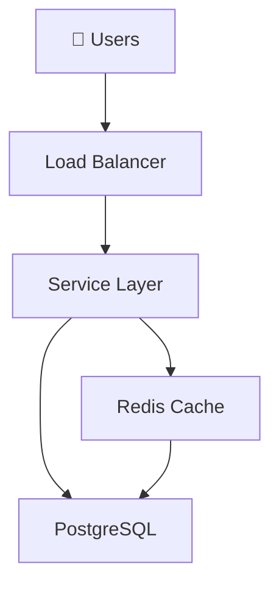

# System Design Template — Replication Guide

**Purpose:** Quick-start template for adding new system design topics using the Hotel Booking Service as the reference pattern.

---

## Before You Start

1. Read [Hotel Booking Service](docs/designs/easy/01-hotel-booking.md) fully (25 min)
2. Read [copilot-instructions.md](.github/copilot-instructions.md) for style rules
3. Have your system design plan topic picked

---

## Template Structure (Copy & Fill)

Save this as `docs/{LEVEL}/{NUMBER:02d}-{topic-slug}.md`:

Example: `docs/medium/02-twitter.md` for "Design Twitter"

```markdown
# [System Name]

> **Interview Time:** 45 min | **Difficulty:** [Easy|Medium|Hard|Advanced]  
> **Key Focus:** [Concurrency issue], [Scalability challenge], [Data consistency problem]

---

## Step 1: Functional & Non-Functional Requirements

### Functional Requirements

- [Feature 1]
- [Feature 2]
- [Feature 3]
- [Feature 4]

### Non-Functional Requirements

| Requirement | Target | Notes |
|:-----------|:-------|:------|
| **Throughput** | X QPS | Peak: Y |
| **Latency** | p99 <X ms | |
| **Availability** | 99.X% | |
| **Consistency** | Strong/Eventual | |
| **Data Retention** | X years/months | |

---

## Step 2: API Design, Data Model & High-Level Design

### Core API Endpoints

```http
GET /resource
POST /resource
PATCH /resource/{id}
DELETE /resource/{id}
```

### Entity Data Model

```
MAIN_TABLE
├─ id (PK)
├─ field_1
├─ field_2 (FK to OTHER_TABLE)
├─ created_at, updated_at

OTHER_TABLE
├─ id (PK)
├─ attributes...
```

### High-Level Architecture



---

## Step 3: Concurrency, Consistency & Scalability

### 🔴 Problem: [Main Race Condition]

**Scenario:** [Real-world example where things break]

**Solutions:**

| Approach | Implementation | Pros | Cons |
|:---------|:---------------|:-----|:-----|
| Simple | SQL/Code | Fast | Incorrect |
| Better | SQL/Code | Correct | Slower |
| Best | SQL/Code | Correct + Fast | Complex |

**Recommended:** [Choice + why]

```sql
-- Code example
```

### 🟡 Problem: [Secondary Challenge]

[Similar structure]

### 💾 Data Consistency Strategy

| Data Type | Consistency | Strategy |
|:----------|:-----------|:---------|
| Critical | Strong | Transactions |
| Eventual | Weak | Cache + async |

---

## Step 4: Persistence Layer, Caching & Monitoring

### Database Design

```sql
CREATE TABLE main_table (
  id SERIAL PRIMARY KEY,
  field_1 VARCHAR(255),
  field_2 INT REFERENCES other_table(id),
  created_at TIMESTAMP DEFAULT NOW(),
  updated_at TIMESTAMP DEFAULT NOW()
);

CREATE INDEX idx_main_table_key ON main_table(field_2, field_1);
```

### Caching Strategy

**Tier 1 (CDN):**
- Static content: TTL 1 day

**Tier 2 (Redis):**
- Hot data: key:value pairs, TTL 1 hour
- Invalidation: On write, delete related cache keys

**Tier 3 (DB Query Cache):**
- Prepared statements, connection pooling

**Cache-Aside Pattern:**
```
1. Check Redis
2. If miss → query DB
3. Update Redis with TTL
4. Return to client
```

### Monitoring & Alerts

**Key Metrics:**
- [Business metric 1 — e.g., booking success rate]
- [System metric 1 — e.g., search latency p99]
- [Error metric 1 — e.g., payment failure rate]

**Prometheus Alerts:**
```yaml
- alert: [MetricName]Low
  expr: metric < threshold
  annotations: "Alert message"
```

---

## ⚡ Quick Reference Cheat Sheet

### When to Use What

| Need | Technology | Why |
|:-----|:-----------|:----|
| Fast search | Elasticsearch | Sub-100ms filtering |
| Prevent race | Pessimistic lock | No double bookings |
| Cache hot data | Redis | 100x faster than DB |

### Critical Design Decisions

- **Decision 1:** [Choice + rationale]
- **Decision 2:** [Choice + rationale]
- **Decision 3:** [Choice + rationale]

### Tech Stack Summary

```
Frontend: [Tech]
Backend: [Tech] (stateless)
Database: [Tech] (primary) + [Replica]
Cache: [Tech]
Search: [Tech]
Queue: [Tech]
Monitoring: [Tech]
Logging: [Tech]
```

---

## 🎯 Interview Summary (5 Minutes)

1. **Clear requirements:** [What must work]
2. **[Key decision]:** [Why this matters]
3. **[Data consistency]:** [How to prevent failures]
4. **[Scalability]:** [Handle load]
5. **[Monitoring]:** [What to track]

---

## Glossary & Abbreviations

--8<-- "_abbreviations.md"
```

---

## Step-by-Step Guide

### 1. Choose Your Design

From [../2025-05-03-systems-design-plan.md](../2025-05-03-systems-design-plan.md):

Example: "Design Twitter" (Medium difficulty)

### 2. Determine Level & Number

```
Difficulty → Folder:

Easy → docs/easy/
Medium → docs/medium/
Hard → docs/hard/
Advanced → docs/advanced/
```

Count existing designs, increment number:

```
docs/easy/01-hotel-booking.md
docs/easy/02-url-shortening.md   ← You add this (02)
```

### 3. Create File

```bash
touch docs/medium/02-twitter.md
```

Paste template above, fill in content.

### 4. Write Each Step (Estimated Time)

| Step | Time | Focus |
|:-----|:-----|:------|
| 1 - Requirements | 5 min | Clear, realistic numbers |
| 2 - API + Schema + Diagram | 10 min | Mermaid diagram good quality |
| 3 - Concurrency | 15 min | ⭐ Most important — real problems |
| 4 - Database + Cache + Monitoring | 10 min | Practical choices |
| Cheat Sheet | 5 min | Scannable in 2 min |

**Total writing time:** 45 min–1 hr per design

### 5. Check for Completeness

**Each step needs:**

**Step 1:**
- ✓ Functional requirements (5–7 features)
- ✓ Non-functional requirements table (5 rows minimum)

**Step 2:**
- ✓ Core API endpoints (3–5 endpoints)
- ✓ Entity data model (4–6 entities)
- ✓ Mermaid architecture diagram

**Step 3:**
- ✓ At least 2 major problems identified
- ✓ Each problem has trade-off table (3 approaches minimum)
- ✓ "Recommended" choice is explicit
- ✓ Data consistency strategy table

**Step 4:**
- ✓ Database schema with CREATE TABLE + indexes
- ✓ Caching tiers with TTLs
- ✓ Key metrics (3–5)
- ✓ Alert rule examples

**Cheat Sheet:**
- ✓ "When to Use" table
- ✓ Critical design decisions (3–5 bullets)
- ✓ Tech stack summary

### 6. Add New Glossary Terms

For any term you use that's **not** in `_abbreviations.md`:

1. Add to end of `docs/_abbreviations.md`:
   ```markdown
   ??? "New Term (Full Name)"
       **Quick:** One-liner.
       
       **Detailed:** More explanation.
       
       → **Use case:** Why it matters.
   ```

2. No need to link — Markdown auto-detects matching text

### 7. Update mkdocs.yml

Add entry to `nav:` section:

```yaml
nav:
  - Medium Designs:
    - medium/index.md
    - "01 · Example Design": medium/01-example.md
    - "02 · Twitter": medium/02-twitter.md   ← Add this
```

### 8. Build & Test

```bash
cd interview-prep-docs
python3 -m mkdocs serve
# Open http://127.0.0.1:8000/medium/02-twitter/
# Check: Markdown renders, Mermaid diagrams render, links work
```

### 9. Verify Markdown Quality

Before considering done:

- [ ] No `✗` in console output (build succeeded)
- [ ] Mermaid diagrams display correctly (not code blocks)
- [ ] Blank line before every list
- [ ] No pipes `|` inside Mermaid node labels
- [ ] `--8<-- "_abbreviations.md"` at end
- [ ] All URLs are relative (no `file://` or `../../../`)

---

## Reusable Problem Patterns

### For Concurrency Issues

**Template:**
```markdown
### 🔴 Problem: [Race Condition Name]

**Scenario:** Two concurrent requests try to [action] simultaneously when [constraint] exists.

**Solutions:**

| Approach | Code | Pros | Cons |
|:---------|:-----|:-----|:-----|
| None | [Naive] | Simple | Race condition |
| Pessimistic Lock | `FOR UPDATE` | Guaranteed | Slower |
| Optimistic Lock | Version field | Faster under low contention | Retries |
| Distributed Lock | Redis SET NX | Cross-service | Deadlock risk |

**Recommended:** [Choice] because [reason related to throughput + correctness tradeoff]
```

### For Scalability Issues

**Template:**
```markdown
### Scaling [Bottleneck]

**Problem:** [At X scale, Y becomes slow]

**Solution:** [Technique]

- Cache with TTL
- Index + query optimization
- Denormalization
- Sharding

**Implementation:**
[Code or SQL example]
```

### For Data Model Issues

**Template:**
```markdown
### Data Model Evolution

**v1 (Simple):**
[Schema]

**v2 (Improved):**
[Schema with denormalization/optimization]

**Changes:** [What changed and why]
```

---

## What NOT to Do

❌ Omit Step 3 (concurrency) — this is where most candidates fail  
❌ Use pipes `|` inside Mermaid node labels  
❌ Forget blank lines before lists  
❌ Include `--8<-- "_abbreviations.md"` without the dashes  
❌ Make cheat sheet longer than 1 page (scannable in 2 min)  
❌ Define terms twice (once in text, once in glossary) — use glossary only  
❌ Leave TODOs or placeholders in published file  

---

## From Plan to Published

**Workflow:**

```
1. Pick from 2025-05-03-systems-design-plan.md
   ↓
2. Create docs/{level}/{number}-{slug}.md
   ↓
3. Fill template (Step 1, 2, 3, 4, Cheat Sheet)
   ↓
4. Add glossary terms to _abbreviations.md
   ↓
5. Update mkdocs.yml nav
   ↓
6. Build: python3 -m mkdocs build ✓
   ↓
7. Preview: python3 -m mkdocs serve
   ↓
8. Review & publish
```

**Time per design (first time):** ~2 hours  
**Time per design (after first 3):** ~1 hour (pattern becomes familiar)

---

## Document Your Decisions

Add this comment at top of new design file to explain your choices:

```markdown
<!--
Design Choices:
- Chose PostgreSQL over NoSQL for strong consistency requirement
- Used pessimistic lock (not optimistic) because... 
- Caching TTL = 30 sec to balance freshness vs. performance
- Sharding by user_id to enable geographic distribution
-->
```

---

## Iteration Notes

After receiving feedback:

1. **Candidate says "X is unclear"** → Expand Step 2, add diagram
2. **Candidate says "Not enough detail on caching"** → Expand Step 4 caching strategy
3. **Candidate misses concurrency issue** → Rewrite Step 3 problem statement more clearly
4. **Interview asked about Y, not in design** → Add a "Deep Dive" sub-article (`01.01-topic.md`)

---

**Template Version:** 1.0  
**Last Updated:** April 26, 2026

---

## Next Steps

1. Pick 1–2 Easy designs as next targets (good warmup)
2. Then 3–5 Medium designs (most important)
3. Then Hard designs (complex, take longer)
4. Finally Advanced (specialized)

**Suggested Easy Follow-ups:**
- URL Shortening Service (database design + caching)
- Pastebin (s3 + CDN + database)
- Parking Lot System (concurrency on inventory)

**Suggested Medium Follow-ups:**
- Design Twitter (feed consistency)
- Design Rate Limiter (sliding window algorithms)
- Design Web Cache (caching policies)

Start with what you know best, build confidence, then tackle unfamiliar domains!
