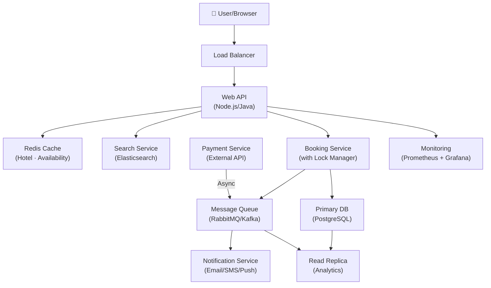

# Hotel Booking Service

> **Interview Time:** 45 min | **Difficulty:** Hard  
> **Key Focus:** Concurrency, inventory management, double-booking prevention, search scalability

---

## Step 1: Functional & Non-Functional Requirements

### Functional Requirements

- Users can search for available hotels by location, date range, and filters
- Users can book a room (reserve with payment)
- Users can cancel a reservation (full or partial refund)
- Users can view booked history and current reservations
- Hosts/hotels can manage inventory (add rooms, set pricing, update availability)
- Support different room types and prices
- Notification on booking confirmation and cancellation

### Non-Functional Requirements

| Requirement | Target | Notes |
|:-----------|:-------|:------|
| **Throughput** | 10M users, 50K bookings/day | Peak: 500 QPS during holidays |
| **Latency** | Search <200ms, Booking <500ms |  |
| **Availability** | 99.95% uptime | Booking failures acceptable (retry) |
| **Consistency** | Strong (no overbooking) | Weak for historical data |
| **Data Retention** | 5 years for billing, 1 year for activity logs | |

---

## Step 2: API Design, Data Model & High-Level Design

### Core API Endpoints

```http
# Search
GET /search
  ?location=NYC&check_in=2025-01-15&check_out=2025-01-20&guests=2&room_type=STANDARD

# Booking  
POST /bookings
  {hotel_id, room_id, check_in, check_out, guest_info, payment_method}
  → BookingId + confirmation

# Cancel
DELETE /bookings/{booking_id}
  → Processes refund, frees inventory

# Retrieve
GET /bookings/{booking_id}
  → Booking details + current status
```

### Entity Data Model

```
HOTELS
├─ hotel_id (PK)
├─ name, location, address
├─ rating, amenities (array)
├─ created_at, updated_at

ROOMS
├─ room_id (PK)
├─ hotel_id (FK), room_type, capacity
├─ base_price, currency

AVAILABILITY (Time-Series)
├─ room_id (PK), date (PK), price
├─ inventory_count, booked_count
├─ updated_at

BOOKINGS
├─ booking_id (PK), user_id, room_id, hotel_id
├─ check_in (PK), check_out, status (CONFIRMED/CANCELLED)
├─ total_price, payment_status
├─ created_at, updated_at

PAYMENTS
├─ payment_id (PK), booking_id (FK)
├─ amount, status (PENDING/SUCCESS/FAILED/REFUNDED)
├─ payment_method, transaction_id
```

### High-Level Architecture



---

## Step 3: Concurrency, Consistency & Scalability

### 🔴 Problem: Double Booking

**Scenario:** Two users simultaneously click "Book Room 101 for Jan 15-17" when only 1 room is available.

**Solutions (from weakest to strongest):**

| Approach | Implementation | Pros | Cons |
|:---------|:---------------|:-----|:-----|
| **Optimistic Lock** | Version field in AVAILABILITY row | Simple, fast | Retries on conflict (lost bookings) |
| **Pessimistic Lock** | `SELECT ... FOR UPDATE` before booking | Guaranteed correctness | Slower (holds locks) |
| **Row-Level Lock** | Database constraint (unique booking timestamp) | Consistent | Requires good DB design |
| **Distributed Lock** | Redis SET NX or Zookeeper | Works across services | Complexity, deadlock risk |

**Recommended:** Pessimistic Lock FOR SMALL INVENTORY (rooms <1000). For larger inventories, **Optimistic Lock + Retry**.

```sql
-- Pessimistic (Transaction)
BEGIN;
SELECT inventory_count FROM availability 
  WHERE room_id = ? AND date = ? AND day_of_checkout = ?
  FOR UPDATE;

IF inventory_count > 0 THEN
    UPDATE availability SET inventory_count = inventory_count - 1;
    INSERT INTO bookings (...);
    COMMIT;
END IF;
```

### 🟡 Problem: Race Condition in Refunds

**Scenario:** Cancellation processed twice → double refund.

**Solution:** Idempotency keys

```
POST /bookings/{booking_id}/cancel
  Header: Idempotency-Key: <UUID>
  
Service checks: If Idempotency-Key exists + CANCELLED → return cached response
If new → process once, cache result
```

### 🟢 Scalability: Availability Search

**Problem:** Searching across millions of hotel-date combinations is slow.

**Solution:** Denormalized Availability Cache + Elasticsearch

```
AVAILABILITY_DENORM (cached in Redis/Memcached):
  Key: hotel:NYC:2025-01:STANDARD → [dates with available rooms]
  TTL: 1 hour (refresh on booking)

Or: Elasticsearch index for faceted search
  Index: hotels_availability_2025_01
  Shard by: (location, hotel_id, room_type)
```

### 💾 Data Consistency Strategy

| Data Type | Consistency | Strategy |
|:----------|:-----------|:---------|
| **Bookings** | Strong ACID | Transactions, duplicates = error |
| **Availability** | Eventual | Cache + async reconciliation |
| **User Profiles** | Eventual | Read replicas OK |
| **Analytics** | Weak | Batch jobs (Spark, daily) |

---

## Step 4: Persistence Layer, Caching & Monitoring

### Database Design

**Primary Database: PostgreSQL**

```sql
-- Indexes critical for performance
CREATE INDEX idx_availability_search 
  ON availability(hotel_id, check_in_date, room_type, inventory_count);

CREATE INDEX idx_bookings_user 
  ON bookings(user_id, created_at DESC);

-- Partitioning by date (reduces scan size)
CREATE TABLE availability_2025_01 PARTITION OF availability
  FOR VALUES FROM ('2025-01-01') TO ('2025-02-01');
```

**Replica for Analytics** (not real-time):

```
Primary (write) ← PostgreSQL Master
└─ Replica (read analytics) ← PostgreSQL Standby
   └─ [Every 6 hrs] → Data Warehouse (Snowflake/BigQuery)
```

### Caching Strategy

```
TIER 1: HTTP Cache (CDN)
├─ Static: Hotel listing metadata (TTL: 1 day)
└─ Dynamic: Search results (TTL: 5 min)

TIER 2: Application Cache (Redis)
├─ hotel:{id} → hotel details (TTL: 1 hr)
├─ availability:{room_id}:{date} → count + price (TTL: 30 sec)
└─ user_bookings:{user_id} → [bookings] (TTL: 10 min)

TIER 3: Database Query Cache
├─ Result-set caching (expensive queries)
└─ Prepared statements (reduced parse overhead)

Invalidation:
- On booking → invalidate availability:{room_id}:{all_dates_in_range}
- On price update → invalidate hotel:{id}
- Backfill missing data on cache miss (cache-aside pattern)
```

### Search Indexing (Elasticsearch)

```json
{
  "index": "hotels_search",
  "mappings": {
    "properties": {
      "hotel_id": { "type": "keyword" },
      "location": { "type": "geo_point" },
      "name": { "type": "text", "analyzer": "standard" },
      "amenities": { "type": "keyword" },
      "rating": { "type": "float" },
      "min_price": { "type": "integer" },
      "availability_2025_01": { "type": "sparse_vector" }
    }
  }
}

-- Search query (filtered by check-in date)
GET /hotels/_search
{
  "query": {
    "bool": {
      "must": [
        { "match": { "location.city": "NYC" } },
        { "range": { "rating": { "gte": 4.0 } } }
      ],
      "filter": [
        { "term": { "availability_2025_01.2025-01-15": 1 } }
      ]
    }
  }
}
```

### Monitoring & Alerts

**Key Metrics to Track:**

1. **Booking Success Rate** — % of bookings completed vs. attempted
2. **Double-Booking Incidents** — Should be ~0 (audit daily)
3. **Search Latency p99** — Target <200ms
4. **Cache Hit Ratio** — Should be >80% for availability
5. **Payment Failure Rate** — Track failed payments, retries
6. **Notification Delivery** — Email open rate, SMS delivery rate

```yaml
# Prometheus alerts
- alert: BookingSuccessRateLow
  expr: booking_success_rate < 0.95
  for: 5m
  annotations: "Booking success rate below 95%"

- alert: DoubleBookingDetected
  expr: double_booking_count > 0
  for: 1m
  annotations: "Double booking detected - investigate immediately"

- alert: SearchLatencyHigh
  expr: search_latency_p99 > 200
  annotations: "Search latency exceeding SLA"
```

---

## ⚡ Quick Reference Cheat Sheet

### When to Use What

| Need | Technology | Why |
|:-----|:-----------|:----|
| **Strong consistency** | Pessimistic lock + Transaction | No double bookings |
| **Availability search fast** | Elasticsearch + date index | Sub-100ms faceted search |
| **Real-time inventory** | Redis cache (short TTL) | Instant updates on booking |
| **Historical queries** | Read replica + data warehouse | Don't slow down production |
| **Geographic search** | Geospatial index (PostGIS) | Nearby hotels efficiently |

### Critical Design Decisions

- **Booking must be transactional** (strong consistency) — use pessimistic lock or distributed lock
- **Search can be eventually consistent** — cache availability, refresh on change
- **Cancellation must be idempotent** — use Idempotency-Key header
- **High-traffic periods** → Implement booking queue (asynchronous processing) with SLA
- **Notifications → async** (don't block booking response); retry on failure

### Tech Stack Summary

```
Frontend: React + TypeScript
Backend: Java/Node.js (stateless)
Database: PostgreSQL (primary) + Replica
Cache: Redis
Search: Elasticsearch
Queue: RabbitMQ/Kafka
Payment: Stripe/PayPal (API)
Notifications: SendGrid (email), Twilio (SMS)
Monitoring: Prometheus + Grafana
Logging: ELK Stack
```

---

## 🎯 Interview Summary (5 Minutes)

> If you have only 5 minutes before the interview, memorize this:

1. **Clear requirements:** Search must be fast, booking must prevent overbooking
2. **Prevent double bookings:** Use transactions + pessimistic lock on inventory
3. **Make search fast:** Denormalized availability cache (Redis) + Elasticsearch
4. **Handle cancellations safely:** Idempotency-Key in headers
5. **Scale read traffic:** Use read replicas for non-booking queries
6. **Monitor closely:** Track booking success rate and double-booking attempts (should be 0)

---

## Glossary & Abbreviations

--8<-- "_abbreviations.md"
