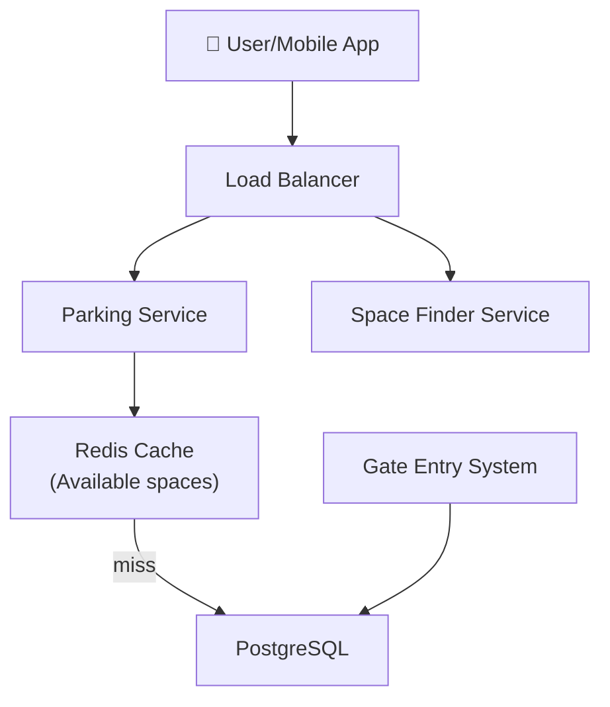

# Design an Efficient Parking Lot System

> **Interview Time:** 45 min | **Difficulty:** Easy  
> **Key Focus:** Inventory management, concurrent reservations, space optimization

---

## Step 1: Functional & Non-Functional Requirements

### Functional Requirements

- Users can find available parking spaces by location/level
- Users can reserve a space (auto-assign or prefer specific)
- Users can release/cancel reservation
- System tracks vehicle entry/exit timestamps
- Admins can manage parking lot layout (add levels, spaces, pricing)

### Non-Functional Requirements

| Requirement | Target | Notes |
|:-----------|:-------|:------|
| **Throughput** | 50K spaces, 100 entries/exits per hour per lot | Peak: 500 QPS |
| **Latency** | Find space <200ms, Assign <100ms | |
| **Availability** | 99.9% | |
| **Consistency** | Strong (no double-assignment) | |
| **Data Retention** | 1 year history | |

---

## Step 2: API Design, Data Model & High-Level Design

### Core API Endpoints

```http
GET /lots/{lot_id}/available-spaces
  ?level=2&space_type=COMPACT
  → {available_count, spaces}

POST /reservations
  {lot_id, space_id?, space_type}
  → {reservation_id, assigned_space}

DELETE /reservations/{reservation_id}
  → Frees space

POST /entry
  {license_plate, lot_id}
  → {space_number, entry_time}
```

### Entity Data Model

```
PARKING_LOTS
├─ id (PK), name, location
├─ total_spaces, levels

SPACES
├─ id (PK), lot_id (FK), level, space_number
├─ space_type (REGULAR/COMPACT/HANDICAP)
├─ is_available, reserved_by (FK user)

RESERVATIONS
├─ id (PK), space_id (FK), user_id (FK)
├─ created_at, reserved_until

VEHICLE_ENTRIES
├─ id (PK), space_id (FK), license_plate
├─ entry_time, exit_time, fee_paid
```

### High-Level Architecture



---

## Step 3: Concurrency, Consistency & Scalability

### 🔴 Problem: Double Assignment of Same Space

**Scenario:** Two users simultaneously reserve the same space.

**Solutions:**

| Approach | Code | Pros | Cons |
|:---------|:-----|:-----|:-----|
| Optimistic lock | Version field on SPACES | Fast | Retries |
| Pessimistic lock | `SELECT...FOR UPDATE` | Guaranteed | Slower |
| Status field check | Check `is_available` in transaction | Explicit | Needs careful logic |

**Recommended:** Pessimistic lock with transaction

```sql
BEGIN;
SELECT id FROM spaces WHERE id = ? AND is_available = true FOR UPDATE;
UPDATE spaces SET is_available = false, reserved_by = ? WHERE id = ?;
INSERT INTO reservations (space_id, user_id) VALUES (?, ?);
COMMIT;
```

### 🟡 Problem: Stale Cache of Available Spaces

**Scenario:** Cache shows 5 spaces available, but new reservation depletes them.

**Solution:** Invalidate cache on every reservation

```
Redis key: lot:123:available_spaces
TTL: 30 seconds (short, or invalidate on change)
On reservation: increment cache counter (optimistic)
On failure: refresh from DB
```

### 💾 Data Consistency Strategy

| Data Type | Consistency | Strategy |
|:----------|:-----------|:---------|
| **Space assignment** | Strong ACID | Transaction + pessimistic lock |
| **Available count** | Eventual | Cache with short TTL, refresh on miss |
| **Vehicle inside/outside** | Eventually Consistent | Queue + background sync |

---

## Step 4: Persistence Layer, Caching & Monitoring

### Database Design

```sql
CREATE TABLE parking_lots (
  id SERIAL PRIMARY KEY,
  name VARCHAR(255),
  location VARCHAR(255),
  total_spaces INT
);

CREATE TABLE spaces (
  id SERIAL PRIMARY KEY,
  lot_id INT NOT NULL REFERENCES parking_lots(id),
  level INT,
  space_number VARCHAR(10),
  space_type ENUM('REGULAR', 'COMPACT', 'HANDICAP'),
  is_available BOOLEAN DEFAULT true,
  reserved_by BIGINT
);

CREATE UNIQUE INDEX idx_lot_level_number ON spaces(lot_id, level, space_number);
CREATE INDEX idx_available ON spaces(lot_id, is_available);

CREATE TABLE reservations (
  id SERIAL PRIMARY KEY,
  space_id INT NOT NULL REFERENCES spaces(id),
  user_id BIGINT NOT NULL,
  created_at TIMESTAMP DEFAULT NOW(),
  reserved_until TIMESTAMP
);
```

### Caching Strategy

**Redis:**
- `lot:{lot_id}:available` → Count of available spaces (TTL 30 sec)
- `lot:{lot_id}:spaces` → {level, space_number, type} for display
- Invalidate on every reservation/release

### Monitoring & Alerts

**Key Metrics:**
- Space utilization % (real-time)
- Reservation success rate
- Average time to find & assign space
- False availability (cache shows available, actually taken)

---

## ⚡ Quick Reference Cheat Sheet

### When to Use What

| Need | Technology | Why |
|:-----|:-----------|:----|
| Prevent double-booking | Pessimistic lock + transaction | Guarantees assignment |
| Fast "available spaces" query | Redis cache | Real-time count |
| Track vehicle timeline | DB log, partition by date | Audit trail |

### Critical Design Decisions

- Use **pessimistic lock** (no retries allowed for safety-critical parking)
- **Cache available count**, invalidate on every change
- **Partition data by lot** (separate reservations table per large lot)
- **Background job** to auto-release expired reservations

### Tech Stack Summary

```
Frontend: Mobile app
Backend: Java/Node.js
Database: PostgreSQL
Cache: Redis
Monitoring: Prometheus
```

---

## 🎯 Interview Summary (5 Minutes)

1. **Pessimistic lock prevents double-booking** — essential for parking (safety)
2. **Cache available space count** with short TTL (30 sec)
3. **Partition spaces table by lot_id + level** for fast queries
4. **Track entry/exit for billing** (separate high-volume table)
5. **Auto-expiry job** releases reserved but unpaid spaces

---

## Glossary & Abbreviations

--8<-- "_abbreviations.md"
