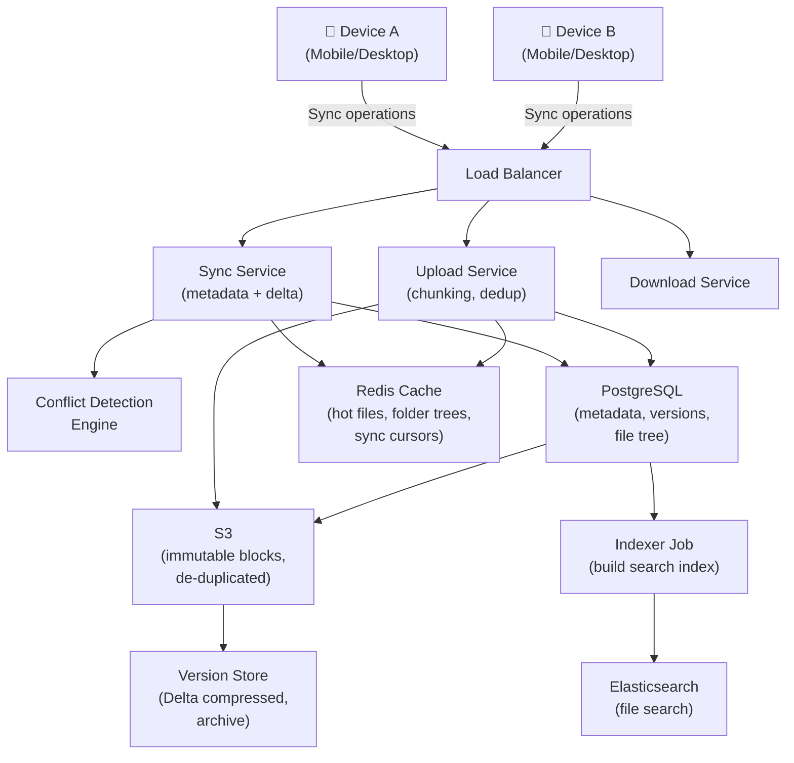

# Dropbox

> **Interview Time:** 60-90 min | **Difficulty:** Hard  
> **Key Focus:** File synchronization, version control, distributed storage, conflict resolution

---

## Step 1: Functional & Non-Functional Requirements

### Functional Requirements

- Users can upload/download files
- Files sync across multiple devices (seamlessly)
- File operations: create, read, update, delete
- Version history (restore previous versions)
- Conflict resolution when same file edited on multiple devices
- Folder structure and nested paths
- Selective sync (choose which folders to sync)
- Sharing files with other users (read, read+write)
- Access control (folder permissions)
- Trash/delete recovery (30 days)

### Non-Functional Requirements

| Requirement | Target | Notes |
|:-----------|:-------|:------|
| **Scale** | 500M users, 2B+ files, 1EB+ data | Petabyte-scale storage |
| **Latency** | File sync <10 seconds | Must feel instant |
| **Availability** | 99.9% uptime | Data durability > availability |
| **Consistency** | Strong for metadata, eventual for content | No lost file versions |
| **Throughput** | 1M file operations/min | Peak: 100K concurrent uploads |
| **Bandwidth** | Optimize: delta sync only changed blocks | Save 90% bandwidth via dedup+delta |

---

## Step 2: API Design, Data Model & High-Level Design

### Core API Endpoints

```http
POST /files/upload
  {file_path: "/docs/report.pdf", content: <binary>, file_size: 5MB}
  → {file_id, version_id, checksum, timestamp}

GET /files/download/{file_id}?version={version_id}
  → {content: <binary>, size, timestamp, checksum}

GET /files/{file_id}/metadata
  → {file_id, name, size, created_at, modified_at, owner_id, versions: [{id, size, timestamp}]}

PUT /files/{file_id}/update
  {delta: <binary chunk>, start_offset: 1000, checksum}
  → {version_id, merged_size, new_checksum}

POST /files/{file_id}/delete
  {move_to_trash: true}
  → {file_id, deleted_at, recovery_deadline}

GET /files/sync
  {last_cursor: "abc123", limit: 1000}
  → {changes: [{file_id, operation: CREATE|UPDATE|DELETE, timestamp}], next_cursor}

POST /files/{file_id}/share
  {user_id, permission: READ|READ_WRITE}
  → {share_id, shared_at}

GET /files/{file_id}/conflicts
  → {conflicts: [{device_a_version, device_b_version, diverged_at}]}
```

### Entity Data Model

```
USERS
├─ user_id (PK)
├─ email (UNIQUE)
├─ name, plan (free|pro|business)
├─ used_space_bytes, max_space_bytes
├─ created_at

FILES (metadata only)
├─ file_id (ULID, PK, sortable by creation time)
├─ owner_id (FK: users)
├─ file_path (VARCHAR, UNIQUE per user)
├─ current_version_id (FK)
├─ size_bytes (current version)
├─ is_deleted (soft delete)
├─ created_at, modified_at, deleted_at

FILE_VERSIONS (immutable version history)
├─ version_id (PK, ULID)
├─ file_id (FK)
├─ device_id (which device uploaded)
├─ content_hash (SHA256, for dedup)
├─ delta_from_version_id (for delta storage)
├─ size_bytes, created_at

FILE_BLOCKS (for large files, chunk-based storage)
├─ block_id (PK, = SHA256(content))
├─ block_size_bytes (typically 4MB)
├─ content (binary, stored in S3)
├─ created_at, last_accessed_at
├─ refcount (how many versions use this block)

FILE_SYNC_CURSOR (for efficient sync protocol)
├─ user_id (PK)
├─ device_id (PK)
├─ last_cursor (opaque token)
├─ timestamp

SHARED_FOLDERS
├─ share_id (PK)
├─ file_id (FK)
├─ shared_by_user_id (FK)
├─ shared_with_user_id (FK)
├─ permission (READ|READ_WRITE)
├─ created_at

TRASH
├─ file_id (FK)
├─ deleted_by_user_id
├─ deleted_at
├─ deleted_path
├─ recovery_deadline (deleted_at + 30 days)
```

### High-Level Architecture



---

## Step 3: Concurrency, Consistency & Scalability

### 🔴 Problem: Concurrent Edits = Conflict

**Scenario:** 
- Device A: User edits file locally (offline), modifies paragraphs 1-3
- Device B: Same user on different device edits paragraphs 4-5 (online, syncs)
- Device A comes online
- Result: Conflicting versions, data loss risk

**Solution: Last-Write-Wins + Conflict Resolution**

```
Metadata (PostgreSQL):
  file_id: 123
  current_version_id: v5 (device B's edit)
  versions: [
    {id: v3, device: A, timestamp: 2026-04-26 14:00:00},
    {id: v4, device: B, timestamp: 2026-04-26 14:05:00},
    {id: v5, device: B, timestamp: 2026-04-26 14:10:00}
  ]

Flow when Device A comes online:
1. Device A sends: "I have version v3 (14:00), upload my changes"
2. Server checks: "Current is v5 (14:10), you're behind. Conflict!"
3. Response: {conflict: true, parent_version: v5}
4. Device A:
   a) Downloads v5 (Device B's latest)
   b) Merges A's changes onto v5 (merge algorithm)
   c) Creates merged version m1 (timestamp, device: A)
   d) Uploads m1 to server
5. Server: {status: CONFLICT_RESOLVED, version_id: m1}
6. Device B (next sync): Gets notification: "File merged. Download latest."

Merge Algorithm:
  if files are text-based:
    → Use 3-way merge (base version, version A, version B)
    → Show conflicts in file: <<<< A | >>>> B
    → User manually resolves
  if files are binary:
    → Last-write-wins: Keep v5, discard A's edits
    → Create "Report - conflicted copy (Device A).pdf"
    → User manually reconciles
```

### 🟡 Problem: Efficient Sync for Large Files

**Scenario:** 100MB file updated locally. Must sync to server without uploading entire file.

**Solution: Delta Sync + Block Deduplication**

```
UPLOAD WITH DELTA SYNC:

1. Client hashes file into 4MB blocks:
   Block 1: SHA256 = hash_1
   Block 2: SHA256 = hash_2
   Block 3 (modified): SHA256 = hash_3_new
   Block 4: SHA256 = hash_4

2. Client queries: "Which blocks exist on server?"
   POST /blocks/check
   {block_hashes: [hash_1, hash_2, hash_3_new, hash_4]}
   
   Response:
   {existing: [hash_1, hash_2, hash_4], missing: [hash_3_new]}

3. Client uploads ONLY missing block (hash_3_new):
   POST /blocks/upload
   {block_id: hash_3_new, content: <4MB binary>}
   
   Result: Upload 4MB instead of 100MB! 96% bandwidth saved.

4. Server creates new version:
   version_id: v6
   blocks: [hash_1, hash_2, hash_3_new, hash_4]
   
5. For storage: Server stores each block once (refcount++)
   Block storage = O(unique_blocks) not O(versions × file_size)

Example:
  - 100 versions of same file
  - Only 5 blocks changed over time
  - Storage: 5 × 4MB = 20MB (not 100 × 100MB = 10GB!)
```

### 🔷 Problem: Conflict Across 3+ Devices

**Scenario:** User has 3 devices. All offline. All edit same file locally. All come online simultaneously.

**Solution: Force Linear Ordering via Server**

```
Device A (desktop): offline, edits 10:00-11:00, comes online 11:05
Device B (phone):   offline, edits 10:00-11:00, comes online 11:04
Device C (tablet):  offline, edits 10:00-11:00, comes online 11:03

Server's responsibility:
1. Device C connects first (11:03)
   → Check: "Current version is v5 (10:00)"
   → Your base is v5: OK
   → Create version v6_C (timestamp: 11:03)
   → Inform device B: "New version is v6_C, please merge"

2. Device B connects (11:04)
   → Check: "Current version is v6_C (11:03)"
   → Your base is v5: CONFLICT
   → 3-way merge: base=v5, a_version=your_v5_edits, b_version=v6_C
   → Resolve: m1 = merge(v5, B_edits, C_edits)
   → Upload m1, create version v7_B

3. Device A connects (11:05)
   → Check: "Current version is v7_B (11:04)"
   → Your base is v5: CONFLICT
   → 3-way merge: base=v5, a_version=your_v5_edits, b_version=v7_B
   → Resolve: m2 = merge(v5, A_edits, v7_B_which_is_merged)
   → Upload m2, create version v8_A

Final state: Linear version history, no data loss
v5 → v6_C → v7_B (merged with C) → v8_A (merged with B and C)

Notification to B,C: "v8_A created, includes all changes, download latest"
```

### Data Consistency Strategy

| Data | Consistency | Strategy |
|:-----|:-----------|:---------|
| **File metadata** | Strong | DB transaction, single source of truth |
| **File content** | Eventual | Delta sync, immutable blocks, conflict detection |
| **Version history** | Strong | Immutable versions, append-only log |
| **Sync cursor** | Eventual OK | Server generates opaque cursor, client stores |
| **Sharing permissions** | Eventual OK | Cache in Redis, refresh every 5 min |
| **Trash recovery** | Strong | Soft-delete flag, 30-day grace period |

---

## Step 4: Persistence Layer, Caching & Monitoring

### Database Design

```sql
-- Users
CREATE TABLE users (
  user_id BIGSERIAL PRIMARY KEY,
  email VARCHAR(255) UNIQUE,
  name VARCHAR(255),
  plan VARCHAR(50),  -- free, pro, business
  space_limit_bytes BIGINT,
  created_at TIMESTAMP DEFAULT NOW()
);

-- File Metadata
CREATE TABLE files (
  file_id VARCHAR(255) PRIMARY KEY,  -- ULID, sortable
  owner_id BIGINT NOT NULL REFERENCES users(user_id),
  file_path VARCHAR(1024),  -- e.g., "/docs/report.pdf"
  parent_dir_path VARCHAR(1024),
  is_dir BOOLEAN DEFAULT FALSE,
  current_version_id VARCHAR(255),  -- FK to file_versions
  size_bytes BIGINT,
  is_deleted BOOLEAN DEFAULT FALSE,
  created_at TIMESTAMP DEFAULT NOW(),
  modified_at TIMESTAMP DEFAULT NOW(),
  deleted_at TIMESTAMP
);

CREATE UNIQUE INDEX idx_files_owner_path 
  ON files(owner_id, file_path) WHERE NOT is_deleted;

CREATE INDEX idx_files_owner_modified 
  ON files(owner_id, modified_at DESC);

-- File Versions (immutable)
CREATE TABLE file_versions (
  version_id VARCHAR(255) PRIMARY KEY,  -- ULID
  file_id VARCHAR(255) NOT NULL REFERENCES files(file_id),
  device_id VARCHAR(255),  -- which device uploaded this version
  parent_version_id VARCHAR(255),  -- for delta tracking
  content_hash VARCHAR(64),  -- SHA256, for dedup
  size_bytes BIGINT,
  block_ids TEXT[],  -- array of block_id references
  is_conflict BOOLEAN DEFAULT FALSE,
  created_at TIMESTAMP DEFAULT NOW()
);

CREATE INDEX idx_versions_file_created 
  ON file_versions(file_id, created_at DESC);

-- File Blocks (de-duplicated storage)
CREATE TABLE file_blocks (
  block_id VARCHAR(64) PRIMARY KEY,  -- SHA256 hash of content
  block_size_bytes INT,
  s3_location VARCHAR(512),  -- e.g., "s3://dropbox-blocks/abc123"
  refcount INT DEFAULT 1,  -- how many versions reference this block
  created_at TIMESTAMP DEFAULT NOW(),
  last_accessed_at TIMESTAMP DEFAULT NOW()
);

CREATE INDEX idx_blocks_last_accessed 
  ON file_blocks(last_accessed_at DESC);

-- Sync Cursors (for efficient delta sync)
CREATE TABLE sync_cursors (
  user_id BIGINT NOT NULL REFERENCES users(user_id),
  device_id VARCHAR(255) NOT NULL,
  last_cursor BIGINT,  -- opaque cursor (version timestamp)
  cursor_version_id VARCHAR(255),  -- version_id seen at last_cursor
  created_at TIMESTAMP DEFAULT NOW(),
  updated_at TIMESTAMP DEFAULT NOW(),
  PRIMARY KEY (user_id, device_id)
);

-- Sharing
CREATE TABLE shared_items (
  share_id BIGSERIAL PRIMARY KEY,
  file_id VARCHAR(255) REFERENCES files(file_id),
  owner_id BIGINT NOT NULL REFERENCES users(user_id),
  shared_with_user_id BIGINT NOT NULL REFERENCES users(user_id),
  permission VARCHAR(20),  -- READ, READ_WRITE
  created_at TIMESTAMP DEFAULT NOW()
);

CREATE INDEX idx_shared_items_user 
  ON shared_items(shared_with_user_id, created_at DESC);

-- Trash
CREATE TABLE trash (
  file_id VARCHAR(255) PRIMARY KEY REFERENCES files(file_id),
  deleted_by_user_id BIGINT REFERENCES users(user_id),
  deleted_path VARCHAR(1024),
  deleted_at TIMESTAMP DEFAULT NOW(),
  recovery_deadline TIMESTAMP  -- deleted_at + 30 days
);

CREATE INDEX idx_trash_user_deleted 
  ON trash(deleted_by_user_id, deleted_at DESC);
```

### Caching Strategy

**Tier 1: Redis (Hot Cache)**

```
1. File Metadata (frequently accessed)
   Key: "file:{file_id}:metadata"
   Value: {name, size, modified_at, owner_id, current_version_id}
   TTL: 1 hour
   Purpose: Avoid DB hits on every file stat

2. File Tree for Directory Listing
   Key: "dir:{parent_dir_path}:files:{owner_id}"
   Value: [file1, file2, ...] (list of file_ids in that directory)
   TTL: 5 minutes
   Purpose: Fast directory listing (ls)

3. Sync Cursor Cache
   Key: "sync:cursor:{user_id}:{device_id}"
   Value: {last_cursor, version_id}
   TTL: 24 hours
   Purpose: Fast cursor lookup during sync

4. Shared Folder Cache
   Key: "shared:{user_id}:accessible_files"
   Value: {file_id: permission, ...}
   TTL: 5 minutes (eventual consistency)
   Purpose: Quick permission check

5. Block Existence Cache
   Key: "block:{block_id}"
   Value: {exists: true, s3_location}
   TTL: 7 days
   Purpose: Avoid DB hit when checking if block already stored
```

**Tier 2: Block Storage**

- S3 with immutable object ACLs
- Lifecycle policy: Move to Glacier after 90 days of no access
- Versioning enabled in S3 bucket
- Object Lock enabled (prevents accidental deletions)

### Sync Protocol (Efficient)

```
Client-to-Server Sync Flow:

1. Client starts with sync_cursor (last state known to server)
2. Client requests: GET /files/sync?cursor={last_cursor}
   
3. Server returns:
   {
     changes: [
       {file_id: 123, operation: CREATE, version_id: v5},
       {file_id: 456, operation: UPDATE, version_id: v7},
       {file_id: 789, operation: DELETE}
     ],
     next_cursor: "new_opaque_token"
   }

4. Client downloads only changed files (O(changes) not O(all files))
5. For updates: Client checks blocks, uploads missing blocks only
6. Client stores new cursor for next sync

Worst case: 1 million files
Best case (using cursor sync): 10 changed files = 10 KB payload
10 KB vs 10 GB! = 1,000,000× bandwidth savings
```

### Monitoring & Alerts

**Key Metrics:**

1. **File Operations**
   - Upload latency (P95 <5 sec for small files)
   - Download latency (P95 <2 sec)
   - Sync delay (P95 <10 sec across devices)

2. **Conflict Resolution**
   - Conflict rate (% of files with conflicts)
   - Auto-resolved vs manual resolution ratio
   - Conflict resolution time (how long user needs to resolve)

3. **Storage Efficiency**
   - Deduplication ratio (should be >50%)
   - Block reuse rate (avg blocks per version)
   - Storage saved by delta sync

4. **Consistency & Data Loss**
   - Version corruption rate (should be 0)
   - Unrecoverable files (deleted beyond grace period)
   - Rollback incidents (emergency version restore)

5. **Sync Reliability**
   - Sync success rate (99.99%)
   - Cursor staleness (should be <1 minute)
   - Device sync divergence (should be <10 minutes)

```yaml
- alert: ConflictRateHigh
  expr: conflict_rate > 0.01
  annotations: "Conflict rate > 1% — check conflict detection logic"

- alert: SyncDelayHigh
  expr: sync_latency_p95 > 30000
  annotations: "Sync latency > 30s — check server performance"

- alert: DeduplicationEfficiencyLow
  expr: dedup_ratio < 0.3
  annotations: "Dedup ratio < 30% — check block chunking algorithm"

- alert: VersionCorruptionDetected
  expr: corrupted_versions > 0
  annotations: "Version corruption detected — CRITICAL"
```

---

## ⚡ Quick Reference Cheat Sheet

### Critical Design Decisions

1. **Immutable versioning** — Each version is permanent, can revert anytime
2. **Block deduplication** — Multiple versions share 4MB blocks by content hash
3. **Delta sync** — Only upload changed blocks, save 90% bandwidth
4. **Conflict detection via timestamps** — Compare version timestamps to detect conflicts
5. **Sync cursors** — Client stores opaque cursor, server returns only changes since cursor
6. **Multi-device merging** — 3-way merge for non-binary files, last-write-wins for binary

### When to Use What

| Need | Technology | Why |
|:-----|:-----------|:----|
| Store file blocks | S3 (immutable, deduplicated) | Scales to EB, durable |
| Detect conflicts | Timestamps + version tree | Simple, deterministic |
| Efficient sync | Cursor-based delta | O(changes) not O(files) |
| Large file upload | Block-based chunking | Can retry individual blocks |
| File search | Elasticsearch | Full-text, fast queries |

### Tech Stack

```
Frontend: Electron/React (desktop), React Native (mobile)
Backend: Python/Go (stateless)
Database: PostgreSQL (metadata), Redis (cache)
Storage: S3 (file blocks), Glacier (archive)
Search: Elasticsearch
Sync protocol: Custom binary protocol + WebSocket
Monitoring: Prometheus
```

---

## 🎯 Interview Summary (5 Minutes)

1. **Block deduplication** → Each 4MB block stored once, refcounted across versions
2. **Delta sync** → Client hashes blocks, uploads only missing ones
3. **Conflict detection** → Timestamp comparison, 3-way merge for text
4. **Sync cursors** → Opaque token avoids syncing entire file tree
5. **Immutable versions** → Can restore any past version anytime
6. **Multi-device merging** → Last-write-wins for binaries, 3-way merge for text
7. **Storage efficiency** → Dedup + delta = 90% bandwidth saved

---

## Glossary & Abbreviations

--8<-- "_abbreviations.md"

## ⚡ Quick Reference Cheat Sheet

[TODO: Fill this section]

---

## 🎯 Interview Summary (5 Minutes)

[TODO: Fill this section]

---

## Glossary & Abbreviations

--8<-- "_abbreviations.md"
