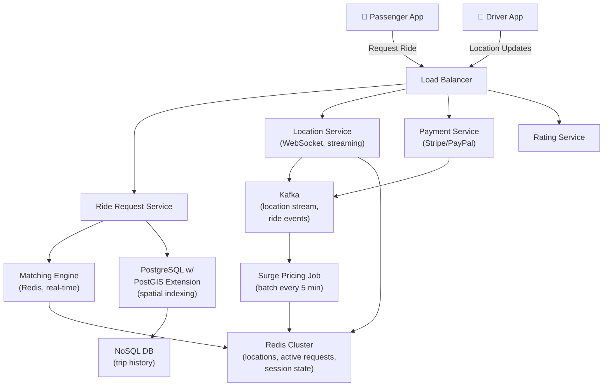

# Uber Backend

> **Interview Time:** 60-90 min | **Difficulty:** Hard  
> **Key Focus:** Real-time location tracking, matching algorithm, surge pricing, payment consistency

---

## Step 1: Functional & Non-Functional Requirements

### Functional Requirements

- Users (passenger/driver) register and create profile
- Passengers can request ride (with pickup/dropoff location)
- System matches nearby drivers to passenger requests
- Drivers accept/decline ride requests
- Real-time location tracking during ride
- Passenger and driver can cancel rides (with fees if close to pickup)
- Payment processing at end of ride
- Trip history and ratings
- Surge pricing based on demand
- Driver status (online, offline, on-ride, completing ride)

### Non-Functional Requirements

| Requirement | Target | Notes |
|:-----------|:-------|:------|
| **Scale** | 100M users, 10M daily active drivers | Peak: 1M concurrent drivers online |
| **Latency** | Match in <30 sec, location update <1 sec | User-facing latency critical |
| **Availability** | 99.95% uptime | Downtimes cost revenue |
| **Consistency** | Strong for payment, eventual for location | No double-charging, eventually accurate location |
| **Throughput** | 1000 requests/sec, 10M location updates/sec | Location updates asynchronous |

---

## Step 2: API Design, Data Model & High-Level Design

### Core API Endpoints

```http
POST /passengers/request-ride
  {passenger_id, pickup: {lat, lng}, dropoff: {lat, lng}, ride_type: UberX|UberXL}
  → {ride_request_id, estimated_price, eta_in_seconds, surge_multiplier}

GET /ride-requests/{ride_request_id}/status
  → {status: MATCHING|ASSIGNED|IN_PROGRESS|COMPLETED, driver_id?, location?, eta?}

PUT /ride-requests/{ride_request_id}/cancel
  {reason: CHANGED_MIND|DRIVER_NOT_HERE}
  → {cancellation_fee: decimal, refund_amount: decimal}

POST /drivers/location-update
  {driver_id, location: {lat, lng, bearing}, timestamp}
  → {status: ACK, battery_level?, online_status?}

POST /drivers/ride-requests/{ride_request_id}/accept
  {driver_id}
  → {success: true/false, ride_id, passenger_info}

POST /rides/{ride_id}/complete
  {driver_id, final_location: {lat, lng}, final_price}
  → {ride_id, payment_status: SUCCEEDED, receipt}

GET /drivers/nearby-requests
  {driver_id, location: {lat, lng}, radius_km: 5}
  → {requests: [{ride_request_id, pickup, dropoff, estimated_price, surge}]}
```

### Entity Data Model

```
PASSENGERS
├─ user_id (PK)
├─ phone, email, name, rating (avg stars)
├─ payment_methods (JSON: [card, wallet])
├─ ride_history_count, created_at

DRIVERS
├─ driver_id (PK)
├─ phone, email, name, vehicle_info (JSON)
├─ rating, trips_completed, status (ONLINE|OFFLINE|ON_RIDE)
├─ documents: {license_url, insurance_url, background_check: bool}
├─ created_at

DRIVER_LOCATIONS (ephemeral, hot data)
├─ driver_id (PK)
├─ location (GEOGRAPHY: point, indexed for spatial queries)
├─ bearing (direction), accuracy
├─ timestamp, server_timestamp

RIDE_REQUESTS
├─ ride_request_id (PK)
├─ passenger_id (FK), driver_id (FK, nullable until matched)
├─ pickup_location (GEOGRAPHY: point)
├─ dropoff_location (GEOGRAPHY: point)
├─ ride_type (UberX, UberXL)
├─ status (MATCHING|ASSIGNED|IN_PROGRESS|COMPLETED|CANCELLED)
├─ base_fare (decimal), surge_multiplier (float)
├─ created_at, completed_at, cancelled_at

RIDES (completed trips)
├─ ride_id (PK)
├─ ride_request_id (FK) — denormalized for history
├─ passenger_id (FK), driver_id (FK)
├─ pickup_location, dropoff_location
├─ actual_distance_km (calculated), duration_seconds
├─ base_fare, surge_multiplier, tip, tax
├─ total_price, payment_status (PENDING|SUCCEEDED|FAILED)
├─ payment_method_id (FK)
├─ passenger_rating (1-5), driver_rating (1-5)
├─ completed_at

RATINGS
├─ ride_id (FK), rater_id (FK)
├─ rating (1-5), comment (text)
├─ created_at

SURGE_PRICING_METRICS (for demand-based pricing)
├─ region_id (geo-hash), timestamp (minute-level)
├─ requests_pending (count), drivers_online (count)
├─ surge_multiplier (1.0 - 5.0)
├─ updated_at
```

### High-Level Architecture



---

## Step 3: Concurrency, Consistency & Scalability

### 🔴 Problem: Race Condition on Ride Acceptance

**Scenario:** Passenger requests ride. System matches to 3 drivers at once (for redundancy). All 3 drivers accept within 100ms. System assigns to first, but other 2 don't get notified.

**Solution: Distributed Lock on Ride Request**

```
1. Ride request enters MATCHING state
2. Matching engine finds 3 drivers (within 2km, high rating)
3. Push notification sent to all 3 drivers
4. Driver 1 hits "Accept" button
   → HTTP POST /ride-requests/{id}/accept
   
5. [CRITICAL SECTION]
   SET lock (atomic operation in Redis)
   lock_key: "ride:{id}:acceptance_lock"
   value: driver_1_id
   TTL: 5 seconds
   
   If SET succeeds:
     → Driver 1 acquires lock
     → Update ride_request.driver_id = driver_1_id, status = ASSIGNED
     → Send "ASSIGNED" to driver 1 (websocket)
     → Send "RIDE_TAKEN" to drivers 2,3 (websocket)
     → Send ETA to passenger (websocket)
     → RETURN success to driver 1
   
   If SET fails (lock already held):
     → Another driver's acceptance in progress
     → RETURN error: "Ride already accepted by another driver"
     → Client shows toast: "This ride was matched to another driver"
     → Driver 2/3 removed from the ride request queue

6. After acceptance, send location-only updates (no more driver search)
```

**Why Redis SET NX (Not eXists)?**
- Atomic: No race between check and set
- Sub-millisecond: Avoids stale data between servers
- Auto-expiry: If handler crashes, lock releases in 5 sec (driver app retries)

### 🟡 Problem: Double Charging in Payment Race Condition

**Scenario:** Driver ends ride. System processes payment. Simultaneously, passenger cancels ride (flaky network sends both requests). System charges twice.

**Solution: Idempotent Payment Processing**

```
Payment request includes:
  {ride_id, driver_id, passenger_id, amount, timestamp, idempotency_key}

idempotency_key = SHA256(
  ride_id + 
  payment_method_id + 
  amount + 
  timestamp_to_minute
)

Payment Service cache (Redis):
  KEY: idempotency_key
  VALUE: {payment_id, status, amount, timestamp}
  TTL: 24 hours

Sequence:
1. Drive ends, POST /rides/{id}/complete
2. Payment service generates idempotency_key
3. Check Redis: "idempotency_key" exists?
   
   YES (duplicate request):
     → Return cached payment_id
     → Log warning (duplicate detected)
     → No new charge
   
   NO (first time):
     → Call Stripe API with idempotency_key
     → Stripe also checks idempotency (Stripe deduplicates on its end)
     → Cache result in Redis
     → Return {payment_id, status: SUCCEEDED}
```

### Solution: Consistency Levels by Data Type

| Data | Consistency | Strategy |
|:-----|:-----------|:---------|
| **Ride acceptance** | Strong | Redis distributed lock |
| **Driver location** | Eventual OK | Async Kafka, eventual DB write |
| **Payment** | Strong | Idempotent + external gateway |
| **Ride completion** | Strong ACID | DB transaction |
| **Surge pricing** | Eventual OK | Batch job every 5 minutes |
| **Ratings** | Eventual OK | Async processing |

### Scalability: Handling 10M Location Updates/sec

**Problem:** Each driver sends location every 5-10 seconds. 1M drivers × 1 update/5sec = 200K updates/sec.

**Solution: Multi-tier Buffering**

```
Driver phone:
  → Batch 5 location updates into 1 message
  → Send every 10 seconds (not every second)
  → Reduces payload 5× (from 200K/sec to 40K/sec)

Location Service (stateless, auto-scaled):
  → Receive location messages
  → Write to Kafka (async, fire-and-forget)
  → Return ACK immediately (latency <50ms)
  → NO direct DB write (would bottleneck)

Kafka (high throughput):
  → Buffer: 10M messages/sec
  → Partition by driver_id (keeps driver's location stream ordered)

Stream Processor:
  → Consume Kafka stream
  → Aggregate: last location per driver
  → Write to Redis (hot cache) — O(1) update
  → Write batches to PostgreSQL (30-sec batches)
    → Reduces 200K writes/sec to 7K batches/sec

Redis (cached locations):
  → Available for immediate queries
  → "Where are nearby drivers?" — Redis geo-radius in <10ms
  → Refresh every 30 seconds from stream processor
```

---

## Step 4: Persistence Layer, Caching & Monitoring

### Database Design

```sql
-- Passengers & Drivers (write-once, slow-moving data)
CREATE TABLE passengers (
  user_id BIGSERIAL PRIMARY KEY,
  phone VARCHAR(20) UNIQUE,
  email VARCHAR(255),
  name VARCHAR(255),
  rating DECIMAL(3,2),
  created_at TIMESTAMP DEFAULT NOW()
);

CREATE TABLE drivers (
  driver_id BIGSERIAL PRIMARY KEY,
  phone VARCHAR(20) UNIQUE,
  email VARCHAR(255),
  name VARCHAR(255),
  vehicle_id VARCHAR(50),
  rating DECIMAL(3,2),
  status ENUM('ONLINE', 'OFFLINE', 'ON_RIDE'),
  created_at TIMESTAMP DEFAULT NOW()
);

-- Live Driver Locations (high-volume, hot data)
-- Use separate PostgreSQL instance with PostGIS extension
CREATE TABLE driver_locations (
  driver_id BIGINT PRIMARY KEY REFERENCES drivers(driver_id),
  location GEOGRAPHY(POINT, 4326),  -- Lat/Lng with spatial index
  bearing INT,  -- 0-359 degrees
  accuracy INT,  -- meters
  timestamp BIGINT,  -- milliseconds
  updated_at TIMESTAMP DEFAULT NOW()
);

-- PostGIS spatial index for fast geo queries
CREATE INDEX idx_driver_locations_geo 
  ON driver_locations USING GIST(location);

-- Ride Requests (transactional, strong ACID)
CREATE TABLE ride_requests (
  ride_request_id BIGSERIAL PRIMARY KEY,
  passenger_id BIGINT NOT NULL REFERENCES passengers(user_id),
  driver_id BIGINT REFERENCES drivers(driver_id),
  pickup_location GEOGRAPHY(POINT, 4326),
  dropoff_location GEOGRAPHY(POINT, 4326),
  ride_type VARCHAR(20),  -- UberX, UberXL
  status VARCHAR(20),  -- MATCHING, ASSIGNED, IN_PROGRESS, COMPLETED, CANCELLED
  base_fare DECIMAL(8,2),
  surge_multiplier DECIMAL(3,2) DEFAULT 1.0,
  created_at TIMESTAMP DEFAULT NOW(),
  matched_at TIMESTAMP,
  completed_at TIMESTAMP
);

CREATE INDEX idx_ride_requests_status_created 
  ON ride_requests(status, created_at DESC);

-- Ride History (immutable log, denormalized for performance)
CREATE TABLE rides (
  ride_id BIGSERIAL PRIMARY KEY,
  ride_request_id BIGINT UNIQUE REFERENCES ride_requests(ride_request_id),
  passenger_id BIGINT NOT NULL REFERENCES passengers(user_id),
  driver_id BIGINT NOT NULL REFERENCES drivers(driver_id),
  pickup_location GEOGRAPHY(POINT, 4326),
  dropoff_location GEOGRAPHY(POINT, 4326),
  actual_distance_km DECIMAL(6,2),
  duration_minutes INT,
  base_fare DECIMAL(8,2),
  surge_multiplier DECIMAL(3,2),
  tip DECIMAL(8,2) DEFAULT 0,
  tax DECIMAL(8,2),
  total_price DECIMAL(8,2),
  payment_status VARCHAR(20),  -- SUCCEEDED, FAILED, REFUNDED
  payment_id VARCHAR(255),
  completed_at TIMESTAMP,
  created_at TIMESTAMP DEFAULT NOW()
);

CREATE INDEX idx_rides_passenger_created 
  ON rides(passenger_id, created_at DESC);
CREATE INDEX idx_rides_driver_created 
  ON rides(driver_id, created_at DESC);

-- Ratings (slow-moving, eventual consistency OK)
CREATE TABLE ratings (
  rating_id BIGSERIAL PRIMARY KEY,
  ride_id BIGINT REFERENCES rides(ride_id),
  rater_id BIGINT,  -- passenger or driver
  ratee_id BIGINT,  -- driver or passenger
  rating INT,  -- 1-5
  comment TEXT,
  created_at TIMESTAMP DEFAULT NOW()
);

CREATE INDEX idx_ratings_ride_id ON ratings(ride_id);
CREATE INDEX idx_ratings_ratee_id ON ratings(ratee_id);
```

### Caching Strategy

**Tier 1: Redis (Hot Cache)**

```
1. Driver Locations (Geo-indexed)
   Key: "driver:locations" (Redis sorted set with geospatial index)
   Structure: GEOADD driver:locations {lon} {lat} {driver_id}
   Query: GEORADIUS driver:locations {lon} {lat} {radius_km} KMWITHDIST
   TTL: 60 seconds (refresh from stream processor)
   Purpose: Fast "Find nearby drivers" queries (<10ms)

2. Active Ride Requests (for matching)
   Key: "ride:requests:matching"
   Value: {ride_request_id: {pickup, dropoff, surge_mult, created_ts}}
   TTL: 5 minutes (removed once assigned or expired)
   Purpose: Matching engine queries for unmatched requests

3. Driver Status + Basic Info
   Key: "driver:{driver_id}:status"
   Value: {status: ON_RIDE|ONLINE|OFFLINE, location, current_ride_id}
   TTL: 30 seconds
   Purpose: Fast status checks without DB query

4. Ride Acceptance Locks (time-limited)
   Key: "ride:{ride_request_id}:acceptance_lock"
   Value: {driver_id, timestamp}
   TTL: 5 seconds (auto-expire if handler crashes)
   Purpose: Prevent race condition on ride acceptance
```

**Tier 2: Database**

- PostgreSQL (ride/passenger/driver data)
- PostGIS extension for spatial queries on historical data
- Archive old locations to compressed storage (>30 days: S3)

### Real-Time Communication: WebSocket

**Client connections:**
- Passenger: Listens for driver location, ETA updates
- Driver: Listens for new ride requests, passenger cancellation

**Server broadcast:**
```
On location update (Kafka stream triggers):
  → Get all passengers with active rides
  → For each passenger, push location to WebSocket connection
  → Message: {driver_location, eta_minutes, updated_at}

On ride cancellation:
  → Push "RIDE_CANCELLED" to driver
  → Driver immediately available again
```

### Monitoring & Alerts

**Key Metrics:**

1. **Ride Matching**
   - Average match time (should be <30s for 95th percentile)
   - Match success rate (% of requests that get matched)
   - Drivers available vs pending requests ratio

2. **Payment Processing**
   - Payment success rate (% > 99.5%)
   - Duplicate payment incidents (should be 0)
   - Average payment latency

3. **Driver Utilization**
   - % of drivers online
   - Average rides per driver per day
   - Acceptance rate (% of offered rides drivers accept)

4. **Customer Experience**
   - Ride cancellation rate by stage (during matching, after assignment, after pickup)
   - Rating distribution (avg rating > 4.7)
   - Support tickets (payment disputes, safety issues)

5. **System Health**
   - Location update latency (P95 <1 second)
   - WebSocket connection stability
   - Cache hit rate for driver locations (should be >95%)
   - PostGIS query performance (<50ms for geo-radius)

```yaml
- alert: MatchSuccessRateLow
  expr: match_success_rate < 0.85
  annotations: "Match rate dropped below 85% — too few drivers online?"

- alert: PaymentFailureRate
  expr: payment_failure_rate > 0.005
  annotations: "Payment failures > 0.5% — investigate payment gateway"

- alert: LocationUpdateLatencyHigh
  expr: location_update_p95 > 2000
  annotations: "Location latency > 2s — Kafka or stream processor bottleneck"

- alert: DuplicatePaymentDetected
  expr: duplicate_payments_per_min > 0
  annotations: "Duplicate payment detected — review idempotence logic"
```

---

## ⚡ Quick Reference Cheat Sheet

### Critical Design Decisions

1. **Redis lock on ride acceptance** — Prevents multiple drivers accepting same ride
2. **Idempotent payment processing** — Prevents double-charging on flaky networks
3. **Kafka for location stream** — Decouples real-time location from write to DB
4. **PostGIS spatial indexes** — Sub-50ms geo-radius queries for matching
5. **Eventual consistency for locations** — OK because location refreshes every 5-10 seconds
6. **WebSocket for real-time updates** — Push notifications for location/ETA without polling

### When to Use What

| Need | Technology | Why |
|:-----|:-----------|:----|
| Find drivers nearby | PostGIS geo-index + Redis cache | Sub-50ms query for matching |
| Match drivers to requests | Redis lock + Kafka stream | At-most-once semantics |
| Process payment | Stripe + idempotency key | Deduplicates retries |
| Stream locations | Kafka + buffer 5 updates | Handles 10M updates/sec |
| Real-time ETA/location | WebSocket | Push vs pull reduces latency |
| Driver status consensus | Redis + 30s TTL | Eventual consistency acceptable |

### Tech Stack

```
Frontend: React Native (iOS/Android)
Backend: Python/Go (stateless, auto-scaled)
Matching Engine: Go (low-latency, real-time)
Databases:
  - PostgreSQL + PostGIS (rides, passengers, drivers)
  - Separate PostgreSQL instance (driver locations, high-volume)
  - Redis cluster (cache, locks, geo-index)
  - NoSQL (trip history archive)
Streaming: Kafka (high-throughput location processing)
Real-time: WebSocket (location/ETA push)
Payment: Stripe API (idempotent)
Monitoring: Prometheus + Grafana
```

---

## 🎯 Interview Summary (5 Minutes)

1. **Ride acceptance race condition** → Redis distributed lock (SET NX with TTL)
2. **Double charging problem** → Idempotent payment with idempotency_key + cache
3. **Matching latency** → PostGIS spatial index + Redis geo-cache (sub-50ms)
4. **10M location updates/sec** → Kafka stream + batching (driver sends every 10s, not every sec)
5. **Real-time location to passenger** → WebSocket push (not polling)
6. **Strong consistency** → Payment gateway (Stripe handles idempotence), DB transactions for rides
7. **Eventual consistency** → Driver locations (refreshed every 30s), ratings

---

## Glossary & Abbreviations

--8<-- "_abbreviations.md"
