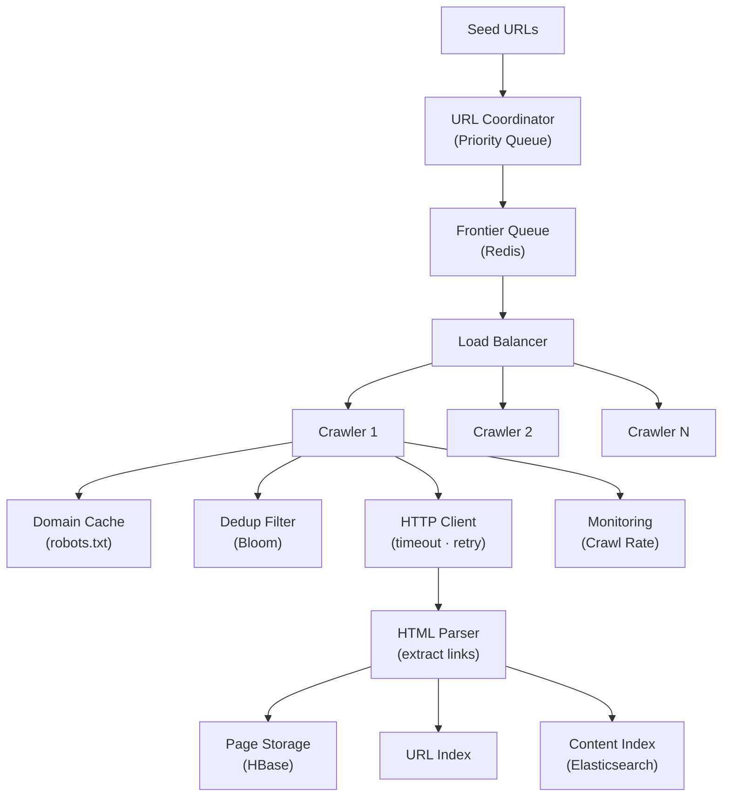

# Web Crawler

> **Interview Time:** 60-90 min | **Difficulty:** Hard  
> **Key Focus:** URL frontier, politeness policy, distributed crawling

---

## Step 1: Functional & Non-Functional Requirements

### Functional Requirements

- Crawl websites starting from seed URLs
- Discover and follow links recursively to other pages
- Extract page content (title, metadata, text)
- Respect robots.txt and politeness policies
- Handle sitemap.xml for efficient crawling
- Deduplicate URLs (avoid revisiting same page)
- Store crawled content with metadata (timestamp, status code)
- Support re-crawling of existing pages (incremental updates)
- Parse and normalize URLs (handle query params, fragments)
- Handle redirects (301/302/307) correctly
- Extract structured data from pages (schema.org, microdata)

### Non-Functional Requirements

| Requirement | Target | Notes |
|:-----------|:-------|:------|
| **Scale** | Crawl 1B+ pages, 10 billion URLs per day | Distributed across 100s of crawlers |
| **Latency** | Crawl 1000 pages/day per crawler | Network + parsing time ~2-3s per page |
| **Freshness** | Re-crawl every 7-30 days depending on update frequency | News pages <1 day, evergreen content <30 days |
| **Politeness** | Max 1 request/sec per domain, respect robots.txt | Avoid DoS-ing target servers |
| **Robustness** | 99.9% uptime for crawler cluster | Failures don't lose URLs in queue |
| **Deduplication** | 100% unique URLs (no millions of duplicates) | Bloom filters or distributed cache |
| **Compliance** | Honor robots.txt, User-Agent header | Legal: CFAA, GDPR, data retention policies |

---

## Step 2: API Design, Data Model & High-Level Design

### Core API Endpoints (Crawler Coordinator)

```http
POST /crawler/seeds
  {urls: ["http://example.com", ...]}
  → {job_id, status: LAUNCHED}

GET /crawler/jobs/{job_id}/status
  → {total_urls: 1B, crawled: 500M, in_progress: 100K, failed: 10M, eta_hours: 24}

POST /crawler/stop
  {job_id}
  → {status: STOPPED}

GET /crawler/stats
  → {pages_per_second, urls_in_queue, cache_hit_ratio, politeness_delays_ms}

POST /storage/get-page
  {url: string}
  → {status_code, content_hash, headers, body_size, crawled_at}
```

### Entity Data Model

```
CRAWL_JOBS
├─ job_id (PK)
├─ created_at, started_at, completed_at
├─ total_urls_discovered, crawled_count, failed_count
├─ status (QUEUED|RUNNING|COMPLETED|FAILED|PAUSED)

URL_FRONTIER
├─ url (PK)
├─ domain_hash (for sharding)
├─ priority (higher = crawl sooner, based on importance)
├─ crawled_at (NULL if not yet crawled)
├─ next_crawl_time (for re-crawling)
├─ visit_count

CRAWLED_PAGES
├─ url (PK)
├─ content_hash (SHA-256, for deduplication)
├─ status_code (200, 404, 403, etc.)
├─ headers (JSON: {Content-Type, Last-Modified, Expires})
├─ body (compressed: gzip or zstd)
├─ extracted_links (array of URLs found in page)
├─ crawled_at, updated_at
├─ error_message (if failed)

CRAWL_METADATA
├─ url (PK)
├─ robots_txt_rules (cached parsing of /robots.txt)
├─ robots_txt_cached_at
├─ last_modified (from HTTP header)
├─ etag (for conditional requests)
├─ crawl_delay_ms (politeness delay per domain)
├─ disallow_patterns (array of patterns from robots.txt)

URL_DEDUP_CACHE (Bloom filter or HyperLogLog)
├─ fingerprint (hash of canonical URL)
├─ seen: boolean (probabilistic set membership)
```

### High-Level Architecture



---

## Step 3: Concurrency, Consistency & Scalability

### 🔴 Problem: Duplicate URL Crawling

**Scenario:** Same URL discovered from multiple crawlers/pages simultaneously. Without deduplication, we crawl it N times, wasting bandwidth.

**Solutions:**

| Approach | Implementation | Pros | Cons |
|:---------|:---------------|:-----|:-----|
| **Bloom Filter** | Hash URL → check before crawl | Fast (O(1)), memory-efficient (1 bit/URL × 10B URLs = 1.2 GB) | False positives (~1-2%), must re-crawl some pages |
| **Distributed Cache** | Redis SET with URL hash TTL 7 days | Zero false positives, works across crawlers | Network latency, harder to scale to 10B URLs |
| **Canonicalization** | Normalize URL (sort params), use canonical header | Catches URL variations | Complex logic, edge cases |
| **Content Hash** | Deduplicate by SHA-256(content) not URL | Catches copy-paste content | Late dedup (already crawled), wastes bandwidth |

**Recommended:** **Bloom Filter + Distributed Cache Hybrid**

```python
class WebCrawler:
    def crawl(self, url):
        # Quick check: local Bloom filter
        if url in self.local_bloom_filter:
            return  # Skip (might be false positive)
        
        # Distributed check: Redis atomic set-if-not-exists
        if redis.set(f"url:{url_hash}", 1, nx=True, ex=86400*7):
            # Won the race; this thread crawls
            self.fetch_and_parse(url)
        else:
            # Another crawler already crawling or crawled
            return
    
    def fetch_and_parse(self, url):
        # Check robots.txt
        if self.is_robots_allowed(url):
            response = http_get(url, timeout=10)
            content = parse_html(response)
            self.store_page(content)
            
            # Add discovered URLs to frontier
            for link in extract_links(content):
                canonical_url = self.canonicalize(link)
                if canonical_url not in redis_cache:
                    self.add_to_frontier(canonical_url)

def canonicalize_url(url: str) -> str:
    """Normalize URL to avoid duplicates"""
    # Remove fragment: example.com/page#section → example.com/page
    url = url.split('#')[0]
    
    # Sort query params: ?b=2&a=1 → ?a=1&b=2
    parsed = urlparse(url)
    if parsed.query:
        params = parse_qs(parsed.query, keep_blank_values=True)
        sorted_params = '&'.join(f"{k}={v[0]}" for k, v in sorted(params.items()))
        url = urlunparse((parsed.scheme, parsed.netloc, parsed.path, 
                         parsed.params, sorted_params, ''))
    
    # HTTPS preferred
    if url.startswith('http://'):
        url = 'https://' + url[7:]
    
    return url.lower()
```

**Bloom Filter Statistics:**
- URLs to track: 10B
- False positive rate: 1% = 100M false crawls
- Memory: 10B × 1.2 bits / 8 = 1.5 GB (fits single machine)

---

### 🟡 Problem: Respecting Politeness Policies (DoS Prevention)

**Scenario:** Crawler hammers server with 10K requests/sec → target blocks us (429, IP ban), legal issues.

**Solution:** Per-domain rate limiting + robots.txt parsing

```python
class PolitenessController:
    def should_crawl(self, url: str) -> bool:
        domain = extract_domain(url)
        
        # Parse robots.txt (cached 7 days)
        rules = self.get_robots_txt(domain)
        
        # Check User-Agent specific rules
        if not rules.is_allowed_for_useragent(url, USER_AGENT):
            return False
        
        # Enforce Crawl-Delay (default 1 sec)
        crawl_delay_ms = rules.crawl_delay_ms or 1000
        
        # Get last crawl time for this domain
        last_crawl = redis.get(f"last_crawl:{domain}")
        if last_crawl is None:
            return True
        
        elapsed_ms = now() - last_crawl
        if elapsed_ms < crawl_delay_ms:
            # Not enough time elapsed; push to delay queue
            requeue_time = last_crawl + crawl_delay_ms + jitter(50)
            priority_queue.push(url, priority=requeue_time)
            return False
        
        # OK to crawl
        redis.set(f"last_crawl:{domain}", now())
        return True
    
    def get_robots_txt(self, domain: str) -> RobotsTxt:
        cached = redis.get(f"robots:{domain}")
        if cached:
            return cached
        
        # Fetch robots.txt
        response = http_get(f"https://{domain}/robots.txt", timeout=5)
        rules = parse_robots_txt(response.text)
        redis.set(f"robots:{domain}", rules, ex=604800)  # 7 days
        return rules
```

**Politeness Thresholds:**
- Standard: 1 request/sec per domain
- News sites: 5-10 requests/sec
- CDNs: No crawl-delay (cached)
- Overloaded: Detect 503 → exponential backoff (1s → 2s → 4s → 8s)

---

### 💾 Problem: Efficient Re-Crawling & Change Detection

**Scenario:** Need to update stale content. Which pages to re-crawl first?

**Solution:** Priority queue based on update frequency + age

```python
class CrawlPriority:
    def calculate_priority(self, url: str) -> float:
        """
        Lower = higher priority = crawl sooner
        Combines: staleness + importance
        """
        metadata = self.get_metadata(url)
        now = time.time()
        
        # Age in seconds since last crawl
        age_sec = now - metadata.crawled_at
        
        # Estimate frequency from past crawls
        update_freq = self.estimate_update_frequency(url)
        
        # Decay period (e.g., hourly = 1 day, monthly = 30 days)
        decay_period_sec = 1 / update_freq
        staleness_score = age_sec / decay_period_sec
        
        # PageRank-like importance
        importance = len(inbound_links[url]) * quality_score
        
        priority = staleness_score - log(importance + 1)
        return priority
    
    def estimate_update_frequency(self, url: str) -> float:
        """Returns updates per second"""
        last_5_crawls = self.get_last_n_crawls(url, 5)
        if len(last_5_crawls) < 2:
            return 1 / (7 * 86400)  # Default: weekly
        
        change_times = []
        for i in range(len(last_5_crawls) - 1):
            if last_5_crawls[i].content_hash != last_5_crawls[i+1].content_hash:
                change_times.append(last_5_crawls[i+1].crawled_at - last_5_crawls[i].crawled_at)
        
        if not change_times:
            return 0  # Never changes
        
        avg_interval = sum(change_times) / len(change_times)
        return 1 / avg_interval
```

---

## Step 4: Persistence Layer, Caching & Monitoring

### Database Design (HBase/Cassandra)

```sql
-- Crawled pages storage (time-series)
CREATE TABLE crawled_pages (
    url TEXT PRIMARY KEY,
    status_code INT,
    content BLOB COMPRESSED,
    headers MAP<TEXT, TEXT>,
    content_hash BLOB,
    extracted_links SET<TEXT>,
    crawled_at TIMESTAMP,
    updated_at TIMESTAMP
) WITH COMPRESSION = 'ZstdCompressor'
  AND compaction = 'LeveledCompactionStrategy';

-- Row key: (domain, next_crawl_time, url) for time-based queries
CREATE TABLE url_frontier (
    domain TEXT,
    next_crawl_time TIMESTAMP,
    url TEXT,
    priority FLOAT,
    crawl_count INT,
    PRIMARY KEY (domain, next_crawl_time, url)
);

-- Inverted index: links_from[source] → [targets]
CREATE TABLE link_graph (
    from_url TEXT,
    to_url TEXT,
    anchor_text TEXT,
    PRIMARY KEY (from_url, to_url)
);

CREATE INDEX idx_frontier_domain_time ON url_frontier(domain, next_crawl_time);
```

### Caching Strategy

```
TIER 1: In-Memory Bloom Filter (each crawler)
├─ Local Bloom filter of 100M URLs
├─ False positive rate: 1%
└─ Refreshed every 1 hour

TIER 2: Distributed Cache (Redis Cluster)
├─ url_set:{hash} → 1 (TTL: 7 days)
├─ domain:robots_txt:{domain} → rules (TTL: 7 days)
├─ domain:last_crawl:{domain} → timestamp
└─ url_metadata:{url} → {status, crawled_at}

Invalidation:
- robots.txt changes → invalidate domain:robots_txt
- Page re-crawled → update url_metadata
- Content changed → signal other crawlers
```

### Monitoring & Alerts

**Key Metrics:**

1. **Crawl Rate** — Pages/sec (target: 10K/sec)
2. **Average Age** — Days since last crawl (target: <14 days)
3. **404 Rate** — Broken links %
4. **5xx Errors** — Server failures (target: <1%)
5. **Robots Blocks** — robots.txt denials (should be <5%)

```yaml
- alert: CrawlRateLow
  expr: rate(crawled_pages_total[5m]) < 10000
  annotations: "Crawl rate below {{$value}} pages/sec"

- alert: FreshnessDegraded
  expr: avg(page_age_seconds) > 30 * 86400
  annotations: "Average page age >30 days"

- alert: HighRobotsBlockRate
  expr: rate(robots_blocked_total[5m]) / rate(requests_total[5m]) > 0.10
  annotations: "Robots block rate: {{$value | humanizePercentage}}"

- alert: TimeoutRate
  expr: rate(http_timeout_total[5m]) / rate(http_requests_total[5m]) > 0.01
  annotations: "HTTP timeout rate >1%"

- alert: DuplicateUrlsHigh
  expr: rate(duplicate_urls_skipped_total[5m]) / rate(discovered_total[5m]) > 0.05
  annotations: "Duplicate rate: {{$value | humanizePercentage}}"
```

---

## ⚡ Quick Reference Cheat Sheet

### When to Use What

| Need | Technology | Why |
|:-----|:-----------|:----|
| **Deduplication** | Bloom Filter + Redis SET | O(1), memory-efficient for 10B+ URLs |
| **Rate Limiting** | Token bucket + Redis | Atomic, distributed per-domain tracking |
| **Large storage** | HBase/Cassandra | Write-heavy, high throughput, built-in compression |
| **Priority Queue** | Sorted Redis Set | Time-based scheduling, staleness-aware ordering |
| **HTML parsing** | Beautiful Soup (Python) | Extract links, text, metadata reliably |
| **URL normalization** | Custom parser + regex | Handle params, fragments, redirects |

### Critical Design Decisions

- **Bloom Filter → Redis atomic check:** Reduces false positives from 1% to ~0.01%
- **Per-domain rate limit:** Respect robots.txt, avoid legal issues + IP bans
- **Content hashing:** Detect duplicate content even if URLs differ
- **Staleness-based priority:** Crawl changing content frequently (news hourly, static yearly)
- **Compression (ZSTD):** Reduce storage 90x for HTML, make 10B URLs practical
- **Distributed crawlers:** Scale horizontally, no single bottleneck

### Tech Stack Summary

```
Frontier Queue: Redis Sorted Set
Deduplication: Bloom Filter + Redis SET
Rate Limiting: Token bucket (Redis atomic ops)
Storage: HBase/Cassandra
Indexing: Elasticsearch (inverted links)
Parsing: Beautiful Soup (Python)
Monitoring: Prometheus + Grafana
```

---

## 🎯 Interview Summary (5 Minutes)

1. **Deduplication:** Use Bloom Filter (O(1), 1 bit/URL) + distributed Redis SET (atomic check)
2. **Politeness:** Per-domain rate limiter (1 req/sec) + parse robots.txt to avoid IP bans
3. **Frontier priority:** Rank URLs by staleness (age) + importance (PageRank) to crawl relevant/fresh first
4. **Large-scale storage:** HBase/Cassandra for 10B pages; compress HTML with ZSTD (90% reduction)
5. **Change detection:** Track content hash + estimated update frequency to intelligently re-crawl
6. **Distributed crawling:** Multiple workers respect robots.txt delay; Redis coordinates dedup + rate limiting
7. **Canonical URLs:** Sort params, remove fragments/sessions to identify true duplicates

---

## Glossary & Abbreviations

--8<-- "_abbreviations.md"
