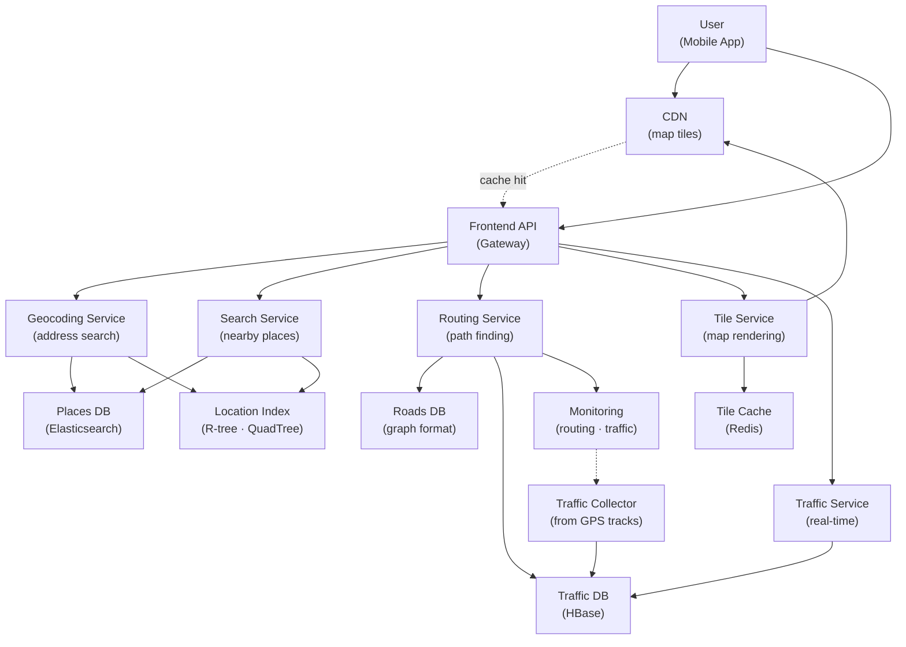

# Google Maps

> **Interview Time:** 60-90 min | **Difficulty:** Hard  
> **Key Focus:** Geospatial data, navigation algorithms, real-time traffic

---

## Step 1: Functional & Non-Functional Requirements

### Functional Requirements

- Search for locations by address, name, or coordinates (lat/lon)
- Display map tiles (raster images covering regions)
- Show markers/POIs (points of interest) on map
- Routing: find path between two points (driving/transit/walking)
- Real-time traffic information (speed, congestion)
- ETA (estimated time of arrival) based on current traffic
- Reverse geocoding (coordinates → address)
- Forward geocoding (address → coordinates)
- Search for nearby places (restaurants, gas stations, hospitals)
- Turn-by-turn navigation with real-time updates

### Non-Functional Requirements

| Requirement | Target | Notes |
|:-----------|:-------|:------|
| **Scale** | 4B daily active users, 1M map views/sec | Global coverage |
| **Latency** | Map tile <200ms, search <100ms, routing <2s | User-facing, critical |
| **Availability** | 99.99% uptime | Users navigate in real-time |
| **Accuracy** | Routing within 5%, ETA within 10% | Depend on traffic data |
| **Update Frequency** | Traffic update every 10-30 sec | Real-time conditions |
| **Storage** | 100M+ places, 10B+ addresses indexed | Massive data |
| **Throughput** | 1M tiles/sec, 100K searches/sec | Peak traffic |

---

## Step 2: API Design, Data Model & High-Level Design

### Core API Endpoints

```http
GET /geocoding
  ?address=1600+Amphitheatre+Parkway,+Mountain+View,+CA
  → {lat: 37.42, lng: -122.08, address_formatted: "...", place_type: BUSINESS}

GET /reverse-geocoding
  ?lat=37.42&lng=-122.08
  → {address: "1600 Amphitheatre Parkway, Mountain View, CA"}

GET /search
  ?query=coffee&location=37.42,-122.08&radius_m=5000
  → {places: [{name, lat, lng, rating, address, types}]}

GET /routing
  ?origin=37.42,-122.08&destination=37.43,-122.06&mode=driving
  → {routes: [{distance_m, duration_sec, steps: [{instruction, distance}]}]}

GET /tiles/{zoom}/{x}/{y}.png
  → PNG image of map tile (256x256 pixels)

GET /traffic
  ?zoom=13&bounds=lat1,lng1,lat2,lng2
  → {segments: [{road_id, speed_kmh, congestion_level}]}

POST /directions-realtime
  WebSocket: stream turn-by-turn navigation updates
  → {current_step, eta_sec, traffic_delay_sec}
```

### Entity Data Model

```
PLACES (POI database)
├─ place_id (PK)
├─ name, description
├─ location (GEOGRAPHY: point, indexed)
├─ address, phone, website
├─ types (ARRAY: RESTAURANT, CAFE, etc.)
├─ rating (1-5), review_count
├─ hours_of_operation
├─ updated_at

ADDRESSES (geocoding index)
├─ address_id (PK)
├─ full_address (unique, indexed)
├─ location (GEOGRAPHY: point)
├─ components {country, state, city, zip}
├─ address_type (STREET|LANDMARK|CITY)
├─ updated_at

ROADS (road network graph)
├─ road_id (PK)
├─ way_id (OSM road ID)
├─ name, road_type (highway, arterial, street)
├─ start_location (GEOGRAPHY), end_location
├─ length_m, speed_limit_kmh
├─ one_way: boolean

TRAFFIC
├─ road_id (PK), timestamp (PK)
├─ average_speed_kmh
├─ congestion_level (1-5, where 5=worst)
├─ incident_type (accident, construction, event)
├─ created_at, updated_at

MAP_TILES
├─ tile_key = "{zoom}/{x}/{y}" (PK)
├─ image_data (PNG binary)
├─ generated_at, version
├─ layer (base, labels, traffic)

ROUTING_CACHE
├─ origin_location (GEOGRAPHY), destination
├─ mode (DRIVING|TRANSIT|WALKING)
├─ routes_cached (ARRAY)
├─ created_at (TTL: 24 hours)
```

### High-Level Architecture



---

## Step 3: Concurrency, Consistency & Scalability

### 🔴 Problem: Routing in Massive Road Graph

**Scenario:** Find shortest path between two points in 1B+ road segments. Dijkstra algorithm on full graph = 1000+ seconds.

**Solutions:**

| Approach | Implementation | Pros | Cons |
|:---------|:---------------|:-----|:-----|
| **Contraction Hierarchies** | Pre-compute node importance, contract less important ones | Very fast queries (milliseconds) | Complex preprocessing, memory hungry |
| **Hub Labels** | Precompute distance to "hub" nodes | Extremely fast (constant time!) | Massive preprocessing, storage intensive |
| **A* with Landmarks** | Use precomputed landmarks + heuristics | Fast + adaptive to traffic | Requires good landmark selection |
| **Hierarchical Approach** | Route at multi-levels (highways → streets) | Practical for navigation | Some accuracy loss at boundaries |

**Recommended:** **Contraction Hierarchies + Real-time Traffic Overlay**

```python
class RoutingEngine:
    def preprocess_road_graph(self, roads: List[Road]):
        """Build contraction hierarchy for fast queries"""
        
        # Contraction Hierarchies Algorithm:
        # 1. Assign importance scores to nodes (centrality + degree)
        # 2. Process nodes in increasing importance order
        # 3. For each node, create shortcuts across it
        # 4. Contract (remove) node with shortcuts permanently in place
        
        node_importance = self.compute_node_importance(roads)
        contraction_order = sorted(roads, key=lambda r: node_importance[r.id])
        
        shortcuts = []
        for node in contraction_order:
            # Find all pairs (u, v) where shortest path goes through this node
            for u in node.neighbors:
                for v in node.neighbors:
                    if u != v:
                        # Distance u→node→v
                        dist = u.distance[node] + node.distance[v]
                        
                        # Is this the shortest path u→v?
                        if dist < self.shortest_distance.get((u, v), float('inf')):
                            # Create shortcut
                            shortcuts.append(Shortcut(u, v, dist, node.id))
            
            # Contract this node
            contraction_order.remove(node)
    
    def find_route_ch(self, origin: Location, dest: Location) -> Route:
        """Query using contraction hierarchies"""
        
        # Forward search from origin
        forward_dist = dijkstra(origin, max_node_order=node_order[dest])
        
        # Backward search from destination
        backward_dist = dijkstra(dest, max_node_order=node_order[origin])
        
        # Find meeting point with minimum distance
        best_dist = float('inf')
        best_path = None
        
        for node in all_nodes:
            total_dist = forward_dist.get(node, inf) + backward_dist.get(node, inf)
            if total_dist < best_dist:
                best_dist = total_dist
                best_path = self.reconstruct_path(origin, node, dest, forward_dist, backward_dist)
        
        return best_path
    
    def find_route_with_traffic(self, origin: Location, dest: Location) -> Route:
        """Find fastest route considering real-time traffic"""
        
        # Use contraction hierarchies as base
        base_route = self.find_route_ch(origin, dest)
        
        # Overlay real-time traffic costs
        routes = []
        for edge in base_route.edges:
            road = self.get_road(edge.road_id)
            speed = self.get_current_speed(road)  # From traffic service
            
            # Adjust edge weight: weight = distance / speed
            edge.travel_time = road.length_m / (speed + 0.1)  # speed in m/sec
        
        # Re-evaluate route with traffic
        actual_time = sum(e.travel_time for e in base_route.edges)
        
        # Consider alternative routes if congestion detected
        alternatives = self.find_alternative_routes(origin, dest, num=2)
        
        # Return the fastest given current traffic
        all_routes = [base_route] + alternatives
        fastest = min(all_routes, key=lambda r: r.total_travel_time)
        
        return fastest
```

**Performance Comparison:**

```
Dijkstra on full graph: 1000+ seconds (impractical)
A* with heuristics: 100-500 seconds (still slow)
Contraction Hierarchies: 10-50 milliseconds (1000x faster!)
Hub Labels: 1-5 microseconds (even faster, but larger preprocessing)
```

---

### 🟡 Problem: Updating Traffic in Real-Time

**Scenario:** Accident on Highway 101 at 5:30pm. Must propagate this info to all routing requests within 30 seconds. But 100M+ road segments, constant updates.

**Solution:** Segment-level traffic updates + hierarchical propagation

```python
class TrafficService:
    def update_traffic_segment(self, road_id: str, speed_kmh: float, congestion: int):
        """Update traffic for a single road segment"""
        
        # Store in time-series DB (HBase)
        timestamp_sec = int(time.time())
        row_key = f"{road_id}#{timestamp_sec}"
        
        self.traffic_db.put(row_key, {
            'speed': speed_kmh,
            'congestion': congestion,  # 1-5 scale
            'timestamp': timestamp_sec,
            'incident_type': self.detect_incident(road_id)
        })
        
        # Publish to Kafka for real-time subscribers
        self.kafka.produce(topic='traffic-updates', key=road_id, value={
            'road_id': road_id,
            'speed': speed_kmh,
            'congestion': congestion
        })
        
        # Invalidate routing cache for affected paths
        self.invalidate_routing_cache(road_id)
    
    def aggregate_traffic_for_region(self, bounds: Bounds, zoom_level: int) -> List[TrafficSegment]:
        """Get aggregated traffic for map display"""
        
        # Query only segments visible at this zoom level
        roads_in_region = self.spatial_index.query(bounds, zoom_level)
        
        traffic_segments = []
        for road in roads_in_region:
            latest_traffic = self.traffic_db.get_latest(road.id)
            
            if latest_traffic:
                traffic_segments.append(TrafficSegment(
                    road_id=road.id,
                    start=road.start_location,
                    end=road.end_location,
                    speed=latest_traffic.speed,
                    congestion=latest_traffic.congestion,
                    timestamp=latest_traffic.timestamp
                ))
        
        return traffic_segments
    
    def detect_incident(self, road_id: str) -> str:
        """Detect if something changed (accident, congestion, etc.)"""
        
        latest = self.traffic_db.get_latest(road_id)
        recent_history = self.traffic_db.get_history(road_id, last_n=10)
        
        if len(recent_history) < 2:
            return 'NORMAL'
        
        prev = recent_history[-2]
        
        # Detect accidents: sudden speed drop >50%
        if prev.speed > 0 and latest.speed < prev.speed * 0.5:
            return 'ACCIDENT'
        
        # Detect congestion: persistent slow traffic
        avg_speed = sum(h.speed for h in recent_history[-5:]) / 5
        if avg_speed < 20:  # Walking pace on highway
            return 'CONGESTION'
        
        # Detect unusual: speed change >2x in seconds
        if latest.speed > prev.speed * 2:
            return 'INCIDENT_CLEARED'
        
        return 'NORMAL'
```

---

### 💾 Problem: Map Tile Generation & Caching

**Scenario:** Generate map tiles for entire world at zoom 0-20 = 1B+ tiles (at zoom 18). Can't pre-render all. Must generate on-demand, cache heavily.

**Solution:** Vector tiles + client-side rendering + hierarchical caching

```python
class TileService:
    def get_tile(self, zoom: int, x: int, y: int, layer: str) -> Image:
        """Get map tile with multi-level caching"""
        
        tile_key = f"{zoom}/{x}/{y}/{layer}"
        
        # TIER 1: CDN cache (browser + edge servers)
        cdn_key = f"tile:{tile_key}"
        cached = self.cdn.get(cdn_key)
        if cached:
            self.metrics.increment('tile_cache_hits')
            return cached
        
        # TIER 2: Redis cache (hot tiles, last hour)
        redis_key = f"tile:{tile_key}"
        cached = self.redis.get(redis_key)
        if cached:
            self.cdn.set(cdn_key, cached, ttl=86400)  # Cache in CDN
            return cached
        
        # TIER 3: Generate tile (expensive)
        self.metrics.increment('tile_cache_misses')
        tile_image = self.render_tile(zoom, x, y, layer)
        
        # Cache for future requests (TTL: 1 hour, tiles update slowly)
        self.redis.set(redis_key, tile_image, ttl=3600)
        self.cdn.set(cdn_key, tile_image, ttl=86400)
        
        return tile_image
    
    def render_tile(self, zoom: int, x: int, y: int, layer: str) -> Image:
        """Render tile on-demand from vector data"""
        
        # Get bounds for this tile
        bounds = self.tile_to_bounds(x, y, zoom)
        
        # Query vector data (roads, POIs, labels)
        if layer == 'base':
            roads = self.query_roads(bounds, zoom)
            tile = self.render_roads(roads)
        
        elif layer == 'traffic':
            traffic = self.query_traffic(bounds, zoom)
            tile = self.render_traffic_overlay(traffic)
        
        elif layer == 'labels':
            places = self.query_places(bounds, zoom)
            tile = self.render_labels(places)
        
        return tile.to_png()
    
    def tile_to_bounds(self, x: int, y: int, zoom: int) -> Bounds:
        """Web Mercator projection: tile coordinates → lat/lon"""
        
        n = 2.0 ** zoom
        lon_left = (x / n) * 360 - 180
        lon_right = ((x + 1) / n) * 360 - 180
        
        lat_top = math.degrees(
            math.atan(math.sinh(math.pi * (1 - 2 * y / n)))
        )
        lat_bottom = math.degrees(
            math.atan(math.sinh(math.pi * (1 - 2 * (y + 1) / n)))
        )
        
        return Bounds(lat_top, lon_left, lat_bottom, lon_right)
```

---

## Step 4: Persistence Layer, Caching & Monitoring

### Database Design

```sql
-- Places index (Elasticsearch)
CREATE INDEX places {
    "settings": {
        "number_of_shards": 100,  # Large index, many shards
        "number_of_replicas": 2,
        "analysis": {
            "analyzer": "trigram_analyzer"  # For autocomplete
        }
    },
    "mappings": {
        "properties": {
            "name": { "type": "text", "analyzer": "trigram_analyzer" },
            "location": { "type": "geo_point" },
            "address": { "type": "text" },
            "types": { "type": "keyword" },
            "rating": { "type": "float" },
            "review_count": { "type": "integer" }
        }
    }
};

-- Roads graph (Cassandra, column-oriented)
CREATE TABLE roads (
    road_id TEXT PRIMARY KEY,
    way_name TEXT,
    way_type TEXT,  -- HIGHWAY, ARTERIAL, STREET
    start_location POINT,
    end_location POINT,
    start_node_id TEXT,
    end_node_id TEXT,
    length_meters INT,
    speed_limit_kmh INT,
    one_way BOOLEAN
);

-- Road graph edges for routing
CREATE TABLE road_edges (
    from_node TEXT,
    to_node TEXT,
    road_id TEXT,
    distance_m INT,
    speed_limit_kmh INT,
    PRIMARY KEY (from_node, to_node)
);

-- Real-time traffic (time-series)
CREATE TABLE traffic_timeseries (
    road_id TEXT,
    timestamp_ms BIGINT,
    average_speed_kmh INT,
    congestion_level INT,
    PRIMARY KEY (road_id, timestamp_ms DESC)  -- Recent first
) WITH COMPRESSION = 'ZstdCompressor'
  AND TTL = 604800;  -- Keep 7 days

-- Spatial index for fast geographic queries
CREATE INDEX idx_roads_location ON roads(location)
    USING GIST;  -- GiST allows spatial indexing

CREATE INDEX idx_places_location ON places(location)
    USING GIST;  -- R-tree for efficient range queries
```

### Caching Strategy

```
TIER 1: Browser Cache
├─ Map tiles (PNG, TTL: 24 hours)
├─ Geocoding results (user searches, TTL: 7 days)
└─ Routing results (common routes, TTL: 6 hours)

TIER 2: CDN (Edge cache)
├─ Map tiles (frequently viewed regions)
├─ Static POI data (names, photos)
└─ TTL: 1-24 hours (geographically distributed)

TIER 3: Redis Cache (backend)
├─ Hot tiles (last hour)  [TTL: 1 hour]
├─ Recent routes (popular origins/destinations)  [TTL: 6 hours]
├─ Traffic updates (last minute of each segment)  [TTL: 5 minutes]
└─ Geocoding cache (address → coords)  [TTL: 30 days]

TIER 4: Database (source of truth)
├─ Full roads graph (Cassandra)
├─ All POIs (Elasticsearch)
└─ Traffic history (HBase for analytics)

Invalidation:
- Tile: Re-generate if road/POI data changed (rare)
- Traffic: Update every 10-30 sec (stored in Kafka stream)
- Routes: Invalidate if traffic significantly changes (>20% slowdown)
```

### Monitoring & Alerts

**Key Metrics:**

1. **Search Latency** — Time to search for location (target: <100ms)
2. **Routing Time** — Time to compute route (target: <2 sec)
3. **ETA Accuracy** — How close predicted arrival to actual (target: within 10%)
4. **Traffic Update Latency** — Time to propagate traffic info (target: <30 sec)
5. **Tile Cache Hit Ratio** — % of tiles served from cache (target: >95%)

```yaml
- alert: GeocodingLatencySlow
  expr: histogram_quantile(0.99, rate(geocoding_latency_seconds_bucket[5m])) > 0.5
  annotations: "Geocoding p99 latency: {{$value}}s (target: <100ms)"

- alert: RoutingLatencySlow
  expr: histogram_quantile(0.99, rate(routing_latency_seconds_bucket[5m])) > 5
  annotations: "Routing p99 latency: {{$value}}s (target: <2s)"

- alert: TrafficUpdateLatencyHigh
  expr: traffic_update_latency_seconds > 30
  annotations: "Traffic updates delayed by {{$value}}s (target: <30s)"

- alert: TileCacheLow
  expr: tile_cache_hit_ratio < 0.90
  annotations: "Tile cache hit ratio: {{$value | humanizePercentage}} (target: >95%)"

- alert: ETAAccuracyDegraded
  expr: avg(abs(predicted_eta_seconds - actual_eta_seconds) / actual_eta_seconds) > 0.15
  annotations: "ETA accuracy degraded to {{$value | humanizePercentage}} error (target: <10%)"

- alert: TrafficDataStale
  expr: now() - traffic_last_update_time > 5*60  # No update for 5 minutes
  annotations: "Traffic data stale (no updates for {{$value}}s)"
```

---

## ⚡ Quick Reference Cheat Sheet

### When to Use What

| Need | Technology | Why |
|:-----|:-----------|:----|
| **Fast routing** | Contraction Hierarchies | 1000x faster than plain Dijkstra |
| **Real-time traffic** | Kafka streams + HBase | Propagate updates within 30 sec |
| **POI search** | Elasticsearch | Full-text search + facets + geo-queries |
| **Road graph storage** | Cassandra (graph format) | Efficient neighbor lookups |
| **Tile caching** | Redis → CDN → Browser | Multi-level cache for 95%+ hit rate |
| **Spatial indexing** | R-tree (GiST) | O(log N) range queries for geo bounds |

### Critical Design Decisions

- **Contraction Hierarchies:** Preprocess graph once, query in milliseconds (vs seconds with Dijkstra)
- **Traffic overlay:** Update edge weights dynamically based on real-time traffic
- **Hierarchical tile caching:** Redis for hot → CDN for edges → Browser for user
- **Vector tiles:** Pre-render only frequently accessed tiles; generate others on-demand
- **Geohashing for sharding:** Partition data by geographic region for locality
- **ETA = distance / speed:** But speed varies by time/congestion; use predictive models

### Tech Stack Summary

```
Routing: Contraction Hierarchies or A* + landmarks
Road Graph: Cassandra (edges + adjacency list)
Places DB: Elasticsearch (full-text search + geo)
Traffic: Kafka (real-time updates) + HBase (time-series)
Tiles: Redis cache + CDN + client-side render
Geocoding: Elasticsearch reverse index (coords → address)
```

---

## 🎯 Interview Summary (5 Minutes)

1. **Contraction Hierarchies:** Pre-process road graph by node importance; queries in milliseconds (1000x faster Dijkstra)
2. **Real-time traffic:** Kafka streams for propagation within 30 sec; overlay weights dynamically on routes
3. **ETA prediction:** Distance / average_speed, weighted by traffic + time-of-day patterns
4. **Tile caching:** Multi-level (browser → CDN → Redis); pre-render hot tiles, generate on-demand for others
5. **Spatial indexing:** R-tree (GiST) for O(log N) range queries on geographic bounds
6. **Nearby search:** Geohashing to partition space; Elasticsearch for text + geo-proximity combined
7. **Alternative routes:** Yen's algorithm or k-shortest paths; compare travel time given current traffic

---

## Glossary & Abbreviations

--8<-- "_abbreviations.md"
