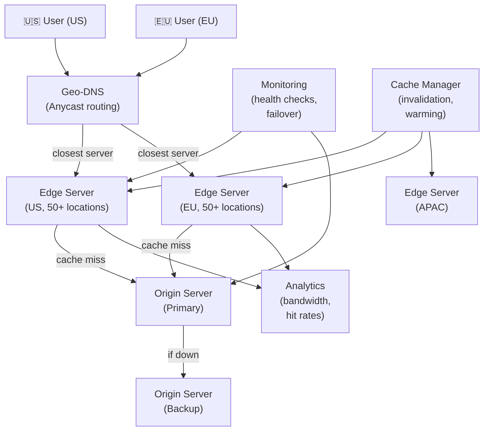

# Global Content Distribution Network

> **Interview Time:** 60-90 min | **Difficulty:** Hard  
> **Key Focus:** Edge caching, geo-routing, content replication, cache invalidation, failover

---

## Step 1: Functional & Non-Functional Requirements

### Functional Requirements

- Distribute content (images, videos, HTML) globally from closest edge server
- Provide origin server configuration (which assets to cache, TTLs)
- Cache invalidation (purge content when updated)
- Automatic failover if edge server goes down
- Geo-location based routing (US users → US servers, EU users → EU servers)
- Support for dynamic content (with cache headers)
- Traffic surge handling (unlimited scale, auto-scaling)
- Analytics (bytes transferred, cache hit rate, user geography)
- Real-time monitoring of edge servers

### Non-Functional Requirements

| Requirement | Target | Notes |
|:-----------|:-------|:------|
| **Latency** | <100ms from user to edge | 180+ edge locations worldwide |
| **Availability** | 99.99% uptime | Failover to backup edge |
| **Throughput** | Pbps (petabits/sec) | Unlimited, auto-scale |
| **Cache hit ratio** | 80%+ | More edge hits = lower costs |
| **Freshness** | Configurable TTL | 1 hour to 30 days |
| **Cost** | Minimize origin bandwidth | Intercept 80%+ traffic at edge |

---

## Step 2: API Design, Data Model & High-Level Design

### Core API Endpoints

```http
GET /files/image.jpg
  → Routes to nearest edge server
  → If cache hit: return from edge
  → If miss: fetch from origin, cache at edge, return

GET /config/cdn-settings
  {domain: "mysite.com"}
  → {ttl_seconds: 3600, cache_rules, gzip_enabled, origin_servers}

POST /cache/purge
  {paths: ["/images/*.jpg", "/api/data"]}
  → {status: purged, purged_count: 1500}

GET /analytics/bandwidth
  {date_range: "last_7_days"}
  → {total_bytes, cache_hit_rate, users_by_country}

GET /edge-status
  → {edge_servers: [{location, status: UP|DOWN, latency_ms}]}
```

### Entity Data Model

```
ORIGINS (content source servers)
├─ origin_id (PK)
├─ domain (e.g., "mysite.com")
├─ origin_ip_addresses (array)
├─ health_check_interval_seconds
├─ cache_ttl_seconds
├─ gzip_enabled, compression_enabled
├─ created_at

EDGE_SERVERS (worldwide caching servers)
├─ edge_id (PK)
├─ location (city, region, continent)
├─ edge_server_ip
├─ geographical_coordinates {lat, lng}
├─ storage_capacity_gb
├─ status (HEALTHY, PARTIAL, DOWN)
├─ parent_edge_id (for cascading misses)
├─ last_health_check_at
├─ created_at

CACHE_ENTRIES (what's cached at each edge)
├─ cache_key (MD5(url + query_params))
├─ origin_id (FK)
├─ url_path
├─ content_hash (SHA256, for verification)
├─ size_bytes
├─ content_type
├─ cache_ttl_seconds
├─ created_at, expires_at
├─ hit_count, last_accessed_at

-- Stored distributed across all edges
-- No central database (too slow), uses cache-coherence protocol

PLATFORM_CONFIGS (per-domain configuration)
├─ domain (UNIQUE)
├─ origin_id (FK)
├─ cache_rules (JSON)
│  {paths: {"/static/*": {ttl: 31536000}, "/api/*": {ttl: 0}}}
├─ geo_routing (preferred_regions)
├─ failover_origins (backup)
├─ created_at

INVALIDATION_RULES (purge patterns)
├─ rule_id (PK)
├─ domain
├─ pattern (glob pattern: "/images/*.jpg")
├─ invalidate_at (timestamp when rule applies)
├─ created_at
```

### High-Level Architecture



---

## Step 3: Concurrency, Consistency & Scalability

### 🔴 Problem: "Thundering Herd" (Cache Stampede)

**Scenario:** Popular video (10K requests/sec) cached on edge. Cache expires. All 10K requests hit origin simultaneously. Origin overwhelmed, times out.

**Solution: Probabilistic Early Expiration + Lock-Based Refresh**

```
Cache Entry expires at: T = 2026-04-26 14:00:00

Normal case (non-popular):
  Request at 13:59 → cache hit, refreshed
  Request at 14:01 → cache miss, fetch from origin

Thundering Herd case (popular, 10K req/sec):
  Request at 14:00:00.000 → cache expired, but don't fetch yet
  Request at 14:00:00.001 → same miss
  Request at 14:00:00.100 → 100 requests in flight
  
  All 100 hit origin simultaneously
  Origin can't handle 10K simultaneous requests
  Origin times out, returns 503
  All 100 requests fail

Solution: Probabilistic Expiration (stale-while-revalidate)

Cache entry:
  content = <video bytes>
  ttl_seconds = 3600
  stale_window_seconds = 600  -- allow stale for 10 minutes
  expires_at = 2026-04-26 14:00:00

At 14:00:00, request arrives:
  Is content expired?  YES
  
  Is content within stale window (14:00 - 10:00)?  YES
  
  → Serve stale content to user immediately
  → But ALSO, with probability P:
    P = (time_since_expiry_seconds) / stale_window_seconds
    
    At 14:00:00, P = 0 / 600 = 0%  → 0% chance to refresh
    At 14:05:00, P = 300 / 600 = 50%  → 50% chance to refresh
    At 14:10:00, P = 600 / 600 = 100%  → 100% chance to refresh (must refresh)

  If refresh triggered:
    Acquire lock (Redis SET NX):
      lock_key = "refresh:video_id"
      value = edge_server_id
      TTL = 10 seconds
    
    If lock acquired:
      → Fetch fresh content from origin
      → Update cache
      → Release lock
      → Serve fresh to this request
    
    If lock not acquired:
      → Another edge server is already fetching
      → Serve stale while waits
      → Poll lock every 100ms
      → Once lock released, serve fresh

Result:
  - User gets fast response (stale content <10ms)
  - Only 1 origin request during refresh (due to lock)
  - Servers after refresh get fresh content
  - No thundering herd
```

### 🟡 Problem: Cache Invalidation (Stale Content)

**Scenario:** User posts new image to site. Site updates image file. But CDN cached old image. User sees outdated photo for 24 hours.

**Solutions:**

```
1. PURGE IMMEDIATELY (cache invalidation on demand)
   POST /cache/purge
   {url: "https://mysite.com/photos/pic.jpg"}
   
   Server broadcasts purge command to all edge servers:
   → Each edge server deletes entry from cache
   → Next request fetches fresh from origin
   
   Latency: ~5 seconds to reach all edges (global broadcast)

2. VERSIONING (append cache-buster token)
   Old URL: /photos/pic.jpg (cached 24 hours)
   New URL: /photos/pic.jpg?v=12345 (different cache entry)
   
   Site links to new URL immediately
   → Cache for new URL starts fresh
   → Old cached version still exists but unused
   → No network broadcast needed
   
   Latency: Instant! (new URL has 0% cache hit initially though)

3. STALE-WHILE-REVALIDATE (serve old while fetching new)
   Configured in Cache-Control header:
   Cache-Control: max-age=3600, stale-while-revalidate=86400
   
   At 2 hours (past max-age but within stale window):
   → Serve cached version to user
   → Fetch fresh in background
   → Next user gets fresh version
   
   Latency: Fast (cached) but not guaranteed fresh

4. CONDITIONAL REQUESTS (ETag, Last-Modified)
   Request: GET /pic.jpg
   Response: ETag: "abc123"
   
   Next request:
   GET /pic.jpg
   If-None-Match: "abc123"  -- "only send if different"
   
   Server compares: file hasn't changed
   Response: 304 Not Modified (0 bytes)
   
   Latency: Network round-trip, but saves bandwidth
```

### Solution: Geo-Routing

```
User location determined via:
1. DNS (geo-aware DNS resolver)
   - User's recursive resolver's IP (approximate location)
   - Route to closest edge server based on IP geolocation

2. HTTP Client-IP (fallback)
   - Read X-Forwarded-For header
   - Geolocate user IP address

3. GeoIP database (local at CDN)
   - IP address ranges mapped to lat/long
   - Query: "Which edge is closest to this user IP?"

Example:
  User opens browser:
  - Query Google DNS: resolve mysite.com
  - Google DNS sees user is in San Francisco (from recursive resolver IP)
  - Responds with IP of closest CDN edge (SF region)
  - Browser connects to SF edge
  - SF edge caches content locally
  - Subsequent requests hit SF edge (cache hit!)
  - Latency: <10ms (local to user)
  
  vs. Default (no geo-routing):
  - User connects to origin in Virginia
  - Latency: 70ms+ (cross-country)
```

---

## Step 4: Persistence Layer, Caching & Monitoring

### Cache Storage

**Distributed caching (no single point of failure):**

```
Edge Server Storage Structure:

/cache/
  domain_1/
    static/
      img1.jpg (cached, expires in 30 days)
      img2.jpg
    api/
      data.json (not cached, bypass by default)
  domain_2/
    ...

Distributed Hashing:
  For origin requests to origin_server_A:
    hash(content_url) determines which edge stores it
    Typically: replicated across 3 nearest edges for redundancy
    
    cache_key = SHA256(url)
    responsible_edges = nearest_N_edges_to_cache_key(hash, 3)
    
    All 3 edges maintain copy
    If 1 edge fails, other 2 have it
    If all 3 fail, fetch from origin again

Eviction Policy (LRU):
  Keep: Most frequently accessed, recently accessed
  Evict: Least frequently accessed, hasn't been accessed
  When storage full:
    1. Delete expired entries
    2. Delete entries past TTL
    3. LRU evict until space available
```

### Configuration & Invalidation

```sql
-- Sample CDN configuration for a domain
{
  "origin_servers": ["origin.example.com"],
  "edge_locations": 150,  -- auto-dedicate to major regions
  
  "cache_rules": {
    "/static/*": {
      "ttl_seconds": 31536000,  -- 1 year (fingerprinted assets)
      "cache": "always"
    },
    "/api/*": {
      "ttl_seconds": 0,
      "cache": "never"  -- bypass cache for APIs
    },
    "/images/*": {
      "ttl_seconds": 86400,  -- 1 day
      "cache": "always"
    }
  },
  
  "geo_routing": {
    "US": ["us-east", "us-west"],
    "EU": ["eu-west", "eu-central"],
    "APAC": ["sg", "au"]
  },
  
  "failover_origins": [
    "origin-primary.com",
    "origin-backup.com"  -- if primary down
  ],
  
  "purge_rules": {
    "patterns": ["/images/product/*.jpg"],
    "automatic": false  -- manual purge only
  }
}
```

### Monitoring & Alerts

**Key Metrics:**

1. **Cache Performance**
   - Cache hit ratio (% of requests served from edge, target >80%)
   - Edge latency (P95 <100ms from user)
   - Origin latency (P95 when cache misses)

2. **Availability**
   - Edge server uptime (target 99.99%)
   - Origin failover incidents (auto-recover time <10 sec)
   - CDN availability (global, target 99.99%)

3. **Data Freshness**
   - Cache validity window (% of requests within freshness)
   - Stale content served (intentional via stale-while-revalidate)
   - Purge operation latency (<5 sec to all edges)

4. **Costs & Bandwidth**
   - Total bytes transferred
   - Bytes served from edge vs origin
   - Origin bandwidth saved (80% × total_bandwidth ideal)
   - Storage utilization per edge

5. **User Experience**
   - Page load time (with CDN vs without)
   - Time to first byte (TTFB)
   - Bounce rate improvement
   - User satisfaction metrics

```yaml
- alert: CacheHitRateLow
  expr: cache_hit_ratio < 0.70
  annotations: "Cache hit rate < 70% — review cache TTLs or rules"

- alert: EdgeServerDown
  expr: edge_server_status == DOWN
  annotations: "Edge server {{ region }} is down — activate failover"

- alert: OriginLatencyHigh
  expr: origin_latency_p95 > 500
  annotations: "Origin latency > 500ms — scaling or health issue"

- alert: PurgeLagHigh
  expr: cache_purge_propagation_time > 10
  annotations: "Cache purge > 10s — some edges not responding"
```

---

## ⚡ Quick Reference Cheat Sheet

### Critical Design Decisions

1. **Geo-DNS routing** — Route user to nearest edge based on their geography
2. **Stale-while-revalidate** — Serve stale content to user, fetch fresh in background
3. **Probabilistic early expiration** — Avoid thundering herd when cache expires
4. **Distributed lock on refresh** — Only 1 origin request during miss, others wait for lock
5. **Versioning for invalidation** — Use query params/cache-busting tokens instead of purge
6. **LRU eviction at edges** — Keep hot content, evict cold when storage full

### When to Use What

| Need | Technology | Why |
|:-----|:-----------|:----|
| Geo-routing | Anycast DNS | Sub-millisecond, global coverage |
| Cache invalidation | Versioning + purge | Instant for urgent, eventual for bulk |
| Stampede prevention | Stale-while-revalidate + lock | No origin overload on expiry |
| Origin failover | Health checks + backup | Automatic recovery in <10 sec |

### Tech Stack

```
Edge Servers: Nginx/Varnish (caching, compression)
Origin: Any web server (transparent to CDN)
Geo-routing: Anycast DNS + GeoDB
Monitoring: Real-time dashboards
Invalidation: REST API + broadcast
```

---

## 🎯 Interview Summary (5 Minutes)

1. **Geo-routing** → DNS resolves to nearest edge based on user location
2. **Cache hierarchy** → Edge → Origin (bypass for APIs)
3. **Thundering herd** → Stale-while-revalidate + probabilistic refresh + locks
4. **Cache invalidation** → Versioning (instant) vs purge (eventual, global broadcast)
5. **Failover** → Health checks + backup origins, auto-recover
6. **Performance target** → <100ms latency, >80% cache hit rate
7. **Cost optimization** → 80% of bandwidth from edges, not origin

---

## Glossary & Abbreviations

--8<-- "_abbreviations.md"

## ⚡ Quick Reference Cheat Sheet

[TODO: Fill this section]

---

## 🎯 Interview Summary (5 Minutes)

[TODO: Fill this section]

---

## Glossary & Abbreviations

--8<-- "_abbreviations.md"
