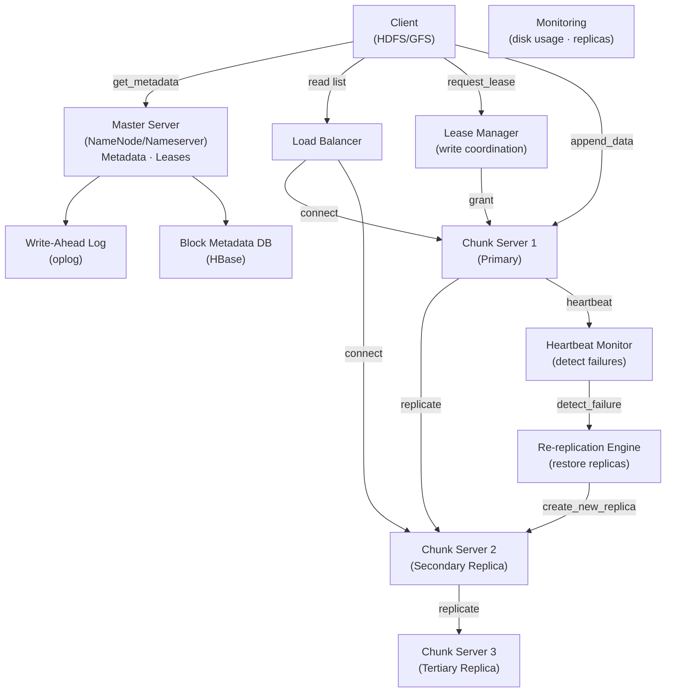

# Distributed File System

> **Interview Time:** 60-90 min | **Difficulty:** Hard  
> **Key Focus:** Block storage, replication, consistency, fault tolerance

---

## Step 1: Functional & Non-Functional Requirements

### Functional Requirements

- Client can read/write files in distributed storage
- Split large files into chunks (like GFS/HDFS)
- Replicate chunks across multiple nodes for fault tolerance
- Support append operations (not random writes)
- Delete files and reclaim storage space
- List files and directories
- Namespace management (directories, hierarchies)
- Atomic rename operations
- Read-after-write consistency
- Handle node failures transparently (automatic re-replication)

### Non-Functional Requirements

| Requirement | Target | Notes |
|:-----------|:-------|:------|
| **Scale** | 1000 nodes, 10PB storage, 1B+ files | 1000s of concurrent clients |
| **Replication Factor** | 3 copies per chunk | Tolerates 2 node failures |
| **Latency** | Read/write <100ms (local replica) | Append slightly slower |
| **Availability** | 99.99% (very high) | Automatic re-replication on failures |
| **Consistency** | Strong (atomic writes) | All replicas eventually consistent |
| **Throughput** | 100 MB/sec per client | Aggregate: 10s of GB/sec |
| **Chunk Size** | 64-256 MB | Balances metadata + parallelism |

---

## Step 2: API Design, Data Model & High-Level Design

### Core API Endpoints

```http
POST /files/create
  {path: "/data/file.txt", replication_factor: 3}
  → {file_id, lease_holder, lease_timeout_ms}

POST /files/{file_id}/append
  {data: bytes, offset: 0}
  → {new_offset, replicas_acked: 3}

GET /files/{file_id}/read
  {offset: 0, length: 1024}
  → {data: bytes, chunk_servers: ["server1", "server2"]}

DELETE /files/{file_id}
  → {deleted_chunks: N, freed_space_gb: X}

GET /files/list
  {path: "/data", recursive: true}
  → {files: [{name, size, replication, owner}]}

POST /files/{file_id}/rename
  {old_path, new_path}
  → {success: true}
```

### Entity Data Model

```
FILES (namespace)
├─ file_id (PK)
├─ path (unique)
├─ owner_id
├─ replication_factor (default 3)
├─ created_at, modified_at
├─ size_bytes, block_count
├─ permissions (read/write/execute)

BLOCKS (chunks of data)
├─ block_id (PK)
├─ file_id (FK)
├─ block_index (0, 1, 2, ...)
├─ size_bytes (usually 64-256 MB)
├─ checksum (SHA-1 or CRC32)
├─ replicas: [server1, server2, server3]
├─ created_at

BLOCK_SERVERS (chunk storage nodes)
├─ server_id (PK)
├─ hostname, port
├─ total_storage_gb
├─ used_storage_gb
├─ blocks_stored: [block_ids]
├─ last_heartbeat_ms (for liveness detection)

LEASES (write locks for append operations)
├─ file_id (PK)
├─ lease_holder (primary replica server_id)
├─ lease_start_ms, lease_expiry_ms
├─ version_number (incremented on each write)
```

### High-Level Architecture



---

## Step 3: Concurrency, Consistency & Scalability

### 🔴 Problem: Write Conflicts & Stale Replicas

**Scenario:** Multiple clients try to append to same file simultaneously. One replica fails mid-write → replicas have different data.

**Solutions:**

| Approach | Implementation | Pros | Cons |
|:---------|:---------------|:-----|:-----|
| **Primary · Replica Model** | Client writes to primary; primary replicates to secondaries sequentially | Preserves order, atomic writes | Primary is bottleneck, single point of failure initially |
| **Quorum-based** | Client writes to N/2+1 replicas; success if majority acks | Fault-tolerant | Complex consistency guarantees, slower |
| **Version Numbers** | Increment version on each write | Detect stale reads | Must persist version, adds complexity |
| **Leases** | Primary gets lease; blocks write by others until expiry | Strong ordering, prevents split-brain | Lease timeout must be carefully tuned |

**Recommended:** **Primary · Replica Model (like HDFS) + Version Numbers + Leases**

```python
class ChunkServer:
    def append_to_block(self, block_id, data, version_num, replicas):
        """Primary replica handles write"""
        
        # Check version consistency
        if version_num != self.get_lease_version(block_id):
            raise StaleVersionError()
        
        # Write locally (append-only guarantee)
        local_offset = self.write_data_local(block_id, data)
        
        # Synchronously replicate to all secondaries
        replication_pipeline = self.build_replica_pipeline(replicas)
        
        for replica_server in replication_pipeline:
            try:
                ack = self.send_to_replica(replica_server, block_id, data, local_offset)
                if not ack:
                    raise ReplicationFailedError(replica_server)
            except TimeoutError:
                # Replica failed; mark for re-replication
                self.mark_replica_failed(block_id, replica_server)
                # Append succeeds if 2/3 replicas ack (quorum)
        
        # Return success once 2/3 replicas confirmed
        return local_offset

class NameNode:
    def request_write_lease(self, file_id, client_id) -> Lease:
        """Grant exclusive write lease to prevent conflicts"""
        
        # Check for existing lease
        existing = self.find_active_lease(file_id)
        if existing and not existing.is_expired():
            if existing.holder != client_id:
                raise LeaseHeldByOtherClient(existing.holder)
        
        # Grant lease with timeout (e.g., 30 seconds)
        lease = Lease(
            file_id=file_id,
            holder=client_id,
            version=self.increment_version(file_id),
            expiry_ms=now() + 30000
        )
        
        self.persist_lease_to_log(lease)
        return lease
```

---

### 🟡 Problem: Data Replication & Re-replication Overhead

**Scenario:** Chunk Server 2 fails. NameNode detects (heartbeat timeout). System must re-replicate block to new server. But if too many nodes fail, re-replication creates network storm.

**Solution:** Prioritized re-replication queue + bandwidth throttling

```python
class ReReplicationEngine:
    def on_server_failure(self, failed_server_id):
        """Detect failure, re-replicate affected blocks"""
        
        # Find all blocks on failed server
        blocks_to_rereplicate = self.find_blocks_on_server(failed_server_id)
        print(f"Server {failed_server_id} had {len(blocks_to_rereplicate)} blocks")
        
        # Prioritize by replication factor (blocks with <3 replicas first)
        priority_queue = PriorityQueue()
        
        for block_id in blocks_to_rereplicate:
            current_replicas = self.get_replica_count(block_id)
            priority = 3 - current_replicas  # Blocks with fewer replicas: higher priority
            
            # Also prioritize smaller blocks (less network bandwidth)
            block_size_gb = self.get_block_size(block_id) / (1024**3)
            priority += block_size_gb / 100  # Adjust priority slightly by size
            
            priority_queue.push(block_id, priority)
        
        # Re-replicate with bandwidth throttling
        for block_id in priority_queue:
            # Find best target server (most free space, least loaded)
            target_server = self.select_best_target_server()
            
            # Copy block asynchronously, limited to 100 MB/sec per block
            self.replicate_block_async(block_id, target_server, bandwidth_limit=100_MB)
    
    def select_best_target_server(self) -> ServerID:
        """Select replica target with lowest load and good fault tolerance"""
        
        # Prefer servers in different data centers (rack-aware)
        # Prefer servers with more free space
        # Avoid overloading any single server
        
        candidates = [
            s for s in self.get_all_servers() 
            if s.status == HEALTHY and s.free_space > 1024  # At least 1 TB free
        ]
        
        # Sort by (free_space DESC, rack_diversity DESC, load ASC)
        candidates.sort(
            key=lambda s: (
                -s.free_space,
                self.rack_distance_score(s),  # Prefer different rack
                -s.block_count_ratio  # Prefer lighter loaded
            )
        )
        
        return candidates[0] if candidates else None
```

**Bandwidth Calculation:**
- Block size: 256 MB
- Re-replication bandwidth limit: 100 MB/sec per block
- Time per block: 256 / 100 = 2.56 seconds
- With 1000 blocks to re-replicate: 1000 × 2.56 / 10 parallel streams ≈ 256 seconds = 4 minutes

---

### 💾 Problem: Partial Write Recovery

**Scenario:** Client writes block, crashes mid-write. Some replicas have partial data; others have none. On restart, client can't distinguish between stale and new data.

**Solution:** Checksums + version-based recovery

```python
class BlockRecovery:
    def verify_block_integrity(self, block_id: str):
        """Verify block checksums after failure recovery"""
        
        replicas = self.get_replicas(block_id)
        verified_replicas = []
        
        for replica_server in replicas:
            try:
                replica_checksum = replica_server.get_checksum(block_id)
                actual_data = replica_server.read_block(block_id)
                computed_checksum = sha1(actual_data)
                
                if replica_checksum == computed_checksum:
                    verified_replicas.append(replica_server)
                else:
                    # Checksum mismatch; mark for deletion
                    self.mark_block_for_deletion(block_id, replica_server)
            except Exception as e:
                logging.error(f"Replica {replica_server} failed: {e}")
        
        # If fewer than replication_factor good replicas, re-replicate
        if len(verified_replicas) < self.get_replication_factor(block_id):
            self.schedule_replication(block_id)
        
        return verified_replicas
    
    def write_with_checksum(self, block_id: str, data: bytes):
        """Write block with stored checksum for recovery"""
        
        checksum = hashlib.sha1(data).digest()
        
        # Write both data and checksum atomically
        # In practice: write to local disk first, then compute checksum
        self.write_block_data(block_id, data)
        self.write_block_checksum(block_id, checksum)
        
        # Replicate to other servers
        for replica_server in self.get_replicas(block_id)[1:]:
            replica_server.store_block(block_id, data, checksum)
```

---

## Step 4: Persistence Layer, Caching & Monitoring

### Database Design (HBase/Cassandra for metadata)

```sql
-- Main block table
CREATE TABLE blocks (
    block_id TEXT PRIMARY KEY,
    file_id TEXT,
    block_index INT,
    size_bytes BIGINT,
    checksum BLOB,
    replicas LIST<TEXT>,
    created_at TIMESTAMP,
    updated_at TIMESTAMP
) WITH COMPRESSION = 'ZstdCompressor'
  AND compaction = 'LeveledCompactionStrategy';

-- Lease table (for write coordination)
CREATE TABLE leases (
    file_id TEXT PRIMARY KEY,
    lease_holder TEXT,
    lease_start_ms BIGINT,
    lease_expiry_ms BIGINT,
    version_num INT,
    owner TEXT
);

-- Write-ahead log (oplog) for recovery
CREATE TABLE oplog (
    oplog_id BIGINT PRIMARY KEY,
    operation_type TEXT,  -- CREATE/APPEND/DELETE
    file_id TEXT,
    block_id TEXT,
    timestamp_ms BIGINT,
    data BLOB
) WITH COMPRESSION = 'ZstdCompressor';

-- Chunk server state
CREATE TABLE chunk_servers (
    server_id TEXT PRIMARY KEY,
    hostname TEXT,
    port INT,
    total_space_bytes BIGINT,
    used_space_bytes BIGINT,
    blocks_count INT,
    last_heartbeat_ms BIGINT,
    status TEXT  -- HEALTHY|FAILED|DECOMMISSIONED
);

CREATE INDEX idx_leases_expiry ON leases(lease_expiry_ms);
CREATE INDEX idx_blocks_file ON blocks(file_id);
CREATE INDEX idx_oplog_timestamp ON oplog(timestamp_ms);
```

### Caching Strategy

```
TIER 1: Client-side cache
├─ Block locations (TTL: 10 min)
├─ File metadata (TTL: 5 min)
└─ Lease info (TTL: check expiry)

TIER 2: NameNode in-memory cache
├─ All block → replica mappings
├─ Active leases
└─ File namespace tree

TIER 3: Chunk server local cache
├─ Recently accessed blocks (hot blocks)
├─ Block checksums (verify integrity)
└─ Lease version numbers

Invalidation:
- On block re-replication: update block → replica mapping
- On lease grant: notify all clients holding old lease
- On node failure: invalidate cached locations
```

### Monitoring & Alerts

**Key Metrics:**

1. **Replication Factor** — Avg replicas per block (target: 3)
2. **Blocks Under-replicated** — Blocks with <3 replicas (target: 0)
3. **Missing Blocks** — Blocks with 0 replicas (target: 0, critical)
4. **Re-replication Rate** — Blocks being re-replicated (should be low)
5. **Chunk Server Health** — Heartbeat latency + failure rate

```yaml
- alert: UnderReplicatedBlocks
  expr: count(blocks_with_replicas < 3) > 0
  for: 5m
  annotations: "{{$value}} blocks under-replicated"

- alert: MissingBlocks
  expr: count(blocks_with_replicas == 0) > 0
  for: 1m
  annotations: "CRITICAL: {{$value}} blocks missing (possible data loss)"

- alert: ReReplicationBehind
  expr: re_replication_queue_size > 1000
  annotations: "Re-replication queue size: {{$value}} (network congestion?)"

- alert: ChunkServerFailure
  expr: up{job="chunk_servers"} == 0
  for: 2m
  annotations: "Chunk server {{$labels.instance}} down"

- alert: HighDiskUsage
  expr: chunk_server_used_bytes / chunk_server_total_bytes > 0.80
  annotations: "Chunk server {{$labels.instance}} >80% full"

- alert: WriteLeaseStale
  expr: lease_expiry_ms < now()
  annotations: "Write lease expired (possible split-brain)"
```

---

## ⚡ Quick Reference Cheat Sheet

### When to Use What

| Need | Technology | Why |
|:-----|:-----------|:----|
| **Metadata storage** | NameNode (in-memory) + HBase oplog | Fast lookups + durability |
| **Block location tracking** | NameNode in-memory map | Sub-millisecond lookups |
| **Write coordination** | Lease-based primary · replica | Preserves write order, prevents conflicts |
| **Replication** | Primary → pipeline to secondaries | Minimizes latency (parallel replication) |
| **Block verification** | SHA-1 checksums + version numbers | Detect corruption + stale replicas |
| **Rack awareness** | Keep replicas in 2+ data centers | Tolerate data center failures |

### Critical Design Decisions

- **Primary · replica model:** Preserves write ordering, simple to understand
- **Leases:** Prevent split-brain writes; controlled expiry prevents deadlock
- **Version numbers:** Distinguish stale vs new blocks during recovery
- **Rack-aware replication:** 1 local, 1 same rack, 1 different rack
- **Heartbeat-based failure detection:** 10-30 second detection latency
- **Asynchronous re-replication:** Don't block reads/writes; bandwidth-limited

### Tech Stack Summary

```
Metadata: NameNode (in-memory) + HBase/Cassandra oplog
Block Storage: Distributed chunk servers (Linux file system)
Replication: Primary · secondary pipeline model
Consistency: Strong write consistency, eventual read
Failure Detection: Heartbeat + version-based recovery
```

---

## 🎯 Interview Summary (5 Minutes)

1. **Chunk-based storage:** Split files into 64-256 MB chunks, store on multiple servers for fault tolerance
2. **Replication model:** Primary replica coordinates writes; secondaries replicate synchronously
3. **Metadata in NameNode:** File namespace + block-to-server mapping in-memory for fast lookups
4. **Write leases:** Grant exclusive lease to prevent conflicts; client renews lease during writes
5. **Failure handling:** Heartbeat detection (10-30 sec) triggers re-replication to restore factor-3
6. **Rack awareness:** Replicate to 2+ data centers to tolerate data center failures
7. **Strong write consistency:** Writes are atomic + ordered; checksums verify integrity

---

## Glossary & Abbreviations

--8<-- "_abbreviations.md"
