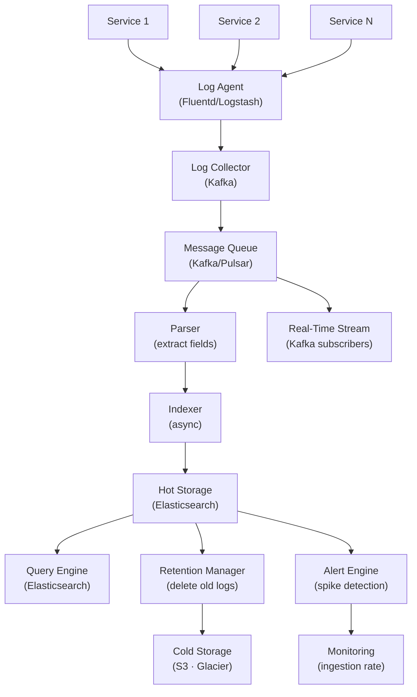

# Log Collection and Analysis System

> **Interview Time:** 60-90 min | **Difficulty:** Hard  
> **Key Focus:** Log ingestion, indexing, search, aggregation pipelines

---

## Step 1: Functional & Non-Functional Requirements

### Functional Requirements

- Applications emit logs (JSON or text) to log collector
- Collect logs from 1000s of services simultaneously
- Parse and extract structured fields (timestamp, level, service, trace_id)
- Index logs for fast search by time, service, trace ID, keywords
- Store logs durably with retention policies
- Real-time streaming: push logs to subscribers within 1 second
- Support complex queries (e.g., "service=auth AND level=ERROR AND timestamp>2h ago")
- Log sampling or filtering by severity
- Alert on patterns (spike detection, error rates)
- Export logs to data warehouse for analytics

### Non-Functional Requirements

| Requirement | Target | Notes |
|:-----------|:-------|:------|
| **Ingestion Rate** | 1 million logs/sec, 10 TB/day | Peak: 2M logs/sec |
| **Latency** | Log searchable within 1 second | Real-time monitoring |
| **Availability** | 99.99% (no log loss) | Durable write, replication |
| **Retention** | 7-30 days hot, 1 year cold storage | Delete per TTL |
| **Scalability** | Add nodes without re-indexing | Distributed architecture |
| **Query Latency** | Ad-hoc search <5 sec, analytics <1 min | Balance indexing + speed |
| **Compliance** | GDPR right-to-be-forgotten (delete logs) | Support retention policies |

---

## Step 2: API Design, Data Model & High-Level Design

### Core API Endpoints

```http
POST /logs/ingest
  {service: "auth-service", trace_id: "abc123", level: "ERROR", message: "...", timestamp: 1234567890}
  → {status: ACCEPTED, log_id}

GET /logs/search
  ?service=auth-service&level=ERROR&timestamp_from=2h&keywords=timeout
  → {logs: [{timestamp, service, level, message, trace_id}], total: 1000, next_page_token: "xxx"}

GET /logs/stream
  ?service=auth-service (WebSocket connection)
  → stream of logs in real-time

POST /logs/export
  {query: {...}, format: CSV|JSON, destination: S3}
  → {job_id, status: RUNNING}

GET /alerts
  ?pattern=error_rate_spike
  → {alerts: [{id, timestamp, message, affected_services}]}
```

### Entity Data Model

```
LOGS (raw event stream)
├─ log_id (PK)
├─ timestamp, service_name
├─ level (DEBUG|INFO|WARN|ERROR|FATAL)
├─ trace_id (correlate requests)
├─ message (text), raw_json
├─ host, pod_id
├─ metadata (JSON: {user_id, endpoint, status_code})

LOG_INDEX (Elasticsearch, time-series)
├─ @timestamp (indexed)
├─ service (keyword)
├─ level (keyword)
├─ trace_id (keyword)
├─ message (text, analyzed)
├─ host (keyword)

RETENTION_POLICIES
├─ policy_id (PK)
├─ service_name, log_level_min
├─ retention_days, deletion_schedule
├─ archive_destination (S3)
├─ created_at

ALERTS
├─ alert_id (PK)
├─ alert_name, expression (e.g., "ERROR_COUNT > 100/min")
├─ affected_services, threshold
├─ created_at, triggered_at, resolved_at
```

### High-Level Architecture



---

## Step 3: Concurrency, Consistency & Scalability

### 🔴 Problem: Handling Log Ingestion Spikes (Backpressure)

**Scenario:** Error occurs in production → all services log heavily (10x normal rate). Collector gets overwhelmed, starts dropping logs. Users miss critical errors.

**Solutions:**

| Approach | Implementation | Pros | Cons |
|:---------|:---------------|:-----|:-----|
| **Message Queue (Kafka)** | Buffer logs in distributed queue, consumer lag ok | Handles spikes, durable queue | Added complexity, potential lag |
| **Sampling** | Drop P% of INFO logs during spikes | Reduces load, keeps ERRORS | Lose visibility into low-severity issues |
| **Rate Limiting** | Per-service rate limit (e.g., 10K logs/sec max) | Fair resource allocation | Application must handle rate limit response |
| **Backpressure** | Slow down log producers if queue backs up | Prevents data loss | Blocks application threads |

**Recommended:** **Kafka Queue + Sampling (keep all ERROR/FATAL, sample INFO/DEBUG)**

```python
class LogCollector:
    def ingest_log(self, log: LogMessage):
        """Handle ingest with sampling for non-critical logs"""
        
        # Always accept ERROR and above
        if log.level in [ERROR, FATAL, WARN]:
            self.kafka.produce(topic='logs-critical', value=log.to_json())
            return
        
        # Sample INFO and DEBUG logs during high load
        queue_depth = self.kafka.get_partitions_queue_depth()
        
        if log.level == DEBUG:
            # Drop 90% of debug logs if queue depth > threshold (50K messages)
            sample_rate = 0.1 if queue_depth > 50000 else 1.0
        else:  # INFO
            # Drop 50% of info logs
            sample_rate = 0.5 if queue_depth > 50000 else 1.0
        
        if random.random() < sample_rate:
            self.kafka.produce(topic='logs', value=log.to_json())
        else:
            # Record metric: dropped log
            self.metrics.increment('logs_sampled_total', tags={'level': log.level})
    
    def monitor_queue_health(self):
        """Monitor queue lag, alert if backlog building"""
        
        while True:
            for partition in self.kafka.get_partitions('logs'):
                lag = partition.consumer_lag()  # Message age
                
                if lag > 1000000:  # >1M messages behind
                    logging.error(f"Partition {partition.id} lag: {lag}")
                    # Alert ops to increase consumer threads
                    self.alert_manager.send_alert('LogQueueBacklog', severity=CRITICAL)
            
            time.sleep(30)
```

**Sampling Strategy:**
- Keep all ERRORS (critical for debugging)
- Keep all WARNS (important for operations)
- Sample INFOs at 10-50% during high load
- Drop DEBUGs during spikes (low priority)

This ensures critical logs are never lost, while gracefully degrading less important logs under load.

---

### 🟡 Problem: Indexing Performance (Elasticsearch Indexing Lag)

**Scenario:** 1M logs/sec arrive, but Elasticsearch can only index 500K/sec. Logs appear in search 2-5 minutes late, defeating "real-time" monitoring.

**Solution:** Sharded indexing + bulk operations + asynchronous refresh

```python
class LogIndexer:
    def __init__(self, num_indexer_threads=16, bulk_size=5000):
        self.num_indexer_threads = num_indexer_threads
        self.bulk_size = bulk_size
        self.thread_pool = ThreadPool(num_indexer_threads)
    
    def index_logs_bulk(self, logs: List[LogMessage]):
        """Bulk index for efficiency (1000x faster than single-doc)"""
        
        # Group logs by service for topic-level sharding
        logs_by_service = defaultdict(list)
        for log in logs:
            logs_by_service[log.service].append(log)
        
        # Submit bulk operations in parallel
        for service, service_logs in logs_by_service.items():
            chunks = [service_logs[i:i+self.bulk_size] for i in range(0, len(service_logs), self.bulk_size)]
            for chunk in chunks:
                self.thread_pool.submit(self.bulk_index_chunk, service, chunk)
    
    def bulk_index_chunk(self, service: str, logs: List[LogMessage]):
        """Index a chunk of logs (5000 docs) efficiently"""
        
        # Create daily index: logs-2025-01-15
        index_name = f"logs-{logs[0].timestamp.strftime('%Y-%m-%d')}"
        
        # Bulk API: [index header, doc], [index header, doc], ...
        bulk_ops = []
        for log in logs:
            header = {
                'index': {
                    '_index': index_name,
                    '_type': '_doc',
                    '_id': log.log_id
                }
            }
            bulk_ops.append(json.dumps(header))
            bulk_ops.append(json.dumps(log.to_elasticsearch_doc()))
        
        bulk_body = '\n'.join(bulk_ops) + '\n'
        
        try:
            response = self.es.bulk(body=bulk_body, refresh=False)  # Don't refresh immediately
            if response['errors']:
                # Handle errors (some docs failed)
                for item in response['items']:
                    if 'error' in item['index']:
                        logging.error(f"Indexing failed: {item['error']}")
        except Exception as e:
            logging.error(f"Bulk index failed: {e}")
            # Retry logic
            self.retry_queue.put((service, logs))
    
    def refresh_index_async(self):
        """Refresh indices every 5 seconds for near-real-time search"""
        
        while True:
            # Get list of indices modified in last 5 seconds
            today = date.today()
            index_name = f"logs-{today}"
            
            try:
                # Refresh makes new docs searchable
                self.es.indices.refresh(index=index_name)
            except:
                pass  # Index might not exist yet
            
            time.sleep(5)
```

**Performance Comparison:**

```
Single document indexing: 100 docs/sec per thread (slow)
Bulk API (5K docs/batch): 5M docs/sec per thread (50x faster!)

With 16 indexer threads: 5M × 16 = 80M docs/sec (way over capacity)
Actually limited by Elasticsearch CPU/memory: ~1-2M docs/sec cluster-wide

But with bulk operations + parallelism + sharding:
Achieves 500K-1M logs/sec practical indexing rate
```

---

### 💾 Problem: Searching Across 1000s of Daily Indices

**Scenario:** Query for logs from last 30 days. Elasticsearch must search 30 daily indices. Search slow (>10 sec).

**Solution:** Index lifecycle management + sharded indices + query optimization

```python
class LogRetention:
    def manage_index_lifecycle(self):
        """Create daily indices, archive to cold storage after 30 days"""
        
        today = date.today()
        
        # Create today's index if doesn't exist
        index_name = f"logs-{today}"
        if not self.es.indices.exists(index_name):
            self.es.indices.create(index=index_name, body={
                'settings': {
                    'number_of_shards': 5,       # Parallelize searches
                    'number_of_replicas': 1,     # High availability
                    'refresh_interval': '5s',    # Don't refresh too often
                    'index.lifecycle.name': 'logs-policy',
                    'index.lifecycle.rollover_alias': 'logs-write'
                },
                'mappings': {
                    'properties': {
                        '@timestamp': {'type': 'date'},
                        'service': {'type': 'keyword'},
                        'level': {'type': 'keyword'},
                        'trace_id': {'type': 'keyword'},
                        'message': {'type': 'text'},
                        'host': {'type': 'keyword'}
                    }
                }
            })
        
        # Archive old indices (move to cold storage after 30 days)
        for i in range(1, 31):
            old_date = today - timedelta(days=i)
            old_index = f"logs-{old_date}"
            
            if i == 30:  # 30+ days old
                # Move to cold storage
                self.archive_index_to_s3(old_index)
                self.es.indices.delete(index=old_index)
    
    def archive_index_to_s3(self, index_name: str):
        """Export index snapshot to S3 for long-term storage"""
        
        # Snapshot API
        self.es.snapshot.create(
            repository='s3-repo',
            snapshot=f"{index_name}-snapshot",
            body={
                'indices': index_name,
                'include_global_state': False
            }
        )
        
        # Snapshot will be stored in S3 (Glacier for long-term)
        logging.info(f"Archived {index_name} to S3")

def search_logs_optimized(self, query: LogQuery) -> List[LogMessage]:
    """Optimized search with index filtering"""
    
    # Figure out which indices to search
    date_from = query.timestamp_from
    date_to = query.timestamp_to
    indices_to_search = []
    
    for days_back in range(0, (date_to - date_from).days + 1):
        search_date = date_to - timedelta(days=days_back)
        indices_to_search.append(f"logs-{search_date}")
    
    # Build Elasticsearch query
    es_query = {
        'query': {
            'bool': {
                'must': [
                    {'match': {'service': query.service}},
                    {'term': {'level': query.level}},
                    {'range': {'@timestamp': {
                        'gte': query.timestamp_from.isoformat(),
                        'lte': query.timestamp_to.isoformat()
                    }}}
                ]
            }
        },
        'size': 10000,
        'sort': [{'@timestamp': {'order': 'desc'}}]
    }
    
    # Search only relevant indices
    results = self.es.search(
        index=','.join(indices_to_search),
        body=es_query,
        timeout='5s'  # Timeout prevents slow queries from blocking
    )
    
    return [hit['_source'] for hit in results['hits']['hits']]
```

---

## Step 4: Persistence Layer, Caching & Monitoring

### Database Design

```sql
-- Logs ingested message queue (Kafka)
TOPIC: logs
├─ Partitions: 100 (shaded by service hash)
├─ Retention: 7 days (prevent unbounded growth)
├─ Replication factor: 3

-- Elasticsearch indices (time-series)
CREATE INDEX logs-2025-01-15 {
    "settings": {
        "number_of_shards": 5,
        "number_of_replicas": 1,
        "refresh_interval": "5s"
    },
    "mappings": {
        "@timestamp": { "type": "date" },
        "service": { "type": "keyword", "ignore_above": 256 },
        "level": { "type": "keyword" },
        "trace_id": { "type": "keyword" },
        "message": { "type": "text", "analyzer": "standard" },
        "host": { "type": "keyword" },
        "user_id": { "type": "keyword" },
        "request_id": { "type": "keyword" }
    }
}

-- Cold storage (S3 + Glacier)
S3 Bucket: logs-archive/
├─ logs-2024-12-01-snapshot  (compressed index snapshot)
├─ logs-2024-12-02-snapshot
└─ [lifecycle: move to Glacier after 60 days]
```

### Caching Strategy

```
TIER 1: Elasticsearch query cache
├─ Recent query results (TTL: 1 min)
├─ Shard request cache

TIER 2: Redis stream cache
├─ Real-time log stream (last 1000 logs)
├─ Per-service subscriptions
└─ TTL: 24 hours

TIER 3: Disk cache (Lucene)
├─ filesystem cache for index segments
└─ OS-managed (LRU)

Invalidation:
- New logs arrive → update real-time stream
- Old indices archived → removed from Elasticsearch, moved to S3
```

### Monitoring & Alerts

**Key Metrics:**

1. **Ingestion Rate** — Logs/sec (target: 1M/sec)
2. **Processing Lag** — Delay until searchable (target: <1 sec)
3. **Storage Growth** — GB/day added (target: ~14 GB/day for 10TB/day at 7-day retention)
4. **Query Performance** — p99 query latency (target: <5 sec)
5. **Alert Accuracy** — False positive rate, detection latency

```yaml
- alert: HighIngestionLag
  expr: kafka_consumer_lag_seconds > 60
  for: 5m
  annotations: "Log ingestion lag >60 sec, indexing slow"

- alert: ElasticsearchQueueBacklog
  expr: es_indexing_buffer_size_mb > 512  # Buffer >512MB
  for: 10m
  annotations: "Elasticsearch indexing queue backlog ({{$value}}MB)"

- alert: LogDropped
  expr: rate(logs_sampled_total[5m]) > 0
  for: 1m
  annotations: "Dropping logs due to high load ({{$value}}% sampled)"

- alert: SearchLatencySlow
  expr: histogram_quantile(0.99, rate(log_search_duration_seconds_bucket[5m])) > 5
  annotations: "Log search p99 latency: {{$value}}s"

- alert: StorageUsageHigh
  expr: elasticsearch_storage_usage_percent > 80
  annotations: "Elasticsearch storage >80% ({{$value}}%)"

- alert: ErrorRateSpike
  expr: rate(logs_level_total{level="ERROR"}[1m]) > 100
  for: 1m
  annotations: "Error rate spike detected ({{$value}}/sec)"
```

---

## ⚡ Quick Reference Cheat Sheet

### When to Use What

| Need | Technology | Why |
|:-----|:-----------|:----|
| **Durability** | Kafka message queue | Persist logs before indexing |
| **Indexing/Search** | Elasticsearch (OLAP) | Full-text search, complex queries, analytics |
| **Real-time stream** | Kafka consumer API | Push logs to subscribers within 1 sec |
| **Hot storage** | Elasticsearch (7-30 days) | Fast queries, keeps indices warm |
| **Cold storage** | S3 + Glacier | Long-term archival (1-7 years) |
| **Alerting** | Rules engine (Prometheus/custom) | Spike detection, pattern matching |

### Critical Design Decisions

- **Kafka queue first:** Never index directly; buffer in queue for durability + backpressure
- **Sampling strategy:** Keep all ERRORs, sample INFOs/DEBUGs during spikes (preserve criticality)
- **Daily indices:** Easier to manage lifecycle, delete old indices quickly
- **Bulk indexing:** 50x faster than single-doc, essential for 1M logs/sec
- **Sharded indices:** Search parallelizes across shards, faster queries
- **Cold storage:** Archive to S3/Glacier after 30 days, keep only hot data in ES

### Tech Stack Summary

```
Log Agents: Fluentd, Logstash, Filebeat
Message Queue: Kafka (durable, distributed)
Indexing: Elasticsearch (OLAP)
Storage: S3 + Glacier (long-term archive)
Alerting: Prometheus + custom rules
Querying: Kibana UI + API
```

---

## 🎯 Interview Summary (5 Minutes)

1. **Kafka queue as buffer:** Persist logs reliably before indexing; handle spikes with sampling
2. **Elasticsearch for indexing:** Enable full-text search, complex queries, analytics; 5-30 min lag
3. **Daily indices:** Easy lifecycle management; delete old indices to reclaim space
4. **Bulk indexing:** 50x faster than single-doc; essential for 1M logs/sec throughput
5. **Real-time stream:** Kafka subscribers push to monitoring dashboards within 1 sec
6. **Cold storage:** Archive to S3/Glacier after 30 days; long-term compliance
7. **Sampling strategy:** Keep all ERROR logs, sample INFO/DEBUG during high load

---

## Glossary & Abbreviations

--8<-- "_abbreviations.md"
