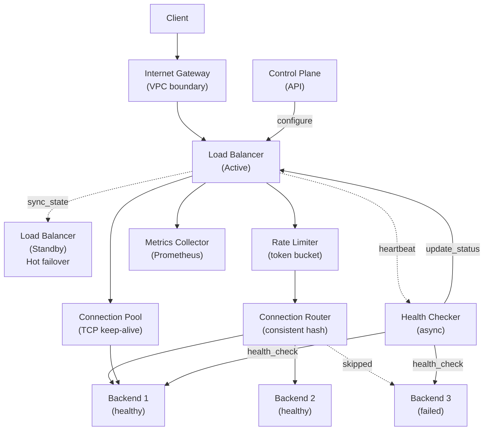

# Load Balancer

> **Interview Time:** 60-90 min | **Difficulty:** Hard  
> **Key Focus:** Request routing, health checks, session affinity, distribution algorithms

---

## Step 1: Functional & Non-Functional Requirements

### Functional Requirements

- Distribute incoming traffic across multiple backend servers
- Support multiple load balancing algorithms (round-robin, least connections, weighted)
- Health checking: detect and remove failed servers
- Session persistence (sticky sessions) for stateful applications
- SSL/TLS termination (decrypt at load balancer)
- Support multiple protocols (HTTP, HTTPS, TCP, UDP)
- Geographic routing (route to nearest data center)
- Rate limiting and DDoS protection
- Connection pooling and keep-alive support
- Request logging and metrics collection

### Non-Functional Requirements

| Requirement | Target | Notes |
|:-----------|:-------|:------|
| **Throughput** | 1M requests/sec | Single load balancer |
| **Latency** | Add <5ms overhead | Network routing + health checks |
| **Availability** | 99.99% uptime | Active-passive failover |
| **Scalability** | 10,000+ backend servers | Consistent hashing for distribution |
| **Failover** | <1 second detection + redirect | Minimal request loss on failure |
| **Connection limits** | 1M concurrent connections per LB | Connection pooling |
| **Geographic** | Route within 50ms of user | CDN + DNS-based geo-routing |

---

## Step 2: API Design, Data Model & High-Level Design

### Core API Endpoints (Load Balancer Control Plane)

```http
POST /backends
  {id: "web-1", host: "10.0.1.1", port: 8080, weight: 1, health_check_path: "/health"}
  → {id, status: REGISTERED}

GET /backends
  → {backends: [{id, host, port, weight, status: HEALTHY|UNHEALTHY}]}

DELETE /backends/{id}
  → {status: DEREGISTERED}

POST /routing-rules
  {path_prefix: "/api", algorithm: "least_connections", backends: ["web-1", "web-2"]}
  → {rule_id}

GET /health
  → {load_balancer_id, active_connections, requests_per_sec, backend_health: {...}}
```

### Entity Data Model

```
BACKENDS
├─ backend_id (PK)
├─ host, port
├─ weight (affects distribution)
├─ status (HEALTHY|UNHEALTHY|DRAINING)
├─ last_health_check_at
├─ consecutive_failures
├─ max_consecutive_failures (to mark unhealthy)

ROUTING_RULES
├─ rule_id (PK)
├─ path_prefix, host_header_match
├─ algorithm (ROUND_ROBIN|LEAST_CONN|IP_HASH|WEIGHTED)
├─ backend_ids (list of available backends)
├─ session_sticky: bool

ACTIVE_CONNECTIONS
├─ connection_id (PK)
├─ client_ip, client_port
├─ backend_id, backend_connection_id
├─ session_id (if sticky)
├─ created_at, last_activity_at
├─ data_sent_bytes, data_received_bytes

METRICS
├─ timestamp_ms, backend_id
├─ requests_count, error_count
├─ avg_response_time_ms, p99_latency_ms
├─ active_connections, bytes_in, bytes_out
```

### High-Level Architecture



---

## Step 3: Concurrency, Consistency & Scalability

### 🔴 Problem: Uneven Load Distribution with Dynamic Backends

**Scenario:** Backend servers added/removed, or weights changed. Simple round-robin distributes unevenly. If server A has weight 3 and server B has weight 1, but we alternate, B gets overloaded.

**Solutions:**

| Approach | Implementation | Pros | Cons |
|:---------|:---------------|:-----|:-----|
| **Simple Round-Robin** | Cycle through backends | Easy, fair if static | No weight support, ignore capacity |
| **Weighted Round-Robin** | Allocate slots by weight | Fair distribution | Complex scheduling on weight changes |
| **Least Connections** | Route to server with fewest active conns | Adaptive to load | O(N) lookup, complex with weights |
| **Consistent Hashing** | Hash client IP → server | Preserves sessions, stable with changes | Hotspot risk if hash function bad |

**Recommended:** **Least Connections (weighted) for general use; Consistent Hashing for session persistence**

```python
class LoadBalancer:
    def select_backend_least_conn(self, backends, weights):
        """Select backend with fewest active connections, weighted"""
        
        weighted_candidates = [
            (backend, backend.active_connections / (weights[backend.id] + 1))
            for backend in backends if backend.status == HEALTHY
        ]
        
        if not weighted_candidates:
            raise NoHealthyBackendError()
        
        # Select backend with lowest weighted connection count
        selected = min(weighted_candidates, key=lambda x: x[1])
        return selected[0]
    
    def select_backend_consistent_hash(self, client_ip, backends):
        """Consistent hashing for session stickiness"""
        
        # Build hash ring
        ring_size = 360  # degrees in circle
        hash_ring = {}
        
        for backend in backends:
            if backend.status != HEALTHY:
                continue
            
            token = hash(backend.id) % ring_size
            hash_ring[token] = backend
        
        # Hash client IP
        client_hash = hash(client_ip) % ring_size
        
        # Find next backend in ring (clockwise)
        sorted_tokens = sorted(hash_ring.keys())
        for token in sorted_tokens:
            if token >= client_hash:
                return hash_ring[token]
        
        # Wrap around
        return hash_ring[sorted_tokens[0]]
```

**Example Traffic Distribution (Weighted Round-Robin):**

```
Backends: [A (weight=3), B (weight=1), C (weight=2)]

Distribution cycle: [A, B, A, C, A, C]  (6 requests: A gets 3, C gets 2, B gets 1)

If server removed (say C unavailable):
Adjust: [A, B, A, A, B, A]  (A: 4/6, B: 2/6 ≈ 3/1 ratio preserved)
```

---

### 🟡 Problem: Connection Draining & Graceful Shutdown

**Scenario:** Operator wants to remove backend server (maintenance/upgrade). But there are 10,000 active connections. If we drop them, clients see errors.

**Solution:** Graceful drain: mark server as DRAINING, stop accepting new connections, let existing complete

```python
class BackendManager:
    def drain_backend(self, backend_id: str):
        """Gracefully drain backend before removal"""
        
        backend = self.get_backend(backend_id)
        backend.status = DRAINING  # Stop accepting new connections
        
        logging.info(f"Draining {backend_id}, active conns: {backend.active_connections}")
        
        # Wait for existing connections to close
        max_wait_sec = 300  # 5 minute timeout
        start_time = time.time()
        
        while backend.active_connections > 0:
            elapsed = time.time() - start_time
            if elapsed > max_wait_sec:
                logging.warning(f"Drain timeout after {max_wait_sec}s, force-closing {backend.active_connections} connections")
                self.force_close_connections(backend_id)
                break
            
            # Wait, then check again
            time.sleep(5)
            logging.info(f"Draining {backend_id}, remaining conns: {backend.active_connections}")
        
        # Remove from load balancer
        self.deregister_backend(backend_id)
        logging.info(f"Backend {backend_id} fully drained")
    
    def handle_client_request(self, client_ip):
        """Don't route new requests to DRAINING backends"""
        
        healthy_backends = [
            b for b in self.backends 
            if b.status in [HEALTHY, DRAINING]
        ]
        
        # Use only HEALTHY for new connections
        healthy_only = [b for b in healthy_backends if b.status == HEALTHY]
        if healthy_only:
            return self.select_backend(healthy_only)
        
        # Fallback to DRAINING if no HEALTHY (rare case)
        return self.select_backend(healthy_backends)
```

---

### 💾 Problem: Detecting Backend Failures Quickly

**Scenario:** Backend server crashes. LB should detect within 1-2 seconds and stop routing traffic. Health checks are expensive (run every 5 seconds).

**Solution:** Connection timeout detection + periodic health checks

```python
class HealthChecker:
    def __init__(self, check_interval_sec=10, failure_threshold=3):
        self.check_interval_sec = check_interval_sec
        self.failure_threshold = failure_threshold  # Mark unhealthy after 3 consecutive failures
    
    def health_check_backend(self, backend: Backend):
        """Async health check to backend health endpoint"""
        
        try:
            response = http_get(
                f"http://{backend.host}:{backend.port}{backend.health_check_path}",
                timeout=5
            )
            
            if response.status_code == 200:
                backend.consecutive_failures = 0
                backend.status = HEALTHY
                backend.last_successful_check_at = now()
            else:
                backend.consecutive_failures += 1
                if backend.consecutive_failures >= self.failure_threshold:
                    backend.status = UNHEALTHY
        
        except TimeoutError:
            backend.consecutive_failures += 1
            if backend.consecutive_failures >= self.failure_threshold:
                backend.status = UNHEALTHY
    
    def run_health_checks(self):
        """Run async health checks on all backends"""
        
        while True:
            for backend in self.backends:
                # Run check in thread pool (don't block)
                self.thread_pool.submit(self.health_check_backend, backend)
            
            time.sleep(self.check_interval_sec)
    
    def detect_connection_timeout(self, backend_id: str):
        """Fast detection: connection timeouts mark backend unhealthy immediately"""
        
        backend = self.get_backend(backend_id)
        if backend.status == HEALTHY:
            logging.warning(f"Connection timeout to {backend_id}, marking UNHEALTHY")
            backend.status = UNHEALTHY
            backend.consecutive_failures = self.failure_threshold
```

---

## Step 4: Persistence Layer, Caching & Monitoring

### Database Design (In-Memory State + Persistent Log)

```sql
-- Backend configuration (persistent)
CREATE TABLE backends (
    backend_id TEXT PRIMARY KEY,
    host TEXT,
    port INT,
    weight INT,
    health_check_path TEXT,
    max_connections INT,
    created_at TIMESTAMP,
    updated_at TIMESTAMP
);

-- Routing rules configuration
CREATE TABLE routing_rules (
    rule_id TEXT PRIMARY KEY,
    path_prefix TEXT,
    algorithm TEXT,
    backend_ids LIST<TEXT>,
    session_sticky BOOLEAN,
    created_at TIMESTAMP
);

-- Active connections log (for debugging)
CREATE TABLE active_connections (
    connection_id TEXT PRIMARY KEY,
    client_ip TEXT,
    backend_id TEXT,
    created_at TIMESTAMP,
    last_activity_at TIMESTAMP,
    bytes_in BIGINT,
    bytes_out BIGINT
) WITH TTL 604800;  -- 7 days

-- Connection metrics (time-series)
CREATE TABLE lb_metrics (
    timestamp_ms BIGINT,
    backend_id TEXT,
    requests_count INT,
    error_count INT,
    avg_latency_ms INT,
    p99_latency_ms INT,
    active_connections INT,
    PRIMARY KEY (timestamp_ms, backend_id)
) WITH COMPRESSION = 'ZstdCompressor';

CREATE INDEX idx_active_connections_backend ON active_connections(backend_id);
CREATE INDEX idx_metrics_backend_time ON lb_metrics(backend_id, timestamp_ms DESC);
```

### Caching Strategy

```
TIER 1: LB In-Memory State
├─ [Backend ID] → {host, port, weight, status, active_conns}  (refresh on health check)
├─ Routing rules → [backends]  (cached, updated on rule change)
└─ Connection sessions → {client_ip → backend_id}  (TTL: connection lifetime)

TIER 2: Connection Pooling
├─ Keep-Alive HTTP connections to backends (reuse TCP)
├─ Pool size: min 10, max 1000 per backend
└─ Idle timeout: 60 seconds

Invalidation:
- Backend added/removed → update in-memory state synchronously
- Backend status change → update active routing immediately
- Health check result → update backend.status
```

### Monitoring & Alerts

**Key Metrics:**

1. **Request Distribution** — Requests per backend (should be proportional to weight)
2. **Backend Health** — Unhealthy count, detection latency
3. **Connection Pool** — Active connections, timeout rate
4. **Latency** — p50/p99 response time, difference between backends
5. **Error Rate** — 4xx/5xx rate per backend, total error rate

```yaml
- alert: UnhealthyBackends
  expr: count(backend_status == UNHEALTHY) > 0
  for: 1m
  annotations: "{{$value}} backends unhealthy, capacity reduced"

- alert: BackendImbalance
  expr: max(backend_request_rate) / min(backend_request_rate) > 2
  for: 5m
  annotations: "Uneven load distribution ({{$value}}x difference)"

- alert: HighErrorRate
  expr: rate(http_error_total[5m]) / rate(http_requests_total[5m]) > 0.01
  annotations: "Error rate >1%, investigate backends"

- alert: ConnectionPoolExhausted
  expr: active_connections / max_connections > 0.90
  annotations: "Connection pool >90% full ({{$value | humanizePercentage}})"

- alert: LoadBalancerFailover
  expr: active_load_balancer != prev(active_load_balancer)
  for: 1s
  annotations: "Load balancer failover detected"

- alert: HealthCheckLatency
  expr: health_check_duration_ms > 1000
  annotations: "Health checks slow ({{$value}}ms), check network"
```

**Grafana Dashboard Metrics:**

```
Requests per second (by backend):
  rate(http_requests_total[1m]) group by (backend_id)

Latency distribution:
  histogram_quantile([0.50, 0.95, 0.99], rate(http_request_latency_bucket[5m]))

Backend health status:
  backend_status{status="HEALTHY|UNHEALTHY"}

Active connections:
  active_connections by (backend_id)

Bytes transferred:
  rate(bytes_in_total[1m]), rate(bytes_out_total[1m])
```

---

## ⚡ Quick Reference Cheat Sheet

### When to Use What

| Need | Technology | Why |
|:-----|:-----------|:----|
| **Even distribution** | Least Connections (weighted) | Adapts to varying server capacity |
| **Session stickiness** | Consistent Hashing | Client always routes to same backend |
| **Fast failure detection** | Connection timeout + periodic health checks | Detects crashes within 1-2 sec |
| **Graceful shutdown** | Status DRAINING + wait for connections | Zero request loss |
| **SSL termination** | Hardware LB or dedicated TLS proxy | Offloads crypto work from backends |
| **Connection pooling** | TCP keep-alive + connection reuse | Reduces latency, improves throughput |

### Critical Design Decisions

- **Least Connections (weighted):** Better than round-robin for variable server capacity
- **Active-passive failover:** Standby LB takes over within <1 sec if primary fails
- **Per-backend rate limiting:** Prevent one slow backend from dragging down others
- **Graceful drain:** Mark DRAINING before removal, wait for connections to close
- **Periodic health checks + timeout detection:** Hybrid approach for quick failure detection
- **Connection pooling:** Reuse TCP connections to backends (lower latency, fewer sockets)

### Tech Stack Summary

```
Load Balancer: HAProxy, Nginx, F5, Netflix Eureka Gateway
Health Checks: Custom HTTP endpoint /health
Metrics: Prometheus + Grafana
Failover: Active-passive with keepalived/heartbeat
Session Persistence: Consistent hashing or cookie-based
```

---

## 🎯 Interview Summary (5 Minutes)

1. **Distribute traffic:** Route to backend with fewest active connections (weighted by capacity)
2. **Health checks:** Async periodic checks + immediate timeout detection to identify failures (<2 sec)
3. **Session persistence:** Use consistent hashing (hash client IP → backend) if needed
4. **Graceful drain:** Mark server DRAINING before removal, wait for active connections to close
5. **Connection pooling:** Reuse TCP connections to backends with keep-alive (lower latency)
6. **Failover:** Active-passive LB pair, standby takes over within <1 sec if primary fails
7. **Rate limiting:** Per-backend limits prevent slow backends from dragging down fast ones

---

## Glossary & Abbreviations

--8<-- "_abbreviations.md"
