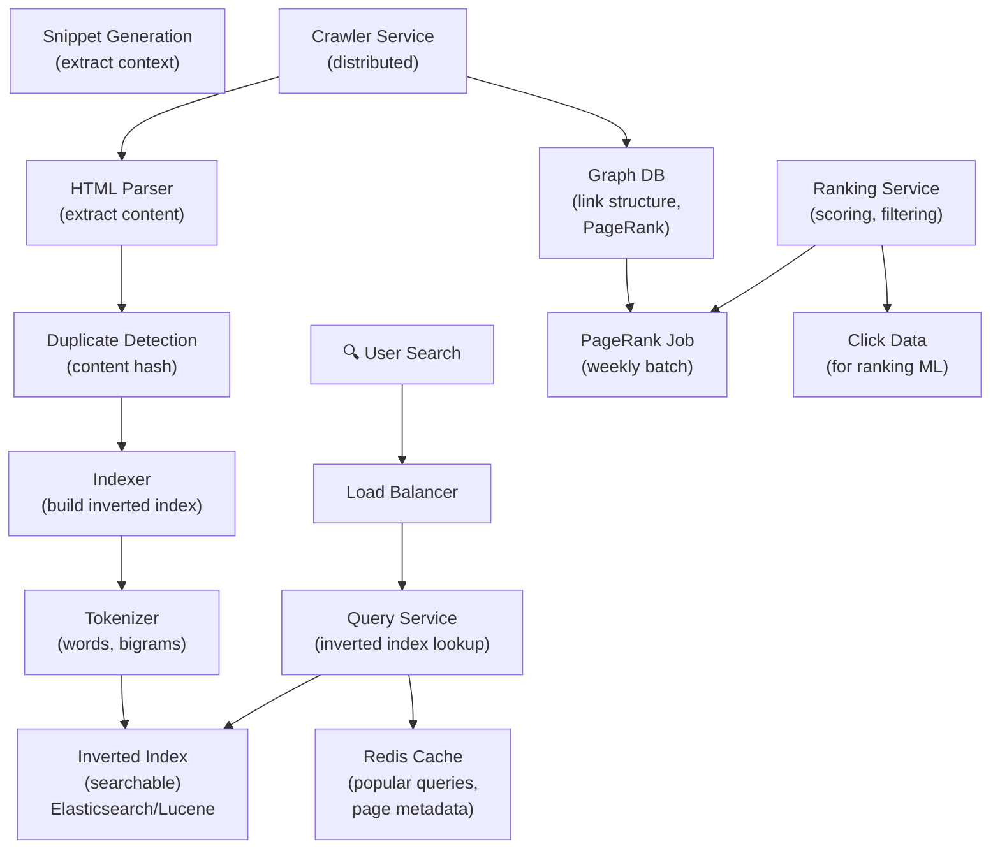

# Google Search

> **Interview Time:** 60-90 min | **Difficulty:** Hard  
> **Key Focus:** Indexing, ranking, query processing, distributed retrieval, PageRank

---

## Step 1: Functional & Non-Functional Requirements

### Functional Requirements

- Users search for keywords, get ranked results
- Crawl websites and index content (billions of pages)
- Retrieve relevant documents within milliseconds
- Rank by relevance (match query words), authority (PageRank), freshness (recent updates)
- Handle spell corrections ("did you mean")
- Support advanced queries (site:, filetype:, date range)
- Update index as web pages change
- Track click-through data to improve ranking

### Non-Functional Requirements

| Requirement | Target | Notes |
|:-----------|:-------|:------|
| **Scale** | 50B+ indexed pages | Petabyte-scale index |
| **Query latency** | <100ms for results | P95: <200ms |
| **Crawl coverage** | 95%+ of publicly available web | Continuous crawling |
| **Index freshness** | 80% of results <1 day old | News: <1 hour old |
| **Availability** | 99.99% uptime | Query service critical |
| **Throughput** | 100K queries/sec | Peak: handle spikes |

---

## Step 2: API Design, Data Model & High-Level Design

### Core API Endpoints

```http
GET /search?q={query}&page={page_num}
  → {results: [{title, url, snippet, rank}], total_results, query_time_ms}

GET /search?q={query}&as_qdr=d7
  {additional filters: date range, site, file type}
  → {results with filters applied}

GET /spelling?q={misspelled_query}
  → {suggestions: ["correct_spelling", "alternative"], confidence}

GET /crawl-status
  {url}
  → {last_crawled_at, crawl_depth, linked_to_from: N pages}

POST /indexing/report-url
  {url}
  → {status: queued_for_crawl, eta: 7_days}
```

### Entity Data Model

```
PAGES (web documents to be indexed)
├─ page_id (ULID, PK)
├─ url (VARCHAR, UNIQUE, indexed)
├─ domain_id (foreign key)
├─ title, meta_description
├─ content (TEXT, for full-text indexing)
├─ content_hash (SHA256, for duplicate detection)
├─ language (en, es, etc.)
├─ page_rank_score (0-100, authority)
├─ crawled_at, indexed_at
├─ last_modified (for freshness)
├─ outgoing_links (count)

INVERTED_INDEX (core search structure)
├─ term (VARCHAR, PK) — e.g., "machine learning"
├─ postings_list (compressed list of page_ids with positions)
│  {page_id, term_frequency, positions_in_page}
├─ document_frequency (how many pages have this term)
├─ idf (inverse document frequency, for TF-IDF scoring)
├─ created_at, updated_at

LINKS (for PageRank calculation)
├─ from_page_id (FK)
├─ to_page_id (FK)
├─ anchor_text (link label, indicates topic relevance)
├─ created_at
├─ PRIMARY KEY (from_page_id, to_page_id)

DOMAINS (grouping pages by domain)
├─ domain_id (PK)
├─ domain_name (e.g., "example.com")
├─ page_count (number of pages indexed)
├─ domain_authority (0-100, based on backlinks)
├─ crawl_frequency (daily, weekly, monthly)
├─ robots_txt_rules (crawl rules)
├─ last_crawled_at

PAGE_RANK (precomputed authority scores)
├─ page_id (PK)
├─ rank_score (float, 0-100)
├─ backlink_count (how many pages link to this)
├─ updated_at (recalculated weekly)

CLICK_DATA (for ranking refinement)
├─ query (search term)
├─ page_id (result clicked)
├─ position (rank in results)
├─ click_timestamp, session_id
├─ dwell_time (how long user stayed on result)
├─ is_pogo_stick (did user go back to results and try another link)
```

### High-Level Architecture



---

## Step 3: Concurrency, Consistency & Scalability

### 🔴 Problem: Distributed Crawling Collisions

**Scenario:** Multiple crawler instances see same URL. All try to crawl it simultaneously. URL is crawled 10× instead of once.

**Solution: Distributed Lock on URL Crawling**

```
Crawler discovers URL: "https://example.com/article/page1"

1. Hash URL: url_hash = SHA256("https://example.com/article/page1")
2. Lock in Redis (distributed):
   SET lock_key: "crawl:{url_hash}"
   value: {crawler_id, timestamp}
   NX (only set if not exists)
   EX 3600 (expire in 1 hour)

3. If SET succeeds:
   → This crawler instance acquires lock
   → Proceed with crawl
   → Call: GET /page → parse → extract links → add to crawl queue
   → Update: UPDATE pages SET crawled_at = NOW()
   → Done, lock released (or expires)

4. If SET fails (another crawler has lock):
   → This crawler skips the URL
   → Moves to next URL in queue
   → No duplicate crawl

Crawler Queue (Kafka topic):
  Priority: new pages, pages not crawled in 30 days
  Partitioned by domain_hash (all pages from same domain go to same partition)
  → Respects robots.txt crawl-delay (don't overload single domain)
```

### 🟡 Problem: Index Staleness During Large Crawls

**Scenario:** Web changes 10K times/sec. Index updates slower. Query results might be 1 day old.

**Solution: Dual-Index with Rolling Updates**

```
Maintain 2 inverted indexes:
  Index_A (current, serving queries)
  Index_B (being built, not serving queries yet)

Weekly Index Update Process:
1. Day 1-6: Build Index_B in background
   - Crawler finds new pages, updates in Index_B
   - Changed pages re-crawled, Index_B updated
   - Deletions marked in Index_B
   
2. Day 7 (Sunday midnight):
   - Verify Index_B is complete and correct
   - Switch traffic from Index_A to Index_B (atomic switch in load balancer)
   - Index_A becomes backup, then used for next week's build
   - Minimal queries affected during switch (<1 sec)

Result:
  - Index refreshed weekly, <1% of pages are stale
  - News/trending updates: separate "Hot Index" updated every hour
  - Critical freshness handled via separate service (see problem below)
```

### Solution: Freshness for Time-Sensitive Queries

```
Query: "breaking news" or "live scores" or "stock price"
  → Route to FRESH INDEX (updated every 1 hour)
  → Other queries → MAIN INDEX (updated weekly)

Two-tier Indexing:
  Tier 1: Fresh Index (1 million docs, updated hourly)
    - News sites, social media, real-time data
    - Expensive to update frequently
  
  Tier 2: Main Index (50 billion docs, updated weekly)
    - Stable content, blogs, documentation
    - Cheap to build once per week

Query Processing:
  if is_fresh_query(query):
    results = search(fresh_index) ∪ search(main_index)
    re-rank by freshness
  else:
    results = search(main_index)
```

### 🔷 Problem: PageRank Computation (50B pages graph)

**Scenario:** Computing PageRank on 50B pages × average 10 outlinks each = 500B edges. Can't fit in single machine RAM.

**Solution: MapReduce-Based PageRank**

```
PageRank Formula:
  PR(A) = (1-d)/N + d × Σ(PR(T)/C(T))
  
  where:
    d = damping factor (0.85)
    N = total pages
    T = pages linking to A
    C(T) = count of outlinks from T

Distributed Computation (3-step MapReduce):

ITERATION 1:
  Map Phase:
    Read LINKS table: {from_page_id → to_page_ids}
    For each link (A → B):
      Emit (B, PR(A) / outlink_count(A))
    
    Also emit (B, 0) for dangling pages
  
  Shuffle: Group by page_id
  
  Reduce Phase:
    For each page_id:
      rank = (1-d)/N + d × sum(incoming contributions)
      Output: (page_id, new_rank)

  Run N iterations (typically 20 iterations for convergence)

Scalability: Handles 500B edges distributed across cluster
  - MapReduce parallelizes across 1000s of machines
  - Each machine processes subset of edge list
  - Communication: shuffle step (expensive, but necessary)
  - Runtime: ~1 hour for 20 iterations on 50K machine cluster

Result: PageRank stored in PAGE_RANK table, used during ranking
```

### Data Consistency Strategy

| Data | Consistency | Strategy |
|:-----|:-----------|:---------|
| **Inverted index** | Eventual | Built weekly, all fresh results |
| **PageRank** | Eventual | Computed weekly via MapReduce |
| **Link graph** | Strong | Immutable, append-only |
| **Crawled pages** | Eventual | Continuously updated |
| **Click data** | Eventual OK | Batch processed daily |
| **Query results** | Strong per search | Deterministic ranking |

---

## Step 4: Persistence Layer, Caching & Monitoring

### Database Design

```sql
-- Pages (immutable, append-only after crawl)
CREATE TABLE pages (
  page_id BIGSERIAL PRIMARY KEY,
  url VARCHAR(2048) UNIQUE,
  domain_id BIGINT REFERENCES domains(domain_id),
  title VARCHAR(500),
  content TEXT,  -- indexed for full-text search
  content_hash VARCHAR(64),  -- SHA256 for dedup
  language VARCHAR(10),
  is_canonical BOOLEAN,  -- ignore duplicate page copies
  crawled_at TIMESTAMP,
  modified_at TIMESTAMP,
  indexed_at TIMESTAMP,
  created_at TIMESTAMP DEFAULT NOW()
);

CREATE INDEX idx_pages_domain_crawled 
  ON pages(domain_id, crawled_at DESC);
CREATE INDEX idx_pages_url 
  ON pages(url);

-- Inverted Index (built offline: use Elasticsearch/Lucene, not SQL)
-- PostgreSQL full-text search is too slow for 50B pages
-- Instead: Use specialized inverted index engine with compression

-- Links (for PageRank)
CREATE TABLE links (
  from_page_id BIGINT NOT NULL REFERENCES pages(page_id),
  to_page_id BIGINT NOT NULL REFERENCES pages(page_id),
  anchor_text VARCHAR(255),  -- link label
  created_at TIMESTAMP DEFAULT NOW(),
  PRIMARY KEY (from_page_id, to_page_id)
);

CREATE INDEX idx_links_to_page 
  ON links(to_page_id);  -- for PageRank computation

-- Domains
CREATE TABLE domains (
  domain_id BIGSERIAL PRIMARY KEY,
  domain_name VARCHAR(255) UNIQUE,
  page_count INT DEFAULT 0,
  domain_authority INT,  -- 0-100
  last_crawled_at TIMESTAMP,
  crawl_frequency VARCHAR(50),  -- daily, weekly, monthly
  robots_txt TEXT
);

-- Page Rank (precomputed, updated weekly)
CREATE TABLE page_ranks (
  page_id BIGINT PRIMARY KEY REFERENCES pages(page_id),
  rank_score DECIMAL(5,2),  -- 0-100
  backlink_count INT,
  frontlink_count INT,
  updated_at TIMESTAMP DEFAULT NOW()
);

-- Click Statistics (for ranking improvement)
CREATE TABLE click_stats (
  query VARCHAR(255),
  page_id BIGINT REFERENCES pages(page_id),
  position INT,  -- rank in results
  click_count INT,
  dwell_time_avg INT,  -- seconds user spent on page
  is_pogo_stick_count INT,  -- user bounced back to results
  date DATE,
  PRIMARY KEY (query, page_id, date)
);

CREATE INDEX idx_click_stats_query_date 
  ON click_stats(query, date DESC);
```

### Inverted Index Implementation (Elasticsearch)

```yaml
# NOT Standard Postgres — use Elasticsearch for true full-text search

Index Configuration:
  analyzer: standard (tokenize, lowercase, remove stopwords)
  fields:
    - title (high weight, TF-IDF × 10)
    - content (medium weight, TF-IDF × 1)
    - url_path (match exact keywords)
    - anchor_text (from links pointing to this page)

Document Fields:
  {
    page_id: 123456,
    url: "https://example.com/article",
    title: "Machine Learning Basics",
    content: "Machine learning is a subset of AI...",
    domain_id: 456,
    page_rank: 75,
    crawled_at: "2026-04-26",
    language: "en"
  }

Query Processing:
  1. Parse query: "machine learning"
  2. Search inverted index:
     term "machine": pages [123, 456, 789, ...]
     term "learning": pages [123, 456, 1000, ...]
   
  3. Intersection (AND): [123, 456]
  4. Score by TF-IDF:
     page 123: TF(machine)=5, TF(learning)=3, IDF both high → high score
     page 456: TF(machine)=2, TF(learning)=10 → lower score
  
  5. Boost by PageRank: multiply score by (1 + page_rank/100)
  6. Final ranking: page 123 > page 456
```

### Caching Strategy

**Tier 1: Redis**

```
1. Popular Queries Cache
   Key: "query:{query_string}:{filter_hash}"
   Value: {results: [...], total_count, snippet_html, page_positions}
   TTL: 24 hours (refresh when query made again)
   Purpose: Avoid re-searching for top 1000 queries
   Hit rate: ~20% (20% of searches are for popular queries)

2. Page Metadata Cache
   Key: "page:{page_id}:meta"
   Value: {url, title, snippet, page_rank}
   TTL: 7 days
   Purpose: Fast snippet generation without DB hit

3. Domain Authority Cache
   Key: "domain:{domain_id}:authority"
   Value: {authority_score, page_count}
   TTL: 7 days (refreshed with weekly PageRank update)
   Purpose: Fast domain-level filtering
```

**Tier 2: Elasticsearch**

- Primary inverted index (immutable after weekly build)
- Replicated across data centers for availability
- Sharded by content hash space (distribute 50B docs across shards)

### Monitoring & Alerts

**Key Metrics:**

1. **Query Performance**
   - Query latency (P95 <100ms target)
   - Results relevance (CTR for top result, bounce rate)
   - Query error rate (<0.1%)

2. **Index Quality**
   - Index freshness (% pages <1 day old)
   - Coverage (% of web indexed)
   - Duplicate elimination ratio
   - False positive rate (irrelevant results)

3. **Crawling Health**
   - Crawl quota utilization (pages/day)
   - Robots.txt compliance rate
   - Crawl errors (4xx, 5xx, timeouts)
   - Pages per domain (detect spam)

4. **PageRank Computation**
   - Convergence time (<1 hour target)
   - Distribution quality (check for islands, dead zones)
   - Cache hit rate for popular queries (>20% target)

5. **System Health**
   - Inverted index size (growth rate, compression ratio)
   - Elasticsearch shard rebalancing
   - Link graph consistency (broken links)

```yaml
- alert: QueryLatencyHigh
  expr: query_latency_p95 > 200
  annotations: "Query latency > 200ms — check index size, shard distribution"

- alert: CrawlErrorRateHigh
  expr: crawl_error_rate > 0.05
  annotations: "5% crawl errors — may impact freshness"

- alert: IndexCoverageLow
  expr: indexed_pages / estimated_web_pages < 0.90
  annotations: "Index coverage < 90% — increase crawl rate or fix crawler"

- alert: DuplicatePageDetectionFailing
  expr: suspected_duplicates_ratio > 0.10
  annotations: "10% suspected duplicates — review dedup logic"
```

---

## ⚡ Quick Reference Cheat Sheet

### Critical Design Decisions

1. **Crawl locks in Redis** — Prevent duplicate crawls of same URL
2. **Weekly index rebuild** — Dual-index strategy: Index_A current, Index_B building
3. **Fresh Index for breaking news** — Separate hourly-updated index for time-sensitive queries
4. **Distributed PageRank via MapReduce** — 20 iterations across 50K machines
5. **Elasticsearch for inverted indexing** — Not SQL: specialized full-text engine
6. **Dual-damping strategy** → TF-IDF (relevance) + PageRank (authority) + freshness

### When to Use What

| Need | Technology | Why |
|:-----|:-----------|:----|
| Full-text indexing | Elasticsearch + compression | Handles 50B pages, <100ms queries |
| PageRank computation | MapReduce batches weekly | Distributed, parallelizable |
| URL crawl coordination | Redis distributed lock | Prevents duplicate crawls |
| Query result freshness | Dual-index (fresh + main) | Trade-off: freshness vs scale |
| Index building | MapReduce + Elasticsearch | Offline, fault-tolerant|

### Tech Stack

```
Crawler: Custom (Go/Rust, high-perf)
Parser: jsoup/BeautifulSoup
Deduplication: Content hash checks (Bloom filters for scale)
Indexing: Elasticsearch (distributed, full-text)
Link analysis: GraphDB (or Spark for PageRank)
Query service: Go/Rust (low-latency)
Database: PostgreSQL (metadata), Redis (cache)
Batch: MapReduce/Spark (PageRank, click analysis)
Monitoring: Prometheus + Grafana
```

---

## 🎯 Interview Summary (5 Minutes)

1. **Distributed crawling** → Redis lock prevents duplicate crawls
2. **Weekly index rebuild** → Dual-index strategy (Index_A current, Index_B building)
3. **Fresh index for news** → Separate hourly index for breaking news queries
4. **PageRank algorithm** → MapReduce computes authority across 50B pages
5. **Inverted index** → Elasticsearch for sub-100ms queries on 50B documents
6. **Ranking signals** → TF-IDF (relevance) + PageRank (authority) + freshness + clicks
7. **Scalability** → Partitioned by domain, sharded by content space, replicated for resilience

---

## Glossary & Abbreviations

--8<-- "_abbreviations.md"

## ⚡ Quick Reference Cheat Sheet

[TODO: Fill this section]

---

## 🎯 Interview Summary (5 Minutes)

[TODO: Fill this section]

---

## Glossary & Abbreviations

--8<-- "_abbreviations.md"
