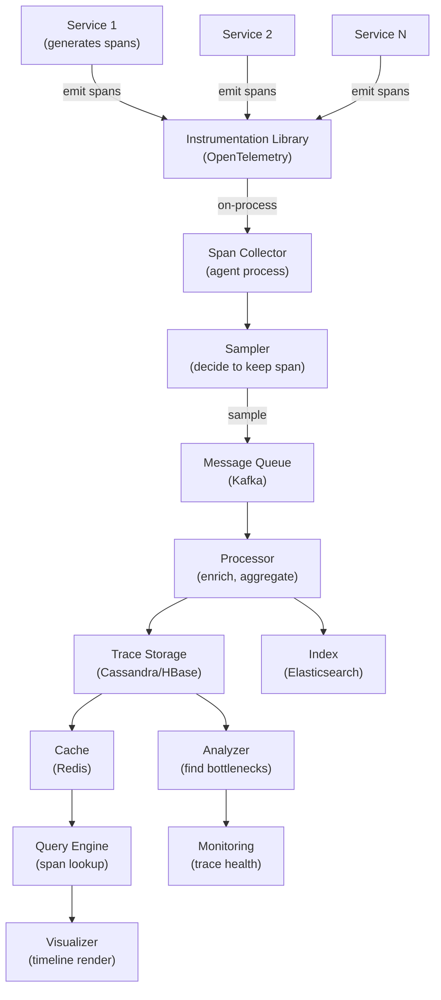

# Distributed Tracing System

> **Interview Time:** 60-90 min | **Difficulty:** Hard  
> **Key Focus:** Span collection, trace correlation, sampling, performance analysis

---

## Step 1: Functional & Non-Functional Requirements

### Functional Requirements

- Generate trace IDs at request entry (auto-generated or passed in)
- Propagate trace ID through request lifecycle
- Collect spans from all services touched by a request
- Store span data with timing, errors, and causality
- Query traces by trace ID, service, latency, error status
- Visualize request flow (service A → B → C timeline)
- Identify latency bottlenecks (which service is slow)
- Debug errors (with stack traces and logs attached to spans)
- Correlation with logs (logs contain trace ID for cross-reference)

### Non-Functional Requirements

| Requirement | Target | Notes |
|:-----------|:-------|:------|
| **Span Ingestion** | 1M spans/sec, 100 billion spans/day | Same QPS as metrics |
| **Latency** | Span collected within 1 second | Near real-time debugging |
| **Retention** | 7 days hot storage, 30 days queryable | Don't keep forever (cost) |
| **Query Speed** | Retrieve trace <500ms, visualize <1s | Interactive debugging |
| **Sampling** | 10-100% sample rate (configurable) | Prevent storage explosion |
| **Storage** | ~500 GB/day (with sampling) | Compression + smart retention |
| **Accuracy** | Accurate timing within 10ms | Must trust latency data |

---

## Step 2: API Design, Data Model & High-Level Design

### Core API Endpoints

```http
POST /traces/spans
  [{trace_id, span_id, parent_span_id, service, operation, duration_ms, 
    start_time_ms, tags: {endpoint, status}, error: false}]
  → {success: true}

GET /traces/{trace_id}
  → {trace_id, spans: [{service, operation, start, duration, tags, error}], total_duration_ms}

GET /traces/search
  ?service=api-gateway&operation=GetUser&latency_min=100&latency_max=5000&error=false&limit=10
  → {traces: [{trace_id, duration, services_touched}], total_count}

GET /traces/{trace_id}/analyze
  → {critical_path: [services in bottleneck order], latency_breakdown: {service: ms}}

GET /services/{service_name}/latency
  ?percentile=p99&operation=GetUser&time_range=1h
  → {percentile_value_ms: 250, samples: 10000}
```

### Entity Data Model

```
SPANS
├─ trace_id (PK, for grouping)
├─ span_id (PK, unique within trace)
├─ parent_span_id (null for root)
├─ service_name
├─ operation_name (function or RPC name)
├─ start_time_ms, duration_ms
├─ timestamp (server receive time)
├─ tags (JSON: {http.method, http.status_code, db.query_type})
├─ logs (array: {timestamp, message, severity})
├─ error: bool, error_message (if true)
├─ baggage (trace-wide context: user_id, request_id)

TRACE_INDEX
├─ trace_id (PK)
├─ service_names (array of all services touched)
├─ root_service, root_operation
├─ start_time_ms, duration_ms
├─ error: bool, error_count
├─ root_cause_service (inferred from trace)
├─ created_at

LATENCY_HISTOGRAM (per-service)
├─ service_name, operation_name
├─ histogram_buckets [{bucket_size, count}]
├─ percentiles: {p50, p95, p99}
├─ timestamp_ms (1 min interval, pre-aggregated)
```

### High-Level Architecture



---

## Step 3: Concurrency, Consistency & Scalability

### 🔴 Problem: Capturing Trace Context Across Services

**Scenario:** Request: Client → API Gateway → Auth Service → Database. How do we link all spans into one trace?

**Solution:** Trace context propagation via headers

```
Request Header (sent by client or generated by gateway):
  X-Trace-ID: abc123  (globally unique, 128-bit UUID)
  X-Span-ID: span-1   (unique within trace)
  X-Parent-SPAN-ID: null  (no parent for root)

API Gateway:
  Receives X-Trace-ID: abc123
  Creates span: {trace_id: abc123, span_id: span-1, parent: null}
  Makes request to Auth Service with same X-Trace-ID, X-Span-ID: span-2, X-Parent-SPAN-ID: span-1

Auth Service:
  Receives X-Trace-ID: abc123, X-Parent-SPAN-ID: span-1
  Creates span: {trace_id: abc123, span_id: span-2, parent: span-1}
  Database call with updated trace context

Database:
  Receives trace context
  Creates span: {trace_id: abc123, span_id: span-3, parent: span-2}
  Returns data

All spans grouped by trace_id=abc123, forming a tree by parent_span_id
```

```python
class TraceContextPropagator:
    def extract_trace_context(self, headers: dict) -> TraceContext:
        """Extract trace context from HTTP headers"""
        
        trace_id = headers.get('X-Trace-ID')
        span_id = headers.get('X-Span-ID')
        parent_span_id = headers.get('X-Parent-Span-ID')
        
        # If not present, create new trace
        if not trace_id:
            trace_id = generate_trace_id()  # 128-bit UUID
            span_id = generate_span_id()
            parent_span_id = None
        
        return TraceContext(
            trace_id=trace_id,
            span_id=span_id,
            parent_span_id=parent_span_id
        )
    
    def inject_trace_context(self, context: TraceContext) -> dict:
        """Inject trace context into outgoing request headers"""
        
        # Create child span for the outgoing call
        new_span_id = generate_span_id()
        
        return {
            'X-Trace-ID': context.trace_id,
            'X-Span-ID': new_span_id,
            'X-Parent-Span-ID': context.span_id,  # This request's span is parent of next
            'X-Trace-Flags': '01'  # Sampled
        }

def instrument_outgoing_request(self, client, method, url, headers, **kwargs):
    """Middleware to automatically propagate trace context"""
    
    # Get current trace from context-local storage
    current_context = current_trace_context.get()
    
    if current_context:
        # Inject trace context into request
        trace_headers = self.propagator.inject_trace_context(current_context)
        headers.update(trace_headers)
    
    # Make actual request
    response = client.request(method, url, headers=headers, **kwargs)
    
    return response
```

---

### 🟡 Problem: Storage Explosion with 100B Spans/Day

**Scenario:** 1M spans/sec × 86400 sec/day = 86B spans. With 1 KB per span = 86 TB/day. Unaffordable.

**Solution:** Sampling + smart retention

```python
class SamplingStrategy:
    def should_sample_trace(self, trace_context: TraceContext, service: str) -> bool:
        """Decide whether to keep this trace or discard it"""
        
        # Strategy 1: Percentage sampling (keep 1% of traces)
        base_sample_rate = 0.01
        
        # Strategy 2: Always sample errors
        if trace_context.has_error:
            return True
        
        # Strategy 3: Always sample slow traces (p99 latency)
        if trace_context.duration_ms > 1000:  # Slow
            return True
        
        # Strategy 4: Adaptive sampling by service
        service_sample_rates = {
            'api_gateway': 0.1,     # High-traffic, lower sample
            'auth_service': 0.05,   # Less critical
            'payment': 0.5,         # Critical, sample more
        }
        sample_rate = service_sample_rates.get(service, base_sample_rate)
        
        # Strategy 5: User-specified via baggage
        if 'sample=true' in trace_context.baggage:
            return True  # Always sample this trace (debug mode)
        
        # Final decision
        decision = random.random() < sample_rate
        trace_context.sampled = decision
        trace_context.sample_rate = sample_rate
        
        return decision

def calculate_storage_with_sampling():
    """Calculate storage impact of sampling strategies"""
    
    spans_per_day = 86 * 1e9  # 86 billion
    bytes_per_span = 1000      # 1 KB average
    
    # No sampling
    storage_no_sampling = (spans_per_day * bytes_per_span) / (1024**4)  # TB
    print(f"No sampling: {storage_no_sampling:.1f} TB/day (too much!)")
    
    # 1% sampling
    storage_1pct = storage_no_sampling * 0.01
    print(f"1% sampling: {storage_1pct:.1f} TB/day (~0.86 TB, affordable)")
    
    # Adaptive: 1% + always sample errors (add 5% for error overhead)
    storage_adaptive = (storage_1pct * 0.95) + (spans_per_day * 1e9 * bytes_per_span * 0.05)
    print(f"Adaptive (1% + errors): {storage_adaptive:.1f} TB/day (still manageable)")
```

**Sampling Trade-offs:**

```
Low sampling (0.1%): 86 GB/day (cheap, but miss issues)
Moderate (1%): 0.86 TB/day (good balance, affordable)
Adaptive (1% + errors): 0.9 TB/day (catch issues, cheap)
High (10%): 8.6 TB/day (expensive, comprehensive)
```

---

### 💾 Problem: Fast Trace Reconstruction (Find Critical Path)

**Scenario:** Trace has 50 spans across 10 services. User wants to know: which step was slowest? Critical path analysis.

**Solution:** Pre-compute critical path during ingestion

```python
class CriticalPathAnalyzer:
    def compute_critical_path(self, trace: Trace) -> List[Span]:
        """Find longest path through DAG of spans"""
        
        # Build span DAG
        spans_by_id = {s.span_id: s for s in trace.spans}
        children_of = defaultdict(list)
        
        for span in trace.spans:
            if span.parent_span_id:
                children_of[span.parent_span_id].append(span)
        
        # DFS to find longest path (critical path)
        def longest_path_from(span_id, memo={}):
            if span_id in memo:
                return memo[span_id]
            
            span = spans_by_id[span_id]
            children = children_of[span_id]
            
            if not children:
                # Leaf node
                path = [span]
                duration = span.duration_ms
            else:
                # Find longest child path
                longest_child_path = max(
                    (longest_path_from(c.span_id, memo) for c in children),
                    key=lambda p: sum(s.duration_ms for s in p)
                )
                path = [span] + longest_child_path
                duration = span.duration_ms + sum(s.duration_ms for s in longest_child_path)
            
            memo[span_id] = path
            return path
        
        # Root span (no parent)
        root_spans = [s for s in trace.spans if s.parent_span_id is None]
        if root_spans:
            critical_path = longest_path_from(root_spans[0].span_id)
        else:
            critical_path = []
        
        return critical_path

def analyze_trace_latency(trace: Trace):
    """Analyze where time is spent in trace"""
    
    critical_path = self.compute_critical_path(trace)
    
    # Group spans by service
    by_service = defaultdict(lambda: {'count': 0, 'duration_ms': 0})
    
    for span in trace.spans:
        by_service[span.service_name]['count'] += 1
        by_service[span.service_name]['duration_ms'] += span.duration_ms
    
    # Rank services by time spent (identify bottleneck)
    service_times = sorted(
        by_service.items(),
        key=lambda x: x[1]['duration_ms'],
        reverse=True
    )
    
    print(f"Trace {trace.trace_id}: Total {trace.duration_ms}ms")
    print(f"Critical path: {' → '.join(s.service_name for s in critical_path)}")
    print(f"Bottleneck services:")
    for service, metrics in service_times[:5]:
        pct = (metrics['duration_ms'] / trace.duration_ms) * 100
        print(f"  {service}: {metrics['duration_ms']}ms ({pct:.1f}%)")
```

---

## Step 4: Persistence Layer, Caching & Monitoring

### Database Design

```sql
-- Spans table (time-series)
CREATE TABLE spans (
    trace_id TEXT,
    span_id TEXT,
    parent_span_id TEXT,
    service_name TEXT,
    operation_name TEXT,
    start_time_ms INT64,
    duration_ms INT,
    tags JSONB,
    logs ARRAY<STRUCT<timestamp, message, severity>>,
    error BOOLEAN,
    error_message TEXT,
    PRIMARY KEY (trace_id, span_id)
) WITH COMPRESSION = 'Gorilla'
  AND TTL = 604800;  -- 7 days

-- Trace index (for searching)
CREATE TABLE trace_index (
    trace_id TEXT PRIMARY KEY,
    service_names SET<TEXT>,
    duration_ms INT,
    error BOOLEAN,
    root_operation TEXT,
    timestamp_ms INT,
    sample_rate FLOAT
);

-- Latency histograms (per-service, pre-aggregated)
CREATE TABLE latency_histogram (
    service TEXT,
    operation TEXT,
    timestamp_ms INT,
    percentile_p50 INT,
    percentile_p95 INT,
    percentile_p99 INT,
    samples_count INT,
    PRIMARY KEY (service, operation, timestamp_ms DESC)
);

CREATE INDEX idx_spans_service_time 
ON spans(service_name, start_time_ms DESC);

CREATE INDEX idx_trace_index_duration 
ON trace_index(duration_ms DESC);

CREATE INDEX idx_trace_index_timestamp 
ON trace_index(timestamp_ms DESC);
```

### Caching Strategy

```
TIER 1: Hot Trace Cache (Redis)
├─ Recently accessed traces (TTL: 24 hours)
├─ Pre-computed critical paths
└─ Frequently searched traces

TIER 2: Latency Histogram Cache
├─ Service latency stats (p50, p95, p99)
├─ Updated every minute
└─ TTL: 1 hour (safe for stats)

TIER 3: Persistent Storage (Cassandra/HBase)
├─ All spans (7 days), then archived to S3
├─ Trace index for fast lookup
└─ Pre-computed criticalpath for recent traces

Invalidation:
- New span arrived → invalidate cache for that trace
- Trace completed → pre-compute critical path
- Histogram update → refresh service statistics
```

### Monitoring & Alerts

**Key Metrics:**

1. **Span Ingestion Rate** — Spans/sec (target: 1M/sec)
2. **P99 Latency** — Distribution of latencies (track by service)
3. **Error Rate by Service** — % of traces with errors (target: <1%)
4. **Query Performance** — Trace retrieval time (target: <500ms)
5. **Sampling Rate** — % of traces sampled (monitor for changes)

```yaml
- alert: LowSpanIngestion
  expr: rate(spans_ingested_total[5m]) < 500000
  annotations: "Span ingestion rate low: {{$value}}/sec"

- alert: TraceQueryLatencySlow
  expr: histogram_quantile(0.99, rate(trace_query_duration_seconds_bucket[5m])) > 0.5
  annotations: "Trace query p99: {{$value}}s (target: <500ms)"

- alert: ServiceLatencySpiking
  expr: histogram_quantile(0.99, rate(service_latency_seconds_bucket{service="payment"}[5m])) > 1.0
  for: 5m
  annotations: "Payment service p99 latency: {{$value}}s (spike!)"

- alert: ErrorRateHigh
  expr: count(span_error=true) / count(span) > 0.05
  for: 5m
  annotations: "Error rate >5% ({{$value | humanizePercentage}})"

- alert: TracesBacklogged
  expr: trace_processing_queue_size > 1000000
  annotations: "Span queue depth: {{$value}} messages (inspect sampler/processor)"

- alert: StorageGrowthRapid
  expr: rate(trace_storage_bytes[1h]) > 50 * 1024 * 1024 * 1024
  annotations: "Trace storage growth: {{$value | humanize}}B/hour (check sampling)"
```

---

## ⚡ Quick Reference Cheat Sheet

### When to Use What

| Need | Technology | Why |
|:-----|:-----------|:----|
| **Trace context propagation** | OpenTelemetry libraries | Standard format, language-agnostic |
| **Span ingestion** | Kafka or Redis Streams | Durable queue, handles spikes |
| **Storage** | Cassandra or HBase | Time-series optimized, distributed |
| **Indexing** | Elasticsearch | Full-text search by operation, service |
| **Sampling** | Percentage + adaptive + error-aware | Control storage cost, catch issues |
| **Critical path** | Pre-compute during ingestion | Fast analysis queries |

### Critical Design Decisions

- **Trace ID propagation:** Use HTTP headers (X-Trace-ID, X-Span-ID) for automatic tracking
- **Sampling strategy:** 1% baseline + always sample errors/slow traces (p99 latency)
- **Storage:** 7d raw (hot), 30d queryable index, archive beyond
- **Critical path:** Pre-compute at ingestion time for instant analysis
- **Baggage context:** Embed user_id, endpoint, status in trace for filtering
- **Causality tracking:** Use parent_span_id to reconstruct request flow

### Tech Stack Summary

```
Instrumentation: OpenTelemetry (Java, Python, Node, Go, etc.)
Trace Collection: Custom agent or Jaeger Agent
Queue: Kafka (durable queue)
Storage: Cassandra or HBase (time-series)
Index: Elasticsearch (full-text search)
Visualization: Jaeger UI or custom
Analytics: Pre-aggregated histograms
```

---

## 🎯 Interview Summary (5 Minutes)

1. **Trace context propagation:** HTTP headers (X-Trace-ID, X-Span-ID) automatically link spans across services
2. **Sampling strategy:** 1% baseline + always sample errors + slow requests (p99) to control storage cost
3. **Span storage:** Cassandra/HBase with 7d hot, 30d queryable, then archive
4. **Critical path analysis:** Pre-compute longest path through span DAG at ingestion time
5. **Service latency rankings:** Group spans by service, find bottleneck (most time spent where)
6. **Error debugging:** Attach logs, stack traces, tags to spans; correlate with application logs
7. **Query optimization:** Index by service/operation, cache recent traces, use aggregated histograms

---

## Glossary & Abbreviations

--8<-- "_abbreviations.md"
