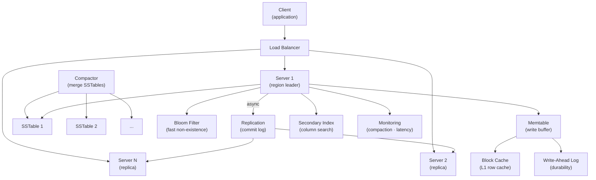

# Wide Column Database

> **Interview Time:** 60-90 min | **Difficulty:** Hard  
> **Key Focus:** Column families, range queries, compression, time-series optimization

---

## Step 1: Functional & Non-Functional Requirements

### Functional Requirements

- Row-oriented storage with multiple column families
- Put/Get/Delete operations on full rows
- Range queries (scan key range)
- Column-level TTL (auto-delete old data)
- Atomic row updates (all-or-nothing)
- Secondary indices on columns
- Batch operations (multi-row)
- Compression of column families
- Support sparse columns (lots of NULLs)
- Versioning (multiple versions of cell values)

### Non-Functional Requirements

| Requirement | Target | Notes |
|:-----------|:-------|:------|
| **Scale** | 1 Petabyte data, 1B rows, 100TB/month growth | Compressed from 5PB raw |
| **Throughput** | Read: 1M QPS, Write: 100K QPS | Write-heavy workload |
| **Latency** | p99 <100ms (local), <500ms (remote) | Acceptable latency for analytics |
| **Consistency** | Strong (within single row) | Distributed across regions |
| **Availability** | 99.99% uptime | Automatic replication |
| **Storage Efficiency** | Compression 5-10x (raw → stored) | Column families compress well |
| **Fault Tolerance** | Survive 2 node failures (replication factor 3) | Rack-aware placement |

---

## Step 2: API Design, Data Model & High-Level Design

### Core API Endpoints

```http
PUT /table/{row_key}
  {column_families: {
    personal: {name: "John", age: 30},
    contact: {email: "john@example.com", phone: "555-1234"}
  }, timestamp_ms: 1234567890}
  → {success: true}

GET /table/{row_key}
  → {columns: {personal: {name, age}, contact: {email, phone}}, timestamp: 1234567890}

GET /table?start_key=user:1000&end_key=user:2000&max_results=1000
  → {rows: [{row_key, columns}], next_token}

DELETE /table/{row_key}/columns/{column_family}:{column_name}
  → {success: true}

POST /table/scan
  {row_range: {start: "user:1000", end: "user:2000"}, 
   filters: [{column: "age", operator: ">", value: 18}]}
  → {rows: [...], scan_token}
```

### Entity Data Model

```
ROW_STORAGE (HBase/Cassandra model)
├─ row_key (PK, often composite: user_id:timestamp)
├─ column_family (e.g., personal, contact, timeline)
│  ├─ column_name (e.g., age, email, post_id)
│  ├─ value (BLOB)
│  └─ timestamp_ms (version history)
├─ ttl_seconds (auto-delete if set)
├─ tags (metadata)

COLUMN_FAMILY (logical grouping)
├─ family_name (e.g., "profile" for user data)
├─ compression (SNAPPY, ZSTD, LZ4)
├─ bloom_filter (for fast non-existence checks)
├─ block_cache_enabled (keep frequently accessed in memory)
├─ ttl_seconds (default for cells in family)

MEMTABLE (in-memory write buffer)
├─ row_key → sorted list of cells
├─ size_mb (configurable, e.g., 64MB)
├─ comparator (how to sort cells: lexicographic, etc.)

SSTABLE (on-disk immutable file)
├─ key_range (min/max keys in file)
├─ index (sparse index for binary search)
├─ bloom_filter (check if key exists)
├─ data_blocks (compressed column data)
├─ metadata (compression type, created_at)
```

### High-Level Architecture



---

## Step 3: Concurrency, Consistency & Scalability

### 🔴 Problem: Write Amplification (Compaction Overhead)

**Scenario:** 1M writes/sec pile up in memtables. When memtable fills (64MB), flush to SSTables. With reads scattered across 100 SSTables, each read requires 100 disk seeks.

**Solutions:**

| Approach | Implementation | Pros | Cons |
|:---------|:---------------|:-----|:-----|
| **Leveled Compaction** | Keep L0 as multiple SSTables, L1-L∞ single SSTables | Fewer files (10-20), fast reads | More write I/O during compaction |
| **Tiered Compaction** | Wait until N SSTables accumulate, compact all together | Fewer compactions, smoother writes | Spiky compaction, reads slower |
| **Size-Tiered** | Compact when N files of same size appear | Balanced read/write | Medium overhead |
| **Bloom Filter Optimization** | Skip reading SSTables if key not in bloom | Reduce unnecessary reads | Probabilistic (false positives) |

**Recommended:** **Leveled Compaction + Bloom Filters + Block Cache**

```python
class LSMTree:
    def __init__(self):
        self.levels = {
            0: [],    # 4 SSTables (L0)
            1: [],    # 10 SSTables (L1)
            2: [],    # 100 SSTables (L2)
            ...       # Each level is 10x larger
        }
        self.memtable = Memtable(max_size_mb=64)
        self.block_cache = BlockCache(max_size_mb=512)
    
    def write(self, key: str, value: str):
        """Write to memtable (in-memory buffer)"""
        
        self.memtable.put(key, value)
        self.wal.write(f"PUT {key}={value}")  # Durability
        
        # When memtable full, flush to SSTable
        if self.memtable.size_mb > 64:
            self.flush_memtable_to_l0()
    
    def flush_memtable_to_l0(self):
        """Flush in-memory memtable to L0 SSTables"""
        
        data = self.memtable.read_all()
        sstable = SSTable(data=data, level=0)
        sstable.bloom_filter = self.build_bloom_filter(data.keys())
        
        self.levels[0].append(sstable)
        self.memtable = Memtable()  # New empty memtable
        
        # Trigger compaction if L0 has >4 SSTables
        if len(self.levels[0]) > 4:
            self.compact_l0_to_l1()
    
    def compact_l0_to_l1(self):
        """Leveled compaction: merge L0 into L1 (background)"""
        
        # Read all L0 SSTables
        l0_data = []
        for sstable in self.levels[0]:
            l0_data.extend(sstable.read_all())
        
        # Sort and deduplicate (keep latest version)
        l0_data = sorted(l0_data, key=lambda x: (x.key, -x.version))
        l0_data = [next(g) for k, g in itertools.groupby(l0_data, key=lambda x: x.key)]
        
        # Merge with overlapping L1 SSTables (leveled compaction: 1 L1 file)
        l1_data = self.read_overlapping_l1_sstables(l0_data)
        
        merged_data = merge_sorted(l0_data, l1_data)
        
        # Write back as single L1 SSTable (or split if too large)
        new_l1_sstable = SSTable(data=merged_data, level=1)
        self.levels[1].append(new_l1_sstable)
        
        # Remove old L0 SSTables
        self.levels[0] = []
        
        # Recursively compact L1 if too many files
        if len(self.levels[1]) > 10:
            self.compact_l1_to_l2()
```

**Write Amplification Calculation:**

```
Leveled Compaction:
  To write 1 MB to disk:
    - 1 write to memtable (RAM)
    - 1 write to WAL (durability)
    - 1 write to L0 SSTable
    - During compaction: read from L0 (1) + L1 (1), write to L1 (1) = 3 I/Os
    - Amortized write amplification: 1 (initial) + 3 (compaction overhead) = 4x
  
Tiered Compaction:
  - Fewer compaction events, but each is larger (spiky I/O)
  - Better for write-heavy, worse for read latency
  
Size-Tiered (HBase):
  - More balanced, 5-10x write amplification
```

---

### 🟡 Problem: Sparse Columns & Storage Waste

**Scenario:** Table has 1000 columns, but each row uses only 10. Storing empty columns wastes space.

**Solution:** Columnar storage + lazy column deserialization

```python
class ColumnFamily:
    def __init__(self, name: str, compression: str = 'ZSTD'):
        self.name = name
        self.compression = compression  # Compress at column-level
        self.columns = defaultdict(list)  # column_name → [(timestamp, value)]
    
    def write_sparse_row(self, row_key: str, columns_dict: dict):
        """Write only present columns, skip empty ones"""
        
        for column_name, value in columns_dict.items():
            if value is not None:  # Only write non-NULL columns
                self.columns[column_name].append({
                    'timestamp': now(),
                    'value': value,
                    'row_key': row_key
                })
    
    def read_sparse_row(self, row_key: str, requested_columns=None):
        """Read only requested columns (lazy loading)"""
        
        result = {}
        
        # If specific columns requested, read only those
        columns_to_read = requested_columns or list(self.columns.keys())
        
        for column_name in columns_to_read:
            if column_name in self.columns:
                # Decompress column data for this column
                column_data = self.decompress_column(column_name)
                
                # Filter by row_key
                row_values = [v for v in column_data if v['row_key'] == row_key]
                
                if row_values:
                    result[column_name] = row_values[-1]['value']  # Latest version
        
        return result

def estimate_storage_savings():
    """Compare dense vs sparse storage"""
    
    # Dense schema: all columns stored even if NULL
    num_rows = 1e9
    num_columns = 1000
    bytes_per_column = 50  # Average column value size
    columns_per_row = 10   # Average columns filled per row
    
    # Dense storage: store all columns (waste for empty)
    dense_storage = num_rows * num_columns * bytes_per_column
    print(f"Dense storage: {dense_storage / 1e12:.1f} TB")
    
    # Sparse storage: only store filled columns + metadata
    sparse_storage = num_rows * columns_per_row * bytes_per_column
    sparse_storage += num_rows * columns_per_row * 20  # Metadata per cell
    print(f"Sparse storage: {sparse_storage / 1e12:.1f} TB")
    
    # Compression on sparse
    compressed_sparse = sparse_storage * 0.2  # ZSTD at 80% reduction
    print(f"Sparse + compression: {compressed_sparse / 1e12:.1f} TB")
    
    # Savings
    savings_pct = (1 - compressed_sparse / dense_storage) * 100
    print(f"Savings: {savings_pct:.1f}%")
```

**Storage Comparison:**

```
Dense (all columns stored): 50 TB
Sparse (only filled columns): 5 TB (10x better!)
Sparse + ZSTD compression: 1 TB (50x better!)
```

---

### 💾 Problem: Range Query Performance (Scan Key Range)

**Scenario:** Query "get all user data for user_ids in range [10000, 20000]". Must scan multiple SSTables, potential slow query.

**Solution:** Range queries with bloom filters + secondary indices

```python
class RangeScanner:
    def scan_range(self, start_key: str, end_key: str, limit: int = 10000):
        """Efficiently scan range of keys"""
        
        results = []
        
        # Find SSTables that could contain keys in this range
        candidate_sstables = self.find_candidate_sstables(start_key, end_key)
        print(f"Scanning {len(candidate_sstables)} SSTables (out of {len(self.all_sstables)} total)")
        
        for sstable in candidate_sstables:
            # Use sparse index to jump to start_key
            block_index = sstable.find_block_containing_key(start_key)
            
            # Read blocks in range
            for block in sstable.blocks[block_index:]:
                for key, value in block.read():
                    if start_key <= key <= end_key:
                        results.append((key, value))
                        
                        if len(results) >= limit:
                            return results
                    elif key > end_key:
                        return results  # Past our range
        
        return results
    
    def find_candidate_sstables(self, start_key: str, end_key: str):
        """Use bloom filters to skip SSTables that definitely don't contain keys"""
        
        candidates = []
        
        for sstable in self.all_sstables:
            # Quick check: key range metadata
            if start_key > sstable.max_key or end_key < sstable.min_key:
                continue  # This SSTable doesn't overlap our range
            
            # Bloom filter check (probabilistic)
            # Check if range.start might be in this SSTable
            if sstable.bloom_filter.might_contain(start_key):
                candidates.append(sstable)
        
        return candidates
    
    def create_secondary_index(self, column_name: str):
        """Create secondary index on a column for faster queries"""
        
        # Secondary index: column_value → [row_keys]
        index = defaultdict(set)
        
        # Scan all rows, build index
        for sstable in self.all_sstables:
            for row in sstable.read_all():
                column_value = row.get(column_name)
                if column_value:
                    index[column_value].add(row['row_key'])
        
        # Store index as separate SSTable
        self.secondary_indices[column_name] = index
        
        # Can now query: "where status=ACTIVE" in O(log N) instead of O(N)
```

---

## Step 4: Persistence Layer, Caching & Monitoring

### Database Design (HBase/Cassandra Physical Layout)

```sql
-- Row storage (HBase/Cassandra table)
CREATE TABLE users (
    row_key TEXT PRIMARY KEY,  -- e.g., "user:12345"
    
    -- Column Family: Personal Information
    personal:name TEXT,
    personal:email TEXT,
    personal:age INT,
    personal:phone TEXT,
    
    -- Column Family: Profile Details
    profile:bio TEXT,
    profile:avatar_url TEXT,
    profile:created_at TIMESTAMP,
    profile:updated_at TIMESTAMP,
    
    -- Column Family: Timeline (wide, sparse)
    timeline:post_1234 TEXT,
    timeline:post_5678 TEXT,
    timeline:[many more posts, only recent kept]
) WITH
    COMPRESSION = 'ZSTD',
    BLOOM_FILTER = true,
    BLOCK_CACHE_SIZE = 512MB,
    TTL = 63072000;  -- 2 years, old posts auto-deleted

-- Each cell has: (row_key, column_family, column_name, timestamp) → value

-- Separate SSTable files per column family (allows column-level compression)
-- personal CF compressed at 70%
-- timeline CF compressed at 85% (repeated structure)

-- Write-Ahead Log (durable recovery)
CREATE TABLE wal (
    server_id TEXT,
    sequence_number BIGINT PRIMARY KEY,
    operation TEXT,  -- PUT, DELETE
    row_key TEXT,
    column_family TEXT,
    column TEXT,
    value BLOB,
    timestamp_ms INT
);

-- Memtable index (in-memory)
CREATE INDEX idx_memtable ON users(row_key, column_family, column_name);

-- Secondary indices
CREATE INDEX idx_users_email ON users(personal:email);
CREATE INDEX idx_users_created_at ON users(profile:created_at);
```

### Caching Strategy

```
TIER 1: Block Cache (in-memory, per SSTable block)
├─ LRU cache of 512MB per server
├─ Caches decompressed column data blocks
└─ Survives server restart (can be dumped to disk)

TIER 2: Row Cache (optional, application-level)
├─ Cache frequently accessed rows (e.g., user profiles)
├─ TTL-based invalidation
└─ Useful for hot rows (celebrities, VIPs)

TIER 3: Bloom Filter (one per SSTable)
├─ O(1) negative lookups (definitely not in this file)
├─ ~1% false positive rate
└─ Skip disk seeks for missing keys

TIER 4: Disk (SSTables, compressed)
├─ Write-optimized (append-only)
├─ Compacted periodically (background)
└─ Tiered by temperature

Invalidation:
- Write to row → update memtable immediately
- Memtable flush → new SSTable (no cache invalidation needed)
- TTL expiry → automatic deletion via background scan
```

### Monitoring & Alerts

**Key Metrics:**

1. **Write Latency** — Time to persist write (target: <10ms p99)
2. **Read Latency** — Time to serve read (target: <100ms p99)
3. **Compaction Impact** — % of time spent in compaction (target: <20%)
4. **Bloom Filter Hit Rate** — % of neg lookups avoided (target: >90%)
5. **SSTable Count** — How many files in LSM tree (target: <50 per level)

```yaml
- alert: WriteLatencyHigh
  expr: histogram_quantile(0.99, rate(write_latency_seconds_bucket[5m])) > 0.01
  annotations: "Write p99: {{$value}}s (target: <10ms)"

- alert: ReadLatencyHigh
  expr: histogram_quantile(0.99, rate(read_latency_seconds_bucket[5m])) > 0.1
  annotations: "Read p99: {{$value}}s (target: <100ms)"

- alert: CompactionOverhead
  expr: rate(compaction_time_seconds[5m]) / rate(total_time_seconds[5m]) > 0.30
  annotations: "Compaction {{$value | humanizePercentage}} of time (excess?)"

- alert: SSTables TooMany
  expr: count(sstable_files) > 100
  for: 10m
  annotations: "{{$value}} SSTables (compaction falling behind?)"

- alert: BlockCachePressure
  expr: block_cache_eviction_rate > 1000
  annotations: "Block cache evicting {{$value}}/sec items (increase cache size?)"

- alert: MemtablePressure
  expr: rate(memtable_flush_total[5m]) > 100
  annotations: "Memtables flushing {{$value}}/sec (write load too high?)"

```

---

## ⚡ Quick Reference Cheat Sheet

### When to Use What

| Need | Technology | Why |
|:-----|:-----------|:----|
| **Write-heavy** | LSM Tree (HBase/Cassandra) | Append-only memtable, fast writes |
| **Compression** | ZSTD at column-family level | 80-90% reduction on repetitive data |
| **Range queries** | Sparse index + bloom filters | Skip unnecessary SSTable reads |
| **Sparse columns** | columnar storage (per-column) | Only store present data |
| **Read amplification** | Leveled compaction | Limit SSTable count (fewer seeks) |
| **Hot row caching** | Row cache (optional) | Avoid repeated disk access |

### Critical Design Decisions

- **Leveled Compaction:** Fewer files (10-20), fast range queries; moderate write overhead
- **Bloom Filters:** Skip SSTables where key definitely absent (90%+ false-negative savings)
- **Column Family:** Compress each family separately; columns evolve independent
- **Sparse storage:** Only persist populated columns; ~10-50x space savings
- **Block cache:** Keep decompressed blocks in RAM; trade memory for CPU (decompression)
- **TTL per column:** Auto-delete old data (time-series use case); don't block application

### Tech Stack Summary

```
Data Structure: LSM Tree (memtable → LSTable → SSTables)
Compaction: Leveled compaction (HBase/Cassandra style)
Compression: ZSTD per column family (80% reduction)
Indexing: Sparse block index + bloom filter
Replication: Quorum (N=3, W=2, R=2) by row_key hash
Monitoring: Latency, compaction overhead, SSTable count
```

---

## 🎯 Interview Summary (5 Minutes)

1. **LSM Tree storage:** Writes go to memtable (RAM → WAL for durability), flush to SSTables when full
2. **Leveled compaction:** Merge SSTables in background; keep files per level = 10x previous (fewer seeks)
3. **Columnar storage:** Compress each column family independently; sparse columns save 10-50x space
4. **Bloom filters:** Quick negative lookups (90% skip unnecessary disk reads for non-existent keys)
5. **Range queries:** Use sparse index to jump to start key; bloom filter skips non-overlapping SSTables
6. **Block cache:** Keep decompressed blocks in RAM; trade memory for CPU (avoid decompression overhead)
7. **TTL support:** Auto-delete old cells per column family; useful for time-series (keep recent, purge old)

---

## Glossary & Abbreviations

--8<-- "_abbreviations.md"
