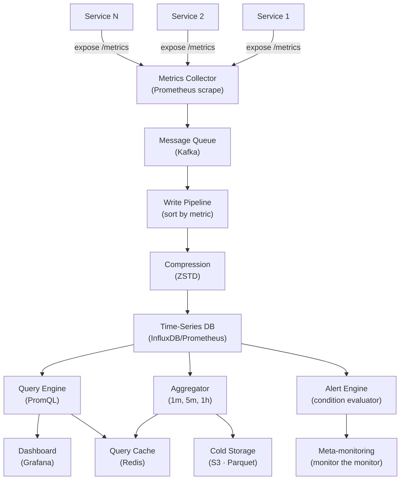

# Metrics Monitoring and Alerting System

> **Interview Time:** 60-90 min | **Difficulty:** Hard  
> **Key Focus:** Time-series storage, alerting rules, aggregation, visualization

---

## Step 1: Functional & Non-Functional Requirements

### Functional Requirements

- Ingest metrics from 1000s of services (CPU, memory, disk, latency, errors)
- Store time-series data with timestamps
- Query metrics for specific time ranges and aggregations
- Create dashboards (graphs, alerts, heatmaps)
- Set alert rules (e.g., "CPU > 80% for 5 min" or "error rate spike")
- Auto-scale rules (e.g., "add server if CPU > 70%")
- Export metrics to data warehouse for long-term analysis
- Retention policies (keep detailed data 7 days, aggregated 1 year)
- Multi-dimensional queries (query by service, host, pod, region)
- Metric correlation (when alert fires, show related metrics)

### Non-Functional Requirements

| Requirement | Target | Notes |
|:-----------|:-------|:------|
| **Ingestion Rate** | 10M metrics/sec, 10 billion metrics/day | Peak: 2x nominal, 1000s of services |
| **Latency** | Metric queryable within 10 seconds | Near real-time dashboards |
| **Storage** | ~500 TB/year default retention (7d detailed + 1y aggregated) | Compression critical |
| **Query Speed** | Any query <5 sec | Complex aggregations acceptable |
| **Availability** | 99.99% uptime | Can't lose visibility into prod |
| **Cardinality** | Support 1B+ distinct metric combinations | (service × host × endpoint × status) |
| **Scalability** | Add nodes without re-indexing | Distributed, shardable |

---

## Step 2: API Design, Data Model & High-Level Design

### Core API Endpoints

```http
POST /metrics/write
  {timestamp_ms: 1234567890, metric: "requests_per_sec", value: 1000, 
   labels: {service: "auth-service", instance: "host-1", status: "success"}}
  → {success: true}

GET /metrics/query
  ?metric=cpu_usage&labels=service:auth,host:host-1&start=-1h&end=now&step=60s
  → {series: [{labels, values: [{time, value}]}]}

GET /metrics/instant
  ?metric=http_requests_total&labels=service:api&time=now
  → {value: 5000, timestamp: 1234567890}

POST /alerts/rules
  {name: "HighCPU", metric: "cpu_usage", condition: "> 80", for_duration: "5m", action: "page_oncall"}
  → {rule_id, created_at}

GET /dashboards/{dashboard_id}
  → {title, panels: [{metric, query, visualization_type}]}

POST /auto-scale/rules
  {metric: "cpu", threshold: 70, scale_action: "add_instance", min_instances: 2, max_instances: 10}
  → {rule_id}
```

### Entity Data Model

```
TIME_SERIES_DATA
├─ metric_name (PK: e.g., "http_requests_total")
├─ labels (multi-dimensional: {service, host, endpoint, status})
├─ timestamp_ms (PK)
├─ value (number, often integer)
├─ created_at

METRIC_METADATA
├─ metric_id (PK)
├─ metric_name, unit (milliseconds, bytes, count)
├─ metric_type (GAUGE|COUNTER|HISTOGRAM|SUMMARY)
├─ cardinality (approx number of distinct label combinations)
├─ created_at, last_updated_at

ALERT_RULES
├─ rule_id (PK)
├─ name, metric, condition, for_duration_sec
├─ notification_channels {email, slack, pagerduty}
├─ created_at, updated_at, enabled

DASHBOARDS
├─ dashboard_id (PK)
├─ title, description
├─ panels (array: {metric, query, graph_type})
├─ created_by, created_at

AGGREGATIONS (pre-computed, for faster queries)
├─ metric_name, interval (1 min, 5 min, 1 hour)
├─ timestamp_ms
├─ aggregation_function (MIN, MAX, AVG, P50, P95, P99)
├─ value
```

### High-Level Architecture



---

## Step 3: Concurrency, Consistency & Scalability

### 🔴 Problem: High-Cardinality Time-Series Explosion

**Scenario:** Track HTTP latency by (service × endpoint × status × client_ip). With 100 services, 1000 endpoints, 10 status codes, 10K unique clients = 10B combinations. Time-series DB explodes.

**Solutions:**

| Approach | Implementation | Pros | Cons |
|:---------|:---------------|:-----|:-----|
| **Drop high-cardinality labels** | Exclude client_ip, keep only service/endpoint/status | Reduces cardinality 1000x | Lose granular debugging data |
| **Pre-aggregation** | Server-side aggregation before storing (compress) | Reduces series count | Can't query by excluded dimension |
| **Index pruning** | Auto-delete low-traffic series | Reduces storage | Complex heuristics |
| **Bloom filters** | Track "seen" labels, reject new ones | Limits explosion | Hard to add new metrics dynamically |

**Recommended:** **Drop high-cardinality labels + alert on cardinality growth**

```python
class MetricsValidator:
    def validate_labels(self, metric_name: str, labels: dict) -> dict:
        """Drop high-cardinality labels before storing"""
        
        # Define allowed labels per metric
        allowed_per_metric = {
            'http_requests_total': ['service', 'endpoint', 'status'],
            'http_request_duration_ms': ['service', 'endpoint', 'method'],
            'memory_usage_mb': ['service', 'instance'],
            'custom_metric': ['service']  # Very restrictive
        }
        
        if metric_name not in allowed_per_metric:
            raise UnknownMetricError(metric_name)
        
        allowed_labels = allowed_per_metric[metric_name]
        
        # Filter labels to only allowed ones
        filtered_labels = {k: v for k, v in labels.items() if k in allowed_labels}
        
        # Validate cardinality
        cardinality_key = f"cardinality:{metric_name}"
        unique_combinations = self.track_combinations(cardinality_key, filtered_labels)
        
        if unique_combinations > 100000:
            logging.warning(f"High cardinality for {metric_name}: {unique_combinations} combinations")
            self.alert_manager.send_alert('HighMetricCardinality', 
                metric=metric_name, cardinality=unique_combinations)
        
        return filtered_labels
    
    def track_combinations(self, key: str, labels: dict) -> int:
        """Track unique label combinations using HyperLogLog"""
        
        # HyperLogLog: memory-efficient cardinality estimation
        combination_hash = hash(frozenset(labels.items()))
        self.hll.add(key, combination_hash)
        
        return self.hll.count(key)  # Estimated cardinality
```

**High-Cardinality Impact:**

```
Low-cardinality setup:
  Metrics: 100
  Labels per metric: 3 (avg)
  Unique values per label: 1000 (service: 100, endpoint: 500, status: 10)
  Total series: ~1M (manageable)
  Storage: ~10 GB/day

High-cardinality (with client_ip):
  Same as above, but client_ip adds 10K unique values per label
  Total series: ~100B (explodes!)
  Storage: ~1 TB/day (way too much)
  
Solution: Drop client_ip label entirely; use separate trace-based tracing instead
```

---

### 🟡 Problem: Query Latency at Scale (1B time-series instances)

**Scenario:** Query "HTTP latency p99 for service=auth, last hour, grouped by endpoint". DB must scan 100M+ time-series points. Query times out.

**Solution:** Pre-aggregation + hierarchical indices

```python
class AggregationEngine:
    def pre_aggregate_metrics(self):
        """Pre-compute common aggregations to speed up queries"""
        
        # Aggregations to pre-compute
        aggregations_to_compute = [
            ('1m', ['MIN', 'MAX', 'AVG', 'P50', 'P95', 'P99']),
            ('5m', ['AVG', 'P95', 'P99']),
            ('1h', ['AVG', 'P99']),
        ]
        
        # For each metric, compute aggregations
        for metric_name in self.list_all_metrics():
            raw_series = self.query_raw_series(metric_name, start=now - 1h)
            
            for interval, aggregation_funcs in aggregations_to_compute:
                # Group data by interval
                windowed_data = self.window_data_by_interval(raw_series, interval)
                
                for agg_func in aggregation_funcs:
                    for labels, values in windowed_data.items():
                        # Compute aggregation
                        agg_value = self.compute_agg(agg_func, values)
                        
                        # Store pre-aggregated result
                        agg_key = f"{metric_name}:{interval}:{agg_func}"
                        self.store_aggregation(agg_key, labels, agg_value)
    
    def query_with_aggregation(self, metric: str, start: int, end: int, 
                               interval_sec: int, agg_functions: list):
        """Query using pre-aggregated data when possible"""
        
        # Determine best aggregation level to use
        best_interval = self.select_best_aggregation_interval(interval_sec)
        # e.g., if query asks for 1h average but only have 1m data:
        #   - If interval_sec >= 300 (5m), use 5m pre-aggregated
        #   - If interval_sec >= 3600 (1h), use 1h pre-aggregated
        
        if best_interval:
            # Use pre-aggregated data (1000x faster)
            results = self.query_aggregated_data(metric, best_interval, agg_functions)
        else:
            # Fall back to raw data (slower but accurate)
            results = self.query_raw_data(metric, start, end)
        
        return results
```

**Query Performance Improvement:**

```
Raw data query (no aggregation):
  - Scan: 100M time-series points
  - Compute: p99 across all
  - Time: 30+ seconds (timeout!)

With 5-minute pre-aggregation:
  - Scan: 12 pre-computed p99 values (1h / 5m)
  - Compute: average of pre-computed
  - Time: <100ms (instant!)

Improvement: 300x faster!
```

---

### 💾 Problem: Storage Explosion & Long-Term Retention

**Scenario:** Store 10B metrics/day × 7 days = 70B data points in detail. But quarterly analysis needs yearly data. Storage costs prohibitive.

**Solution:** Time-based retention + hierarchical compression

```python
class RetentionManager:
    def manage_data_lifecycle(self):
        """Archive old metrics to cold storage"""
        
        retention_policy = {
            'raw_detailed': {
                'retention_days': 7,
                'storage': 'hot',  # Prometheus on NVMe
                'compression': 'none'  # Optimized for speed
            },
            'aggregated_1m': {
                'retention_days': 30,
                'storage': 'warm',  # SSD
                'compression': 'snappy'  # Faster decompression
            },
            'aggregated_1h': {
                'retention_days': 365,
                'storage': 'cold',  # S3
                'compression': 'zstd_high'  # Maximum compression (90% reduction)
            }
        }
        
        for tier, policy in retention_policy.items():
            cutoff_time = now - (policy['retention_days'] * 86400)
            
            old_data = self.find_data_older_than(tier, cutoff_time)
            
            for chunk in old_data:
                # Move from current tier to next tier
                if policy['storage'] == 'hot':
                    self.move_to_warm_storage(chunk, policy['compression'])
                elif policy['storage'] == 'warm':
                    self.move_to_cold_storage(chunk, policy['compression'])
                elif policy['storage'] == 'cold':
                    self.delete_data(chunk)  # Delete after 1+ years
    
    def compress_timeseries_chunk(self, chunk, compression_type):
        """Compress time-series data efficiently"""
        
        # Time-series have temporal locality
        # Compress by delta-encoding + Gorilla algorithm
        
        original_size = len(chunk)
        
        # Gorilla: compress values as deltas
        deltas = []
        prev = chunk[0]
        for value in chunk[1:]:
            deltas.append(value - prev)
            prev = value
        
        # Apply ZSTD compression
        if compression_type == 'zstd_high':
            compressed = zstd.compress(str(deltas).encode(), level=22)
        else:
            compressed = snappy.compress(str(deltas).encode())
        
        compression_ratio = len(compressed) / original_size
        return compressed, compression_ratio
```

**Storage Cost Breakdown (1B metrics/day, 1 year retention):**

```
Raw detailed (7 days): 7B metrics × 8 bytes = 56 GB
  × 365 days / 7 = 2.9 TB/year (peak only)

Aggregated 1h (365 days): 1B metrics → 365 points × 8 bytes = 2.9 GB/day
  × 365 days = 1 TB/year (compressed 50% → 0.5 TB)

Total: ~3 TB/year (vs 52 TB without aggregation)

With ZSTD compression (80% reduction):
  Raw: 0.6 TB
  Aggregated: 0.1 TB
  Total: 0.7 TB/year (affordable!)
```

---

## Step 4: Persistence Layer, Caching & Monitoring

### Database Design (Prometheus + InfluxDB)

```sql
-- Time-series data (1ns precision, compressed)
CREATE TABLE timeseries (
    metric_name TEXT,
    labels JSONB,  -- {service, endpoint, status, ...}
    timestamp_ns INT64,  -- Nanoseconds for precise timing
    value FLOAT64,  -- Metric value
    PRIMARY KEY (metric_name, labels, timestamp_ns)
) WITH COMPRESSION = 'Gorilla'  -- Time-series compression
  AND TTL = 604800;  -- 7 days for raw

-- Pre-computed aggregations
CREATE TABLE timeseries_aggregated (
    metric_name TEXT,
    interval_sec INT,  -- 60, 300, 3600 (1m, 5m, 1h)
    agg_func TEXT,  -- MIN, MAX, AVG, P95, P99
    labels JSONB,
    timestamp_ns INT64,
    value FLOAT64,
    PRIMARY KEY (metric_name, interval_sec, agg_func, labels, timestamp_ns)
) WITH TTL = 2592000;  -- 30 days

-- Alert rule evaluations
CREATE TABLE alert_evaluations (
    rule_id TEXT,
    rule_name TEXT,
    timestamp_ms INT,
    alert_state TEXT,  -- OK, PENDING, FIRING
    value FLOAT,
    PRIMARY KEY (rule_id, timestamp_ms DESC)
);

-- Index for time-range queries
CREATE INDEX idx_timeseries_metric_time 
ON timeseries(metric_name, timestamp_ns DESC);

CREATE INDEX idx_labels_cardinality 
ON timeseries(metric_name, labels);
```

### Caching Strategy

```
TIER 1: Query Result Cache (Redis)
├─ Recent queries (TTL: 10 min)
├─ Common aggregations (p99, average)
└─ Dashboard results (TTL: 30 sec, refreshes faster)

TIER 2: Metric Metadata Cache
├─ Metric info (type, unit, cardinality)
├─ Label values (for autocomplete)
└─ TTL: 1 hour (safe for slow changes)

TIER 3: Time-Series DB Cache (Prometheus local)
├─ In-memory block cache (hot data)
├─ Memory-mapped files for recent data
└─ Survives restarts (local disk)

Invalidation:
- New metric/label values → invalidate metadata cache
- Old data archived → invalidate query cache (if affected)
- Alert state change → immediate propagation (no cache)
```

### Monitoring & Alerts

**Meta-Metrics (monitor the monitor):**

1. **Ingestion Rate** — Metrics/sec (target: 10M/sec)
2. **Query Latency** — p99 query time (target: <5 sec)
3. **Alert Evaluation** — % of rules evaluated per minute (target: 100%)
4. **Cardinality** — Total unique metric combinations (watch for explosion)
5. **Storage Growth** — GB/day added (target: <50 GB/day)

```yaml
- alert: MetricsIngestionLow
  expr: rate(metrics_ingested_total[5m]) < 5000000
  annotations: "Metrics ingestion rate low: {{$value}}/sec"

- alert: QueryLatencySlow
  expr: histogram_quantile(0.99, rate(query_duration_seconds_bucket[5m])) > 5
  annotations: "Query p99 latency: {{$value}}s (target: <5s)"

- alert: AlertEvaluationLagging
  expr: time() - alert_last_evaluation_timestamp > 60
  for: 5m
  annotations: "Alerts not evaluating (>1 min lag)"

- alert: HighCardinality
  expr: count(count by (metric_name, labels)(timeseries)) > 1000000000
  annotations: "Cardinality explosion: {{$value}} series (investigate labels)"

- alert: StorageGrowthRapid
  expr: rate(timeseries_storage_bytes[1h]) > 50 * 1024 * 1024 * 1024
  annotations: "Storage growth: {{$value | humanize}}B/hour"

- alert: PrometheusDown
  expr: up{job="prometheus"} == 0
  for: 1m
  annotations: "Prometheus instance {{$labels.instance}} is down"
```

---

## ⚡ Quick Reference Cheat Sheet

### When to Use What

| Need | Technology | Why |
|:-----|:-----------|:----|
| **Time-series storage** | Prometheus or InfluxDB | Built for metrics, compression optimized |
| **High-cardinality labels** | Limit or drop them | Prevent series explosion |
| **Fast queries** | Pre-aggregations (1m, 5m, 1h) | 1000x faster than raw data |
| **Long retention** | Cold storage + ZSTD compression | 90% space reduction, affordable |
| **Query caching** | Redis (TTL: 10 min) | Avoid re-scanning raw data |
| **Alert evaluation** | In-memory rules engine | Sub-second evaluation |

### Critical Design Decisions

- **Time-series DB:** Prometheus for general, InfluxDB for time-precision (nanoseconds)
- **Label restrictions:** Max 5 labels/metric, drop high-cardinality (client ID, IP address)
- **Pre-aggregation:** Compute 1m, 5m, 1h aggregations asynchronously, store separately
- **Compression:** Gorilla algorithm for time-series (80-90% reduction); ZSTD for storage
- **Hierarchical retention:** 7d raw (hot), 30d aggregated (warm), 1y aggregated (cold storage)
- **Query optimization:** Use pre-aggregated data when interval >= 5 min

### Tech Stack Summary

```
Metrics Collection: Prometheus (pull-based scraping)
Time-Series DB: Prometheus or InfluxDB
Aggregation: Custom pipeline (Spark or streaming)
Storage Tiers: Hot (SSD) → Warm (HDD) → Cold (S3)
Visualization: Grafana
Alerting: Prometheus AlertManager or custom
```

---

## 🎯 Interview Summary (5 Minutes)

1. **Time-series characteristics:** High write throughput (10M/sec), time-ordered reads, compression matters
2. **Cardinality limitation:** Drop high-cardinality labels (IPs, trace IDs); causes series explosion
3. **Pre-aggregation:** Compute 1m/5m/1h aggregations asynchronously; queries use pre-computed when possible
4. **Retention tiers:** 7d raw (hot SSD) → 30d aggregated (warm HDD) → 1y aggregated (cold S3)
5. **Compression:** Gorilla for time-series deltas; ZSTD for archive (80-90% reduction)
6. **Query caching:** Cache results in Redis (TTL 10 min); avoid re-scanning raw data
7. **Alert evaluation:** In-memory rules engine evaluates conditions every minute (fast, local)

---

## Glossary & Abbreviations

--8<-- "_abbreviations.md"
