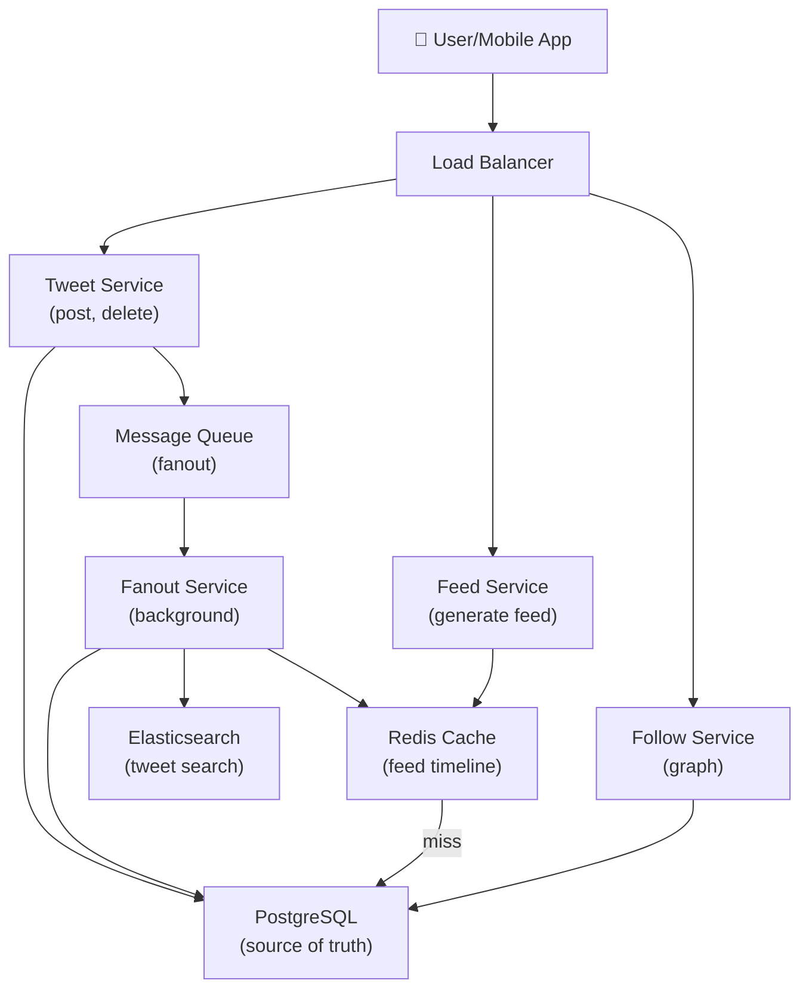

# Design Twitter

> **Interview Time:** 60 min | **Difficulty:** Medium  
> **Key Focus:** Feed consistency, real-time updates, social graph, fanout strategies

---

## Step 1: Functional & Non-Functional Requirements

### Functional Requirements

- Users can post tweets (text, images, video links)
- Users can follow/unfollow other users
- Users see home feed (tweets from followed accounts + self, reverse chronological)
- Users can like, retweet, reply to tweets
- Users can search tweets by keywords
- Tweets can be deleted/edited by author
- Retweets/likes are visible on tweet details

### Non-Functional Requirements

| Requirement | Target | Notes |
|:-----------|:-------|:------|
| **Throughput** | 500M users, 2M tweets/sec peak | Holiday peaks: 5M tweets/sec |
| **Latency** | Feed load <200ms p99 | Refresh must be snappy |
| **Availability** | 99.9% uptime | Tweet posting > feed loading |
| **Consistency** | Eventual (3–5 sec lag OK) | Real-time consistency too expensive |
| **Feed freshness** | Feed updated <5 sec | Acceptable for social network |

---

## Step 2: API Design, Data Model & High-Level Design

### Core API Endpoints

```http
POST /tweets
  {content, media_urls?, location?}
  → {tweet_id, created_at}

GET /home-feed
  ?page_token=abc&limit=20
  → {tweets: [...], next_page_token}

POST /tweets/{tweet_id}/like
  → {tweet_id, likes_count}

POST /tweets/{tweet_id}/retweet
  → {retweet_id, created_at}

POST /users/{user_id}/follow
  {target_user_id}
  → {status: "followed"}
```

### Entity Data Model

```
USERS
├─ user_id (PK)
├─ username (UNIQUE), profile_pic_url
├─ bio, follower_count, created_at

TWEETS
├─ tweet_id (PK)
├─ author_id (FK), content, media_ids
├─ created_at, updated_at, like_count, retweet_count

FOLLOWS
├─ follower_id (FK), following_id (FK) (composite PK)
├─ created_at

LIKES
├─ user_id (FK), tweet_id (FK) (composite PK)
├─ created_at

RETWEETS
├─ user_id (FK), tweet_id (FK), retweet_id (PK)
├─ created_at

HOME_FEED_CACHE (Denormalized)
├─ user_id (FK) (PK), tweet_id (FK), tweet_json
├─ inserted_at (for deletion by age)
```

### High-Level Architecture



---

## Step 3: Concurrency, Consistency & Scalability

### 🔴 Problem: Feed Consistency (Eventual Seconds Old)

**Scenario:** User1 posts tweet. User2 immediately loads feed. Does User2 see User1's tweet?

**Solutions:**

| Approach | Strategy | Pros | Cons |
|:---------|:---------|:-----|:-----|
| **Pull on demand** | Fetch tweets from DB when feed loaded | Always fresh | Slow (N queries for N tweets), expensive |
| **Push on write** | Send tweet to all followers' caches | Fast read, real-time | Slow write (fanout), storage |
| **Hybrid (fanout + cache-aside)** | Push to active followers, pull for inactive | Balanced for most use cases | Complex logic |
| **Timeline DBs** | Special DB (DynamoDB, Cassandra) optimized for time-series | Efficient, scalable | Cost, operational complexity |

**Recommended:** **Hybrid Fanout Pattern**

```python
# Fanout process (async, on tweet creation)
def fanout_tweet(tweet_id, author_id):
    followers = db.get_followers(author_id)
    
    # Push to ACTIVE followers (online in last hour)
    active_followers = followers.filter(last_active > now - 1hour)
    for follower in active_followers:
        redis.lpush(f"feed:{follower}", tweet_json)
        redis.ltrim(f"feed:{follower}", 0, 999)  # Keep 1000 most recent
    
    # Inactive followers: will pull on refresh
    # This saves fanout cost for inactive users
    
    # Also index in Elasticsearch for search
    elasticsearch.index_tweet(tweet_id, content)
```

### 🟡 Problem: High-Follower Users (Celebrities)

**Scenario:** @elonmusk has 100M followers. Each tweet needs to update 100M timelines (too slow).

**Solution:** Hybrid fanout with pull fallback

```
For normal users (<10K followers): Push tweet to all followers' caches
For celebrities (>10K followers): Don't push; instead add to "celebrity feed" 
When loading feed, merge:
  - User's normal followed accounts (pushed)
  - Celebrity tweets (pulled on demand from special index)
```

### 💾 Data Consistency Strategy

| Data Type | Consistency | Strategy |
|:----------|:-----------|:---------|
| **Tweet creation** | Strong (after published) | DB transaction |
| **Feed visibility** | Eventual (3–5 sec lag) | Async fanout + cache |
| **Like count** | Eventual | Count in cache, trickle to DB |
| **Follow relationship** | Strong | DB constraint + cache invalidation |

---

## Step 4: Persistence Layer, Caching & Monitoring

### Database Design

```sql
CREATE TABLE tweets (
  tweet_id BIGSERIAL PRIMARY KEY,
  author_id BIGINT NOT NULL REFERENCES users(id),
  content TEXT NOT NULL,
  created_at TIMESTAMP DEFAULT NOW(),
  like_count INT DEFAULT 0,
  retweet_count INT DEFAULT 0
);

CREATE INDEX idx_tweets_author_time ON tweets(author_id, created_at DESC);

CREATE TABLE follows (
  follower_id BIGINT NOT NULL REFERENCES users(id),
  following_id BIGINT NOT NULL REFERENCES users(id),
  created_at TIMESTAMP DEFAULT NOW(),
  PRIMARY KEY (follower_id, following_id)
);

CREATE INDEX idx_follows_following ON follows(following_id);

CREATE TABLE likes (
  user_id BIGINT NOT NULL REFERENCES users(id),
  tweet_id BIGINT NOT NULL REFERENCES tweets(tweet_id),
  created_at TIMESTAMP DEFAULT NOW(),
  PRIMARY KEY (user_id, tweet_id)
);
```

### Caching Strategy

**Tier 1 (Redis):**
- `feed:{user_id}` → [tweet_json, ...] (0-1000 most recent)
- `tweet_likes:{tweet_id}` → Set of user_ids (who liked)
- `user:{user_id}:follower_count` → Count
- TTL: 24 hours (or invalidate on change)

**Tier 2 (DB Query Cache):**
- User profile (follower count, description)
- Follow graph (for suggestions)

**Cache Invalidation:**
- On new tweet: Push to followers' feeds, invalidate author's profile
- On like: Increment Redis counter (eventually consistent DB update)
- On follow: Invalidate recommendations, next feed refresh pulls new data

### Monitoring & Alerts

**Key Metrics:**
1. **Feed latency p99** — Target 200ms (includes cache hit)
2. **Fanout latency** — How long until tweet appears in follower feeds
3. **Cache hit ratio** — Should be >95% for feed queries
4. **Database load** — Query throughput for tweet creation
5. **Elasticsearch indexing lag** — How long until tweet searchable

```yaml
- alert: FeedLatencyHigh
  expr: feed_latency_p99 > 500
  annotations: "Feed loading too slow"

- alert: FanoutQueueBacklog
  expr: queue_pending_fanouts > 1000000
  annotations: "Fanout backlog building up"

- alert: CacheHitRatioDrop
  expr: cache_hit_ratio < 0.85
  annotations: "Feed cache effectiveness dropped"
```

---

## ⚡ Quick Reference Cheat Sheet

### When to Use What

| Scenario | Strategy | Why |
|:---------|:---------|:----|
| Normal user tweets | Push fanout to followers | Fast feed loads |
| Celebrity tweets | Pull on demand (lazy) | Avoid 100M cache writes |
| Feed read | Redis cache-aside | Fast, cheap |
| Search tweets | Elasticsearch | Full-text search |

### Critical Design Decisions

- **Eventual consistency OK** — 3–5 sec lag acceptable for social
- **Hybrid fanout** — Push for active users, pull for inactive
- **Timeline cache in Redis** — Keep 1000 most recent tweets per user
- **Async fanout** — Don't block tweet creation on fanout
- **Elasticsearch for search** — DB not efficient for keyword search
- **Like count cache + eventual DB** — Optimize for reads (reads >> writes)

### Tech Stack Summary

```
Frontend: Web + Mobile apps
Backend: Java/Go (stateless services)
Timeline Cache: Redis
Database: PostgreSQL
Search: Elasticsearch
Queue: Kafka (fanout events)
Monitoring: Prometheus + Grafana
```

---

## 🎯 Interview Summary (5 Minutes)

1. **Hybrid fanout pattern** — Push to active followers, pull for inactive/celebrities
2. **Redis for feed cache** — Keep 1K most recent tweets per user, TTL 24 hrs
3. **Eventual consistency** — Feed updates in 3–5 sec (acceptable for social)
4. **Fanout service** — Background job converts tweet creation to timeline updates
5. **Elasticsearch for search** — Index tweets in parallel with fanout
6. **Like count optimization** — Cache counter, trickle updates to DB

---

## Glossary & Abbreviations

--8<-- "_abbreviations.md"
