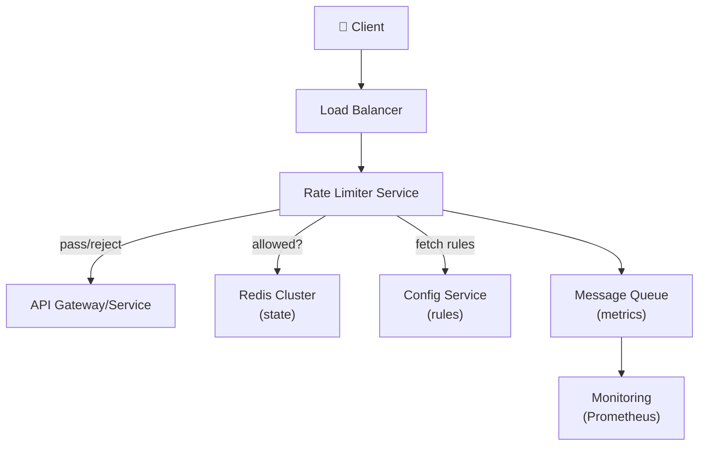

# Design an API Rate Limiter

> **Interview Time:** 60 min | **Difficulty:** Medium  
> **Key Focus:** Token bucket algorithm, sliding window, distributed rate limiting across services

---

## Step 1: Functional & Non-Functional Requirements

### Functional Requirements

- Rate limit requests per user/IP by configurable rate (e.g., 100 req/min)
- Support different rate limit rules (per user, per IP, per endpoint)
- Return HTTP 429 (Too Many Requests) when limit exceeded
- Provide `X-RateLimit-*` headers in responses (remaining, reset time)
- Support multiple strategies: token bucket, sliding window, fixed window
- Allow whitelisting of certain IPs/users

### Non-Functional Requirements

| Requirement | Target | Notes |
|:-----------|:-------|:------|
| **Throughput** | 1M requests/sec globally | Per-service: 10K QPS |
| **Latency** | Check rate limit <1ms | Sub-millisecond decision |
| **Availability** | 99.99% | Must not slow down API |
| **Consistency** | Eventual (soft limits OK) | Hard limits at scale difficult |
| **Precision** | 95%+ accuracy | Small overage acceptable |

---

## Step 2: API Design, Data Model & High-Level Design

### Core API Endpoints

```http
# Check if request allowed
POST /check-rate-limit
  {user_id, endpoint, ip_address}
  → {allowed: true/false, remaining: N, reset_at: timestamp}

# Configure rate limits (admin)
POST /configure-limit
  {user_id, endpoint, limit: 100, window: 60}
  → {status: "configured"}

# Get rate limit status
GET /limit-status/{user_id}
  → {limits: [{endpoint, remaining, reset_at}]}
```

### Rate Limit Configuration

```
Default: 100 requests per minute per user
Tiers:
  - Free: 10 req/min
  - Standard: 100 req/min
  - Premium: 1000 req/min
  - Enterprise: Unlimited
```

### High-Level Architecture



---

## Step 3: Concurrency, Consistency & Scalability

### 🔴 Problem: Accurate Rate Limiting Across Distributed Services

**Scenario:** User makes 200 requests/sec across 5 servers. Each server thinks user has 20 requests remaining.

**Solutions:**

| Approach | Implementation | Pros | Cons |
|:---------|:---------------|:-----|:-----|
| **Local Counters** | Counter per server, no sync | Fast, simple | Inaccurate (race conditions) |
| **Redis Shared State** | All servers query Redis for counter | Accurate, consistent | Network latency, Redis dependency |
| **Token Bucket + Redis** | Tokens in Redis, servers decrement | Smooth rate, fair | Slightly slower than local |
| **Eventual Consistency** | Async updates, allow small overages | Fast, scalable | May exceed limit temporarily |

**Recommended:** **Token Bucket with Redis** — balance between accuracy and performance

```sql
-- Redis implementation
SET rate_limit:user:123 {tokens: 100, last_refill: now}

-- Check and decrement (atomic)
SCRIPT:
  IF tokens > 0:
    tokens -= 1
    SAVE state
    RETURN true
  ELSE:
    RETURN false
```

### 🟡 Problem: Distributed Coordination at High Scale

**Scenario:** 100K requests/sec from same user across 10 rate limiter instances.

**Solution:** Token bucket with configurable refill rate

```
Bucket capacity: 100 tokens
Refill rate: 100 tokens per 60 seconds = 1.67 tokens/sec

On each request:
1. Check time elapsed since last refill
2. Add (elapsed_time * refill_rate) tokens (max capacity)
3. Decrement 1 token if available
4. Return allowed/denied
```

### 💾 Data Consistency Strategy

| Data Type | Consistency | Strategy |
|:----------|:-----------|:---------|
| **Token count** | Eventual (soft limit) | Redis atomic operations |
| **Rate limit config** | Strong | Config service + cache |
| **Metrics/logs** | Weak | Queue + async processing |

---

## Step 4: Persistence Layer, Caching & Monitoring

### Token Bucket State Storage

```
Redis Data Structure:
hash key: "rate_limit:{user_id}"
{
  tokens: 100,           // Current tokens
  capacity: 100,         // Max tokens  
  refill_rate: 1.67,     // tokens per second
  last_refill: 1714161600000  // milliseconds
}

TTL: Auto-expire after 24 hours inactivity
```

### Rate Limit Algorithm (Pseudocode)

```python
def is_allowed(user_id, endpoint):
    # Fetch current state from Redis
    state = redis.get(f"rate_limit:{user_id}:{endpoint}")
    
    now = current_time_ms()
    elapsed = (now - state.last_refill) / 1000.0  # seconds
    
    # Refill tokens (capped at capacity)
    tokens = min(
        state.tokens + (elapsed * state.refill_rate),
        state.capacity
    )
    
    # Decrement 1 token if available
    if tokens > 0:
        tokens -= 1
        allowed = True
    else:
        allowed = False
    
    # Save updated state
    redis.hset(f"rate_limit:{user_id}:{endpoint}", {
        "tokens": tokens,
        "last_refill": now
    })
    
    return allowed
```

### Monitoring & Alerts

**Key Metrics:**
1. **Requests allowed (per user/endpoint)** — throughput
2. **Requests rejected (HTTP 429)** — gate effectiveness
3. **Rate limiter latency p99** — Check must be <1ms
4. **False positives** — Allowed > configured limit
5. **Redis latency** — Dependency monitoring

```yaml
# Prometheus alerts
- alert: RateLimiterLatencyHigh
  expr: rate_limiter_latency_p99 > 5  # 5ms threshold
  annotations: "Rate limiter latency exceeding SLA"

- alert: RateLimiterDowntime
  expr: up{job="rate-limiter"} == 0
  annotations: "Rate limiter service down"

- alert: HighRejectionRate
  expr: (rejected_requests / total_requests) > 0.1
  annotations: "High rejection rate - may indicate abuse"
```

### Response Headers

```http
HTTP/1.1 200 OK
X-RateLimit-Limit: 100
X-RateLimit-Remaining: 47
X-RateLimit-Reset: 1714162260

---

HTTP/1.1 429 Too Many Requests
X-RateLimit-Limit: 100
X-RateLimit-Remaining: 0
X-RateLimit-Reset: 1714162260
Retry-After: 45
```

---

## ⚡ Quick Reference Cheat Sheet

### When to Use What

| Scenario | Algorithm | Why |
|:---------|:----------|:----|
| Simple per-user limit | Fixed window | Easiest, acceptable accuracy |
| Smooth, fair limiting | Token bucket | Prevents bursts, predictable |
| Precise global limit | Distributed token bucket | Accurate across services |
| High scale (100K+ QPS) | Eventual consistency + async | Non-blocking, fast |

### Critical Design Decisions

- **Token bucket > sliding window** — Allows burst, smoother UX
- **Redis for shared state** — Required for accuracy across servers
- **Async metrics collection** — Don't measure in critical path
- **Cache config rules** — Don't fetch from DB on every request
- **Soft limits acceptable** — Small overage OK at scale (99% accuracy vs 100%)

### Tech Stack Summary

```
Frontend: Any (receives 429)
Rate Limiter: Node.js/Go (low-latency required)
State: Redis Cluster (atomic operations)
Config: PostgreSQL + Redis cache
Monitoring: Prometheus + Grafana
Logging: ELK Stack
```

---

## 🎯 Interview Summary (5 Minutes)

1. **Token bucket algorithm** — Add tokens periodically, decrement on each request
2. **Redis for shared state** — Atomic operations ensure accuracy across servers
3. **Refill rate calculation** — tokens += elapsed_time * (limit / window)
4. **Soft vs hard limits** — Soft OK at scale (eventual consistency), hard requires coordination
5. **Response headers** — X-RateLimit-* tells client when limit resets
6. **Async metrics** — Don't measure in critical path; queue for analysis

---

## Glossary & Abbreviations

--8<-- "_abbreviations.md"
