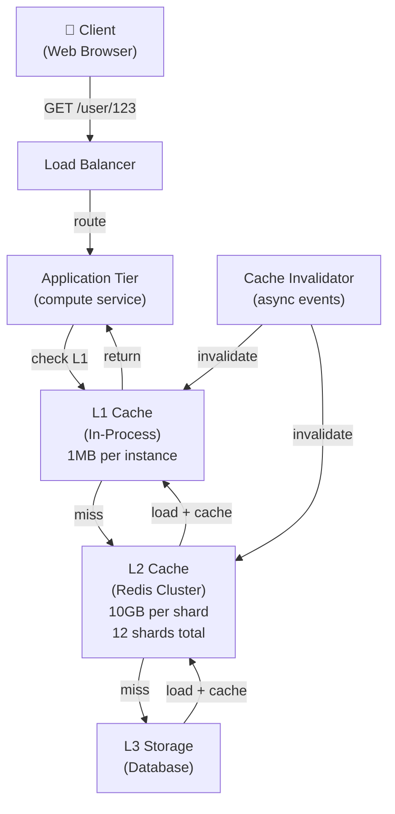

# Web Cache

> **Interview Time:** 60 min | **Difficulty:** Medium  
> **Key Focus:** Cache invalidation, LRU eviction, consistency, multi-level caching

---

## Step 1: Functional & Non-Functional Requirements

### Functional Requirements

- Cache frequently accessed data (data, API responses)
- Return cached data if available (cache hit), fetch from origin if miss
- Eviction policies: LRU (least recently used), LFU (least frequently used), TTL
- Cache invalidation: explicit purge, TTL expiration, conditional updates
- Support for different data types (objects, strings, lists, sets)
- Enable/disable caching per data item
- Performance analytics (hit ratio, eviction stats)
- Multi-tier caching (L1: in-process, L2: service cache, L3: distributed)

### Non-Functional Requirements

| Requirement | Target | Notes |
|:-----------|:-------|:------|
| **Latency** | <5ms cache hit | Memory-based, <1ms ideal |
| **Hit ratio** | 80%+ for hot data | Cold data has lower hit ratio |
| **Availability** | 99.9% (non-critical) | Cache loss = re-fetch, no harm |
| **Throughput** | 100K ops/sec | Single instance, distributed via sharding |
| **Memory usage** | Bounded by max_memory | Evict least valuable when full |
| **Consistency** | Eventual (cache miss OK) | Stale data acceptable for short TTL |

---

## Step 2: API Design, Data Model & High-Level Design

### Core API Endpoints/Operations

```
GET /cache/{key}
  → {value, hit_count, last_accessed, ttl_remaining_seconds}
  → If miss: fetch from database, store in cache, return
  → If hit: update access time, return value

SET /cache/{key}
  {value, ttl_seconds: 3600, eviction_policy: LRU}
  → {success: true, stored_size_bytes, eviction_count}

DELETE /cache/{key}
  → {success: true, freed_size_bytes}

FLUSH /cache
  → {cleared_count, freed_size_bytes}

GET /cache/stats
  → {hits, misses, hit_ratio, eviction_count, memory_used, memory_max}

INVALIDATE /cache
  {keys: [key1, key2, key3]}
  → {invalidated_count, eviction_count}
```

### Entity Data Model

```
CACHE_ENTRY
├─ key (PK, string - "user:123", "post:456")
├─ value (binary, up to max_value_size)
├─ size_bytes (for memory management)
├─ created_at (timestamp)
├─ last_accessed_at (for LRU)
├─ access_count (for LFU)
├─ ttl_seconds (0 = no expiry)
├─ expires_at (created_at + ttl_seconds)
├─ priority (for weighted eviction)
├─ flags (pinned=true for never-evict)

CACHE_STATS (aggregated per shard/instance)
├─ timestamp
├─ hits_count
├─ misses_count
├─ evictions_count
├─ memory_used_bytes
├─ memory_max_bytes
├─ entries_count
```

### High-Level Architecture



---

## Step 3: Concurrency, Consistency & Scalability

### 🔴 Problem: Cache Stampede (Thundering Herd)

**Scenario:** Popular item cached. Popular data expires. 1000 requests hit simultaneously. All 1000 go to database to refresh cache. Database overloaded.

**Solution: Probabilistic Early Expiration**

```
Cache entry: {key: "trending_items", ttl: 3600, created: 14:00}

Normal expiration:
  Request at 15:00: Cache expired, fetch from DB

Stampede-prone scenario (popular item):
  Requests: 1000/sec
  At 15:00:00 → Cache expires
  Requests 15:00:00 to 15:00:10 → All 1000 miss
  Database hit: 10,000 simultaneous queries!
  → DB overload

Solution: Probabilistic early refresh

Cache entry:
  ttl = 3600
  early_refresh_start = ttl * 0.8 = 2880 (80% of TTL)
  early_refresh_end = ttl (100% of TTL)

At time 14:40 (80% of TTL):
  Request arrives
  Is item within early refresh window?  YES
  
  Probability P = (time_since_window_start) / (window_duration)
  P = (14:40 - 14:48) / (3600 * 0.2)
    = 480 / 720 = 66%
  
  random.rand() < 0.66:  YES → Refresh (refresh 66% of requests)
                         NO  → Use stale (serve stale cache)

Acquire lock:
  SET refresh_lock:{key} {thread_id, timestamp} NX EX 10 sec
  
  If acquired:
    Fetch fresh from DB
    Update cache TTL
    Release lock
  
  If not acquired (another thread refreshing):
    Serve stale cache
    Retry lock in 100ms
    Once lock released, use fresh

Result:
  - Only 1 DB call per expiration
  - Others serve stale (fast)
  - No thundering herd
```

### 🟡 Problem: Inconsistence (Cache vs Database)

**Scenario:** Update database. Old cache still returns. User sees stale data for hours.

**Solutions:**

```
1. WRITE-THROUGH (update cache + database atomically)
  
  Operation: update_item(id, new_value)
  
  Transaction:
    BEGIN
    1. Update database
       UPDATE items SET value = ? WHERE id = ?
    
    2. Update cache (same transaction)
       SET cache[key] = new_value
       TTL = 3600
    
    3. Log invalidation event
       PUBLISH cache_invalidation {operation: UPDATE, key, value}
    
    COMMIT

  Result:
    - Database and cache always consistent
    - If transaction fails, both updated or both not
    - Latency: DB write time + cache write time
    - Throughput: Limited by DB write latency

2. WRITE-BEHIND (write to cache first, journal to database)
  
  Operation: update_item(id, new_value)
  
  Synchronous:
    1. Write to cache (fast, <1ms)
       SET cache[key] = new_value
       → Client gets response immediately
  
  Asynchronous:
    2. Background: Write to database
       Every 1 second or 1000 updates:
         Submit batch to database
         If database write fails:
           Log error and retry in 10 sec
  
  Pros:
    - Cache hits always latest (written there first)
    - Fast response to client
  
  Cons:
    - If cache crashes before DB write, data loss
    - Eventual consistency (DB may lag cache by seconds)
  
  Mitigate:
    - Use persistent cache (Redis with AOF/RDB)
    - Small batch window (100ms)
    - Duplicate cache (replicated, failover)

3. CACHE-ASIDE (write directly to database, invalidate cache)
  
  Operation: update_item(id, new_value)
  
  1. Update database directly
     UPDATE items SET value = ? WHERE id = ?
  
  2. Invalidate cache
     DEL cache[key]
  
  3. Next read:
     GET cache[key] → miss
     GET database[key] → fetch fresh
     SET cache[key] → store for future

  Pros:
    - Simple, decoupled from database
    - Database write is primary source of truth
    - Cache can crash, just slower reads
  
  Cons:
    - Between DELETE and next GET: cache miss (slower)
    - Complexity: need to coordinate invalidation
```

### Solution: Sharding for Scalability

```
Problem: Single Redis instance = single bottleneck
Solution: Partition data across multiple shards

Hash Ring:
  Shard 0: keys 0-2^32/12
  Shard 1: keys 2^32/12 to 2*2^32/12
  ...
  Shard 11: keys 11*2^32/12 to 2^32

For key "user:123":
  hash("user:123") % 12 = shard_id
  
  All operations on "user:123" go to same shard
  → Consistency within key
  → Parallelism across shards

Throughput scaling:
  Single shard: 100K ops/sec
  12 shards: 1.2M ops/sec!

Replicas for fault-tolerance:
  Shard 0 (primary): Leader
  Shard 0 (replica): Follower (reads, auto-promotes if primary fails)
  
  Read: Primary or replica (even distributed)
  Write: Primary only
```

---

## Step 4: Persistence Layer, Caching & Monitoring

### In-Memory Storage (Hash Map)

```
Typical implementation (Redis):

Data structure: Hash table (for O(1) lookup)
  bucket_0 → [entry1, entry2]
  bucket_1 → [entry3]
  bucket_2 → [entry4, entry5, entry6]
  ...

For each entry:
  Key:   string (usually <256 bytes)
  Value: serialized (JSON/binary)
  Size:  bytes (for memory accounting)

Memory management:

Total cache memory = max_memory (e.g., 10GB)
Used memory = sum(value.size + key.size + metadata)

Eviction when used > max_memory:

1. Remove expired entries
2. Remove entries marked for deletion
3. Apply eviction policy:
   
   a) LRU (Least Recently Used)
      - Evict entry not accessed for longest time
      - Track: last_accessed_at for each entry
      - On eviction: find min(last_accessed_at)
      - Complexity: O(N) if full scan, O(1) with LRU list
   
   b) LFU (Least Frequently Used)
      - Evict entry with lowest access_count
      - Track: access_count for each entry
      - On eviction: find min(access_count)
     - Helps with scan operations (accessed many times but long ago)
   
   c) Random
      - Evict random entry
      - O(1) operation
      - Less intelligent but fast

Eviction percentage:
  When memory exceeds max:
    Evict 25% of memory (e.g., delete 500 entries if 2000 total)
    Prevents constant evictions
    Trade-off: use more memory to avoid churn
```

### Cluster Persistence

```
Redis Cluster with RDB + AOF:

RDB (Snapshot):
  Every 60 seconds or 1000 writes:
    Pause: Stop accepting writes for 100ms
    Snapshot: Write all entries to disk
    Compress: gzip to 30% size
    Store: S3 + local disk
  
  Fast recovery: Load RDB on startup
  Data loss risk: Up to 1 minute of writes if crash

AOF (Append-Only File):
  Every write: Append to log
  fsync: Every 1 second (batch multiple writes)
  Durability: Latest 1 second of data
  
  Replay: On startup, replay log to reconstruct state
  Compaction: Periodically rewrite (remove obsolete ops)

Recovery procedure:
  1. Load latest RDB (fast, few seconds)
  2. Replay AOF since RDB timestamp (may take longer)
  
  Result: No data loss (with AOF + fsy every sec)
           Recovery time: N seconds
```

### Monitoring & Alerts

**Key Metrics:**

1. **Cache Hit Rate**
   - hits / (hits + misses) = % of requests served from cache
   - Target: 80%+ for hot data, 10-20% for cold
   - Low hit rate → increase cache size or TTL

2. **Cache Performance**
   - Hit latency: <5ms (should be <1ms)
   - Miss latency: <100ms (depends on database)
   - Eviction rate: entries/sec evicted
   - Memory usage: % of max_memory

3. **Consistency**
   - Staleness: How old is cached data vs actual?
   - TTL misses: Items expired but not accessed
   - Invalidation lag: Time to propagate invalidate across shards

4. **System Health**
   - Shard distribution: Entries per shard (should be balanced)
   - Memory per shard: Detect hot shards
   - Replication lag: Time for writes to reach replicas

```yaml
- alert: CacheHitRateLow
  expr: cache_hit_ratio < 0.70
  annotations: "Hit rate < 70% — increase TTL or cache size"

- alert: EvictionRateHigh
  expr: evictions_per_second > 1000
  annotations: "Evicting 1K entries/sec — cache thrashing"

- alert: MemoryFull
  expr: used_memory / max_memory > 0.95
  annotations: "Cache 95% full — aggressive eviction starting"

- alert: ShardHotspot
  expr: max_shard_entries > avg_shard_entries * 2
  annotations: "One shard has 2× average entries — rebalance"

- alert: ReplicationLagHigh
  expr: replica_lag_ms > 1000
  annotations: "Replica 1s behind leader — replication bottleneck"
```

---

## ⚡ Quick Reference Cheat Sheet

### Critical Design Decisions

1. **Multi-tier caching** → L1 (in-process) + L2 (Redis) + L3 (DB) = full coverage
2. **Probabilistic early refresh** → Avoid thundering herd on expiration
3. **Write-through for consistency** → Database + cache updated atomically
4. **Cache-aside for simplicity** → Invalidate on write, lazy load on read
5. **Sharding for throughput** → 12 shards = 12x single-shard throughput
6. **LRU eviction** → Keep hot items, evict cold items automatically

### Eviction Policy Comparison

| Policy | Latency | Memory Efficiency | Use Case |
|:-------|:--------|:-----------------|:---------|
| **LRU** | O(1) with linked list | Good | Most common, temporal locality |
| **LFU** | O(1) with counter | Excellent | Repeated scan operations |
| **Random** | O(1) | Fair | Speed priority |
| **TTL** | O(1) | Excellent | Fixed lifetime (sessions) |

### Consistency Strategies

| Strategy | Consistency | Latency | Complexity |
|:---------|:-----------|:--------|:-----------|
| **Write-through** | Strong | Slower (2 writes) | Medium |
| **Write-behind** | Eventual | Fast (cache only) | High (crash risk) |
| **Cache-aside** | Eventual | Medium (invalidate lag) | Low |

### Tech Stack

```
L1 Cache: In-process (HashMap/LRU cache library)
L2 Cache: Redis Cluster (12 shards + replicas)
Persistence: RDB snapshots + AOF logs
Monitoring: Prometheus (hit rate, memory, evictions)
Invalidation: Pub/Sub (to broadcast invalidation)
```

---

## 🎯 Interview Summary (5 Minutes)

1. **Multi-tier caching** → L1 (in-process) + L2 (Redis) + L3 (database)
2. **Thundering herd prevention** → Probabilistic early refresh + distributed lock
3. **Consistency** → Write-through (strong) vs write-behind (fast but risky) vs cache-aside (eventual)
4. **Eviction** → LRU (keep hot items) or LFU (for freq access patterns)
5. **Sharding** → 12 shards for 12x throughput, hash ring determines shard
6. **Persistence** → RDB snapshots + AOF for durability, <1 min data loss
7. **Monitoring** → Track hit rate (80%+ target), eviction rate, memory usage

---

## Glossary & Abbreviations

--8<-- "_abbreviations.md"

## ⚡ Quick Reference Cheat Sheet

[TODO: Fill this section]

---

## 🎯 Interview Summary (5 Minutes)

[TODO: Fill this section]

---

## Glossary & Abbreviations

--8<-- "_abbreviations.md"
