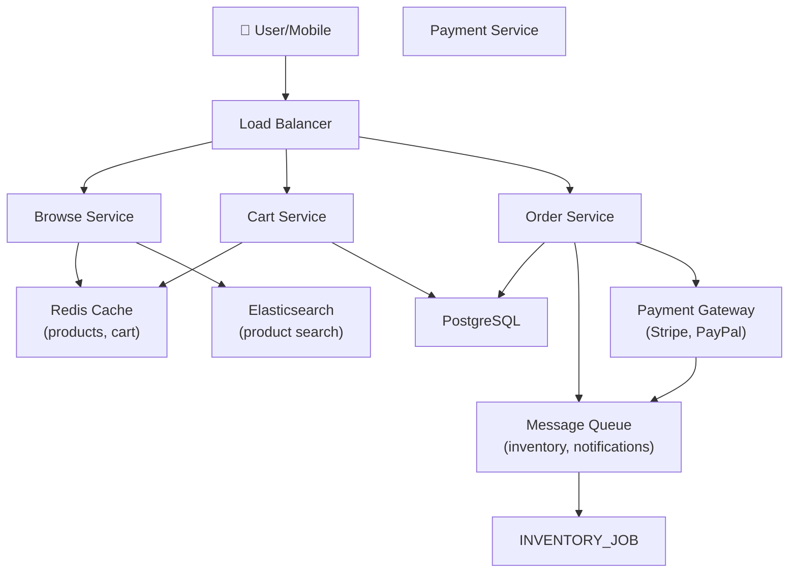

# Design an E-commerce Service

> **Interview Time:** 60 min | **Difficulty:** Medium  
> **Key Focus:** Inventory management, shopping cart, transaction consistency, checkout flow

---

## Step 1: Functional & Non-Functional Requirements

### Functional Requirements

- Users can browse products (search, filter, sort)
- Users can add items to shopping cart
- Users can update cart (quantity, remove items)
- Users can checkout and pay
- Users can view order history
- Users can track order status
- System manages inventory (stock, reservations)
- Admins can manage inventory and pricing

### Non-Functional Requirements

| Requirement | Target | Notes |
|:-----------|:-------|:------|
| **Throughput** | 100M users, 100K orders/day | Peak: 1000 QPS for checkout |
| **Latency** | Browse <200ms, Checkout <500ms | Payment latency critical |
| **Availability** | 99.9% uptime | Browse >> checkout in priority |
| **Consistency** | Strong for inventory, eventual for recommendations | No overselling |
| **Data Retention** | Orders: 5 years, Cart: 30 days | |

---

## Step 2: API Design, Data Model & High-Level Design

### Core API Endpoints

```http
GET /products?search=query&category=electronics&page=1
  → {products: [...], total, next_page}

POST /cart/items
  {product_id, quantity}
  → {cart_id, item_count, total_price}

GET /cart
  → {items: [{product_id, name, price, quantity}], total}

DELETE /cart/items/{product_id}
  → {success: true, cart: {...}}

POST /checkout
  {cart_id, shipping_addr, payment_method}
  → {order_id, status: PROCESSING, total}

GET /orders/{order_id}
  → {order_id, items, status, tracking_url}
```

### Entity Data Model

```
PRODUCTS
├─ product_id (PK)
├─ name, description, price, category
├─ inventory_count, reserved_count
├─ created_at, updated_at

INVENTORY (for concurrency control)
├─ product_id (PK)
├─ available_count, reserved_count
├─ version (for optimistic lock)

CARTS
├─ cart_id (PK), user_id (FK)
├─ items (JSON), total_price, created_at

ORDERS
├─ order_id (PK), user_id (FK)
├─ items (JSON), status (PENDING/PAID/SHIPPED)
├─ total_price, created_at

ORDER_ITEMS
├─ order_id (FK), product_id (FK)
├─ quantity, price_at_purchase
```

### High-Level Architecture



---

## Step 3: Concurrency, Consistency & Scalability

### 🔴 Problem: Overselling (Inventory Race Condition)

**Scenario:** Product has 5 units. User1 and User2 simultaneously checkout with 5 units each. Both succeed (should fail).

**Solutions:**

| Approach | Implementation | Pros | Cons |
|:---------|:---------------|:-----|:-----|
| **Optimistic lock** | Version field, check on update | Fast | Retries in collision |
| **Pessimistic lock** | `SELECT...FOR UPDATE` row lock | Guarantees correctness | Slower, deadlock risk |
| **Reservation** | Reserve inventory at add-to-cart, release on abandon | Prevents oversell | Complex state mgmt |
| **Distributed lock** | Redis SET NX, hold during checkout | Works across services | Network dependency |

**Recommended:** **Pessimistic lock during checkout only**

```sql
BEGIN TRANSACTION;

-- Lock inventory for update (prevent race)
SELECT available_count FROM inventory 
  WHERE product_id = ? FOR UPDATE;

-- Check availability
IF available_count >= required_qty THEN
  -- Deduct inventory
  UPDATE inventory 
    SET available_count = available_count - required_qty
    WHERE product_id = ?;
  
  -- Create order
  INSERT INTO orders (...) VALUES (...);
  
  COMMIT;
  RETURN success;
ELSE
  ROLLBACK;
  RETURN error("out of stock");
END IF;
```

### 🟡 Problem: Cart Abandonment & Reservation Timeout

**Scenario:** User adds 5 units to cart but doesn't checkout. Inventory is tied up for hours.

**Solution:** Reserve inventory at checkout only (not add-to-cart)

```
Add-to-cart: Check availability, but don't reserve
Checkout begins: 
  1. Reserve inventory (TTL 10 min)
  2. Show checkout form
  3. User enters payment
Checkout completes:
  1. Confirm payment
  2. Deduct inventory (reservation → confirmed)
Timeout (10 min):
  1. Release reservation (inventory available again)
```

### 💾 Data Consistency Strategy

| Data Type | Consistency | Strategy |
|:----------|:-----------|:---------|
| **Inventory** | Strong (no overselling) | Transaction + pessimistic lock |
| **Order creation** | Strong ACID | Database transaction |
| **Payment status** | Strong | External payment gateway response |
| **Cart** | Eventual OK | Cache (no strong guarantee needed) |
| **Recommendations** | Weak | Batch jobs, eventual updates |

---

## Step 4: Persistence Layer, Caching & Monitoring

### Database Design

```sql
CREATE TABLE products (
  product_id SERIAL PRIMARY KEY,
  name VARCHAR(255),
  category VARCHAR(100),
  price DECIMAL(10,2),
  created_at TIMESTAMP DEFAULT NOW()
);

CREATE TABLE inventory (
  product_id INT PRIMARY KEY REFERENCES products(product_id),
  available_count INT NOT NULL,
  reserved_count INT DEFAULT 0,
  version INT DEFAULT 0,  -- For optimistic lock
  last_updated TIMESTAMP
);

CREATE UNIQUE INDEX idx_inventory_product ON inventory(product_id);

CREATE TABLE orders (
  order_id BIGSERIAL PRIMARY KEY,
  user_id BIGINT NOT NULL,
  total_price DECIMAL(10,2),
  status ENUM('PENDING', 'PAID', 'SHIPPED', 'DELIVERED'),
  created_at TIMESTAMP DEFAULT NOW(),
  updated_at TIMESTAMP
);

CREATE INDEX idx_orders_user_time ON orders(user_id, created_at DESC);

CREATE TABLE order_items (
  order_id BIGINT NOT NULL REFERENCES orders(order_id),
  product_id INT NOT NULL REFERENCES products(product_id),
  quantity INT,
  price_at_purchase DECIMAL(10,2),
  PRIMARY KEY (order_id, product_id)
);

-- Carts (ephemeral, can use separate cache store)
CREATE TABLE carts (
  cart_id VARCHAR(255) PRIMARY KEY,
  user_id BIGINT,
  items_json JSON,
  created_at TIMESTAMP DEFAULT NOW()
);

CREATE INDEX idx_carts_user ON carts(user_id);
```

### Caching Strategy

**Tier 1 (Redis):**
- `product:{id}` → {name, price, image_url, stock} (TTL 6 hours)
- `cart:{user_id}` → {items: [{id, qty, price}], total} (TTL 30 days)
- `inventory:{id}:count` → available_count (TTL 30 seconds)

**Tier 2:**
- Product search cache (Elasticsearch) — index update on product creation
- Recommendations cache — batch computed daily

**Invalidation:**
- On inventory change: Update Redis counter, eventually DB
- On price change: Invalidate product cache
- On order placed: Clear cart cache

### Monitoring & Alerts

**Key Metrics:**
1. **Overselling incidents** — Count (should be 0)
2. **Checkout success rate** — % of orders completed vs started
3. **Payment failure rate** — % of payment rejections
4. **Cart abandonment rate** — % of carts not converted to orders
5. **Order fulfillment latency** — Time to ship after payment

```yaml
- alert: OversellingSuspected
  expr: oversell_count > 0
  annotations: "Overselling detected - investigate immediately"

- alert: CheckoutSuccessRateLow
  expr: checkout_success_rate < 0.90
  annotations: "Checkout conversion dropping"

- alert: InventoryOutOfSync
  expr: abs(cache_count - db_count) > 100
  annotations: "Inventory cache significantly out of sync with DB"
```

---

## ⚡ Quick Reference Cheat Sheet

### When to Use What

| Need | Technology | Why |
|:-----|:-----------|:----|
| Fast product browse | Elasticsearch + cache | Sub-100ms search |
| Prevent overselling | Pessimistic lock + transaction | Guarantees correctness |
| Shopping cart | Redis + eventual DB sync | Fast reads |
| Inventory reservation | TTL-based locking (10 min) | Auto-release on timeout |

### Critical Design Decisions

- **Lock inventory only at checkout**, not add-to-cart (saves lock time)
- **Reserve for 10 minutes** (if not paid, release)
- **Pessimistic lock on inventory row** (no optimistic retries needed)
- **Payment gateway handles fraud** (don't implement security in app)
- **Cart eventual consistency OK** (same user, sequentially reads own cart)
- **Order immutable** (no changes after payment)

### Tech Stack Summary

```
Frontend: Web + Mobile
Backend: Python/Node.js (stateless)
Database: PostgreSQL
Cache: Redis
Search: Elasticsearch
Payment: Stripe/PayPal API
Queue: RabbitMQ (notifications, fulfillment)
Monitoring: Prometheus
```

---

## 🎯 Interview Summary (5 Minutes)

1. **Lock inventory at checkout** — pessimistic lock prevents race conditions
2. **Reserve for 10 minutes** — TTL-based lock releases if payment abandoned
3. **Separate checkout transaction** — ACID guarantee for order creation
4. **Cache inventory counter** — Redis for fast "in stock" checks
5. **Queue payment/fulfillment** — Don't block user on async operations
6. **Monitor overselling** — Track incidents (should be 0)

---

## Glossary & Abbreviations

--8<-- "_abbreviations.md"

---

## ⚡ Quick Reference Cheat Sheet

[TODO: Fill this section]

---

## 🎯 Interview Summary (5 Minutes)

[TODO: Fill this section]

---

## Glossary & Abbreviations

--8<-- "_abbreviations.md"
