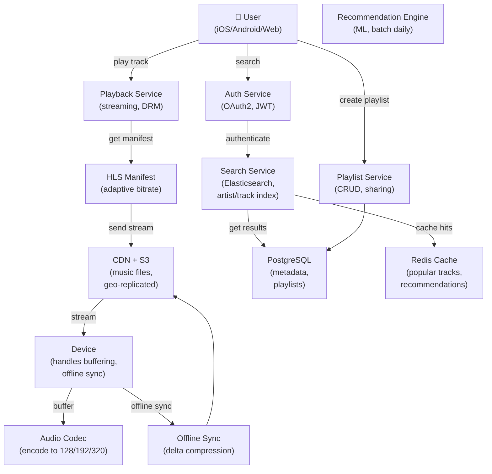

# Spotify

> **Interview Time:** 60 min | **Difficulty:** Medium  
> **Key Focus:** Music streaming, playlists, recommendations, adaptive bitrate, offline sync

---

## Step 1: Functional & Non-Functional Requirements

### Functional Requirements

- Users search for songs/artists and play music
- Stream music at variable bitrates (128kbps - 320kbps FLAC)
- Create and manage playlists (personal, collaborative)
- Shuffle and repeat modes
- Recommendations (discover weekly, radio stations)
- Offline mode: cache songs locally (up to 10,000 songs)
- Social features: share playlists, see what friends listening to
- Skip/forward controls with limits (3 skips per 30 minutes)
- Progress tracking (pause, resume, seek within track)
- Device mode: play on phone, switch to speaker, sync

### Non-Functional Requirements

| Requirement | Target | Notes |
|:-----------|:-------|:------|
| **Latency** | <1 sec to start playback | Buffering key metric |
| **Availability** | 99.9% streaming uptime | Music service critical |
| **Audio quality** | Scaled by bitrate (128-320kbps) | User preference + network speed |
| **Throughput** | 100M concurrent streams | Global scale |
| **Offline cache** | Up to 10K tracks/device | ~50GB storage max |
| **Recommendation accuracy** | Personalization improves over time | A/B tested |

---

## Step 2: API Design, Data Model & High-Level Design

### Core API Endpoints

```http
GET /search?q={query}&type=track|artist|playlist
  → {tracks: [{id, title, artist, duration}], artists: [...]}

POST /playback/play
  {track_id, device_id, position_ms: 0}
  → {playback_id, stream_url: "hls://...", bitrate}

POST /playback/pause
  {playback_id}
  → {success: true, position_ms}

POST /playback/seek
  {playback_id, position_ms: 120000}
  → {position_ms: 120000}

POST /playlists
  {name, public: true/false}
  → {playlist_id, created_at}

POST /playlists/{playlist_id}/tracks
  {track_ids: [id1, id2, id3]}
  → {added_count: 3}

GET /recommendations/{playlist_id}
  → {tracks: [{id, title, reason: "Based on your top tracks"}]}

GET /offline/sync
  {device_id}
  → {tracks_to_sync: [id1, id2, ...], total_size_mb}
```

### Entity Data Model

```
USERS
├─ user_id (PK)
├─ username, email (UNIQUE)
├─ subscription_type (free, premium)
├─ monthly_data_limit_gb (free: 3GB, premium: unlimited)
├─ created_at

TRACKS
├─ track_id (PK, ULID)
├─ title, artist_id (FK)
├─ duration_ms
├─ genres (array)
├─ streams_count (popularity)
├─ file_location (S3: "s3://tracks/track_123")
├─ bitrates_available [128, 192, 256, 320]
├─ created_at

ARTISTS
├─ artist_id (PK)
├─ name, bio
├─ followers_count
├─ top_tracks (array of track_ids)
├─ created_at

PLAYLISTS
├─ playlist_id (PK)
├─ user_id (FK, creator)
├─ title, description
├─ is_public (true/false)
├─ tracks (array of track_ids, ordered)
├─ collaborators (array of user_ids)
├─ created_at, modified_at

PLAYBACK_SESSIONS
├─ session_id (PK, ULID)
├─ user_id (FK)
├─ device_id (FK)
├─ track_id (FK)
├─ started_at, last_heartbeat_at
├─ position_ms (current position)
├─ bitrate_kbps (negotiated)
├─ status (PLAYING, PAUSED, STOPPED)
├─ skips_count (in last 30 min)

OFFLINE_CACHE (per device)
├─ device_id (FK)
├─ user_id (FK)
├─ track_id (FK)
├─ file_size_mb
├─ cached_at, last_played_at
├─ PRIMARY KEY (device_id, track_id)

RECOMMENDATIONS (precomputed)
├─ user_id (FK)
├─ track_id (FK)
├─ score (0-1, confidence)
├─ reason (e.g., "Similar to tracks you love")
├─ computed_at, expires_at
```

### High-Level Architecture



---

## Step 3: Concurrency, Consistency & Scalability

### 🔴 Problem: Skip Limit Enforcement (Concurrent Skips)

**Scenario:** User allowed 3 skips per 30 minutes. User skips 2 times in last 29 minutes. Next skip should be denied. But multiple skip requests in flight simultaneously.

**Solution: Distributed Rate Limiting with TTL Window**

```
Skip limit configuration:
  max_skips_per_window = 3
  window_duration = 1800 seconds (30 minutes)

User attempts to skip:
  PUT /playback/skip {user_id, device_id}

Redis atomic check:
  Key: "skips:{user_id}:{floor(timestamp / 1800)}"
  Example: "skips:user_123:7842" (timestamp=14088000)
  
  Atomic operation:
    1. Increment: INCR key  → new_count = 2
    2. Get expiration: TTL key
    3. If TTL = -1 (no expiry):
       → SET EX key, 1800 seconds
    
    Result: new_count = 2

Check allowed:
    if new_count <= 3:
      → SKIP ALLOWED
      → Play next song
    else:
      → SKIP DENIED
      → Response: "You've used all skips for 30 min"
      → Seconds until reset = 1800 - (timestamp % 1800)

Window mechanics:
  User skips at:  0:00, 0:30, 1:00 (3 skips used)
  
  Window 1 (0:00 - 30:00):
    Keys: skips:123:0 = 3
    Expires at 30:00
  
  At 29:50:
    User tries 4th skip in same window
    → Denied (already at 3)
  
  At 30:01:
    Key skips:123:0 has expired
    New window: skips:123:1
    → Skip allowed (window reset)
```

### 🟡 Problem: Adaptive Bitrate Streaming

**Scenario:** User on 4G (20Mbps). Network drops to 2G (500kbps). Player should switch to lower bitrate without interruption.

**Solution: HLS with Multiple Bitrate Variants**

```
HLS (HTTP Live Streaming) Manifest:

#EXTM3U
#EXT-X-VERSION:3
#EXT-X-TARGETDURATION:10

# Variant 1: Low bitrate (mobile, poor network)
#EXT-X-STREAM-INF:BANDWIDTH=128000,RESOLUTION=480x270
https://cdn.spotify.com/track_123_128.m3u8

# Variant 2: Medium bitrate
#EXT-X-STREAM-INF:BANDWIDTH=192000,RESOLUTION=720x480
https://cdn.spotify.com/track_123_192.m3u8

# Variant 3: High bitrate (premium, good network)
#EXT-X-STREAM-INF:BANDWIDTH=320000,RESOLUTION=1280x720
https://cdn.spotify.com/track_123_320.m3u8

Client-side switching (device/player):

1. Measure network speed:
   Download 1MB chunk, measure time
   speed = 1000KB / time_ms
   
2. Calculate max bitrate:
   safe_bitrate = speed * 0.8  (use 80% of available)
   
3. Pick variant:
   if safe_bitrate > 256kbps → download 320kbps variant
   else if safe_bitrate > 192kbps → download 256kbps
   else if safe_bitrate > 128kbps → download 192kbps
   else → download 128kbps

4. Download segmented:
   Each variant split into 10-second segments
   Player downloads next segments in background
   If network improves: switch up
   If network degrades: switch down
   
5. Buffer management:
   Min buffer: 3 segments (30 sec)
   Max buffer: 50 segments (500 sec, ~8 min)
   
   Too little buffer: Risk pause on network jitter
   Too much buffer: Wasted bandwidth, slow adaptation

Bitrate switching algorithm (smooth):
  current_speed = measure_latest_download_speed()
  current_buffer = get_buffered_duration_sec()
  
  if current_speed > previous_speed * 1.2 AND current_buffer > 30:
    → Upgrade bitrate (network improved, enough buffer)
  
  if current_speed < previous_speed * 0.8 OR current_buffer < 10:
    → Downgrade bitrate (network degraded, low buffer)
  
  else:
    → Stay same (slow transition)

Result:
  - Seamless playback across network conditions
  - Automatic quality adjustment
  - Minimal buffering (typically 3-5 segments)
```

### Solution: Offline Sync with Delta Compression

```
User wants to download 100 songs locally (offline mode):

Download request:
  POST /offline/sync
  {device_id, track_ids: [id1, id2, ..., id100]}

Server side:
  1. Check entitlements:
     - Free user: max 3 tracks offline
     - Premium: max 10,000 tracks
     - Storage limit: 50GB on device
  
  2. Check device has space:
     track_sizes = [id1: 5MB, id2: 4.5MB, ...]
     total = 450 MB
     if device_free_space < 450MB:
       → Return error: "Not enough storage"
  
  3. Calculate deltas:
     For each track, check if already on device
     if exists and unchanged:
       → Mark as "use local copy"
     else:
       → Mark as "download"
  
  4. Create sync manifest:
     {
       to_download: [{id, size_mb}, ...],
       to_use_local: [{id}, ...],
       total_size_mb: 280  ← Only new/changed files
     }
  
  5. Return streaming URLs + manifest:
     {
       urls: [
         {track_id: id1, url: "hls://cdn/id1_128.m3u8"},
         ...
       ],
       total_size_mb: 280
     }

Device-side sync:
  1. Download files in background (over WiFi if possible)
  2. Extract audio from HLS segments
  3. Decode to MP3/AAC and store locally
  4. Update local index
  5. Mark as "offline available"

Offline playback:
  User opens Spotify offline
  → Show only downloaded playlists
  → Play from local storage
  → No network needed
  
  When user comes online:
  → Sync to update:
    - Playlist changes (new songs added to playlist)
    - Track metadata (artist, title, artwork)
    - Remove deleted tracks
    - Sync play history
```

---

## Step 4: Persistence Layer, Caching & Monitoring

### Database Design

```sql
CREATE TABLE tracks (
  track_id VARCHAR(255) PRIMARY KEY,
  title VARCHAR(500),
  artist_id BIGINT REFERENCES artists(artist_id),
  duration_ms INT,
  genres TEXT[],
  streams_total BIGINT DEFAULT 0,
  file_location VARCHAR(512),  -- S3 path
  created_at TIMESTAMP DEFAULT NOW()
);

CREATE INDEX idx_tracks_title_artist 
  ON tracks(title, artist_id);
CREATE INDEX idx_tracks_streams_desc 
  ON tracks(streams_total DESC);

CREATE TABLE playlists (
  playlist_id BIGSERIAL PRIMARY KEY,
  user_id BIGINT NOT NULL REFERENCES users(user_id),
  title VARCHAR(255),
  description TEXT,
  is_public BOOLEAN DEFAULT FALSE,
  tracks_list TEXT[],  -- ordered array of track_ids
  total_duration_ms INT,
  follower_count INT DEFAULT 0,
  created_at TIMESTAMP DEFAULT NOW(),
  modified_at TIMESTAMP DEFAULT NOW()
);

CREATE INDEX idx_playlists_user_created 
  ON playlists(user_id, created_at DESC);

CREATE TABLE playback_sessions (
  session_id VARCHAR(255) PRIMARY KEY,
  user_id BIGINT NOT NULL REFERENCES users(user_id),
  device_id VARCHAR(255),
  track_id VARCHAR(255) REFERENCES tracks(track_id),
  started_at BIGINT,
  position_ms INT,
  bitrate_kbps INT,
  status VARCHAR(20),  -- PLAYING, PAUSED, STOPPED
  created_at TIMESTAMP DEFAULT NOW()
);

CREATE INDEX idx_sessions_user_active 
  ON playback_sessions(user_id, created_at DESC);

CREATE TABLE offline_cache (
  device_id VARCHAR(255) NOT NULL,
  user_id BIGINT NOT NULL,
  track_id VARCHAR(255) NOT NULL REFERENCES tracks(track_id),
  file_size_mb INT,
  cached_at TIMESTAMP DEFAULT NOW(),
  last_played_at TIMESTAMP,
  PRIMARY KEY (device_id, track_id)
);

CREATE INDEX idx_offline_user_tracks 
  ON offline_cache(user_id, cached_at DESC);
```

### Caching Strategy

**Tier 1: Redis**

```
1. Popular Tracks (trending, top 1000)
   Key: "tracks:top_1000"
   Value: [track_id_1, track_id_2, ...] with metadata
   TTL: 1 hour
   Purpose: Fast recommendations, popular tab

2. User Recommendations (personalized)
   Key: "recommendations:{user_id}"
   Value: [{track_id, score, reason}, ...]
   TTL: 24 hours (recomputed daily)
   Purpose: Discover weekly, radio stations

3. Playlist Detail Cache
   Key: "playlist:{playlist_id}:metadata"
   Value: {title, owner, track_count, duration}
   TTL: 6 hours
   Purpose: Avoid DB hit on playlist load

4. User Preferences
   Key: "user:{user_id}:preferences"
   Value: {bitrate_pref: 320, offline_enabled: true, ...}
   TTL: 30 days (rarely changes)
   Purpose: Instant access for streaming config

5. Skip Limit Window (as discussed above)
   Key: "skips:{user_id}:{window_id}"
   Value: count
   TTL: 1800 seconds (window duration)
   Purpose: Rate limiting
```

### Monitoring & Alerts

**Key Metrics:**

1. **Playback Quality**
   - Start latency (time to first byte, <1 sec target)
   - Buffer underruns (pauses due to buffering)
   - Bitrate distribution (% at each quality level)
   - Adaptive switch frequency (should be smooth)

2. **Streaming Performance**
   - Streaming errors (failed requests, retries)
   - Chunk completion time (P95 <2 sec per segment)
   - CDN hit rate (60%+ from CDN not origin)

3. **Offline Usage**
   - Cache hit rate (% of plays from offline)
   - Sync frequency (how often users refresh)
   - Storage utilization (avg GB per user)

4. **Recommendations Quality**
   - Skip rate (% of recommended songs skipped)
   - Save rate (% added to library)
   - Model accuracy (A/B test new vs old)

5. **System Health**
   - Playlist load latency (P95 <200ms)
   - Search latency (P95 <500ms)
   - Active concurrent streams (auto-scale triggers)

```yaml
- alert: StartLatencyHigh
  expr: start_latency_p95 > 3000
  annotations: "Start latency > 3s — CDN or auth bottleneck"

- alert: BufferUnderruns
  expr: buffer_underrun_rate > 0.001
  annotations: "0.1% of streams have pauses — manifest or bitrate issue"

- alert: RecommendationSkipRate
  expr: recommendation_skip_rate > 0.30
  annotations: "30% skip rate on recs — model needs retraining"

- alert: OfflineCacheCorruption
  expr: corrupted_local_files > 0
  annotations: "Corrupted offline cache — need re-sync"
```

---

## ⚡ Quick Reference Cheat Sheet

### Critical Design Decisions

1. **HLS streaming with ABR** — Adaptive bitrate based on network speed
2. **Skip limit per 30-min window** — Distributed rate limiting with Redis TTL
3. **Offline sync with delta compression** — Only download new/changed tracks
4. **Recommendations precomputed daily** — Batch ML training, cached for serving
5. **Segmented streaming (10-sec chunks)** — Enables quick bitrate switching
6. **Playlist immutable snapshots** — Track ordering version history for undo

### Audio Bitrate Targets

| Bitrate | Quality | Bandwidth | Device |
|:--------|:--------|:----------|:--------|
| **128 kbps** | Low | 500kbps required | 2G/poor WiFi |
| **192 kbps** | Good | 1.5Mbps | 3G/fair WiFi |
| **256 kbps** | Very Good | 2Mbps | LTE/good WiFi |
| **320 kbps** | Premium | 2.5Mbps+ | 5G/excellent WiFi |

### Tech Stack

```
Frontend: React/React Native (web, iOS, Android)
Backend: Microservices (Go/Scala)
Database: PostgreSQL (metadata), Cassandra (sessions)
Cache: Redis (rates, recommendations, user prefs)
Search: Elasticsearch (tracks, artists, playlists)
Streaming: HLS + DASH, Widevine DRM
CDN: CloudFront/Akamai (geo-distributed)
Offline: SQLite (local DB), FFmpeg (encoding)
Recommendations: Spark/TensorFlow (batch training)
```

---

## 🎯 Interview Summary (5 Minutes)

1. **Skip limit** → Redis TTL window, atomic increment, deny if > 3 per 30min
2. **Adaptive bitrate** → HLS manifest with 128/192/256/320kbps variants
3. **Network adaptation** → Client measures speed, switches bitrate every 10-30 sec
4. **Offline mode** → Download track locally, sync metadata, play without network
5. **Recommendations** → Daily batch training, cache in Redis, serve with reasons
6. **Buffering** → 3-50 segments (~30-500 sec), switch bitrate based on buffer
7. **DRM** → Widevine license for premium tracks, prevent offline piracy

---

## Glossary & Abbreviations

--8<-- "_abbreviations.md"

## ⚡ Quick Reference Cheat Sheet

[TODO: Fill this section]

---

## 🎯 Interview Summary (5 Minutes)

[TODO: Fill this section]

---

## Glossary & Abbreviations

--8<-- "_abbreviations.md"
