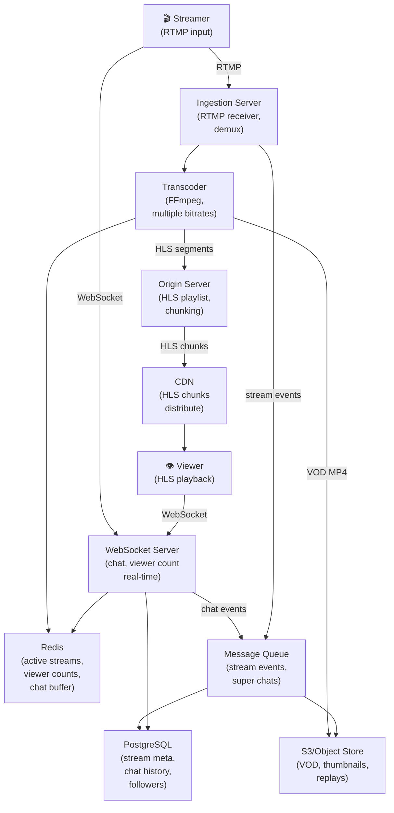

# Live Video Streaming Platform

> **Interview Time:** 60 min | **Difficulty:** Medium  
> **Key Focus:** Real-time streaming, viewer management, chat, adaptive bitrate

---

## Step 1: Functional & Non-Functional Requirements

### Functional Requirements

- Streamers can go live with video/audio (RTMP/HLS input)
- Viewers can watch live stream with real-time video (100ms+ latency acceptable)
- Chat messages in real-time (related to stream)
- Multiple quality options (adaptive bitrate: 360p, 720p, 1080p)
- Host can ban/mute viewers
- Viewers can follow streamers, get notifications on live
- Stream history/VOD (video on demand)
- Concurrent viewer count and analytics
- Super chat (paid messages with highlight)
- Stream thumbnails and metadata

### Non-Functional Requirements

| Requirement | Target | Notes |
|:-----------|:-------|:------|
| **Scale** | 1M concurrent viewers per stream | 100K+ streams simultaneously |
| **Latency** | <5s end-to-end video latency | HLS (10-30s) vs RTMP (2-3s) trade-off |
| **Availability** | 99.9% up-time | CDN failover required |
| **Consistency** | Eventual for viewer count | Strong for chat history |
| **Throughput** | 1M chat messages/sec | All viewers see messages in order |
| **Bandwidth** | Adaptive bitrate, save 40% | Mobile-friendly lower quality |

---

## Step 2: API Design, Data Model & High-Level Design

### Core API Endpoints

```http
# Streaming
POST /streams/start
  {streamer_id, title, category, description}
  → {stream_id, rtmp_url, rtmp_key}

PUT /streams/{stream_id}/end
  {streamer_id}
  → {status: "ended", duration: 3600}

GET /streams/{stream_id}/watch
  {viewer_id}
  → {hls_url, chat_url, viewer_count}

# Chat
POST /streams/{stream_id}/chat
  {user_id, message}
  → {message_id, timestamp}

GET /streams/{stream_id}/chat?limit=50
  → {messages: [{user_id, message, timestamp, is_moderator}]}

POST /streams/{stream_id}/chat/{message_id}/delete
  {moderator_id}
  → {deleted: true}

# Analytics
GET /streams/{stream_id}/stats
  → {viewer_count, peak_viewers, chat_count, duration}

GET /streamers/{streamer_id}/analytics
  → {total_views, total_streams, followers}

# Super Chat
POST /streams/{stream_id}/super-chat
  {viewer_id, message, amount}
  → {super_chat_id, highlighted: true}

# VOD
GET /streamers/{streamer_id}/vods
  → {vods: [{stream_id, title, views, duration}]}

GET /vods/{stream_id}/watch
  → {mp4_url}
```

### Entity Data Model

```
STREAMERS
├─ streamer_id (PK)
├─ username
├─ email
├─ verified (boolean)
├─ follower_count (denormalized)
├─ bio, avatar_url
├─ created_at

STREAMS
├─ stream_id (ULID, PK, sortable by time)
├─ streamer_id (FK)
├─ title, description
├─ category (gaming, music, sports, creative, etc.)
├─ status (live, ended)
├─ started_at, ended_at
├─ viewer_count (current, cached, peak in stream_stats)
├─ chat_count (denormalized)
├─ thumbnail_url
├─ hls_playlist_url (output stream URL)

STREAM_STATS
├─ stream_id (PK)
├─ peak_viewer_count
├─ total_unique_viewers
├─ total_chat_messages
├─ avg_viewer_duration
├─ bitrates_watched {360p: count, 720p: count, 1080p: count}
├─ created_at

CHAT_MESSAGES
├─ message_id (ULID, PK, sortable by time)
├─ stream_id (FK)
├─ user_id (FK)
├─ message (TEXT, max 500 chars)
├─ timestamp
├─ is_deleted
├─ is_super_chat (boolean)
├─ super_chat_amount (nullable, if is_super_chat)

STREAM_VIEWERS (active connections)
├─ viewer_id (user session, not PK)
├─ stream_id (FK)
├─ joined_at
├─ last_heartbeat
├─ quality_watching (360p, 720p, 1080p)
├─ is_muted (by streamer)

FOLLOWERS
├─ follower_id (user who follows)
├─ streamer_id (the streamer being followed)
├─ followed_at
├─ PRIMARY KEY (follower_id, streamer_id)

VOD (Video on Demand)
├─ vod_id (ULID, PK)
├─ stream_id (FK)
├─ streamer_id (FK)
├─ title, description
├─ duration
├─ mp4_url (stored in S3)
├─ thumbnail_url
├─ views (denormalized)
├─ created_at
```

### High-Level Architecture



---

## Step 3: Concurrency, Consistency & Scalability

### 🔴 Problem: Accurate Real-Time Viewer Count

**Scenario:** 1M viewers watch stream. Every viewer sends keep-alive heartbeat. Viewer count fluctuates wildly.

**Solution: Periodic Aggregation with Eventual Consistency**

```
Viewer Tracking (no centralized counter):

1. Viewer joins stream:
   HSET stream:{stream_id}:viewers 
   user_session_id {joined_at, bitrate, is_muted}
   
2. Every 30 seconds, viewer sends heartbeat:
   ZADD stream:{stream_id}:active_heartbeats 
   now user_session_id
   (Sorted set by timestamp → easy to find stale)

3. Aggregation job (runs every 10 seconds):
   FOR each active_stream:
     ZRANGE stream:{stream_id}:active_heartbeats 
       (now - 60_seconds) (now)
     HGETALL stream:{stream_id}:viewers
     → Union = current active viewers
     
     viewers_count = count
     
     HSET stream:{stream_id}:stats 
       viewer_count viewers_count, 
       peak_viewers max(prev_peak, viewers_count)

Result:
  - Viewer count accurate within 30 sec (acceptable for UI)
  - No single point of failure
  - Each viewer sends 1 heartbeat per 30s (low bandwidth)
  - Aggregation is read-only, scalable

Caching:
  cache:stream:{stream_id}:viewers = 1234567
  TTL: 10 sec
  (Refreshed by aggregation job)
```

### 🟡 Problem: Video Transcoding Bottleneck

**Scenario:** Streamer with 1M viewers broadcasts. Transcoding 1080p → 720p → 360p on single machine = 10 hour latency!

**Solution: Distributed Parallel Transcoding**

```
Transcoding Pipeline:

Input (RTMP @ 1080p 30fps 5 Mbps)
  ↓
[Transport] Split into segments (10 sec each)
  ↓
[Transcoder Cluster]
  ├─ Transcoder 1: 1080p chunk 1 → [1080p, 720p, 360p]
  ├─ Transcoder 2: 1080p chunk 2 → [1080p, 720p, 360p]
  ├─ Transcoder 3: 1080p chunk 3 → [1080p, 720p, 360p]
  └─ (N transcoders, each 1 chunk at a time)
  ↓
[Muxer] Re-order output chunks → Single quality stream
  ↓
HLS Playlist (chunks uploaded to origin every 10s)

Autoscaling:
  Queue size increases → add transcoders
  Latency increases > 5s → alert ops

Output for each bitrate:
  /hls/{stream_id}/360p/segment_001.ts
  /hls/{stream_id}/720p/segment_001.ts
  /hls/{stream_id}/1080p/segment_001.ts
  
  /hls/{stream_id}/360p/playlist.m3u8
  /hls/{stream_id}/720p/playlist.m3u8
  /hls/{stream_id}/1080p/playlist.m3u8
```

### 🔷 Problem: Chat Ordering & Consistency at Scale

**Scenario:** 1M chat messages/second. Messages arrive out of order to viewers. Some see message A then B, others see B then A!

**Solution: Sequence Numbers + WebSocket Ordering**

```
Chat Architecture:

Producers (1M viewers sending messages):
  POST /chat {stream_id, user_id, message}
  
[Chat Ingestion Service]
  1. Atomically increment counter:
     seq = INCR stream:{stream_id}:message_sequence
  
  2. Store message with sequence:
     ZADD stream:{stream_id}:chat_messages 
     seq {user_id, message, timestamp}
     (sorted set by sequence)
  
  3. Publish to WebSocket subscribers:
     PUBLISH stream:{stream_id}:chat 
     {seq, user_id, message}

Consumers (WebSocket subscribers):
  1. Connect to stream
     → Fetch last 50 messages from Redis (recent)
  
  2. Subscribe to /stream/{stream_id}/chat channel
  
  3. On new message:
     {seq, user_id, message}
     → Insert into DOM in sequence order (not arrival time)
     → Client maintains last_seq
  
  4. On reconnect:
     GET last_seq from client
     → Fetch missed messages:
        ZRANGE stream:{stream_id}:chat_messages 
        (last_seq + 1) (+inf)
     → Backfill client

Result:
  - Messages globally ordered by sequence
  - Exactly-once delivery (no duplicates)
  - Auto-recovery on client disconnect
  - Lag < 500ms (acceptable for chat)
```

### 💾 Problem: VOD Storage & Cold Start

**Scenario:** Stream ends, produce 500GB MP4 file. Upload to S3 takes 1 hour. Viewers can't access VOD immediately.

**Solution: Streaming VOD with HLS Fallback**

```
VOD Creation:

1. During Stream:
   HLS chunks are created every 10s in /tmp
   → Store both in CDN and S3

2. When Stream Ends:
   a) Re-mux HLS chunks into MP4 (fast, no re-encode)
      ffmpeg -i /hls/{stream_id}/720p/playlist.m3u8 \
              -c copy \
              output.mp4
      
      This takes 5-10 minutes (copies, not transcodes)
   
   b) Upload MP4 to S3 as stream completes
      (multipart upload, parallel parts)
   
   c) Immediately reuse HLS chunks as VOD fallback
      (available instantly, no MP4 needed)

3. VOD Playback:
   If MP4 ready (uploaded to S3):
     → Progressive MP4 download (single URL)
   Else:
     → HLS streaming (same chunks as live)

Result:
  - VOD available within 5 min (HLS)
  - MP4 available within 1-2 hours (re-mux+upload)
  - No re-transcoding, save 100× time
```

---

## Step 4: Persistence Layer, Caching & Monitoring

### Database Design

```sql
CREATE TABLE streamers (
  streamer_id BIGSERIAL PRIMARY KEY,
  username VARCHAR(100) UNIQUE NOT NULL,
  email VARCHAR(100) UNIQUE,
  verified BOOLEAN DEFAULT FALSE,
  follower_count INT DEFAULT 0,
  bio TEXT,
  avatar_url TEXT,
  created_at TIMESTAMP DEFAULT NOW()
);

CREATE TABLE streams (
  stream_id BIGSERIAL PRIMARY KEY,
  streamer_id BIGINT NOT NULL REFERENCES streamers(streamer_id),
  title VARCHAR(255),
  description TEXT,
  category VARCHAR(50),
  status VARCHAR(20),  -- live, ended
  started_at TIMESTAMP NOT NULL,
  ended_at TIMESTAMP,
  thumbnail_url TEXT,
  hls_playlist_url TEXT,
  peak_viewer_count INT DEFAULT 0,
  total_unique_viewers INT DEFAULT 0,
  chat_message_count INT DEFAULT 0,
  created_at TIMESTAMP DEFAULT NOW()
);

CREATE INDEX idx_streams_streamer_started 
  ON streams(streamer_id, started_at DESC);

CREATE INDEX idx_streams_status_created 
  ON streams(status, created_at DESC);

CREATE TABLE chat_messages (
  message_id BIGSERIAL PRIMARY KEY,
  stream_id BIGINT NOT NULL REFERENCES streams(stream_id),
  user_id BIGINT NOT NULL REFERENCES users(user_id),
  message TEXT,
  is_super_chat BOOLEAN DEFAULT FALSE,
  super_chat_amount DECIMAL(10,2),
  sequence_number INT NOT NULL,
  created_at TIMESTAMP DEFAULT NOW(),
  is_deleted BOOLEAN DEFAULT FALSE
);

CREATE INDEX idx_chat_messages_stream_seq 
  ON chat_messages(stream_id, sequence_number);

CREATE INDEX idx_chat_messages_stream_created 
  ON chat_messages(stream_id, created_at DESC);

CREATE TABLE stream_viewers (
  viewer_session_id VARCHAR(100) PRIMARY KEY,
  stream_id BIGINT NOT NULL REFERENCES streams(stream_id),
  user_id BIGINT NOT NULL REFERENCES users(user_id),
  quality VARCHAR(10),  -- 360p, 720p, 1080p
  is_muted BOOLEAN DEFAULT FALSE,
  joined_at TIMESTAMP DEFAULT NOW(),
  last_heartbeat TIMESTAMP DEFAULT NOW()
);

CREATE INDEX idx_stream_viewers_stream 
  ON stream_viewers(stream_id);

CREATE TABLE followers (
  follower_id BIGINT NOT NULL REFERENCES users(user_id),
  streamer_id BIGINT NOT NULL REFERENCES streamers(streamer_id),
  followed_at TIMESTAMP DEFAULT NOW(),
  PRIMARY KEY (follower_id, streamer_id)
);

CREATE INDEX idx_followers_streamer 
  ON followers(streamer_id);

CREATE TABLE vods (
  vod_id BIGSERIAL PRIMARY KEY,
  stream_id BIGINT NOT NULL REFERENCES streams(stream_id),
  streamer_id BIGINT NOT NULL REFERENCES streamers(streamer_id),
  title VARCHAR(255),
  description TEXT,
  duration INT,
  mp4_url TEXT,
  thumbnail_url TEXT,
  views INT DEFAULT 0,
  created_at TIMESTAMP DEFAULT NOW()
);

CREATE INDEX idx_vods_streamer_created 
  ON vods(streamer_id, created_at DESC);
```

### Caching Strategy

```
Redis Tier 1: Real-Time (TTL: 10-30 sec)

1. Active Streams (live streams)
   Key: "active_streams"
   Value: SET {stream_id_1, stream_id_2, ...}
   TTL: 30 sec
   Purpose: Quick index of all live streams
   Hit rate: 90% (same streams watched frequently)

2. Viewer Count (per stream)
   Key: "stream:{stream_id}:viewer_count"
   Value: 1234567 (integer)
   TTL: 10 sec
   Purpose: Display to all viewers
   Updated by: Aggregation job

3. Active Heartbeats (viewer sessions)
   Key: "stream:{stream_id}:active_heartbeats"
   Value: ZSET {viewer_session_1: timestamp, ...}
   TTL: 60 sec
   Purpose: Track active viewers for aggregation
   Updated by: Each heartbeat from viewer

4. Recent Chat Messages (last 50)
   Key: "stream:{stream_id}:chat_recent"
   Value: [{message_id, user_id, message, timestamp}]
   TTL: 5 minutes
   Purpose: New viewers backfill recent chat
   Hit rate: 100% (every viewer loads these)

5. Stream Metadata (title, thumbnail, etc.)
   Key: "stream:{stream_id}:meta"
   Value: {title, category, thumbnail_url}
   TTL: 1 hour
   Purpose: Avoid DB reads for every viewer
```

### Monitoring & Alerts

```yaml
- alert: StreamIngestLatencyHigh
  expr: ingest_to_hls_latency_p95 > 5000  # 5 seconds
  annotations: "RTMP to HLS latency > 5s — transcoder bottleneck"

- alert: TranscoderQueueDepth
  expr: transcoder_queue_size > 100
  annotations: "Transcoder queue > 100 segments — scaling needed"

- alert: ChatMessageLoss
  expr: chat_messages_dropped > 0
  annotations: "Chat messages lost — durability issue"

- alert: ViewerCountSpikeAnomaly
  expr: (now - 30m_ago) / 30m_ago > 2.0
  annotations: "Viewer count doubled in 30min — check for bot traffic"

- alert: VODAvailabilityExceeded
  expr: time_from_stream_end_to_vod_available > 600  # 10 min
  annotations: "VOD not available within 10min of stream end"

- alert: CDNOriginCacheHitRateLow
  expr: cdn_hit_rate < 0.8
  annotations: "CDN hit rate < 80% — cache efficiency issue"

- alert: WebSocketConnectionPoolExhausted
  expr: active_websocket_connections > max_connections * 0.9
  annotations: "WebSocket connection pool near capacity — scale needed"
```

**Key Metrics:**

- **Ingest to playback latency** — End-to-end delay (HLS: 10-30s, RTMP: 2-3s)
- **Video quality distribution** — % viewers watching each bitrate
- **Bitrate adaptation events** — How often quality changes (should be smooth)
- **Chat throughput** — Messages per second processed
- **Viewer retention** — % watch duration (avg session length)
- **Transcoder utilization** — CPU/GPU usage per stream
- **CDN hit rate** — Cache efficiency (target >80%)

---

## ⚡ Quick Reference Cheat Sheet

### Critical Design Decisions

1. **Distributed transcoding** — Parallel chunks across multiple transcoders
2. **Sequence-number ordered chat** — Globally consistent message ordering
3. **Eventual consistency for viewer count** — Aggregate every 10s, acceptable lag
4. **HLS for playback** — HTTP-based, CDN-friendly, automatic bitrate switching
5. **In-stream VOD** — Reuse HLS segments, no re-encode needed
6. **Heartbeat-based active tracking** — Every 30s, low overhead, accurate

### Tech Stack

```
Ingest: Nginx-RTMP (RTMP server)
Transcoding: FFmpeg (open-source) or AWS MediaLive
Origin: Wowza or custom Go origin server
CDN: Cloudflare / Akamai (HLS distribution)
Chat: Redis Pub/Sub + WebSocket
Storage: S3 (VOD, replays, thumbnails)
Database: PostgreSQL (metadata, chat history)
Monitoring: Prometheus + Grafana
```

### When to Use What

| Problem | Solution |
|:--------|:---------|
| Video latency too high | RTMP instead of HLS (lower latency) |
| Transcoding bottleneck | Parallel transcoding, more workers |
| Chat out of order | Sequence numbers on all messages |
| Viewer count inaccurate | Periodic aggregation, cache |
| VOD not available | Reuse HLS segments as fallback |

---

## 🎯 Interview Summary (5 Minutes)

1. **RTMP ingest** → Streamer uploads video stream to ingestion server
2. **Parallel transcoding** → Multiple transcoders encode chunks to multiple bitrates
3. **HLS output** → Chunked streaming, CDN-friendly, auto bitrate switching
4. **Sequence-number chat** → For ordering, each message gets atomic sequence number
5. **Eventual consistency viewer count** → Aggregate every 10s from heartbeats
6. **VOD reuse** → Convert HLS chunks to MP4, no re-transcoding needed
7. **Heartbeat tracking** → Viewers send ping every 30s, cleaned up after 60s inactivity

---

## Glossary & Abbreviations

--8<-- "_abbreviations.md"

## ⚡ Quick Reference Cheat Sheet

[TODO: Fill this section]

---

## 🎯 Interview Summary (5 Minutes)

[TODO: Fill this section]

---

## Glossary & Abbreviations

--8<-- "_abbreviations.md"
