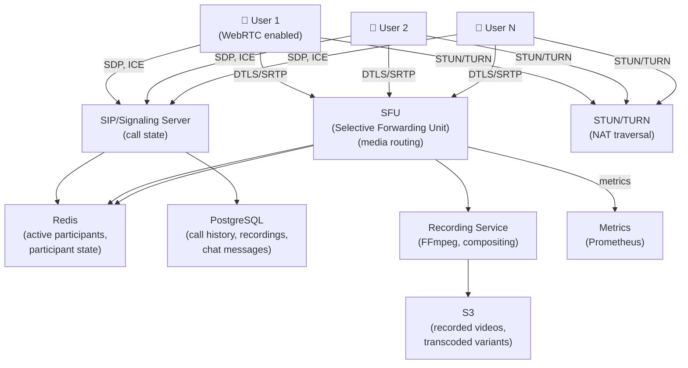

# Design a Video Conferencing System

> **Interview Time:** 60 min | **Difficulty:** Medium  
> **Key Focus:** Real-time audio/video synchronization, routing, group calls

---

## Step 1: Functional & Non-Functional Requirements

### Functional Requirements

- Users can start/schedule video calls (1-on-1, groups up to 1000 participants)
- Real-time audio/video transmission with <150ms latency
- Screen sharing (presenter screen visible to all)
- Chat/messaging during calls
- Recording of calls (automatic or manual)
- Meeting links with access control (public, invite-only)
- Virtual backgrounds and effects
- Mute/unmute, camera on/off
- Speaker view, gallery view, grid view
- Call history and stats
- Breakout rooms (split large meetings into smaller groups)

### Non-Functional Requirements

| Requirement | Target | Notes |
|:-----------|:-------|:------|
| **Scale** | 1M concurrent calls, 100B minutes/month | Peer-to-peer fallback |
| **Latency** | <150ms audio/video, <200ms screen share | Real-time requirement |
| **Availability** | 99.95% uptime | Global deployment |
| **Consistency** | Strong for call state, eventual for UI | Participant list can lag |
| **Audio Quality** | 16-48 kHz, adaptive bitrate | Fixed 20ms frames |
| **Video Resolution** | 480p-4K adaptive, 15-60fps | Simulcast multi-bitrate |

---

## Step 2: API Design, Data Model & High-Level Design

### Core API Endpoints

```http
# Call Management
POST /calls
  {initiator_id, participants: [user_ids], title, scheduled_time?}
  → {call_id, sfu_url, token}

GET /calls/{call_id}
  → {participants, status, started_at, recording_status}

PUT /calls/{call_id}/end
  {user_id}
  → {ended_at, duration, stats}

POST /calls/{call_id}/record
  {action: start|stop}
  → {recording_id}

# Participant Management
POST /calls/{call_id}/participants/{user_id}/mute
  {mute_audio: true, mute_video: true}
  → {success: true}

POST /calls/{call_id}/participants/{user_id}/remove
  {moderator_id}
  → {removed: true}

POST /calls/{call_id}/breakout-rooms
  {room_count, participants_per_room}
  → {rooms: [{room_id, participants}]}

# Signaling
POST /calls/{call_id}/sdp-offer
  {user_id, sdp, video_codecs}
  → {sdp_answer, ice_candidates}

POST /calls/{call_id}/ice-candidate
  {user_id, ice_candidate}
  → {queued: true}

# Chat
POST /calls/{call_id}/messages
  {user_id, message}
  → {message_id}

GET /calls/{call_id}/messages
  → {messages: [{user_id, message, timestamp}]}
```

### Entity Data Model

```
USERS
├─ user_id (PK)
├─ email, username
├─ created_at

CALLS
├─ call_id (ULID, PK)
├─ initiator_id (FK)
├─ title, description
├─ scheduled_time (nullable)
├─ started_at, ended_at
├─ status (scheduled, active, ended, cancelled)
├─ call_type (1-to-1, group)
├─ max_participants
├─ access_control (public, invite-only, password)
├─ sfu_region (us-west, eu, asia-pac)
├─ created_at

CALL_PARTICIPANTS
├─ participant_id (PK)
├─ call_id (FK)
├─ user_id (FK)
├─ joined_at, left_at
├─ is_audio_enabled
├─ is_video_enabled
├─ is_screen_sharing
├─ bitrate_sent (kbps)
├─ packet_loss (%)
├─ is_moderator

CALL_RECORDINGS
├─ recording_id (ULID, PK)
├─ call_id (FK)
├─ initiated_by (FK)
├─ started_at, ended_at
├─ file_url (S3 location)
├─ duration
├─ file_size
├─ status (recording, processing, completed, failed)
├─ created_at

CALL_CHAT_MESSAGES
├─ message_id (ULID, PK)
├─ call_id (FK)
├─ user_id (FK)
├─ message (TEXT, max 2000 chars)
├─ timestamp

BREAKOUT_ROOMS
├─ room_id (ULID, PK)
├─ call_id (FK)
├─ room_number (1, 2, 3, ...)
├─ participants [user_ids] (array)
├─ created_at
├─ closed_at

MEETINGS (scheduled, recurring meetings)
├─ meeting_id (ULID, PK)
├─ organizer_id (FK)
├─ title, description
├─ recurring_rule (once, daily, weekly, monthly)
├─ start_time, end_time
├─ timezone
├─ invitee_emails
├─ created_at
```

### High-Level Architecture



---

## Step 3: Concurrency, Consistency & Scalability

### 🔴 Problem: Audio/Video Synchronization Drift

**Scenario:** User A speaks, User B sees A's lips moving 500ms late. Conversation feels unnatural.

**Solution: RTP Timestamp-Based Synchronization**

```
Real-time Transport Protocol (RTP):

Each audio/video packet contains:
├─ Sequence number (incremental for packet order)
├─ RTP timestamp (clock-based, not wall time)
├─ SSRC (Synchronization Source = user session)
└─ Payload type (audio codec, video codec)

Example stream:
  Audio: 48kHz clock = 48000 ticks per second
  Video: 90kHz clock = 90000 ticks per second
  
  Audio packet N: timestamp = 1000000
  Audio packet N+1: timestamp = 1000960 (20ms of audio)
  
  Video frame M: timestamp = 2000000
  Video frame M+1: timestamp = 2001800 (20ms of video at 90kHz)

Synchronization at Receiver:

Receiver's buffer (SFU):
  Audio buffer: [ts: 1000000, data], [ts: 1000960, data], ...
  Video buffer: [ts: 2000000, data], [ts: 2001800, data], ...

Compare RTP timestamps to sync:
  For audio ts=1000960:
    Find video ts closest to 1000960 (in same timebase)
    → Video frame at ts=2001800 ≈ aligned
  
  Play both at same wall-clock time → synchronized!

Jitter Buffer:

Network delays vary (50ms-200ms). Use adaptive jitter buffer:

  Incoming packets:
  [ts: 100, delay: 50ms], [ts: 120, delay: 70ms], [ts: 140, delay: 45ms]
  
  Jitter buffer size = conservative estimate of max delay
  Play when available:
  ts=100 ready at wall time + 70ms → play
  ts=120 ready at wall time + 70ms → play
  ts=140 ready at wall time + 70ms → play
```

### 🟡 Problem: Controlling Audio Feedback & Echo

**Scenario:** When User A talks, their own audio echoes back from User B's speaker. Annoying feedback loop.

**Solution: Echo Cancellation (AEC)**

```
Echo Cancellation Algorithm:

Microphone input (User A): [voice + background noise + echo]
Speaker output (to User A): [other participants' audio]

Goal: Remove speaker output echo from microphone input

Adaptive filter:
  Estimated echo = Filter * speaker_output
  Residual = microphone_input - estimated_echo
  
  Filter adapts to match actual acoustic path
  (room size, furniture, distance from speaker, etc.)

OS-Level AEC:
  WebRTC engine includes AECM (Acoustic Echo Cancellation for Mobile)
  Runs on client → no server-side audio processing needed
  Cancels >90% of echo

Region Selection (minimize echo):
  - Each region has local SFU (reduced RTT)
  - Connect users to geographically nearest SFU
  - Lower RTT → less echo artifact
```

### 🔷 Problem: Network Congestion & Quality Adaptation

**Scenario:** User connects on slow 2G network (500 kbps). Video streams at 5Mbps. Freeze buffering.

**Solution: Simulcast + Client-Side Adaptive Bitrate**

```
Simulcast (Multiple Bitrates):

Sender encodes video at multiple bitrates simultaneously:
  ├─ 360p @ 500kbps (low quality, mobile)
  ├─ 720p @ 1.5Mbps (medium quality, wifi)
  └─ 1080p @ 4Mbps (high quality, desktop)
  
SFU receives all 3 streams, selects best for each receiver:
  Receiver 1 (2G, 500kbps): SFU forwards 360p stream
  Receiver 2 (4G, 2Mbps): SFU forwards 720p stream
  Receiver 3 (Fiber, 10Mbps): SFU forwards 1080p stream

Bandwidth Estimation (REMB):

Receivers continuously estimate available bandwidth:
  REMB (Receiver Estimated Maximum Bitrate):
    Based on: packet loss, RTT, jitter
    
  Receiver detects:
    - 5% packet loss → available bandwidth = 80% of current
    - 0% packet loss for 2 seconds → increase 10%
  
  Send REMB feedback to sender → SFU adapts layer selection

Network Quality Monitoring:

  Key metrics:
    send_bitrate = bytes_sent / time
    target_bitrate = calculated from REMB
    packet_loss = lost_packets / total_packets
    rtt = measured ping
    jitter = variance in RTT
  
  Decision tree:
    IF packet_loss > 5% AND rtt > 150ms:
      → Switch to lower resolution
    ELSE IF packet_loss < 2% AND rtt < 100ms:
      → Try higher resolution
```

---

## Step 4: Persistence Layer, Caching & Monitoring

### Database Design

```sql
CREATE TABLE users (
  user_id BIGSERIAL PRIMARY KEY,
  email VARCHAR(100) UNIQUE NOT NULL,
  username VARCHAR(50),
  created_at TIMESTAMP DEFAULT NOW()
);

CREATE TABLE calls (
  call_id BIGSERIAL PRIMARY KEY,
  initiator_id BIGINT NOT NULL REFERENCES users(user_id),
  title VARCHAR(255),
  description TEXT,
  status VARCHAR(20),  -- scheduled, active, ended, cancelled
  scheduled_time TIMESTAMP,
  started_at TIMESTAMP,
  ended_at TIMESTAMP,
  sfu_region VARCHAR(50),  -- us-west, eu, asia-pac
  call_type VARCHAR(20),  -- 1-to-1, group
  max_participants INT,
  access_control VARCHAR(20),  -- public, invite-only
  created_at TIMESTAMP DEFAULT NOW()
);

CREATE INDEX idx_calls_initiator_created 
  ON calls(initiator_id, created_at DESC);

CREATE INDEX idx_calls_status_started 
  ON calls(status, started_at DESC);

CREATE TABLE call_participants (
  participant_id BIGSERIAL PRIMARY KEY,
  call_id BIGINT NOT NULL REFERENCES calls(call_id),
  user_id BIGINT NOT NULL REFERENCES users(user_id),
  joined_at TIMESTAMP DEFAULT NOW(),
  left_at TIMESTAMP,
  is_audio_enabled BOOLEAN DEFAULT TRUE,
  is_video_enabled BOOLEAN DEFAULT TRUE,
  is_screen_sharing BOOLEAN DEFAULT FALSE,
  is_moderator BOOLEAN DEFAULT FALSE,
  bitrate_sent INT,  -- kbps
  packet_loss DECIMAL(5,2)  -- percentage
);

CREATE INDEX idx_call_participants_call 
  ON call_participants(call_id);

CREATE INDEX idx_call_participants_user 
  ON call_participants(user_id);

CREATE TABLE call_recordings (
  recording_id BIGSERIAL PRIMARY KEY,
  call_id BIGINT NOT NULL REFERENCES calls(call_id),
  initiated_by BIGINT REFERENCES users(user_id),
  started_at TIMESTAMP DEFAULT NOW(),
  ended_at TIMESTAMP,
  file_url TEXT,
  duration INT,  -- seconds
  file_size BIGINT,  -- bytes
  status VARCHAR(50),  -- recording, processing, completed, failed
  created_at TIMESTAMP DEFAULT NOW()
);

CREATE INDEX idx_call_recordings_call 
  ON call_recordings(call_id);

CREATE TABLE call_chat_messages (
  message_id BIGSERIAL PRIMARY KEY,
  call_id BIGINT NOT NULL REFERENCES calls(call_id),
  user_id BIGINT NOT NULL REFERENCES users(user_id),
  message TEXT,
  created_at TIMESTAMP DEFAULT NOW()
);

CREATE INDEX idx_call_chat_messages_call_created 
  ON call_chat_messages(call_id, created_at);

CREATE TABLE breakout_rooms (
  room_id BIGSERIAL PRIMARY KEY,
  call_id BIGINT NOT NULL REFERENCES calls(call_id),
  room_number INT,
  participants BIGINT[],  -- array of user_ids
  created_at TIMESTAMP DEFAULT NOW(),
  closed_at TIMESTAMP
);

CREATE INDEX idx_breakout_rooms_call 
  ON breakout_rooms(call_id);

CREATE TABLE meetings (
  meeting_id BIGSERIAL PRIMARY KEY,
  organizer_id BIGINT NOT NULL REFERENCES users(user_id),
  title VARCHAR(255),
  description TEXT,
  recurring_rule VARCHAR(50),  -- once, daily, weekly, monthly
  start_time TIMESTAMP NOT NULL,
  end_time TIMESTAMP NOT NULL,
  timezone VARCHAR(50),
  invitee_emails TEXT[],
  created_at TIMESTAMP DEFAULT NOW()
);

CREATE INDEX idx_meetings_organizer_start 
  ON meetings(organizer_id, start_time DESC);
```

### Caching Strategy

```
Redis Tier 1: Active Call State (TTL: call duration)

1. Active Call Metadata
   Key: "call:{call_id}"
   Value: {status, initiator, sfu_url, participants: [ids]}
   TTL: expires when call ends
   Purpose: Instant participant list, call state

2. Participant State (per call)
   Key: "call:{call_id}:participants"
   Value: HASH {user_id: {audio, video, screen_share}}
   TTL: 5 minutes (refreshed by heartbeat)
   Purpose: Track mute/video state for UI

3. SFU Assignment
   Key: "user:{user_id}:sfu"
   Value: {sfu_ip, sfu_port, token, region}
   TTL: call duration
   Purpose: Route user to correct SFU instance

4. Active Recordings
   Key: "calls:recording:{call_id}"
   Value: {status, started_at, segments_recorded}
   TTL: call duration + 1 hour
   Purpose: Track recording progress
```

### Monitoring & Alerts

```yaml
- alert: AudioJitterHigh
  expr: audio_jitter_ms_p95 > 100
  annotations: "Audio jitter > 100ms — network issues"

- alert: VideoLatencyHigh
  expr: video_end_to_end_latency_p95 > 200
  annotations: "Video latency > 200ms — quality degradation"

- alert: PacketLossHigh
  expr: packet_loss_percent > 5
  annotations: "Packet loss > 5% — try lower bitrate"

- alert: EchoDetected
  expr: audio_echo_suppression_triggered_count > 0
  annotations: "Echo cancellation active — check speaker/mic placement"

- alert: SFUCapacityExceeded
  expr: sfu_participant_count > max_capacity * 0.9
  annotations: "SFU near capacity — spin up additional instance"

- alert: RecordingFailed
  expr: recording_failed_count > 0
  annotations: "Call recording failed — check disk space and permissions"

- alert: TURNServerLatency
  expr: turn_server_latency_p95 > 500
  annotations: "TURN server latency > 500ms — check network"
```

**Key Metrics:**

- **Audio/video latency** — End-to-end delay (p50, p95, p99)
- **Jitter** — Variance in packet arrival times
- **Packet loss rate** — % of packets lost in transmission
- **MOS score** — Mean Opinion Score (perceptual quality, 1-5)
- **SFU CPU/memory usage** — Resource utilization
- **Call setup time** — Time to first audio/video frame
- **Participant drop rate** — % calls where participant drops

---

## ⚡ Quick Reference Cheat Sheet

### Critical Design Decisions

1. **RTP timestamps** — Audio/video sync via clock-based timestamps, not wall time
2. **Adaptive jitter buffer** — Accommodates network delay variance
3. **Echo cancellation (AEC)** — Client-side processing, not server
4. **Simulcast multi-bitrate** — Encode 3 bitrates, SFU selects best per receiver
5. **REMB feedback** — Receivers estimate bandwidth, inform sender
6. **Regional SFU deployment** — Minimize RTT, reduce echo
7. **Recording via FFmpeg** — Compose video/audio streams, mux to MP4

### Tech Stack

```
Signaling: Node.js/Go (SIP or custom protocol)
Media: WebRTC (standardized real-time)
SFU: mediasoup or janus (open-source)
TURN: coturn (NAT traversal)
Recording: FFmpeg (video composition)
Database: PostgreSQL (call history)
Cache: Redis (active state)
Storage: S3 (recordings)
```

### When to Use What

| Problem | Solution |
|:--------|:---------|
| Audio/video sync drift | RTP timestamps + jitter buffer |
| Echo feedback | Client-side AEC (WebRTC built-in) |
| Network congestion | Simulcast + REMB adaptive bitrate |
| NAT traversal | STUN/TURN servers |
| Recording quality | Composite all streams with FFmpeg |

---

## 🎯 Interview Summary (5 Minutes)

1. **RTP timestamps** → Clock-based, not wall time, for A/V sync
2. **Jitter buffer** → Adaptive, handles network delay variance
3. **Echo cancellation** → Client-side with AEC algorithm
4. **Simulcast encoding** → Encode 3 bitrates simultaneously
5. **REMB feedback** → Receivers estimate bandwidth, adapt quality
6. **Regional SFUs** → Deploy near users, minimize latency + echo
7. **Recording** → Composite video/audio with FFmpeg, store to S3

---

## Glossary & Abbreviations

--8<-- "_abbreviations.md"
