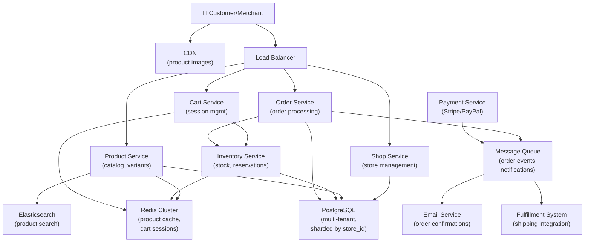

# Design a Shopify-like E-Commerce Platform

> **Interview Time:** 60 min | **Difficulty:** Medium  
> **Key Focus:** Multi-tenant stores, order management, inventory sync, payment processing

---

## Step 1: Functional & Non-Functional Requirements

### Functional Requirements

- Merchants create and manage their own stores (multi-tenant)
- Customers browse products, search by category/name
- Add products to cart, manage wish lists
- Checkout with multiple payment methods (credit card, PayPal, etc.)
- Order management (creation, tracking, fulfillment, returns)
- Inventory management (real-time stock updates, low-stock alerts)
- Product variants (size, color, price variations)
- Order email notifications (order confirmed, shipped, delivered)
- Merchant dashboard (sales report, inventory, order tracking)
- Reviews and ratings on products

### Non-Functional Requirements

| Requirement | Target | Notes |
|:-----------|:-------|:------|
| **Scale** | 1M+ shops, 1B+ products, 100K orders/min | Multi-tenant architecture |
| **Latency** | Product load <100ms, checkout <500ms | Customer-facing critical |
| **Availability** | 99.95% uptime | SLA required for merchants |
| **Consistency** | Strong for inventory, eventual for reviews | Inventory must be accurate |
| **Throughput** | 100K concurrent shoppers per second | Peak traffic during sales |
| **Payment** | Process 10K payments/sec, PCI compliance | Third-party payment gateways |

---

## Step 2: API Design, Data Model & High-Level Design

### Core API Endpoints

```http
# Product Management
GET /stores/{store_id}/products?page=1&limit=20
  → {products: [{product_id, name, price, variants, stock}]}

POST /stores/{store_id}/products
  {name, description, price, category, variants, stock}
  → {product_id}

POST /stores/{store_id}/products/{product_id}/inventory
  {variant_id, quantity}
  → {stock_updated: true}

# Shopping
POST /carts/{user_id}/items
  {product_id, variant_id, quantity}
  → {cart_id, item_count}

GET /carts/{user_id}
  → {items: [{product_id, quantity, price}], total}

POST /orders
  {user_id, store_id, items, shipping_address, payment_method}
  → {order_id, status}

GET /orders/{order_id}
  → {status, items, shipping_info, tracking}

# Reviews
POST /products/{product_id}/reviews
  {user_id, rating, comment}
  → {review_id}

GET /products/{product_id}/reviews?sort=recent|helpful
  → {reviews: [{rating, comment, author}]}
```

### Entity Data Model

```
TENANTS (Shops/Stores)
├─ store_id (PK)
├─ owner_id (FK -> users)
├─ store_name (indexed, searchable)
├─ description
├─ logo_url
├─ settings (currency, tax_rate, shipping_zones)
├─ created_at

PRODUCTS
├─ product_id (ULID, PK, sortable)
├─ store_id (FK, partition key)
├─ name, description
├─ price (DECIMAL)
├─ category_id
├─ avg_rating (denormalized)
├─ review_count (denormalized)
├─ created_at, updated_at

PRODUCT_VARIANTS
├─ variant_id (PK)
├─ product_id (FK)
├─ attributes (size, color, etc. as JSON)
├─ variant_price (if different from product)
├─ sku (unique per product)
├─ stock (int, current quantity)
├─ reserved_stock (int, in pending orders)
├─ updated_at

ORDERS
├─ order_id (ULID, PK, sortable)
├─ store_id (FK, partition key)
├─ user_id (FK)
├─ status (pending, paid, shipped, delivered, cancelled)
├─ total_price (DECIMAL)
├─ tax_amount, shipping_cost
├─ payment_status (pending, completed, failed)
├─ created_at, shipped_at, delivered_at

ORDER_ITEMS
├─ order_item_id (PK)
├─ order_id (FK)
├─ product_id (FK)
├─ variant_id (FK)
├─ quantity, unit_price
├─ status (pending, fulfilled, cancelled)

CARTS
├─ user_id + store_id (composite PK)
├─ items [{ variant_id, quantity, price }] (JSON)
├─ total, tax, shipping
├─ expires_at (auto-delete after 30 days)

REVIEWS
├─ review_id (PK)
├─ product_id (FK)
├─ user_id (FK)
├─ rating (1-5)
├─ title, comment
├─ helpful_count, unhelpful_count
├─ created_at

INVENTORY_HISTORY
├─ history_id (PK)
├─ variant_id (FK)
├─ from_quantity, to_quantity
├─ reason (sale, return, adjustment)
├─ order_id (FK, nullable)
├─ created_at
```

### High-Level Architecture



---

## Step 3: Concurrency, Consistency & Scalability

### 🔴 Problem: Inventory Race Condition

**Scenario:** Product has 1 stock. Two users checkout simultaneously, both see stock=1. Double-sale!

**Solution: Pessimistic Locking with Reservation**

```
Order Flow (atomic inventory reduction):

1. User adds item to cart → No inventory deduction
   (Just update Redis cart session)

2. User clicks "Checkout"
   POST /orders {items: [{variant_id, quantity}]}

3. [ATOMIC TRANSACTION]
   SELECT stock FROM product_variants 
   WHERE variant_id = 123 
   FOR UPDATE;  -- Lock this row
   
   IF stock < quantity_requested:
       ROLLBACK, return error (out of stock)
   ELSE:
       UPDATE product_variants 
       SET stock = stock - quantity_requested
       WHERE variant_id = 123;
       
       INSERT INTO orders (...)
       INSERT INTO order_items (...)
       
       COMMIT;

Result: 
  - Only 1 of 2 checkout requests succeeds
  - Stock is 100% accurate
  - Consistent across all instances

Caching:
  cache:product:{variant_id}:stock = 50
  → On checkout, UPDATE DB and invalidate cache immediately
  → Next request refetches fresh stock from DB
```

### 🟡 Problem: Inventory Consistency Across Reads

**Scenario:** Merchant dashboard shows 100 remaining units. Customer sees product available. But 50 units are in pending orders that haven't been paid yet.

**Solution: Track Reserved Stock Separately**

```sql
-- Inventory Accounting:

product_variants:
├─ stock: 100  (physically in warehouse)
├─ reserved_stock: 50  (allocated to pending orders)
└─ available: 50  (stock - reserved)

-- When user creates order but payment pending:
UPDATE product_variants 
SET reserved_stock = reserved_stock + quantity
WHERE variant_id = 123;

-- When payment confirmed:
UPDATE product_variants 
SET stock = stock - quantity,
    reserved_stock = reserved_stock - quantity
WHERE variant_id = 123;

-- When payment fails:
UPDATE product_variants 
SET reserved_stock = reserved_stock - quantity
WHERE variant_id = 123;
-- (No change to stock, just unreserve)

-- Query for available inventory:
SELECT (stock - reserved_stock) as available
FROM product_variants
WHERE variant_id = 123;
```

### 🔷 Problem: Multi-Tenant Data Isolation

**Scenario:** Store A's products appear in Store B's catalog due to isolation bug.

**Solution: Partition Database by store_id**

```
PostgreSQL Sharding:
├─ Shop 1 (store_id = 1000-1999)
│   ├─ DB Shard 1 (contains stores with IDs mod 3 = 0)
│        Products, Orders, Inventory
│   └─ Replica 1
│
├─ Shop 2 (store_id = 2000-2999)
│   ├─ DB Shard 2 (contains stores with IDs mod 3 = 1)
│   └─ Replica 2
│
└─ Shop N...

Routing Logic (in application layer):
  shard_id = hash(store_id) % 3
  connection_string = SHARD_CONFIGS[shard_id]
  
Every query includes store_id filter:
  SELECT * FROM products 
  WHERE store_id = 1234 AND ...
  
Index to prevent full-table scans:
  CREATE INDEX idx_products_store_id 
  ON products(store_id) 
```

### 🟡 Problem: Cart Abandonment & Inventory Locking

**Scenario:** User adds 50 units to cart, leaves page. Stock blocked forever.

**Solution: Time-Bounded Reservations**

```
Cart Lifecycle:

1. Add to cart → Create/update Redis session
   Key: "cart:{user_id}:{store_id}"
   TTL: 30 days (persistent)
   
2. Start checkout → Reserve inventory
   Reserve for 15 minutes (timeout)
   Set: "reservation:{order_id}" 
   TTL: 15 min
   
3. Payment captured within 15 min:
   Finalize purchase, reduce stock

4. Payment fails or timeout:
   Background job runs every 1 min:
   FOR each expired reservation:
      UNRESERVE inventory
      SEND email: "Your cart will be cleared in X days"
```

---

## Step 4: Persistence Layer, Caching & Monitoring

### Database Design

```sql
CREATE TABLE stores (
  store_id BIGSERIAL PRIMARY KEY,
  owner_id BIGINT NOT NULL REFERENCES users(user_id),
  store_name VARCHAR(255) NOT NULL,
  slug VARCHAR(255) UNIQUE,
  logo_url TEXT,
  created_at TIMESTAMP DEFAULT NOW()
);

CREATE TABLE products (
  product_id BIGSERIAL PRIMARY KEY,
  store_id BIGINT NOT NULL REFERENCES stores(store_id),
  name VARCHAR(255) NOT NULL,
  description TEXT,
  category_id INT,
  price DECIMAL(10,2) NOT NULL,
  avg_rating DECIMAL(3,2),
  review_count INT DEFAULT 0,
  created_at TIMESTAMP DEFAULT NOW(),
  updated_at TIMESTAMP DEFAULT NOW()
);

CREATE INDEX idx_products_store_category 
  ON products(store_id, category_id);

CREATE INDEX idx_products_store_created 
  ON products(store_id, created_at DESC);

CREATE TABLE product_variants (
  variant_id BIGSERIAL PRIMARY KEY,
  product_id BIGINT NOT NULL REFERENCES products(product_id),
  sku VARCHAR(100) UNIQUE,
  attributes JSONB,  -- {color: red, size: M}
  variant_price DECIMAL(10,2),
  stock INT NOT NULL,
  reserved_stock INT DEFAULT 0,
  updated_at TIMESTAMP DEFAULT NOW()
);

CREATE INDEX idx_variants_product 
  ON product_variants(product_id);

CREATE INDEX idx_variants_sku_store 
  ON product_variants(sku);

CREATE TABLE orders (
  order_id BIGSERIAL PRIMARY KEY,
  store_id BIGINT NOT NULL REFERENCES stores(store_id),
  user_id BIGINT NOT NULL REFERENCES users(user_id),
  status VARCHAR(50),  -- pending, paid, shipped, delivered
  total_price DECIMAL(10,2),
  tax_amount DECIMAL(10,2),
  shipping_cost DECIMAL(10,2),
  shipping_address JSONB,
  payment_status VARCHAR(50),  -- pending, completed, failed
  payment_method VARCHAR(50),  -- card, paypal
  payment_transaction_id VARCHAR(255) UNIQUE,
  created_at TIMESTAMP DEFAULT NOW(),
  shipped_at TIMESTAMP,
  delivered_at TIMESTAMP
);

CREATE INDEX idx_orders_store_created 
  ON orders(store_id, created_at DESC);

CREATE INDEX idx_orders_user_created 
  ON orders(user_id, created_at DESC);

CREATE INDEX idx_orders_status 
  ON orders(status);

CREATE TABLE order_items (
  order_item_id BIGSERIAL PRIMARY KEY,
  order_id BIGINT NOT NULL REFERENCES orders(order_id),
  variant_id BIGINT NOT NULL REFERENCES product_variants(variant_id),
  quantity INT NOT NULL,
  unit_price DECIMAL(10,2),
  status VARCHAR(50)
);

CREATE INDEX idx_order_items_order 
  ON order_items(order_id);

CREATE TABLE carts (
  cart_id BIGSERIAL PRIMARY KEY,
  user_id BIGINT NOT NULL,
  store_id BIGINT NOT NULL REFERENCES stores(store_id),
  items JSONB,  -- [{variant_id, quantity, price}]
  total DECIMAL(10,2),
  created_at TIMESTAMP DEFAULT NOW(),
  updated_at TIMESTAMP DEFAULT NOW(),
  UNIQUE(user_id, store_id)
);

CREATE TABLE reviews (
  review_id BIGSERIAL PRIMARY KEY,
  product_id BIGINT NOT NULL REFERENCES products(product_id),
  user_id BIGINT NOT NULL REFERENCES users(user_id),
  rating INT CHECK (rating >= 1 AND rating <= 5),
  title VARCHAR(255),
  comment TEXT,
  helpful_count INT DEFAULT 0,
  created_at TIMESTAMP DEFAULT NOW()
);

CREATE INDEX idx_reviews_product_rating 
  ON reviews(product_id, rating DESC);

CREATE INDEX idx_reviews_user 
  ON reviews(user_id);
```

### Caching Strategy

```
Redis Tier 1: Hot Data (TTL: 5-15 min)

1. Product Cache (catalog)
   Key: "product:{product_id}"
   Value: {name, price, avg_rating, stock, variants}
   TTL: 15 min
   Hit rate: 80% (customers view same products)

2. Variant Stock Cache
   Key: "stock:{variant_id}"
   Value: {stock: 50, reserved: 10, available: 40}
   TTL: 5 min
   Purpose: Avoid DB hits for every stock check
   Strategy: Invalidate immediately after checkout

3. Cart Session
   Key: "cart:{user_id}:{store_id}"
   Value: {items: [{variant_id, quantity}], total}
   TTL: 30 days
   Purpose: Shopping cart persistence across sessions

4. Recent Orders (user dashboard)
   Key: "orders:{user_id}"
   Value: [order_id_1, order_id_2, ...] (latest 5)
   TTL: 1 hour
   Purpose: Fast order history retrieval

5. Store Hot Products (trending)
   Key: "store:{store_id}:trending"
   Value: [product_id_1, product_id_2, ...]
   TTL: 1 hour
   Purpose: Dashboard display
```

### Monitoring & Alerts

```yaml
- alert: CheckoutLatencyHigh
  expr: checkout_api_latency_p95 > 1000
  annotations: "Checkout latency > 1 second — check payment gateway"

- alert: InventoryMismatch
  expr: cache_stock_value != db_stock_value
  annotations: "Stock cache out of sync with DB"

- alert: OrderPaymentFailureRate
  expr: (failed_payments / total_payments) > 0.05
  annotations: "Payment failure rate > 5% — check payment provider"

- alert: MultiTenantDataLeakage
  expr: cross_store_query_detected
  annotations: "Query returned data from multiple stores — isolation breach!"

- alert: CartAbandonmentRate
  expr: (carts_created - successful_orders) / carts_created > 0.85
  annotations: "85%+ cart abandonment — check UX or payment friction"

- alert: InventoryReservationStuck
  expr: expired_reservations_count > 1000
  annotations: "Many expired reservations — cleanup job failing"
```

**Key Metrics:**

- **Checkout conversion rate** — (completed orders / carts created)
- **Product load latency p95** — Cache hit rate on product catalog
- **Payment success rate** — Failed transactions per hour
- **Inventory accuracy** — (reserved + sold ≈ order count)
- **Order fulfillment time** — (shipped - created) in hours
- **Review submission rate** — Engagement metric

---

## ⚡ Quick Reference Cheat Sheet

### Critical Design Decisions

1. **Pessimistic locking** — `SELECT FOR UPDATE` on checkout ensures inventory consistency
2. **Reserved stock tracking** — Separate field for pending orders vs. actual sales
3. **Store-based sharding** — Partition DB by store_id for multi-tenant isolation
4. **15-min reservation timeout** — Prevents inventory blocking from abandoned carts
5. **Cache invalidation on stock change** — Immediate, not scheduled expiry
6. **Separate payment gateway** — Use Stripe/PayPal APIs, never store credit cards

### Tech Stack

```
Frontend: React (product browsing, cart)
Backend: Go/Python (high-throughput order processing)
Database: PostgreSQL (sharded by store_id)
Cache: Redis (product catalog, cart, stock)
Search: Elasticsearch (product search)
Payment: Stripe/PayPal APIs
Email: SendGrid (order notifications)
Fulfillment: ShipStation API (shipping integration)
```

### When to Use What

| Problem | Solution |
|:--------|:---------|
| Inventory race conditions | Pessimistic locking + atomic transaction |
| Multi-tenant isolation | Database sharding by store_id |
| Slow product queries | Redis cache (TTL 15 min) |
| Abandoned carts | Time-bounded reservations (15 min) |
| Out-of-stock confusion | available = stock - reserved_stock |

---

## 🎯 Interview Summary (5 Minutes)

1. **Pessimistic locking** → `SELECT FOR UPDATE` on inventory table during checkout
2. **Reserved stock** → Track separately for pending orders vs. actual sales
3. **Multi-tenant sharding** → Partition database by `store_id` to prevent data leaks
4. **15-minute reservations** → Prevent inventory from being blocked by abandoned carts
5. **Stock cache invalidation** → Immediate on sale, not TTL-based (accuracy critical)
6. **Payment gateway integration** → Use dedicated providers (Stripe), never store cards
7. **Order event queue** → Async notifications, fulfillment, email without blocking checkout

---

## Glossary & Abbreviations

--8<-- "_abbreviations.md"
