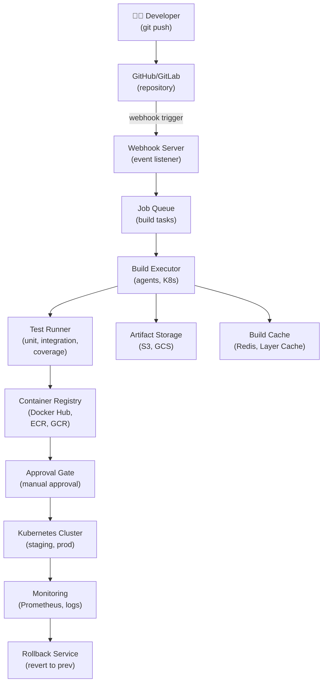

# Design a CI/CD Deployment Pipeline

> **Interview Time:** 60 min | **Difficulty:** Medium  
> **Key Focus:** Build automation, testing, deployment orchestration, rollback

---

## Step 1: Functional & Non-Functional Requirements

### Functional Requirements

- Developer pushes code to git repo (GitHub/GitLab)
- Automatic build trigger (compile, unit tests, linting)
- Run integration tests and code coverage checks
- Build Docker images, push to container registry
- Deploy to staging environment, run smoke tests
- Deploy to production with canary/blue-green strategy
- Monitor metrics, auto-rollback on errors
- Support feature flags for gradual rollout
- Store build artifacts, logs, and deployment history
- Notify team on build / deployment status
- Support manual approvals before prod deployment

### Non-Functional Requirements

| Requirement | Target | Notes |
|:-----------|:-------|:------|
| **Scale** | 1000s builds/day across teams | Parallel job execution |
| **Latency** | Build time <10 min, deploy <5 min | Critical for velocity |
| **Availability** | 99.9% pipeline uptime | No lost commits |
| **Consistency** | Immutable builds, reproducible | Same code = same artifact |
| **Scalability** | 100 parallel job agents | Auto-scale based on queue |
| **Rollback Time** | <2 minutes to revert to prev version | Emergency requirement |

---

## Step 2: API Design, Data Model & High-Level Design

### Core API Endpoints

```http
# Builds
POST /builds
  {repo_url, branch, commit_sha, trigger_type: push|manual}
  → {build_id, status: queued}

GET /builds/{build_id}
  → {status, logs_url, artifact_urls, test_results}

GET /builds/{build_id}/logs?lines=100
  → {logs: [{timestamp, level, message}]}

# Deployments
POST /deployments
  {build_id, target_env: staging|production, strategy: canary|blue-green}
  → {deployment_id, status: in_progress}

GET /deployments/{deployment_id}
  → {status, current_version, target_version, progress: 0-100}

PUT /deployments/{deployment_id}/approve
  {approver_id}
  → {approved: true, proceed_to_prod: true}

PUT /deployments/{deployment_id}/rollback
  {reason}
  → {rolled_back_to_version}

# Artifacts
GET /artifacts/{build_id}
  → {docker_image_uri, build_artifacts: [url, checksum]}

# Feature Flags
POST /feature-flags
  {name, rollout_percentage: 0-100, target_users: []}
  → {flag_id}

GET /feature-flags/{flag_id}/status
  → {enabled: true, rollout_percentage, active_users}
```

### Entity Data Model

```
REPOSITORIES
├─ repo_id (PK)
├─ repo_url, branch (default main)
├─ webhook_secret
├─ created_at

BUILDS
├─ build_id (ULID, PK, sortable)
├─ repo_id (FK)
├─ commit_sha (short SHA, indexed)
├─ commit_message
├─ author (committer info)
├─ status (queued, building, passed, failed, cancelled)
├─ trigger_type (push, manual, scheduled)
├─ started_at, ended_at
├─ duration (seconds)
├─ log_url (cloud storage path)
├─ docker_image_uri
├─ test_coverage (%)
├─ errors (array of error messages)
├─ created_at

BUILD_STAGES
├─ stage_id (PK)
├─ build_id (FK)
├─ stage_name (compile, unit_test, lint, integration_test, docker_build)
├─ status (queued, running, passed, failed)
├─ started_at, ended_at
├─ duration (seconds)

DEPLOYMENTS
├─ deployment_id (ULID, PK)
├─ build_id (FK)
├─ initiator_id (FK -> users)
├─ source_version, target_version
├─ target_environment (staging, production)
├─ strategy (canary, blue-green, rolling)
├─ status (in_progress, completed, failed, rolled_back)
├─ canary_percentage (% traffic for canary)
├─ approval_status (pending, approved, rejected)
├─ approver_id (FK, nullable)
├─ approved_at
├─ started_at, ended_at
├─ created_at

DEPLOYMENT_HEALTH
├─ health_id (PK)
├─ deployment_id (FK)
├─ metric_name (error_rate, latency_p99, pod_restart_count)
├─ baseline_value (previous version)
├─ current_value
├─ threshold_alert
├─ checked_at

FEATURE_FLAGS
├─ flag_id (ULID, PK)
├─ name (unique)
├─ enabled (boolean)
├─ rollout_percentage (0-100)
├─ target_users [user_ids] (array, for whitelist)
├─ created_at, updated_at

ARTIFACTS
├─ artifact_id (PK)
├─ build_id (FK)
├─ artifact_type (docker_image, jar, zip, etc.)
├─ uri (S3/registry path)
├─ file_size
├─ checksum (SHA256)
├─ created_at
```

### High-Level Architecture



---

## Step 3: Concurrency, Consistency & Scalability

### 🔴 Problem: Preventing Concurrent Deployments to Same Service

**Scenario:** Two teams deploy different features to same service simultaneously. Second deployment overwrites first halfway through. Data corruption!

**Solution: Distributed Lock on Service**

```
Deployment Lock Mechanism:

1. Request lock before deployment:
   LOCK deployment:service_name 
   owner=deployment_id_123
   TTL=10_minutes
   
   IF already_locked:
     → WAIT in queue, poll every 30 seconds
     → Timeout after 30 min, notify ops
   ELSE:
     → Acquire lock, proceed with deployment

2. During deployment:
   Check lock still owned by us:
   GET lock:owner == our_deployment_id
   
   IF lock lost:
     → ABORT deployment (another deployment took over)
   ELSE:
     → Proceed with new version rollout

3. After deployment completes:
   DELETE lock (release for next team)

Lock Implementation (using Redis):
  SET lock:service:name 
  deployment_id_123 
  NX  -- only if not exists
  EX 600  -- expire after 10 min
  → Returns OK if lock acquired
  → Returns null if already locked
```

### 🟡 Problem: Blue-Green Deployment with Zero Downtime

**Scenario:** Production running v123. Deploy v124. If v124 has bugs, customer sees errors. Can't rollback instantly.

**Solution: Blue-Green Deployment Strategy**

```
Blue-Green Strategy:

Setup:
  BLUE environment:   [Pod1-v123, Pod2-v123, Pod3-v123] (current, live traffic)
  GREEN environment:  [Pod1-v124, Pod2-v124, Pod3-v124] (staging, warmup)
  Load Balancer:      Routes 100% traffic → BLUE

Deployment Steps:

1. Deploy to GREEN (no traffic)
   kubectl deploy service:v124 → GREEN cluster
   
   Verify GREEN health:
   - Run smoke tests
   - Check app startup
   - Verify database migrations (if needed)
   
   Result: GREEN ready, BLUE still serving all traffic

2. Health check GREEN:
   GET /health → 200 OK
   GET /metrics → latency < 100ms
   
   If health check fails:
     → Keep BLUE running, abort swap
     → Notify team

3. Instant traffic switch (atomic):
   Load Balancer switch:
     BLUE: 100% → 0%
     GREEN: 0% → 100%
     (single rule update, milliseconds)
   
   Result: Users routed to GREEN instantly

4. Monitor new version (5 min):
   Track error_rate, latency, throughputs
   
   IF error_rate > 1%:
     → Switch back to BLUE (rollback in <30 sec)
   ELSE:
     → Keep GREEN, declare success

Rollback (instant):
  If v124 has bugs:
    Load Balancer switch:
      GREEN: 100% → 0%
      BLUE: 0% → 100%
    
    Rollback time: <30 seconds
    Data loss: Zero (BLUE still has data)
```

### 🔷 Problem: Canary Rollout with Progressive Traffic Shift

**Scenario:** Deploy v124 to 1% of users. If errors spike, auto-rollback. Else shift to 10%, 50%, 100%.

**Solution: Traffic-Based Canary**

```
Canary Progression:

Phase 1: 1% traffic (5 min)
  Canary pods: [Pod1-v124] (1 replica)
  Stable pods:  [Pod1-v123, Pod2-v123, Pod3-v123] (99% traffic)
  
  LB distributes:
    - 99 requests → v123 (stable)
    - 1 request → v124 (canary)

Metrics collected:
  canary_error_rate = errors_v124 / requests_v124
  stable_error_rate = errors_v123 / requests_v123
  baseline_p99_latency = current_p99

Phase 2: Decision at 5 min mark
  IF canary_error_rate > stable_error_rate * 2:
    → ABORT (rollback to v123)
    → Alert: "Canary failed, error spike detected"
  ELSE IF canary_error_rate ≤ baseline_error_rate:
    → PROCEED to Phase 2 (10% traffic)

Phase 2: 10% traffic (5 min)
  Canary pods: [Pod1-v124, Pod2-v124]
  (same checks as Phase 1)

Phase 3: 50% traffic (10 min)
  
Phase 4: 100% traffic (complete)

Auto-Rollback Triggers:
  - Error rate > 2× baseline
  - P99 latency > baseline + 50%
  - Pod restart rate > normal
  - Memory usage > 80% threshold
```

---

## Step 4: Persistence Layer, Caching & Monitoring

### Database Design

```sql
CREATE TABLE repositories (
  repo_id BIGSERIAL PRIMARY KEY,
  repo_url VARCHAR(255) UNIQUE,
  branch VARCHAR(100) DEFAULT 'main',
  created_at TIMESTAMP DEFAULT NOW()
);

CREATE TABLE builds (
  build_id BIGSERIAL PRIMARY KEY,
  repo_id BIGINT NOT NULL REFERENCES repositories(repo_id),
  commit_sha VARCHAR(40),
  commit_message TEXT,
  author VARCHAR(100),
  status VARCHAR(50),
  trigger_type VARCHAR(50),
  started_at TIMESTAMP,
  ended_at TIMESTAMP,
  docker_image_uri TEXT,
  test_coverage DECIMAL(5,2),
  created_at TIMESTAMP DEFAULT NOW()
);

CREATE INDEX idx_builds_repo_status 
  ON builds(repo_id, status);
CREATE INDEX idx_builds_commit_sha 
  ON builds(commit_sha);

CREATE TABLE deployments (
  deployment_id BIGSERIAL PRIMARY KEY,
  build_id BIGINT NOT NULL REFERENCES builds(build_id),
  initiator_id BIGINT,
  source_version VARCHAR(50),
  target_version VARCHAR(50),
  target_environment VARCHAR(50),
  strategy VARCHAR(50),
  status VARCHAR(50),
  approval_status VARCHAR(50),
  started_at TIMESTAMP,
  ended_at TIMESTAMP,
  created_at TIMESTAMP DEFAULT NOW()
);

CREATE INDEX idx_deployments_status_created 
  ON deployments(status, created_at DESC);

CREATE TABLE feature_flags (
  flag_id BIGSERIAL PRIMARY KEY,
  name VARCHAR(100) UNIQUE,
  enabled BOOLEAN DEFAULT FALSE,
  rollout_percentage INT,
  target_users BIGINT[],
  created_at TIMESTAMP DEFAULT NOW(),
  updated_at TIMESTAMP DEFAULT NOW()
);
```

### Caching & Monitoring

```
Redis Caching:
  1. Build cache (layer cache for Docker builds)
     Key: "build:cache:{repo_id}:{branch}"
     Value: compressed layer data
     TTL: 7 days
  
  2. Feature flag status
     Key: "feature_flag:{flag_name}"
     Value: {enabled, rollout_percentage}
     TTL: 1 minute
  
  3. Deployment locks
     Key: "deploy:lock:{service_name}"
     Value: {deployment_id, started_at}
     TTL: 10 minutes (auto-release)

Monitoring Alerts:
- Build time increasing (>15 min average)
- Test failure rate spike
- Deployment rollback rate > 1%
- Container registry push latency > 30s
- Canary error rate > 2× baseline
```

---

## ⚡ Quick Reference Cheat Sheet

### Tech Stack

```
CI/CD Platform: Jenkins, GitLab CI, GitHub Actions
Job Executor: Kubernetes, container-based runners
Container Registry: Docker Hub, ECR, GCR, Harbor
Artifact Storage: S3, GCS, Artifactory
Orchestration: Kubernetes (Helm for configs)
Monitoring: Prometheus, DataDog
```

### Critical Decisions

1. **Master lock on deployment** — Only one version rolling at a time
2. **Blue-green deployment** — Instant rollback (< 30 sec)
3. **Canary with auto-abort** — 1% → 10% → 50% → 100%
4. **Immutable artifacts** — Same code = same docker image
5. **Feature flags** — Separate feature rollout from code deployment

---

## 🎯 Interview Summary (5 Minutes)

1. **Distributed lock** — Prevents concurrent deployments via Redis NX
2. **Blue-green strategy** — Two environments, instant switch (<30s), zero downtime
3. **Canary rollout** — Progressive traffic 1% → 100%, auto-abort on errors
4. **Immutable builds** — Same commit SHA = reproducible artifact
5. **Automated tests** — Unit, integration, smoke tests catch regressions early
6. **Feature flags** — Decouple deployment from rollout
7. **Monitoring gates** — Auto-rollback on error rate / latency spike

---

## Glossary & Abbreviations

--8<-- "_abbreviations.md"
