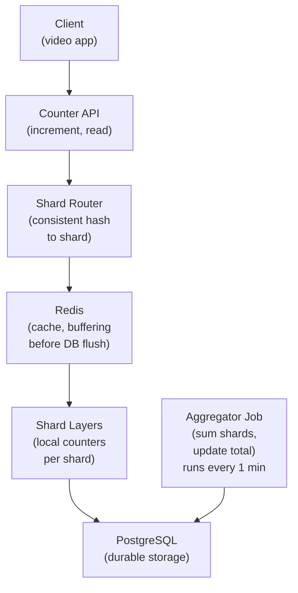

# Design a Distributed Counter System

> **Interview Time:** 60 min | **Difficulty:** Medium  
> **Key Focus:** Atomic operations, eventual consistency, zero data loss

---

## Step 1: Functional & Non-Functional Requirements

### Functional Requirements

- Increment counter (e.g., page views, event count, likes)
- Decrement counter (where applicable)
- Read current value
- Get counter statistics (min, max, increments/sec)
- Support counters for millions of entities (videos, posts, products)
- Persistent storage (no loss on restart)
- Idempotent operations (duplicate requests = single increment)
- Partitioned counters (sharded by key for parallelism)

### Non-Functional Requirements

| Requirement | Target | Notes |
|:-----------|:-------|:------|
| **Scale** | 1M increments/sec | Distributed counters |
| **Latency** | Increment <10ms, read <5ms | Very fast operations |
| **Availability** | 99.99% uptime | No data loss |
| **Consistency** | Strong eventually | Reads lag <1 second |
| **Durability** | Zero loss (persist to DB) | Critical for correctness |
| **Idempotency** | Handle duplicate requests | Network retries safe |

---

## Step 2: API Design, Data Model & High-Level Design

### Core API Endpoints

```http
# Counter Operations
POST /counters/{counter_key}/increment
  {amount: 1, request_id: uuid}  // request_id for idempotency
  → {counter_value, success: true}

POST /counters/{counter_key}/decrement
  {amount: 1, request_id: uuid}
  → {counter_value, success: true}

GET /counters/{counter_key}
  → {counter_value, updated_at, sharded_count: N}

GET /counters/{counter_key}/stats
  → {total, increments_per_sec, lastUpdated}

# Batch Operations
POST /counters/batch-increment
  {increments: [{counter_key, amount}, ...]}
  → {results: [{counter_key, new_value}]}
```

### Entity Data Model

```
COUNTERS (main table)
├─ counter_key (VARCHAR, PK, e.g., "video:123:views")
├─ total_count (BIGINT, sum of all shards)
├─ shard_count (INT, number of shards for this counter)
├─ updated_at (TIMESTAMP)
├─ created_at (TIMESTAMP)

COUNTER_SHARDS (one shard per partition)
├─ shard_key (VARCHAR + shard_id, PK, e.g., "video:123:views#1")
├─ counter_key (FK)
├─ shard_id (INT, 0 to N-1)
├─ shard_value (BIGINT, value for this shard)
├─ updated_at (TIMESTAMP)

IDEMPOTENT_REQUESTS (prevent duplicates)
├─ request_id (VARCHAR, PK, UUID)
├─ counter_key (FK)
├─ operation (increment, decrement)
├─ amount (INT)
├─ applied_at (TIMESTAMP)
├─ expires_at (TIMESTAMP + 24 hours)
```

### High-Level Architecture



---

## Step 3: Concurrency, Consistency & Scalability

### 🔴 Problem: Counter Contention Under Load

**Scenario:** 1M requests/sec all incrementing counter for same video. Single counter row becomes bottleneck. DB locks, latency explodes!

**Solution: Sharded Counters (Partitioning)**

```
Sharded Counter Architecture:

1. Split into N shards (reduce contention):
   counter_key = "video:123:views"
   shard_count = 10  -- 10 shards
   
   Physical shards stored:
   ├─ video:123:views#0 = 50000
   ├─ video:123:views#1 = 49500
   ├─ video:123:views#2 = 51000
   ├─ ...
   └─ video:123:views#9 = 48500
   
   Total = 50000 + 49500 + 51000 + ... = 500M views

2. Route increment to shard:
   request_hash = hash(request_id) % shard_count
   → Route to shard_0, shard_5, shard_3, ... (distributed)
   
   Each shard gets ~1M / 10 = 100K req/sec (manageable)

3. Increment atomically:
   shard_id = hash(request_id) % shard_count
   
   UPDATE counter_shards 
   SET shard_value = shard_value + 1
   WHERE shard_key = '{counter_key}#{shard_id}'
   
   Result:
   - 10 different rows being updated
   - Lock contention reduced 10×
   - Latency: ~5ms (vs 100ms with single row)

4. Read total (aggregation):
   SELECT SUM(shard_value) 
   FROM counter_shards 
   WHERE counter_key = 'video:123:views'
   
   Adds latency: 10ms for SELECT + SUM
   → Cache this, update every 1 minute
```

### 🟡 Problem: Duplicate Requests (Network Retries)

**Scenario:** Client increments counter, gets timeout. Retries. Counter incremented twice!

**Solution: Idempotent Operations via Request ID**

```
Idempotent Increment:

1. Client sends:
   POST /counters/video:123/increment
   {
     amount: 1,
     request_id: "550e8400-e29b-41d4-a716-446655440000"  -- UUID, unique per request
   }

2. Server deduplicates:
   -- Check if request already processed
   existing = SELECT * FROM idempotent_requests 
             WHERE request_id = '550e8400...'
   
   IF existing:
     RETURN {counter_value: existing.counter_value, duplicate: true}
   ELSE:
     -- Process new request
     UPDATE counter_shards SET shard_value += 1 WHERE ...
     
     -- Mark as processed
     INSERT INTO idempotent_requests (
       request_id, counter_key, amount, applied_at
     ) VALUES ('550e8400...', 'video:123:views', 1, now())
     
     RETURN {counter_value: new_value, duplicate: false}

3. Cleanup (after 24 hours):
   Background job:
   DELETE FROM idempotent_requests 
   WHERE expires_at < now()  -- auto-expire after 1 day
   
   Result: Old request IDs recycled
```

### 🔷 Problem: Consistency Between Cache and Database

**Scenario:** Counter cached as 100 in Redis. DB has 100. User increments 10 times. Cache says 110, DB says 100. Lag!

**Solution: Write-Through Cache + Periodic Sync**

```
Cache + DB Sync:

1. Write-through (on increment):
   Increment flow:
   a) Write to DB (source of truth):
      UPDATE counter_shards 
      SET shard_value = shard_value + 1
   
   b) Update cache immediately:
      INCR cache:{counter_key}  -- Redis atomic increment
   
   Wait for both to succeed:
   IF both succeed:
     RETURN success
   ELSE:
     RETURN error (rollback both if possible)

2. Periodic sync (every 1 min):
   Aggregator job:
   
   FOR each active counter:
     db_total = SELECT SUM(shard_value) FROM counter_shards ...
     cache_total = GET cache:{counter_key}
     
     IF cache_total != db_total:
       divergence = abs(db_total - cache_total)
       
       IF divergence > 1000:  -- threshold
         ALERT "Cache drift > 1000"
       
       -- Resync: DB is source of truth
       SET cache:{counter_key} db_total

3. Read-through (on GET):
   total = GET cache:{counter_key}
   
   IF total == null (cache miss):
     total = SELECT SUM(...) FROM counter_shards
     SET cache:{counter_key} total EX 60  -- 1 minute TTL
   
   RETURN total

Consistency guarantee:
  - Strong: writes immediately visible (write-through)
  - Warm re-sync: every 1 min catches drift
  - Data loss: zero (DB is durable)
```

---

## Step 4: Persistence Layer, Caching & Monitoring

### Database Design

```sql
CREATE TABLE counters (
  counter_key VARCHAR(255) PRIMARY KEY,
  total_count BIGINT DEFAULT 0,
  shard_count INT DEFAULT 10,
  updated_at TIMESTAMP DEFAULT NOW(),
  created_at TIMESTAMP DEFAULT NOW()
);

CREATE TABLE counter_shards (
  shard_key VARCHAR(255) PRIMARY KEY,
  counter_key VARCHAR(255) NOT NULL,
  shard_id INT NOT NULL,
  shard_value BIGINT DEFAULT 0,
  updated_at TIMESTAMP DEFAULT NOW(),
  FOREIGN KEY (counter_key) REFERENCES counters(counter_key)
);

CREATE INDEX idx_counter_shards_counter_key 
  ON counter_shards(counter_key);

CREATE TABLE idempotent_requests (
  request_id VARCHAR(36) PRIMARY KEY,
  counter_key VARCHAR(255) NOT NULL,
  operation VARCHAR(50),
  amount INT,
  applied_at TIMESTAMP DEFAULT NOW(),
  expires_at TIMESTAMP  -- 24 hours from applied_at
);

CREATE INDEX idx_idempotent_expires 
  ON idempotent_requests(expires_at);
```

### Caching Strategy

```
Redis:

1. Counter Cache (write-through)
   Key: "counter:{counter_key}"
   Value: {total: 500000000, updated_at}
   TTL: 1 hour (sync from DB if missing)
   Purpose: Fast reads, no DB query
   Hit rate: 99%+ (same counters read repeatedly)

2. Shard Local Cache (hot path)
   Key: "shard:{shard_key}"
   Value: shard_value (int)
   TTL: 1 minute (resync from DB)
   Purpose: Avoid DB lock contention on hot shards
```

### Monitoring

```yaml
- alert: CounterCacheDrift
  expr: abs(cache_value - db_value) > 1000
  annotations: "Cache drifted >1000 from DB – sync issue"

- alert: ShardHotness
  expr: single_shard_qps > total_qps / shard_count * 10
  annotations: "One shard getting 10× traffic – hash function issue?"

- alert: IdempotentTableSize
  expr: idempotent_requests_rows > 100_000_000
  annotations: "Idempotent table bloated – cleanup job failing?"

- alert: CounterLag
  expr: counter_read_latency_p95 > 100
  annotations: "Counter read > 100ms – cache miss storm?"
```

**Key Metrics:**
- Increment latency (p50, p95, p99)
- Cache hit rate (should be >95%)
- Drift rate (cache vs DB divergence)
- Shard distribution (QPS across shards, should be balanced)

---

## ⚡ Quick Reference Cheat Sheet

### Critical Decisions

1. **Sharded counters** – 10-100 shards per counter, reduce lock contention
2. **Request ID deduplication** – Idempotent via UUID, cleanup after 24h
3. **Write-through cache** – Update DB + cache atomically
4. **Periodic sync** – Every 1 min, catch drift early
5. **Aggregation job** – Sum shards, update main counter table

### Tech Stack

```
Cache: Redis (atomic INCR, fast reads)
Database: PostgreSQL (durable, ACID)
Scheduler: Cron job (aggregation)
Monitoring: Prometheus (drift detection)
```

---

## 🎯 Interview Summary (5 Minutes)

1. **Sharded counters** → N shards per counter, hash request to shard
2. **Request deduplication** → UUID request_id, check + mark in table
3. **Write-through cache** → Update DB + Redis atomically
4. **Periodic aggregation** → Sum shards every 1 min, catch drift
5. **Idempotent cleanup** → Auto-expire request_ids after 24 hours
6. **Strong consistency** → Writes visible immediately (write-through)
7. **Zero data loss** → DB durable, cache is optimization only

---

## Glossary & Abbreviations

--8<-- "_abbreviations.md"
