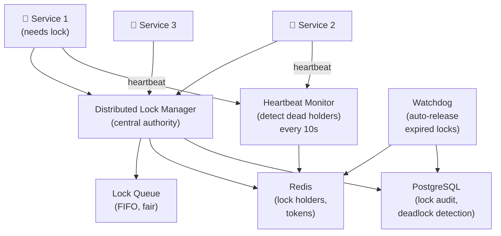

# Design a Distributed Locking System

> **Interview Time:** 60 min | **Difficulty:** Medium  
> **Key Focus:** Mutual exclusion, deadlock prevention, lock fairness

---

## Step 1: Functional & Non-Functional Requirements

### Functional Requirements

- Lock acquisition (exclusive, with timeout)
- Lock release (explicit and automatic on expiry)
- Deadlock detection and prevention
- Lock reentrance (same thread can re-acquire same lock)
- Shared locks (multiple readers, exclusive writers)
- Lock queue (fair FIFO ordering)
- Timeout on acquire with graceful failure
- Monitor lock holders (for debugging)
- Support for different lock types (mutex, semaphore, RWLock)

### Non-Functional Requirements

| Requirement | Target | Notes |
|:-----------|:-------|:------|
| **Scale** | 100K concurrent locks system-wide | Distributed, many services |
| **Latency** | Acquire <5ms, release <2ms | Must be fast |
| **Availability** | 99.99% lock availability | No false failures |
| **Fairness** | FIFO queue, no starvation | Fair allocation |
| **Safety** | No deadlock, no lost locks | Correctness critical |
| **Timeout** | Auto-release after expiry | Self-healing |

---

## Step 2: API Design, Data Model & High-Level Design

### Core API Endpoints

```http
# Mutex (Exclusive Lock)
POST /locks/{lock_key}/acquire
  {holder_id, timeout_ms: 5000, lease_duration: 30000}
  → {acquired: true/false, token, expires_at}

POST /locks/{lock_key}/release
  {token}
  → {released: true}

GET /locks/{lock_key}/status
  → {held_by: holder_id, since: timestamp, expires_in_ms}

# Reader-Writer Lock
POST /locks/{lock_key}/read-lock
  {reader_id}
  → {acquired: true, token}

POST /locks/{lock_key}/write-lock
  {writer_id}
  → {acquired: true/false}

# Semaphore (N permits)
POST /locks/{semaphore_key}/acquire
  {holder_id, permits: 2}  -- need 2 permits
  → {acquired: true, token, remaining_permits}

# Monitoring
GET /locks/active
  → {locks: [{lock_key, holder, since, type}]}
```

### Entity Data Model

```
LOCKS
├─ lock_key (VARCHAR, PK)
├─ lock_type (exclusive, shared, semaphore)
├─ holder_id (FK, nullable, who holds it)
├─ acquired_at (TIMESTAMP)
├─ expires_at (TIMESTAMP, auto-release)
├─ lease_duration (INT, ms)
├─ token (VARCHAR, unique per acquisition)
├─ reentrancy_count (INT, for same holder)

LOCK_QUEUE
├─ queue_id (PK)
├─ lock_key (FK)
├─ holder_id (FK)
├─ position (INT, queue order)
├─ requested_at (TIMESTAMP)
├─ lock_type (shared, exclusive)

READER_WRITER_LOCK
├─ lock_key (VARCHAR, PK)
├─ writer_id (nullable, current writer)
├─ reader_ids [array], reader_count (INT)
├─ write_queue [(holder_id, position)] (pending writers)

SEMAPHORE
├─ semaphore_key (VARCHAR, PK)
├─ total_permits (INT)
├─ available_permits (INT)
├─ current_holders {holder_id: permit_count}
```

### High-Level Architecture



---

## Step 3: Concurrency, Consistency & Scalability

### 🔴 Problem: Deadlock (Circular Lock Dependencies)

**Scenario:** Service A holds lock X, waits for Y. Service B holds Y, waits for X. Deadlock!

**Solution: Lock Ordering + Cycle Detection**

```
Deadlock Prevention:

1. Lock Ordering (strict global order):
   Define canonical lock order:
   resource_lock < database_lock < cache_lock
   
   Rule: Acquire in order, release in reverse
   
   Service A:
     ACQUIRE resource_lock
     ACQUIRE database_lock
     RELEASE database_lock
     RELEASE resource_lock
   
   Service B:
     ACQUIRE resource_lock  -- same order!
     ACQUIRE database_lock
     ...
   
   Result: No cycle possible

2. Cycle Detection (catch violations):
   On lock acquire request:
   
   -- Check wait-for graph
   current_holders = GET lock_holders(lock_key)
   
   FOR each holder:
     -- Recursively find what they're waiting for
     waiting_for = GET lock_queue(holder_id)
     
     IF waiting_for contains requesting_service:
       CYCLE DETECTED!
       RETURN error, don't grant lock
       ALERT ops: "Deadlock pattern detected"

3. Timeout (last resort)
   max_lock_hold_time = 30 seconds
   
   IF lock held > 30s:
     Force release
     ALERT: "Lock held too long, force released"
```

### 🟡 Problem: Lock Fairness (Starvation)

**Scenario:** Service keeps releasing/re-acquiring lock. Blocked service never gets it (barging).

**Solution: FIFO Queue + No Barging**

```
Fair Lock Queue:

1. Acquire attempt:
   Service A requests lock:
   
   IF lock is free:
     -- Check if anyone waiting
     IF queue is empty:
       GRANT immediately
     ELSE:
       -- Queue not empty, must wait (no barging)
       ENQUEUE A
   ELSE:
     -- Lock held, add to queue
     ENQUEUE A

2. Release triggers next holder:
   Service B releases lock:
   
   DEQUEUE next_holder from queue
   GRANT lock to next_holder
   NOTIFY next_holder (via callback or poll)
   
   Result:
   - Queue enforces fairness
   - No one starves
   - FIFO = no priority inversion

3. Queue Implementation (Redis):
   ZADD lock:queue:{lock_key} 
   <current_timestamp> 
   <service_id>
   --> Sorted set, FIFO by score
   
   ZRANGE lock:queue:{lock_key} 0 0
   --> Get first (oldest) in queue
   
   -- Grant approval:
   PUBLISH lock:queue:{lock_key} {service_id: "svc_A"}
   --> Service A wakes up, acquires lock
```

### 🔷 Problem: Reader-Writer Lock (Multiple Readers, Single Writer)

**Scenario:** 1000 services reading shared data, 1 needs to write. Writers blocked by readers indefinitely!

**Solution: Write-Preferring RWLock**

```
Reader-Writer Lock:

State:
  readers = Set[service_id]  (currently reading)
  writer_queue = [(service_id, position)] (waiting writers)
  active_writer = null

1. Read-Lock acquire:
   IF active_writer or writer_queue not empty:
     -- Writer waiting, don't let new readers in
     QUEUE reader in writer_queue
     WAIT until my turn comes
   ELSE:
     -- No writer, grant read immediately
     readers.add(service_id)
     GRANT

2. Write-Lock acquire:
   ENQUEUE in writer_queue (waits for all readers + prev writers)
   
   WAIT UNTIL:
     - active_writer == null (no writer holding)
     - readers.empty() (no readers)
     - I'm at front of queue
   
   GRANT
   active_writer = service_id

3. Release logic:
   IF I'm a reader:
     readers.remove(service_id)
     IF readers.empty() AND writer_queue not empty:
       WAKE UP next writer
   
   IF I'm a writer:
     active_writer = null
     IF writer_queue not empty:
       WAKE UP next writer
     ELSE:
       WAKE UP all queued readers

Result:
  - Multiple concurrent readers
  - Writers get priority (no writer starvation)
  - Readers don't block writers
```

---

## Step 4: Persistence Layer, Caching & Monitoring

### Database Design

```sql
CREATE TABLE distributed_locks (
  lock_key VARCHAR(255) PRIMARY KEY,
  lock_type VARCHAR(50),  -- exclusive, shared, semaphore
  holder_id VARCHAR(100),
  token VARCHAR(36) UNIQUE,  -- UUID
  acquired_at TIMESTAMP DEFAULT NOW(),
  expires_at TIMESTAMP NOT NULL,
  lease_duration INT,  -- milliseconds
  reentrancy_count INT DEFAULT 0
);

CREATE INDEX idx_locks_expires 
  ON distributed_locks(expires_at);

CREATE TABLE lock_queue (
  queue_id BIGSERIAL PRIMARY KEY,
  lock_key VARCHAR(255) NOT NULL,
  holder_id VARCHAR(100),
  lock_type VARCHAR(50),
  requested_at TIMESTAMP DEFAULT NOW(),
  position INT
);

CREATE INDEX idx_queue_lock_position 
  ON lock_queue(lock_key, position);

CREATE TABLE reader_writer_locks (
  lock_key VARCHAR(255) PRIMARY KEY,
  writer_id VARCHAR(100),  -- who holds write lock
  reader_count INT DEFAULT 0,
  reader_ids TEXT[],  -- array of reader IDs
  write_queue TEXT  -- JSON array of pending writers
);

CREATE TABLE lock_audit (
  audit_id BIGSERIAL PRIMARY KEY,
  lock_key VARCHAR(255),
  action VARCHAR(50),  -- acquired, released, timeout
  holder_id VARCHAR(100),
  timestamp TIMESTAMP DEFAULT NOW()
);

CREATE INDEX idx_audit_lock_timestamp 
  ON lock_audit(lock_key, timestamp DESC);
```

### Caching Strategy (Redis)

```
1. Lock Holder (authoritative)
   Key: "lock:{lock_key}"
   Value: {holder_id, token, expires_at, lease_duration}
   TTL: lock lease duration (auto-expire)

2. Lock Queue (FIFO)
   Key: "lock:queue:{lock_key}"
   Value: ZSET {holder_id: timestamp, ...}
   TTL: per-queue (until lock released)

3. Active Readers (for RWLock)
   Key: "rwlock:readers:{lock_key}"
   Value: SET {reader_id_1, reader_id_2, ...}
   TTL: read lock duration

4. Lock Metadata (for fast lookup)
   Key: "lock:meta:{lock_key}"
   Value: {type, queue_length, holder, acquired_ago}
   TTL: 1 minute
```

### Monitoring

```yaml
- alert: DeadlockDetected
  expr: deadlock_cycle_found
  annotations: "Deadlock pattern detected – services in wait cycle!"

- alert: LockTimeout
  expr: locks_held > 30_seconds
  annotations: "Lock held > 30s – force release, possible deadlock"

- alert: QueueBacklog
  expr: lock_queue_length > 1000
  annotations: "Lock queue > 1000 waiting – high contention"

- alert: TokenMismatch
  expr: release_token != current_token
  annotations: "Release with invalid token – token reuse or bug?"

- alert: ReaderWriterStarvation
  expr: writer_queue_wait_time > 5_minutes
  annotations: "Writer waiting > 5 min – reader starvation?"
```

**Key Metrics:**
- Lock acquisition latency (p50, p95, p99)
- Lock contention (queue length)
- Lock hold duration (should be <1 second)
- Deadlock detection rate (should be zero)
- Reader/writer ratio

---

## ⚡ Quick Reference Cheat Sheet

### Critical Decisions

1. **Lock ordering** – Global total order, prevents deadlock
2. **FIFO queue** – No barging, ensures fairness
3. **Auto-expiry** – Lease duration, auto-release if holder dies
4. **Cycle detection** – Catch deadlock patterns before they happen
5. **Write-preferring RWLock** – Writers get priority over new readers
6. **Heartbeat monitor** – Detect dead holders, release their locks

### Tech Stack

```
Lock Manager: Centralized (Redis + custom logic)
Storage: Redis (fast), PostgreSQL (audit trail)
Scheduler: Background job (cleanup, deadlock detection)
Monitoring: Prometheus (latency, queue depth)
```

---

## 🎯 Interview Summary (5 Minutes)

1. **Lock ordering** → Global total order of resources
2. **FIFO queue** → Fair allocation, no starvation
3. **Cycle detection** → Check wait-for graph before granting
4. **Auto-expiry** → Lease duration auto-releases hung locks
5. **Read-writer lock** → Multiple readers, exclusive writers
6. **Heartbeat monitor** → Detect dead holders every 10s
7. **Force release** → After 30s, fail-safe timeout

---

## Glossary & Abbreviations

--8<-- "_abbreviations.md"
