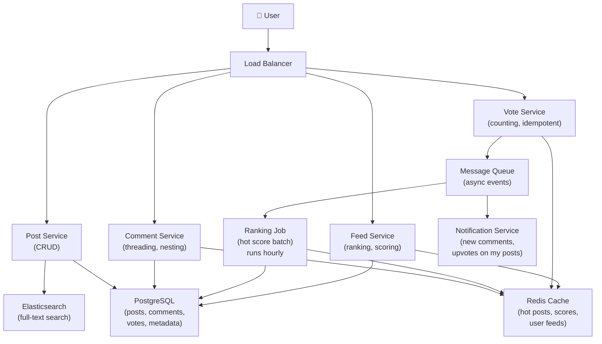

# Platform Like Reddit

> **Interview Time:** 60 min | **Difficulty:** Medium  
> **Key Focus:** Feed ranking, voting systems, community moderation, real-time updates

---

## Step 1: Functional & Non-Functional Requirements

### Functional Requirements

- Users can create posts (text, image, link) in communities (subreddits)
- Users can comment on posts and reply to comments (threaded)
- Users can upvote/downvote posts and comments
- Users can earn karma (aggregated upvote count)
- Feed shows "Hot", "New", "Top" sorted posts
- Communities moderated by community leaders
- Users can follow communities and get feed notifications
- Spam detection and filtering
- Search posts and comments
- Gilding (award system)

### Non-Functional Requirements

| Requirement | Target | Notes |
|:-----------|:-------|:------|
| **Scale** | 500M users, 100M+ posts/day | Billions of votes/day |
| **Latency** | Feed load <500ms | Sorting billions of posts |
| **Availability** | 99.9% uptime | Eventually consistent OK |
| **Consistency** | Eventual for votes | Vote count lag <5 sec acceptable |
| **Throughput** | 1M votes/sec | Peak: viral post = 100K votes/min |
| **Sorting** | Hot algorithm updates every 1 hour | Reddit's algorithm: score = votes, time decay |

---

## Step 2: API Design, Data Model & High-Level Design

### Core API Endpoints

```http
POST /communities/{subreddit}/posts
  {title, content, image_url?, post_type: TEXT|IMAGE|LINK}
  → {post_id, created_at, upvote_count: 1 (auto-upvote by author)}

GET /communities/{subreddit}/feed?sort=hot|new|top&time=day|week|all
  → {posts: [{post_id, title, upvote_count, comment_count, created_at}]}

POST /posts/{post_id}/upvote
  {user_id}
  → {success: true, new_score, vote_recorded}

POST /posts/{post_id}/downvote
  {user_id}
  → {success: true, new_score, vote_recorded}

POST /posts/{post_id}/comments
  {content, parent_comment_id?}  -- parent_comment_id for nested replies
  → {comment_id, created_at, depth}

GET /posts/{post_id}/comments?sort=best|new&depth=3
  → {comments: [{comment_id, content, upvote_count, children: [...]}]}

GET /users/{user_id}/profile
  → {karma, post_count, comment_count, joined_at}

GET /search?q={query}&type=posts|comments
  → {results: [...]}
```

### Entity Data Model

```
USERS
├─ user_id (PK)
├─ username (UNIQUE)
├─ total_karma (denormalized, sum of post + comment upvotes)
├─ created_at
├─ last_active_at

COMMUNITIES (subreddits)
├─ community_id (PK)
├─ name (UNIQUE, e.g., "programming")
├─ description
├─ subscriber_count
├─ moderators (array of user_ids)
├─ rules, nsfw_flag
├─ created_at

POSTS
├─ post_id (ULID, PK, sortable by time)
├─ user_id (FK)
├─ community_id (FK)
├─ title, content (TEXT)
├─ score (cached: upvotes - downvotes)
├─ upvote_count, downvote_count (denormalized, updated async)
├─ comment_count (denormalized)
├─ hot_score (calculatedperiodically for "Hot" ranking)
├─ created_at, updated_at
├─ is_deleted (soft delete)

VOTES (on posts)
├─ user_id (FK)
├─ post_id (FK)
├─ vote_value (-1=downvote, 1=upvote, 0=neutral)
├─ created_at
├─ PRIMARY KEY (user_id, post_id)

COMMENTS
├─ comment_id (ULID, PK, sortable by time)
├─ post_id (FK)
├─ user_id (FK)
├─ parent_comment_id (FK, nullable — for nested replies)
├─ content (TEXT)
├─ score (upvotes - downvotes)
├─ upvote_count, downvote_count (denormalized)
├─ best_score (for "best" ranking)
├─ depth (nesting level, max 10)
├─ created_at
├─ is_deleted (soft delete)

COMMENT_VOTES (on comments)
├─ user_id (FK)
├─ comment_id (FK)
├─ vote_value (-1, 0, 1)
├─ created_at
├─ PRIMARY KEY (user_id, comment_id)

SUBSCRIPTIONS (user following communities)
├─ user_id (FK)
├─ community_id (FK)
├─ subscribed_at
├─ PRIMARY KEY (user_id, community_id)

AWARDS (gilding)
├─ award_id (PK)
├─ post_id or comment_id (FK)
├─ user_id (gave award to this user)
├─ award_type (Gold, Platinum, etc.)
├─ given_at
```

### High-Level Architecture



---

## Step 3: Concurrency, Consistency & Scalability

### 🔴 Problem: Vote Counting Race Condition

**Scenario:** Post gets 100K upvotes simultaneously. Multiple instances increment count. Count goes to 95K instead of 100K.

**Solution: Redis-based Vote Aggregation**

```
Vote Flow (idempotent, handles retries):

1. User upvotes post
   POST /posts/{post_id}/upvote {user_id}

2. [IDEMPOTENCE CHECK]
   HGET votes:{post_id} user_id
   
   If exists (user already voted):
     → Return current score
     → No double-vote
   
   If not exists (first vote):
     → Proceed to vote

3. Vote recorded in Redis (fast, in-memory):
   HSET votes:{post_id} user_id 1  -- user_id → 1 (upvote)
   INCR score:{post_id}  -- increment score

4. Event sent to queue (async):
   PUBLISH vote:events {post_id, user_id, timestamp}

5. Background job (batch every 5 seconds):
   GROUP votes by post_id
   Aggregate: SUM(upvotes) - SUM(downvotes) = final_score
   UPDATE posts SET upvote_count = ..., score = ...
   (This is eventually consistent, lag <5 sec)

Result:
  - Redis handles 1M votes/sec (easy)
  - DB eventually gets accurate count (writes batched, reduce DB load)
  - Vote is idempotent (retries OK, no double-count)

Data Flow:
  Redis (hot, accurate, temporary):
    vote:{post_id}: {user_id_1: 1, user_id_2: -1, user_id_3: 1}
  
  Batch aggregation:
    upvotes = 2, downvotes = 1, net_score = 1
      → DB write (UPDATE votes SET...)
  
  Cache:
    score:{post_id} = 1  (replaces with DB value after batch)
```

### 🟡 Problem: Feed Ranking (Hot, New, Top)

**Scenario:** Decide ranking order. Simple recency? No, dead posts get old. By votes? Then old posts dominate. Need decay.

**Solution: Time-Decay Scoring Algorithm**

```
Reddit's Hot Algorithm:

Score = log10(upvotes - downvotes + 1) + (timestamp / 45000)

Components:
1. log10(votes + 1) — logarithmic: 100 votes ≈ 2 points, 1000 votes ≈ 3 points
   → Prevents very high-vote posts from dominating forever
   → "Votes diminish in value as count increases"

2. timestamp / 45000 — decay term for age
   45000 seconds = 12.5 hours
   → A post made 12.5 hours ago loses 1 point of value
   → Forces older posts to fall down feed as new posts arrive

Example:
  Post A: 1000 upvotes, created 1 hour ago
    Score = log10(1001) + (creation_time / 45000)
          = 3.0 + small_value ≈ 3.0

  Post B: 10 upvotes, created 5 minutes ago
    Score = log10(11) + (recent_time / 45000)
          = 1.04 + 0 ≈ 1.04

  → But if Post A is 12 hours old:
    Score = 3.0 + (-12 hours in seconds / 45000)
          = 3.0 - 0.96 ≈ 2.04

  → Post A and B can have similar scores even with 1000× vote difference!
  → Prevents vote-inflation from bottlenecking fresh content

Batch Computation:
  - Calculate hot_score every 1 hour for all posts
  - Store in DB as materialized view
  - Query returns pre-sorted posts (no real-time calculation)
  - Lag: ±30 minutes acceptable for "hot" ranking
```

### Solution: Comment Threading Depth Control

```
Comments can be nested: reply to reply to reply
BUT: Deep nesting kills UX (hard to read, API load)

Solution: Cap nesting depth to 10

Example:
  Post P1
  ├─ Comment C1 (depth 1)
  │  └─ Reply C2 (depth 2)
  │     └─ Reply C3 (depth 3, max depth reached)
  │        └─ Reply to C3 → stored as reply to C1 (depth 2, re-thread)

Query optimization:
  GET /posts/{post_id}/comments?depth=3
  → Top-level comments only
  → For each comment, fetch children up to depth 3
  → Reduces payload (otherwise N-level nesting = exponential comments)

Caching:
  cache:comments:{post_id}:depth_2 = {comment_ids at depths 0-2}
  TTL: 5 minutes
  → Fast fetching, reduced depth traversal
```

---

## Step 4: Persistence Layer, Caching & Monitoring

### Database Design

```sql
CREATE TABLE posts (
  post_id BIGSERIAL PRIMARY KEY,
  user_id BIGINT NOT NULL REFERENCES users(user_id),
  community_id BIGINT NOT NULL REFERENCES communities(community_id),
  title VARCHAR(300),
  content TEXT,
  upvote_count INT DEFAULT 1,  -- self-upvote
  downvote_count INT DEFAULT 0,
  comment_count INT DEFAULT 0,
  score INT DEFAULT 1,  -- upvotes - downvotes
  hot_score DECIMAL(10,4),  -- time-decay score, materialized
  created_at TIMESTAMP DEFAULT NOW(),
  is_deleted BOOLEAN DEFAULT FALSE
);

CREATE INDEX idx_posts_community_hot 
  ON posts(community_id, hot_score DESC) 
  WHERE NOT is_deleted;

CREATE INDEX idx_posts_created_at 
  ON posts(created_at DESC) 
  WHERE NOT is_deleted;

-- Votes on Posts
CREATE TABLE post_votes (
  user_id BIGINT NOT NULL REFERENCES users(user_id),
  post_id BIGINT NOT NULL REFERENCES posts(post_id),
  vote_value SMALLINT,  -- -1, 0, 1
  created_at TIMESTAMP DEFAULT NOW(),
  PRIMARY KEY (user_id, post_id)
);

CREATE INDEX idx_post_votes_post_id 
  ON post_votes(post_id);

-- Comments
CREATE TABLE comments (
  comment_id BIGSERIAL PRIMARY KEY,
  post_id BIGINT NOT NULL REFERENCES posts(post_id),
  user_id BIGINT NOT NULL REFERENCES users(user_id),
  parent_comment_id BIGINT REFERENCES comments(comment_id),
  content TEXT,
  upvote_count INT DEFAULT 1,
  downvote_count INT DEFAULT 0,
  score INT DEFAULT 1,
  best_score DECIMAL(10,4),  -- for "best" ranking
  depth INT,  -- 0 = top-level, max 10
  created_at TIMESTAMP DEFAULT NOW(),
  is_deleted BOOLEAN DEFAULT FALSE
);

CREATE INDEX idx_comments_post_best 
  ON comments(post_id, best_score DESC) 
  WHERE depth < 10 AND NOT is_deleted;

CREATE INDEX idx_comments_parent 
  ON comments(parent_comment_id) 
  WHERE NOT is_deleted;

-- Comment Votes
CREATE TABLE comment_votes (
  user_id BIGINT NOT NULL REFERENCES users(user_id),
  comment_id BIGINT NOT NULL REFERENCES comments(comment_id),
  vote_value SMALLINT,
  created_at TIMESTAMP DEFAULT NOW(),
  PRIMARY KEY (user_id, comment_id)
);

-- Subscriptions (user follows communities)
CREATE TABLE subscriptions (
  user_id BIGINT NOT NULL REFERENCES users(user_id),
  community_id BIGINT NOT NULL REFERENCES communities(community_id),
  subscribed_at TIMESTAMP DEFAULT NOW(),
  PRIMARY KEY (user_id, community_id)
);

CREATE INDEX idx_subscriptions_user 
  ON subscriptions(user_id);

-- Karma (denormalized, updated async)
CREATE TABLE user_karma (
  user_id BIGINT PRIMARY KEY REFERENCES users(user_id),
  post_karma INT DEFAULT 0,  -- sum of post upvotes
  comment_karma INT DEFAULT 0,
  total_karma INT DEFAULT 0,
  updated_at TIMESTAMP DEFAULT NOW()
);
```

### Caching Strategy

**Tier 1: Redis**

```
1. Feed Cache (pre-computed hot posts)
   Key: "feed:{community_id}:hot"
   Value: [post_id_1, post_id_2, ..., post_id_100] (sorted by hot_score)
   TTL: 30 minutes
   Purpose: Avoid re-sorting billions of posts on every page load
   Hit rate: 70% (80% of users load same hot posts)

2. Post Score Cache
   Key: "score:{post_id}"
   Value: {upvotes: 1000, downvotes: 50, net: 950}
   TTL: 5 minutes
   Purpose: Don't hit DB for every score query

3. Comment Tree Cache
   Key: "comments:{post_id}:top_level"
   Value: [comment_id_1, comment_id_2, ...] (top 10 by best_score)
   TTL: 5 minutes
   Purpose: Fast comment loading

4. User Vote Cache (personal votes)
   Key: "votes:{user_id}:{post_id}"
   Value: {vote_value: 1}  -- to check if user already voted
   TTL: 1 hour
   Purpose: Prevent double-voting and show user's vote state

5. Community Feed Cache
   Key: "community:{community_id}:new"
   Value: [post_id_1, post_id_2, ...] (latest 100 posts)
   TTL: 10 minutes
   Purpose: Fast "new" feed loading
```

**Tier 2: Database (batch write buffer)**

```
Vote Buffer (in Redis):
  vote:{post_id}:pending = {user_id_1, user_id_2, ...}
  
Batch Job (every 5 seconds):
  1. Read all pending votes from Redis
  2. Aggregate by post_id
  3. Single UPDATE to DB:
     UPDATE posts SET upvote_count = upvote_count + ?, ...
  4. Clear Redis buffer

Result:
  - 1M votes/sec in Redis (immediate, durable via AOF)
  - Batched to DB every 5 sec (reduce DB write load)
  - Eventual consistency: Vote appears in DB within 5 sec
```

### Monitoring & Alerts

**Key Metrics:**

1. **Feed Performance**
   - Feed load latency (P95 <500ms target)
   - Cache hit rate for feeds (70%+ target)
   - "Hot" algorithm freshness (updated hourly)

2. **Vote Processing**
   - Vote throughput (votes/sec)
   - Vote lag (vote appears in feed, <5 sec target)
   - Vote duplication rate (should be < 0.01%)
   - Redis buffer size (should be <100K entries)

3. **Comment Quality**
   - Comment depth distribution (% at each level)
   - Deep nesting incidents (>depth 10 should be rare)
   - Comment load latency (P95 <200ms)

4. **Spam & Moderation**
   - Posts deleted by moderators (count/day)
   - Flagged/reported content (processing time)
   - Karma manipulation attempts (vote brigading)

5. **User Engagement**
   - DAU/MAU growth
   - Post creation rate (posts/min)
   - Comment rate (comments/min)
   - Upvote/post ratio (avg upvotes per post)

```yaml
- alert: VoteLagHigh
  expr: vote_db_lag_seconds > 10
  annotations: "Vote lag > 10s — Redis buffer issue or DB bottleneck"

- alert: FeedLatencyHigh
  expr: feed_load_latency_p95 > 1000
  annotations: "Feed latency > 1s — check hot_score materialization"

- alert: HotScoreStale
  expr: hours_since_last_ranking_update > 2
  annotations: "Hot ranking not updated in 2 hours — batch job failed"

- alert: CacheMissRateHigh
  expr: feed_cache_hit_rate < 0.5
  annotations: "Feed cache hit rate < 50% — increase cache TTL or size"
```

---

## ⚡ Quick Reference Cheat Sheet

### Critical Design Decisions

1. **Redis vote aggregation** — Fast voting counters, batch to DB every 5 sec
2. **Time-decay scoring** — log10(votes) + timestamp/45000 prevents stale posts dominating
3. **Hourly hot_score materialization** — Pre-compute and cache, avoid live calculation
4. **Comment depth limit = 10** — Prevents deep nesting, improves query performance
5. **Feed caching (30 min)** — 70% cache hit rate saves billions of DB queries
6. **Vote idempotency** — Check (user_id, post_id) primary key, retries safe

### When to Use What

| Need | Technology | Why |
|:-----|:-----------|:----|
| Vote counting | Redis + batch writes | 1M votes/sec + eventual consistency |
| Feed ranking | Materialized hot_score | Sub-500ms feed loads |
| Comment threading | Depth limit (10) + primary key on parent | Prevents exponential queries |
| Full-text search | Elasticsearch | Fast title/content search |

### Tech Stack

```
Backend: Python/Go (stateless)
Database: PostgreSQL (posts, comments, votes)
Cache: Redis (scores, feed, votes)
Search: Elasticsearch
Batch: Spark/Flink (ranking job)
Monitoring: Prometheus
```

---

## 🎯 Interview Summary (5 Minutes)

1. **Vote aggregation** → Redis + batch writes every 5 sec to DB
2. **Hot algorithm** → log10(votes) + time_decay, materialized hourly
3. **Feed caching** → 30-min TTL, 70% hit rate saves DB queries
4. **Comment nesting** → Cap depth at 10 to prevent exponential loading
5. **Vote idempotence** → Primary key (user_id, post_id) prevents double-votes
6. **Ranking signals** → Votes, time, comments, gilding all feed into hot_score
7. **Eventual consistency** → Votes cached in Redis, DB updated every 5 sec

---

## Glossary & Abbreviations

--8<-- "_abbreviations.md"

## ⚡ Quick Reference Cheat Sheet

[TODO: Fill this section]

---

## 🎯 Interview Summary (5 Minutes)

[TODO: Fill this section]

---

## Glossary & Abbreviations

--8<-- "_abbreviations.md"
