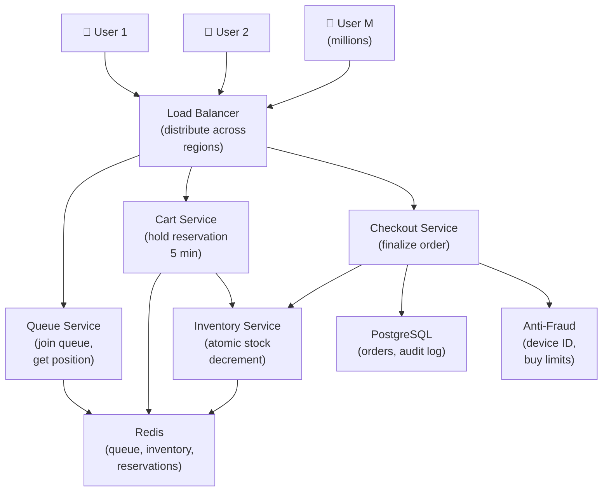

# Design a Flash Sale System

> **Interview Time:** 60 min | **Difficulty:** Medium  
> **Key Focus:** High concurrency inventory management, fairness, surge handling

---

## Step 1: Functional & Non-Functional Requirements

### Functional Requirements

- Merchants create flash sales (limited time, limited quantity, steep discount)
- Timer countdown visible to users
- Users add items to cart at sale price
- Checkout with order guarantee (reserved quantity)
- Real-time inventory updates across all users
- Fair allocation (lottery if more users than stock)
- Queue system for surge traffic (users wait fairly)
- Order confirmation and cancellation
- Admin dashboard (sales metrics, inventory, user queue)
- Prevent common exploits (bot traffic, scalping)

### Non-Functional Requirements

| Requirement | Target | Notes |
|:-----------|:-------|:------|
| **Scale** | 1M concurrent users on single sale | 100K purchases/sec |
| **Latency** | Add to cart <100ms, checkout <500ms | User experience critical |
| **Availability** | 99.9% during sale | High visibility, high stakes |
| **Consistency** | Strong for inventory | No overselling |
| **Fairness** | Equal access, no bots | Lottery if oversold |
| **Queue** | Manage 10M waiting users | Fair ordering |

---

## Step 2: API Design, Data Model & High-Level Design

### Core API Endpoints

```http
# Sales
GET /flash-sales/{sale_id}
  → {sale_id, product_name, stock, remaining_time, sale_price, original_price}

# Cart
POST /carts/{user_id}/items
  {sale_id, quantity_requested}
  → {quantity_reserved, expires_at: (now + 5 min)}

GET /carts/{user_id}
  → {items: [{sale_id, quantity}], total, expires_in_seconds}

# Checkout
POST /orders
  {user_id, cart_items}
  → {order_id, status: success|failed (out of stock)}

# Queue (surge traffic)
GET /flash-sales/{sale_id}/queue-position
  {user_id}
  → {position, wait_time_seconds, estimated_start_time}

POST /flash-sales/{sale_id}/join-queue
  {user_id, device_id}  -- device prevents multi-account fraud
  → {queue_token, position}

# Admin
GET /admin/sales/{sale_id}/metrics
  → {stock_remaining, orders_count, queue_length, conversion_rate}
```

### Entity Data Model

```
FLASH_SALES
├─ sale_id (ULID, PK)
├─ product_id (FK)
├─ product_name, description
├─ original_price (DECIMAL)
├─ sale_price (DECIMAL, lower)
├─ start_time (TIMESTAMP)
├─ end_time (TIMESTAMP)
├─ total_stock (int, immutable)
├─ stock_remaining (int, decrements atomically)
├─ status (scheduled, live, ended)
├─ created_at

FLASH_SALE_ORDERS
├─ order_id (ULID, PK)
├─ sale_id (FK)
├─ user_id (FK)
├─ quantity_requested, quantity_allocated
├─ status (pending, confirmed, cancelled)
├─ created_at
├─ expires_at (5 min from creation, auto-cancel if unpaid)

CARTS (temporary, session-like)
├─ user_id (PK)
├─ sale_id (PK + composite)
├─ quantity_reserved
├─ expires_at

QUEUE_ENTRIES
├─ queue_id (ULID, PK, sortable by time)
├─ sale_id (FK)
├─ user_id (FK)
├─ device_id (FK, fraud detection)
├┠ joined_at (TIMESTAMP, determines order)
├─ status (waiting, active, served, expired)
├─ expires_at (auto-kick idle users after 1 hour)
```

### High-Level Architecture



---

## Step 3: Concurrency, Consistency & Scalability

### 🔴 Problem: Inventory Oversell During Surge

**Scenario:** 100K users add item to cart, all see "5 in stock". Everyone checks out. 100K orders created but only 5 items available!

**Solution: Atomic Reservation with Rollback**

```
Cart Reservation (atomic):

1. User requests: Add 1 to cart
   POST /add-to-cart {sale_id, quantity: 1}

2. Atomic inventory decrement:
   Lua script (atomic in Redis):
   
   remaining = GET stock:{sale_id}
   
   IF remaining >= quantity_requested:
     remaining -= quantity_requested
     SET stock:{sale_id} remaining
     
     -- Create reserved slot
     SET reserved:{user_id}:{sale_id} {
       quantity: 1,
       reserved_at: now,
       expires_at: now + 5_min
     }
     RETURN {success: true, remaining: remaining}
   ELSE:
     RETURN {success: false, remaining: remaining}

Result:
  - "5 in stock" means exactly 5 can reserve it
  - 6th user gets rejected immediately
  - No overselling in checkout phase

3. Cleanup (expiry):
   Background job every 1 min:
   FOR each expired reserved:{user_id}:{sale_id}:
     quantity = GET reserved:{user_id}:{sale_id}.quantity
     IF expired:
       DELETE reserved entry
       SET stock:{sale_id} += quantity  -- return to pool

Benefit:
  - Immediate feedback (user knows if can buy)
  - Accurate inventory (no double-selling)
  - Self-healing (abandoned carts auto-return stock)
```

### 🟡 Problem: Queue Fairness Under Surge Traffic

**Scenario:** 10M users want to buy 100 items. How do you fairly allocate? Lottery fairness vs first-come fairness?

**Solution: Fair Queuing + Lottery**

```
Queue Architecture:

1. Join Queue (timestamp-based)
   User arrives at sale page:
   POST /queue {user_id, device_id}
   
   Redis ZADD queue:{sale_id} 
   <current_timestamp> 
   <user_id>
   --> Sorted set, ordered by join time

2. Batched Serve (every 100ms)
   Background job:
   ZRANGE queue:{sale_id} 0 999  -- next 1000 in line
   
   For these 1000:
     TRY to reserve from inventory
     Success: Move to "active" state, show product page
     Fail: Keep in queue, next batch
   
   ZREM queue:{sale_id} <served_users>

3. Fair Distribution (if oversold at end)
   At sale end:
   remaining_stock = 10
   waiting_users = 2000
   
   Allocate using weighted lottery:
   eligible = users still in queue (not expired)
   
   FOR i in range(remaining_stock):
     winner = random_pick from eligible
     allocated[winner] = 1
     eligible.remove(winner)
   
   Others get notification: "Not allocated, sold out"

Benefit:
  - First-come advantage (earlier = earlier served)
  - Fair lottery at end (no sniping)
  - Queue always moving (updates every 100ms)
```

### 🔷 Problem: Cache Stampede on Same Product

**Scenario:** Inventory falls to 5 items. Cache expires. All 1M concurrent requests hit DB simultaneously. DB crashes!

**Solution: Probabilistic Early Expire + Lock**

```
Cache Stampede Prevention:

1. Probabilistic refresh (before expiry):
   Key: "stock:{sale_id}"
   Value: {count: 50, fetched_at: now}
   TTL: 5 mins
   
   Get stock:
   value = REDIS.GET stock:{sale_id}
   age_seconds = now - value.fetched_at
   
   TTL_remaining = 5 min - age_seconds
   
   IF age_seconds > 3 min:  -- 60% through TTL
     probability = (age_seconds - 3_min) / (5_min - 3_min)
                 = (current - 3) / 2
     
     IF random() < probability:
       -- Refresh early (avoid thundering herd)
       new_value = DB.query()  -- single DB hit
       REDIS.SET stock:{sale_id} new_value EX 5_min
   
   RETURN value

2. Locking (prevent concurrent refreshes):
   LOCK = REDIS.SET refresh:{sale_id} 
          "locked" 
          NX  -- only if not exists
          EX 10  -- auto-release
   
   Only 1 thread gets the lock, refreshes DB
   Others see cached value (slightly stale OK)

Benefit:
  - Smooth refresh curve (not cliff expiry)
  - Single DB refresh per key
  - No thundering herd
```

---

## Step 4: Persistence Layer, Caching & Monitoring

### Database Design

```sql
CREATE TABLE flash_sales (
  sale_id BIGSERIAL PRIMARY KEY,
  product_id BIGINT NOT NULL,
  product_name VARCHAR(255),
  original_price DECIMAL(10,2),
  sale_price DECIMAL(10,2),
  start_time TIMESTAMP NOT NULL,
  end_time TIMESTAMP NOT NULL,
  total_stock INT NOT NULL,
  status VARCHAR(50),
  created_at TIMESTAMP DEFAULT NOW()
);

CREATE INDEX idx_sales_time 
  ON flash_sales(start_time DESC);

CREATE TABLE flash_sale_orders (
  order_id BIGSERIAL PRIMARY KEY,
  sale_id BIGINT NOT NULL REFERENCES flash_sales(sale_id),
  user_id BIGINT NOT NULL,
  quantity_allocated INT,
  status VARCHAR(50),
  created_at TIMESTAMP DEFAULT NOW(),
  expires_at TIMESTAMP  -- order holds for 5 min
);

CREATE INDEX idx_orders_sale_time 
  ON flash_sale_orders(sale_id, created_at DESC);
CREATE INDEX idx_orders_user 
  ON flash_sale_orders(user_id);
```

### Caching Strategy

```
Redis:

1. Stock (inventory counter)
   Key: "stock:{sale_id}"
   Value: {count: 100, fetched_at: now}
   TTL: 5 min (with probabilistic early refresh)
   Purpose: Avoid DB queries, atomic decrements

2. Queue (fair ordering)
   Key: "queue:{sale_id}"
   Value: ZSET {user_id: timestamp, ...}
   TTL: sale duration + 1 hour
   Purpose: Track join order, fair allocation

3. Reservations (cart holds)
   Key: "reserved:{user_id}:{sale_id}"
   Value: {quantity, reserved_at, expires_at}
   TTL: 5 minutes (auto-cleanup)
   Purpose: Hold inventory while user shops

4. Active users (surge metrics)
   Key: "active_users:{sale_id}"
   Value: Set of user_ids currently browsing
   TTL: 1 minute
   Purpose: Real-time metrics for admins
```

### Monitoring

```yaml
- alert: StockHistoryDivergence
  expr: cache_stock != db_stock
  annotations: "Inventory mismatch – data corruption or race condition!"

- alert: OversellDetected
  expr: allocated_quantity > total_stock
  annotations: "Allocated more than total stock – critical bug!"

- alert: QueueBacklogTooLarge
  expr: queue_length > 10_000_000
  annotations: "Queue too large (10M+) – consider splitting sale"

- alert: CheckoutLatencyHigh
  expr: checkout_latency_p95 > 5000
  annotations: "Checkout latency > 5s – infrastructure bottleneck"

- alert: ReservationExpiredRate
  expr: expired_reservations / total_reservations > 0.3
  annotations: "30%+ reservation expiry – users abandoning carts"

- alert: BotTrafficDetected
  expr: same_device_multiple_orders > 100
  annotations: "Bot detected – same device with many orders"
```

**Key Metrics:**
- Inventory accuracy (allocated + available = total)
- Queue move rate (positions served per second)
- Checkout conversion (orders completed / reservations)
- Fairness Gini coefficient (measure allocation inequality)

---

## ⚡ Quick Reference Cheat Sheet

### Critical Decisions

1. **Atomic reservation** – Lua script atomically decrement + create hold
2. **5-min expiry** – Auto-release unreserved inventory
3. **Probabilistic refresh** – Avoid cache stampede, early expire
4. **Fair queue** – Timestamp-ordered, batched serve
5. **Lottery at end** – Random allocation if oversold
6. **Device-based fraud** – Limit orders per device

### Tech Stack

```
API: Go/Rust (ultra-low latency)
Inventory: Redis (atomic operations)
Queue: Redis Sorted Set (fair ordering)
Database: PostgreSQL (audit, order history)
Anti-fraud: ML model + device fingerprinting
```

---

## 🎯 Interview Summary (5 Minutes)

1. **Atomic reservation** → Lua script: check stock, decrement, create hold
2. **Reservation expiry** → Auto-cleanup returns unsold inventory
3. **Probabilistic refresh** → Avoid cache expiry thundering herd
4. **Fair queueing** → Redis ZSET by join timestamp
5. **Lottery** → Random pick from eligible if oversold
6. **Device fraud** → Limit orders per device_id
7. **Monitoring** → Check allocated <= total_stock, catch bugs early

---

## Glossary & Abbreviations

--8<-- "_abbreviations.md"
