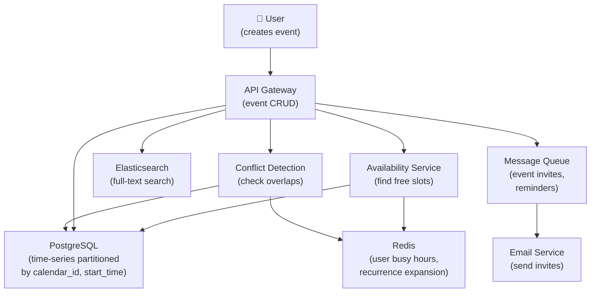

# Design a Meeting Calendar System

> **Interview Time:** 60 min | **Difficulty:** Medium  
> **Key Focus:** Conflict detection, booking atomicity, recurring events

---

## Step 1: Functional & Non-Functional Requirements

### Functional Requirements

- Users create calendar accounts with timezone
- Create, update, delete events (title, time, location, attendees)
- Automatic conflict detection (double-booking prevention)
- Support recurring events (daily, weekly, monthly)
- Invite attendees, track RSVP (accept, decline, tentative)
- Share event calendar with colleagues
- Calendar permissions (view, edit, delegate)
- Find common available time slots for group meetings
- Integration with email (send invites, reminders)
- Timezone conversion for distributed teams

### Non-Functional Requirements

| Requirement | Target | Notes |
|:-----------|:-------|:------|
| **Scale** | 1B users, 10B events/month | High write load |
| **Latency** | Create event <100ms, conflict check <50ms | Real-time feedback |
| **Availability** | 99.95% uptime | Always accessible |
| **Consistency** | Strong for conflict detection | No double-booking |
| **Throughput** | 100K event creates/sec | Peak hours |
| **Query Speed** | Free slot search <200ms | For scheduling assistants |

---

## Step 2: API Design, Data Model & High-Level Design

### Core API Endpoints

```http
# Event Management
POST /calendars/{calendar_id}/events
  {title, start_time, end_time, attendees, timezone, recurrence_rule?}
  → {event_id, conflicts: []}

GET /calendars/{calendar_id}/events?start=date&end=date
  → {events: [{event_id, title, start_time, duration}]}

PUT /calendars/{calendar_id}/events/{event_id}
  {title?, start_time?, end_time?, attendees?}
  → {success, new_conflicts: []}

DELETE /calendars/{calendar_id}/events/{event_id}
  → {deleted: true}

# Conflict Detection
POST /calendars/{calendar_id}/check-availability
  {start_time, end_time, required_attendees: [user_ids]}
  → {available: true/false, conflicts: [{user, event_title, time}]}

# Free Slot Search
POST /calendars/{calendar_id}/find-slots
  {duration_minutes, attendees: [user_ids], date_range: {start, end}}
  → {slots: [{start_time, end_time, available_count}]}

# RSVP
POST /events/{event_id}/rsvp
  {user_id, response: accept|decline|tentative}
  → {rsvp_recorded, updated_count}

# Recurring Events
POST /calendars/{calendar_id}/recurring-events
  {title, start_time, end_time, recurrence: {frequency: daily|weekly, interval: 1}}
  → {series_id, events_created: 100}
```

### Entity Data Model

```
CALENDARS
├─ calendar_id (ULID, PK)
├─ user_id (FK)
├─ name (e.g., "Work Calendar")
├─ timezone
├─ is_primary (one per user)
├─ created_at

EVENTS
├─ event_id (ULID, PK, sortable by time)
├─ calendar_id (FK, partition key)
├─ organizer_id (FK)
├─ title, description
├─ start_time (TIMESTAMP, indexed)
├─ end_time (TIMESTAMP)
├─ location
├─ event_type (meeting, task, blocking)
├─ status (scheduled, cancelled, rescheduled)
├─ recurrence_rule (nullable, e.g., "RRULE:FREQ=WEEKLY;BYDAY=MO,WE,FR")
├─ series_id (for recurring events, group them)
├─ is_all_day (boolean)
├─ timezone
├─ created_at, updated_at

EVENT_ATTENDEES
├─ attendee_id (PK)
├─ event_id (FK)
├─ user_id (FK)
├─ response (accepted, declined, tentative, awaiting)
├─ responded_at (nullable)
├─ is_organizer (boolean)
├─ can_edit (boolean, permissions)

CALENDAR_BLOCKING
├─ blocking_id (PK)
├─ event_id (FK)
├─ blocked_user_ids [array] (users this event blocks)
├─ block_type (conflict, tentative, pto)

RECURRENCE_RULES
├─ rule_id (PK)
├─ event_id (FK)
├─ frequency (DAILY, WEEKLY, MONTHLY, YEARLY)
├─ interval (every N occurrences)
├─ day_of_week [MON, TUE, WED, ...] (for weekly)
├─ end_date (nullable, infinite if null)
├─ exception_dates [dates to skip] (for individual overrides)
```

### High-Level Architecture



---

## Step 3: Concurrency, Consistency & Scalability

### 🔴 Problem: Double-Booking Race Condition

**Scenario:** User has 2pm-3pm free. Two invites arrive simultaneously for overlapping times. Both get accepted!

**Solution: Atomic Conflict Check + Lock**

```
Conflict Detection (Atomic Transaction):

1. User receives invite: 2:30pm - 3:30pm Friday June 1st
   
2. Database transaction (SERIALIZABLE isolation):
   BEGIN TRANSACTION
   
   -- Check for conflicts
   SELECT * FROM events 
   WHERE calendar_id = user_cal_123
   AND start_time < '2030pm' 
   AND end_time > '2:30pm'
   AND status = 'scheduled'
   FOR UPDATE SKIP LOCKED;  -- Lock matching rows
   
   IF conflict_count > 0:
     ROLLBACK, return conflict error
   ELSE:
     INSERT INTO events (...)
     COMMIT

Result:
  - Database serializes concurrent requests
  - Only one CREATE succeeds
  - Other gets "conflict detected" error
  - No double-booking possible

Performance:
  - Lock only affects 1 small time range
  - Other time slots unaffected
  - For busy person: many small locks, not one big lock
```

### 🟡 Problem: Recurring Event Expansion Performance

**Scenario:** "Weekly team meeting for 2 years" = 104 events. If on-the-fly, 104 DB queries for conflict check. Slow!

**Solution: Smart Expansion + Caching**

```
Recurring Event Handling:

1. Storage (efficient):
   EVENTS table:
   {
     event_id: evt_001,
     series_id: series_xyz,  -- Groups all occurrences
     start_time: "2024-06-01 2:00pm",
     recurrence_rule: "FREQ=WEEKLY;BYDAY=FR",
     expansion_end: "2026-06-01"
   }
   
   NOT stored:
     - Don't create 104 separate rows
     - Store only master + recurrence rule

2. Conflict Check (on-the-fly expansion):
   User tries to book new event: June 1, 3:00pm - 3:30pm
   
   Query:
   SELECT * FROM events 
   WHERE series_id = series_xyz
   AND expand_recurrence(recurrence_rule, date_range) 
   INTERSECTS (3:00pm, 3:30pm)
   
   expand_recurrence():
     For FREQ=WEEKLY;BYDAY=FR from June 1-30:
       Friday June 1: 2:00pm
       Friday June 8: 2:00pm
       Friday June 15: 2:00pm
       Friday June 22: 2:00pm
       Friday June 29: 2:00pm
     
     Return: all have 2:00pm-3:00pm (don't conflict with 3:00pm-3:30pm)

3. Cache expansion (for fast repeats):
   Key: "recurring:{series_id}:{month}"
   Value: ["2024-06-01 2:00pm", "2024-06-08 2:00pm", ...]
   TTL: 30 days
   
   → Avoid re-expanding same series multiple times
```

### 🔷 Problem: Timezone Complexity for Distributed Teams

**Scenario:** 10am PST meeting. It's 1pm EST for East Coast, 6pm GMT for London. When recurring weekly: 10am PST stays fixed (even with DST changes).

**Solution: Store Times in UTC, Apply Timezone on Read**

```
Timezone Handling:

1. Storage (UTC only):
   Event: "Weekly standup"
   Organizer timezone: America/Los_Angeles
   
   start_time: 2024-06-01 17:00:00 UTC  (= 10am PST)
   end_time: 2024-06-01 17:30:00 UTC

2. User views calendar (apply timezone on display):
   IF user_timezone = "America/New_York":
     Display: 1:00pm EST
   ELSE IF user_timezone = "Europe/London":
     Display: 6:00pm GMT

3. Recurring logic respects organizer's timezone:
   Organizer sets: "Every Friday 10am PST"
   
   Recurrence rule stored with timezone:
   {
     frequency: WEEKLY,
     byday: FR,
     time: 10:00:00,
     timezone: America/Los_Angeles  -- Key point!
   }
   
   Friday expansion:
   - Compute day in organizer's timezone
   - Convert to UTC for storage
   - Each Friday: [2024-06-01 17:00 UTC, 2024-06-08 17:00 UTC, ...]
   
   Even with DST transitions (Mar 10, Nov 3):
   - Still "10am PST" in organizer's view
   - But UTC time shifts by 1 hour
   - All attendees see consistent absolute time
```

---

## Step 4: Persistence Layer, Caching & Monitoring

### Database Design

```sql
CREATE TABLE calendars (
  calendar_id BIGSERIAL PRIMARY KEY,
  user_id BIGINT NOT NULL,
  name VARCHAR(255),
  timezone VARCHAR(50),
  is_primary BOOLEAN DEFAULT FALSE,
  created_at TIMESTAMP DEFAULT NOW()
);

CREATE TABLE events (
  event_id BIGSERIAL PRIMARY KEY,
  calendar_id BIGINT NOT NULL REFERENCES calendars(calendar_id),
  organizer_id BIGINT NOT NULL,
  series_id BIGINT,  -- for recurring events
  title VARCHAR(255),
  start_time TIMESTAMP NOT NULL,
  end_time TIMESTAMP NOT NULL,
  timezone VARCHAR(50),
  recurrence_rule TEXT,  -- RRULE format
  status VARCHAR(50),
  created_at TIMESTAMP DEFAULT NOW()
);

CREATE INDEX idx_events_calendar_start 
  ON events(calendar_id, start_time DESC);
CREATE INDEX idx_events_calendar_time_range 
  ON events(calendar_id, start_time, end_time);
CREATE INDEX idx_events_series 
  ON events(series_id);

CREATE TABLE event_attendees (
  attendee_id BIGSERIAL PRIMARY KEY,
  event_id BIGINT NOT NULL REFERENCES events(event_id),
  user_id BIGINT NOT NULL,
  response VARCHAR(50),  -- accepted, declined, tentative
  responded_at TIMESTAMP,
  can_edit BOOLEAN DEFAULT FALSE
);

CREATE INDEX idx_attendees_user_response 
  ON event_attendees(user_id, response);
```

### Caching Strategy

```
Redis Caching:

1. User Busy Hours (quick conflict check)
   Key: "calendar:{calendar_id}:busy:{date}"
   Value: [(start_time, end_time), ...]
   TTL: 1 day
   Hit rate: 80% (same days checked repeatedly)

2. Recurring Expansion (avoid recomputing)
   Key: "recurring:{series_id}:{month}"
   Value: [timestamp, timestamp, ...] (expanded occurrences)
   TTL: 30 days

3. Free Slot Cache (for scheduling assistants)
   Key: "free_slots:{user_ids_hash}:{date_range}"
   Value: [{start, end, available_count}]
   TTL: 1 hour (people book constantly)
```

### Monitoring

```yaml
- alert: ConflictCheckLatencyHigh
  expr: conflict_check_latency_p95 > 100  # 100ms
  annotations: "Conflict detection slow — check DB query"

- alert: DoubleBookingDetected
  expr: double_booking_count > 0
  annotations: "Double-booking detected — transaction isolation issue!"

- alert: CalendarQueryTimeout
  expr: calendar_query_timeout_count > 100
  annotations: "Too many queries timing out — need index or caching"

- alert: RecurrenceExpansionSlow
  expr: recurrence_expansion_latency_p95 > 200
  annotations: "Recurring event expansion slow — check cache hit rate"
```

---

## ⚡ Quick Reference Cheat Sheet

### Critical Decisions

1. **SERIALIZABLE isolation** — Prevents double-booking via transaction locks
2. **UTC storage** — Timezone applied on read, not stored
3. **Series-based recurrence** — One row + rule, not 104 rows
4. **Expansion caching** — Pre-compute recurring instances for speed
5. **Busy hours cache** — Quick conflict check before DB query

### Tech Stack

```
API: Go/Node.js (low-latency)
Database: PostgreSQL (ACID, time-series)
Cache: Redis (busy hours, expansions)
Search: Elasticsearch (event search)
Scheduler: iCalendar RFC 5545 (RRULE format)
Email: SendGrid (invites, reminders)
```

---

## 🎯 Interview Summary (5 Minutes)

1. **Atomic conflict check** → SERIALIZABLE transaction + row-level locks
2. **Recurring optimization** → Store series + rule, expand on query (cache result)
3. **Timezone handling** → Store UTC, apply timezone on read
4. **Busy hour caching** → Pre-compute by date, 80% hit rate
5. **Free slot search** → Expand recurring, find gaps, return sorted slots
6. **RSVP tracking** → Separate attendees table, track response state
7. **Conflict notification** → Queue + email service for async invites

---

## Glossary & Abbreviations

--8<-- "_abbreviations.md"
